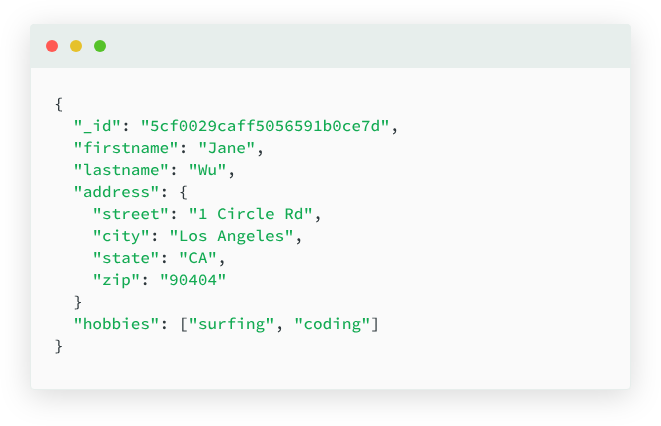
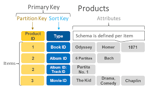
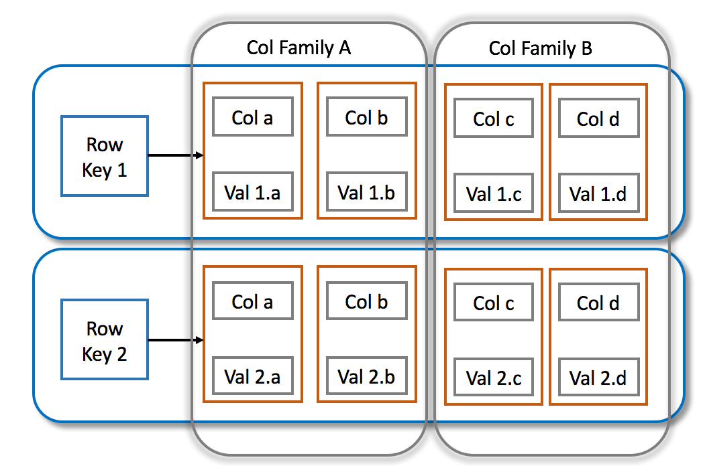
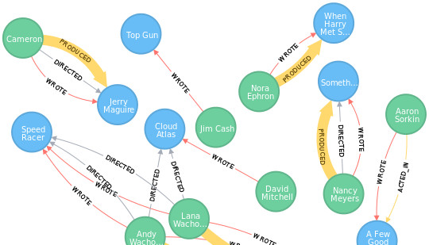

Características, uso y tipos de bases de datos NoSQL.

Las bases de datos NoSQL **(Not Only SQL)** son sistemas de gestión de bases de datos diseñados para manejar grandes volúmenes de datos distribuidos y no estructurados o semiestructurados. A diferencia de las bases de datos relacionales tradicionales (SQL), que utilizan tablas y esquemas rígidos, NoSQL ofrece un modelo más flexible y escalable.

## Características clave
1. **Flexibilidad en el esquema (Schema-less):**  
   No requieren un esquema fijo. Los datos pueden almacenarse sin definir previamente su estructura, lo que facilita la adaptación a cambios en el tiempo.

2. **Escalabilidad Horizontal:**  
   Se diseñan para escalar agregando más servidores en lugar de aumentar la capacidad de un solo servidor. Esto permite manejar grandes volúmenes de datos de forma más eficiente.

3. **Alta Disponibilidad y Distribución:**  
   Los datos se replican y distribuyen en varios nodos, garantizando que la base de datos siga siendo funcional incluso si uno de los nodos falla.

4. **Rendimiento Optimizado:**  
   Están optimizadas para operaciones de lectura/escritura rápidas, lo que las hace ideales para aplicaciones en tiempo real o con grandes volúmenes de transacciones.

5. **Diversidad de Modelos de Datos:**  
   NoSQL ofrece varios modelos de almacenamiento de datos, que se adaptan a diferentes necesidades: documentales, clave-valor, grafo...

6. **Alto Volumen de Datos y Big Data:**  
   Son capaces de gestionar enormes volúmenes de datos y son utilizadas en aplicaciones que generan grandes cantidades de información, como redes sociales o sistemas IoT.

7. **Facilidad de Desarrollo Ágil:**  
   Su flexibilidad permite a los desarrolladores iterar rápidamente, adaptando los modelos de datos a medida que cambian los requisitos del negocio.

---

## Diferencias entre bases de datos SQL y NoSQL

Las bases de datos SQL (relacionales) y NoSQL (no relacionales) están diseñadas para diferentes tipos de aplicaciones y tienen enfoques distintos para almacenar y gestionar datos. A continuación, se explican las principales diferencias entre ambas:

### Modelo de Datos
- **SQL (Relacionales):**  
  - Los datos se almacenan en **tablas** con filas y columnas.  
  - Cada tabla tiene un **esquema rígido** (estructura predefinida).  
  - Se utilizan **relaciones (JOINs)** para vincular datos entre tablas.  

- **NoSQL (No Relacionales):**  
  - Los datos se almacenan en diversos formatos: **documentos (JSON, BSON), clave-valor, grafos o columnas anchas.**  
  - **No requiere esquemas fijos;** el modelo es flexible y dinámico.  
  - Se pueden almacenar datos desestructurados o semiestructurados.

### Escalabilidad
- **SQL:**  
  - Escala **verticalmente** (aumentar CPU, RAM o almacenamiento en el mismo servidor).  
  - La escalabilidad horizontal es posible, pero compleja.  

- **NoSQL:**  
  - Escala **horizontalmente** (añadir más servidores/nodos a la red).  
  - Se adapta fácilmente a grandes volúmenes de datos y tráfico.

### Consistencia y Disponibilidad (Modelo CAP)

El **Modelo CAP** es un principio fundamental en el diseño de sistemas distribuidos que establece que **es imposible que un sistema distribuido garantice simultáneamente las tres propiedades siguientes:**  

1. **Consistencia (Consistency):**  
   Todos los nodos del sistema tienen los mismos datos en un momento dado. Cuando se realiza una escritura, todos los nodos deben reflejar el mismo valor inmediatamente.  

2. **Disponibilidad (Availability):**  
   El sistema sigue funcionando y respondiendo, incluso si algunos nodos fallan. Siempre se garantiza una respuesta, aunque no se asegure que contenga los datos más recientes.  

3. **Tolerancia a Particiones (Partition Tolerance):**  
   El sistema sigue operando incluso si hay una partición (división o pérdida de comunicación) entre nodos. Esto implica que el sistema puede seguir funcionando aunque partes de la red no puedan comunicarse entre sí.  

Así pues, las principales diferecias son:
- **SQL:**  
  - Prioriza la **consistencia (Consistency)** sobre la disponibilidad.  
  - Sigue el principio **ACID (Atomicidad, Consistencia, Aislamiento, Durabilidad)** para garantizar integridad en las transacciones.  

- **NoSQL:**  
  - Prioriza la **disponibilidad (Availability)** y la **partición (Partition Tolerance).**  
  - Utiliza el principio **BASE (Basically Available, Soft state, Eventual consistency)**, permitiendo que los datos se repliquen y se sincronicen eventualmente.  

### Flexibilidad del Esquema
- **SQL:**  
  - **Esquema fijo y estructurado.** Los campos y tipos de datos deben definirse antes de insertar datos.  
  - Cualquier cambio en el esquema puede requerir migraciones complejas.  

- **NoSQL:**  
  - **Esquema dinámico.** Los datos pueden tener diferentes estructuras dentro de la misma colección o base de datos.  
  - Facilita la adaptación a cambios rápidos en los datos.  

### Tipos de Consultas
- **SQL:**  
  - Utiliza el lenguaje estándar **SQL (Structured Query Language).**  
  - Las consultas son complejas y potentes, con **operaciones JOIN** entre múltiples tablas.  

- **NoSQL:**  
  - Las consultas dependen del tipo de base de datos (documento, clave-valor, grafo, etc.).  
  - Las bases de datos de documentos, por ejemplo, utilizan búsquedas específicas sobre documentos (filtros, agregaciones).  
  - **No suele haber JOINs,** lo que puede simplificar y acelerar ciertas consultas.  

### Rendimiento
- **SQL:**  
  - **Alta eficiencia** en consultas complejas con relaciones.  
  - El rendimiento puede disminuir con grandes volúmenes de datos y alta concurrencia.  

- **NoSQL:**  
  - **Optimizado para grandes volúmenes de datos** y operaciones rápidas de lectura/escritura.  
  - Excelente para **aplicaciones de tiempo real** y grandes cargas de trabajo distribuidas.  

### Casos de Uso
- **SQL:**  
  - Aplicaciones donde la **integridad de los datos es crítica** (banca, comercio electrónico, contabilidad).  
  - Proyectos con **datos estructurados y bien definidos.**  
  - Aplicaciones empresariales tradicionales.  

- **NoSQL:**  
  - Aplicaciones con **grandes volúmenes de datos no estructurados** o semiestructurados (redes sociales, IoT, big data).  
  - Sistemas que requieren **alta disponibilidad y escalabilidad horizontal** (e-commerce, juegos en línea, análisis de logs).  
  - Aplicaciones que cambian constantemente y necesitan **flexibilidad.**  

### Complejidad de Implementación
- **SQL:**  
  - Puede ser más compleja de implementar debido a la necesidad de definir esquemas y relaciones.  
  - Ideal para aplicaciones que requieren **transacciones seguras** y una fuerte integridad referencial.  

- **NoSQL:**  
  - Fácil de comenzar y escalar, pero algunas consultas avanzadas pueden ser más complejas.  
  - Se adapta bien a **modelos ágiles y en rápida evolución.**  

### Comparación

| **Aspecto**                   | **SQL**                                           | **NoSQL**                                      |
|------------------------------|---------------------------------------------------|------------------------------------------------|
| **Modelo de Datos**            | Relacional (tablas)                               | No relacional (documentos, clave-valor, grafos)|
| **Escalabilidad**              | Vertical                                          | Horizontal                                     |
| **Esquema**                   | Fijo                                              | Flexible                                       |
| **Consistencia**               | Alta (ACID)                                       | Eventual (BASE)                                |
| **Consultas**                  | SQL (JOINs y transacciones complejas)             | Varía (dependiendo del tipo de base de datos)  |
| **Rendimiento**                | Optimizado para relaciones                       | Optimizado para velocidad y volumen            |
| **Casos de Uso**               | Aplicaciones tradicionales y críticas            | Big data, aplicaciones web en tiempo real      |
| **Ejemplos**                   | MySQL, PostgreSQL, Oracle                        | MongoDB, Cassandra, Redis, DynamoDB            |

---

## Tipos según el modelo de datos

Las bases de datos NoSQL se clasifican en varios tipos según su modelo de almacenamiento y la estructura de datos que gestionan:

### 1. Bases de Datos Documentales (Document Stores)

Almacenan datos en documentos individuales en formatos como **JSON, BSON o XML**. Cada documento contiene pares clave-valor y puede tener estructuras anidadas (subdocumentos y arrays). Estos documentos pueden tener diferentes campos, proporcionando flexibilidad en el esquema.

Entre sus principales ventajas destacan que son **flexibles y desestructuradas**, ya que los documentos pueden variar en estructura y que ofrecen lenguajes que permiten construir **consultas ricas**, pudiendo realizar consultas sobre campos anidados y documentos completos.

*Fuente: [MongoDB](https://www.mongodb.com/resources/basics/databases/document-databases)*

**Casos de uso:**  
- Aplicaciones web y móviles.  
- Sistemas de gestión de contenido (CMS).  
- Catálogos de productos y perfiles de usuarios.  

**Sistemas Gestores de Bases de Datos documentales populares:**  
- MongoDB  
- CouchDB  
- RethinkDB 

### 2. Bases de Datos Clave-Valor (Key-Value Stores)
Almacenan datos como pares clave-valor, donde cada clave es única y apunta a un valor. Es el modelo más simple de NoSQL, similar a un diccionario o hashmap. Entre sus principales ventajas destacan la **alta velocidad** en las operaciones de lectura y escritura y la **simplicidad**, lo que las hace ideales para almacenar datos donde no se requiere una estructura compleja.  

 *Fuente: [AWS](https://aws.amazon.com/es/nosql/key-value/)*

**Casos de Uso:**  
- Caches distribuidos.  
- Sesiones de usuario y perfiles.  
- Configuración de aplicaciones.  

**Sistemas Gestores de Bases de Datos clave-valor populares:**  
- Redis
- DynamoDB (modo clave-valor)  
- Riak KV  

### 3. Bases de Datos Tabular (Wide-Column Stores)
Almacenan datos en tablas, pero a diferencia de las bases de datos relacionales, **cada fila puede tener un número diferente de columnas**. Las columnas se agrupan en familias de columnas, lo que permite almacenar datos relacionados de manera eficiente.  

Entre sus principales ventajas destaca la **optimización para grandes volúmenes de datos** y la **eficiencia en consultas**, lo que las hace excelentes para análisis de big data y procesamiento en tiempo real.  

 *Fuente: [Dataversity](https://www.dataversity.net/wide-column-database/)*

**Casos de Uso:**  
- Análisis de grandes volúmenes de datos.  
- Motores de búsqueda.  
- Registros de transacciones.  

**Sistemas Gestores de Bases de Datos tabulares populares:**  
- Apache Cassandra  
- HBase (Hadoop)
- ScyllaDB  

### 4. Bases de Datos de Grafos (Graph Databases)
Están diseñadas para almacenar y gestionar datos altamente interconectados. Los datos se almacenan como nodos y las relaciones se representan mediante aristas. Los nodos y las aristas pueden tener propiedades (atributos). 

Entre sus principales ventajas destaca el **modelado de relaciones complejas**, lo que las hace excelentes para gestionar redes sociales, recomendaciones, y sistemas donde las conexiones entre datos son clave y la **alta eficiencia en consultas relacionales**, siendo más rápidas y naturales en comparación con SQL.  

 

*Fuente: [LinkedIn](https://www.linkedin.com/pulse/what-graph-database-why-should-you-use-mrinmoy-ghoshal/)*

**Casos de Uso:**  
- Redes sociales.  
- Sistemas de detección de fraudes.  
- Gestión de infraestructuras (redes de telecomunicaciones).  

**Sistemas Gestores de Bases de Datos de grafo populares:**  
- Neo4j
- Amazon Neptune
- ArangoDB (multi-modelo, incluye grafos)

### 6. Bases de Datos de Multimodelo (Multi-Model Databases)
**Descripción:**  
Estas bases de datos permiten combinar diferentes tipos de modelos (documentos, clave-valor, grafos y columnas anchas) dentro de un mismo motor de base de datos. Sus principales ventajas son la **versatilidad**, al adaptarse a múltiples tipos de datos y aplicaciones y la **reducción de la complejidad** puesto que, en lugar de utilizar varias bases de datos especializadas, se puede manejar todo desde una sola base de datos.  

**Casos de Uso:**  
- Aplicaciones que requieren diferentes formas de modelar datos.  
- Sistemas complejos con múltiples tipos de relaciones y estructuras de datos.  

**Sistemas Gestores de Bases de Datos multimodelo populares:**  
- ArangoDB  
- OrientDB  
- Couchbase

### Resumen de comparación
| **Tipo de Base de Datos** | **Modelo**                 | **Ejemplo de Uso**                   | **Ejemplos Populares**         |
|--------------------------|---------------------------|-------------------------------------|-------------------------------|
| Documentos               | JSON/BSON                  | Aplicaciones Web, CMS               | MongoDB, CouchDB              |
| Clave-Valor              | Hashmap                    | Cachés, sesiones de usuario         | Redis, DynamoDB               |
| Columna Ancha            | Columnas flexibles         | Big Data, registros transaccionales | Cassandra, HBase              |
| Grafos                   | Nodos y relaciones         | Redes sociales, detección de fraude | Neo4j, Amazon Neptune         |
| Multimodelo              | Combinación de modelos     | Sistemas complejos                 | ArangoDB, Couchbase           |

## Uso de Bases de Datos NoSQL
Las bases de datos NoSQL ofrecen una solución moderna y escalable para manejar datos complejos y dinámicos que las bases de datos relacionales tradicionales a menudo encuentran desafiantes, de forma que es recomendado su uso para:

- Aplicaciones con grandes cantidades de datos no estructurados (redes sociales, sensores, logs).
- Proyectos que requieren escalabilidad y alta disponibilidad.
- Aplicaciones que necesitan responder rápidamente a cambios en los requisitos de datos.

