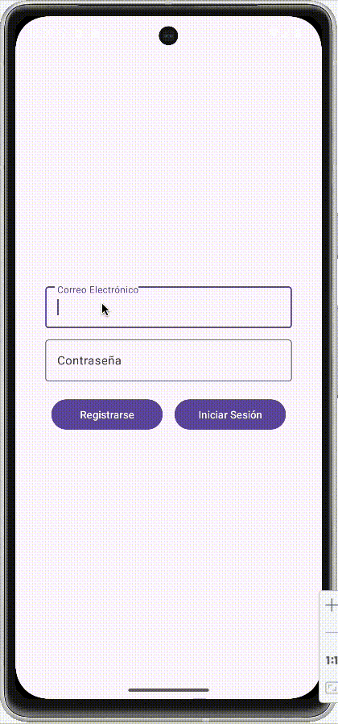
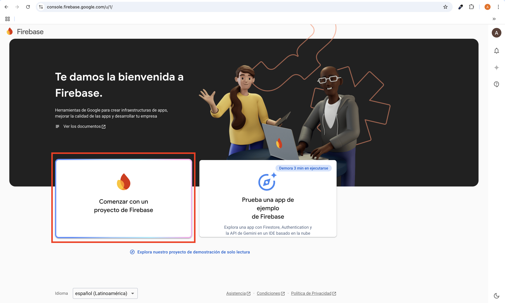
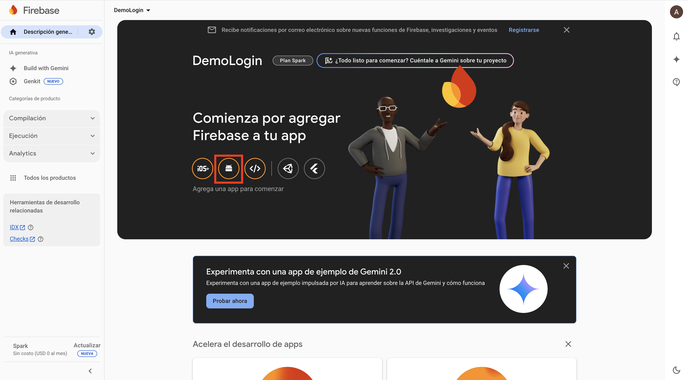
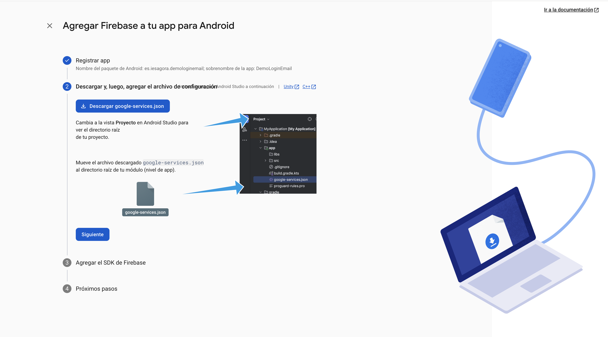
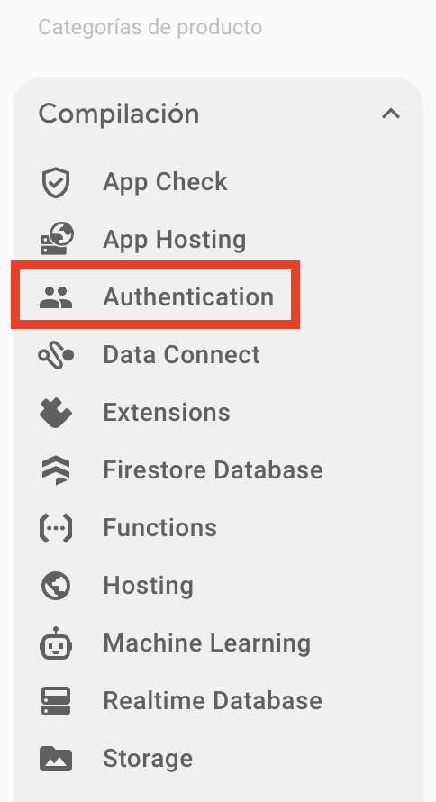
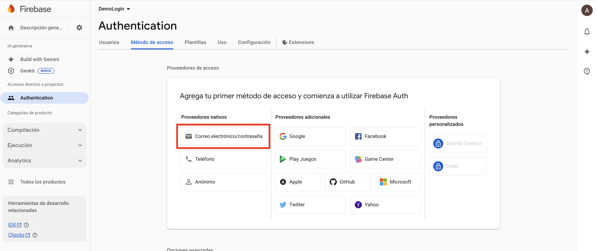
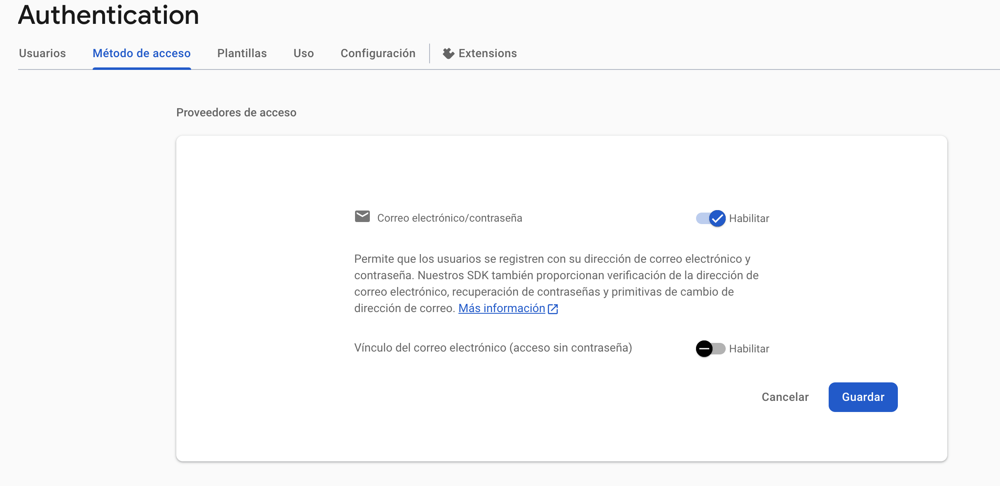

<div class="justify-text">
Vamos a implementar una aplicación sencilla con una pantalla única de log in y registro. Una vez que el usuario se haya logueado, pasarmos a la pantalla principal de la aplicación.



## 1. Configurar Firebase en tu Proyecto Android
Antes de comenzar a programar, debes configurar Firebase en tu aplicación.

**🔹 Paso 1: Crear un Proyecto en Firebase**
1. Ve a la [Firebase Console](https://console.firebase.google.com/) y crea un nuevo proyecto.



2. Agrega una aplicación **Android** e ingresa el **nombre del paquete** de tu app.




3. Descarga el archivo **google-services.json** y colócalo en `app/` dentro de tu proyecto. Para ello, cambia la vista de Android a Proyecto en Android Studio. Puedes seguir las instrucciones del wizard.




**🔹 Paso 2: Agregar Dependencias de Firebase en `build.gradle`**
Abre el archivo `build.gradle (Project Level)` y agrega el plugin de Google Services:
```gradle
plugins {
    alias(libs.plugins.android.application) apply false

    // Add the dependency for the Google services Gradle plugin
    id("com.google.gms.google-services") version "4.4.2" apply false
}
```
Luego, en `build.gradle (Module: app)`, agrega el complemento de google-services y añade las dependencias de Firebase Authentication:
```gradle
plugins {
    alias(libs.plugins.android.application)
    id("com.google.gms.google-services")
}
...
dependencies {
    // Firebase
    implementation(platform("com.google.firebase:firebase-bom:33.8.0"))
    // Firebase Authentication
    implementation("com.google.firebase:firebase-auth")
}
```

Después de esto, **sincroniza el proyecto** (`Sync Now` en Android Studio).

**🔹 Paso 3: Habilita el método de acceso**

En el panel de control, selecciona Compilación > Authentication.



En la pestaña `Método de acceso`, habilita los proveedores con los que quieres permitir el acceso. En este caso, con email y contraseña.



Dentro de las dos opciones, en nuestra aplicación será obligatorio establecer una contraseña. Por tanto, solo habilitamos la primera opción.



---

## 2. Diseño de la Interfaz de Usuario

### Activity Login
En `activity_login.xml`, crea una interfaz para el **registro e inicio de sesión**.

```xml title="activity_login.xml"
<LinearLayout
    xmlns:android="http://schemas.android.com/apk/res/android"
    xmlns:app="http://schemas.android.com/apk/res-auto"
    xmlns:tools="http://schemas.android.com/tools"
    android:layout_width="match_parent"
    android:layout_height="match_parent"
    android:gravity="center"
    android:layout_gravity="center"
    android:orientation="vertical"
    android:padding="20dp"
    tools:context=".MainActivity">

    <LinearLayout
        android:layout_width="match_parent"
        android:layout_height="wrap_content"
        android:gravity="center"
        android:orientation="vertical"
        android:padding="20dp">

        <!-- Campo de Correo Electrónico -->
        <com.google.android.material.textfield.TextInputLayout
            android:layout_width="match_parent"
            android:layout_height="wrap_content"
            app:boxBackgroundMode="outline">

            <com.google.android.material.textfield.TextInputEditText
                android:id="@+id/emailEditText"
                android:layout_width="match_parent"
                android:layout_height="wrap_content"
                android:hint="Correo Electrónico"
                android:inputType="textEmailAddress"/>
        </com.google.android.material.textfield.TextInputLayout>

        <!-- Campo de Contraseña -->
        <com.google.android.material.textfield.TextInputLayout
            android:layout_width="match_parent"
            android:layout_height="wrap_content"
            android:layout_marginTop="10dp"
            app:boxBackgroundMode="outline">

            <com.google.android.material.textfield.TextInputEditText
                android:id="@+id/passwordEditText"
                android:layout_width="match_parent"
                android:layout_height="wrap_content"
                android:hint="Contraseña"
                android:inputType="textPassword"/>
        </com.google.android.material.textfield.TextInputLayout>

        <!-- Contenedor de Botones con Espaciado -->
        <LinearLayout
            android:layout_width="match_parent"
            android:layout_height="wrap_content"
            android:layout_marginTop="20dp"
            android:gravity="center"
            android:orientation="horizontal"
            android:paddingHorizontal="8dp">

            <com.google.android.material.button.MaterialButton
                android:id="@+id/registerButton"
                android:layout_width="0dp"
                android:layout_height="wrap_content"
                android:layout_weight="1"
                android:text="Registrarse"
                android:layout_marginEnd="8dp" />

            <com.google.android.material.button.MaterialButton
                android:id="@+id/loginButton"
                android:layout_width="0dp"
                android:layout_height="wrap_content"
                android:layout_weight="1"
                android:text="Iniciar Sesión"
                android:layout_marginStart="8dp" />
        </LinearLayout>

    </LinearLayout>
</LinearLayout>
```

:::info ACTIVITY PRINCIPAL
Recuerda marcar Login Activity como actividad principal de tu aplicación:
```xml
<activity
    android:name=".LoginActivity"
    android:exported="true">
    <intent-filter>
        <action android:name="android.intent.action.MAIN" />
        <category android:name="android.intent.category.LAUNCHER" />
    </intent-filter>
</activity>
<activity
    android:name=".MainActivity"
    android:exported="false">
</activity>
```
:::

### Activity Principal

En esta Activity mostraremos información básica que devuelve Firebase Auth sobre el usuario. Además, ofreceremos un botón para cerrar la sesión.

```xml title="activity_main.xml"
<LinearLayout xmlns:android="http://schemas.android.com/apk/res/android"
    xmlns:app="http://schemas.android.com/apk/res-auto"
    xmlns:tools="http://schemas.android.com/tools"
    android:layout_width="match_parent"
    android:layout_height="match_parent"
    android:padding="20dp"
    android:gravity="center"
    android:orientation="vertical"
    tools:context=".MainActivity">

    <!-- Título -->
    <TextView
        android:layout_width="wrap_content"
        android:layout_height="wrap_content"
        android:text="Información del Usuario"
        android:textSize="22sp"
        android:textStyle="bold"
        android:paddingBottom="16dp"/>

    <!-- Sección: Correo -->
    <LinearLayout
        android:layout_width="match_parent"
        android:layout_height="wrap_content"
        android:orientation="horizontal"
        android:paddingBottom="8dp">

        <TextView
            android:layout_width="wrap_content"
            android:layout_height="wrap_content"
            android:text="Correo: "
            android:textSize="16sp"
            android:textStyle="bold"/>

        <TextView
            android:id="@+id/emailTextView"
            android:layout_width="wrap_content"
            android:layout_height="wrap_content"
            android:textSize="16sp"/>
    </LinearLayout>

    <!-- Sección: Fecha de Creación -->
    <LinearLayout
        android:layout_width="match_parent"
        android:layout_height="wrap_content"
        android:orientation="horizontal"
        android:paddingBottom="8dp">

        <TextView
            android:layout_width="wrap_content"
            android:layout_height="wrap_content"
            android:text="Fecha de Creación: "
            android:textSize="16sp"
            android:textStyle="bold"/>

        <TextView
            android:id="@+id/creationDateTextView"
            android:layout_width="wrap_content"
            android:layout_height="wrap_content"
            android:textSize="16sp"/>
    </LinearLayout>

    <!-- Sección: Última Conexión -->
    <LinearLayout
        android:layout_width="match_parent"
        android:layout_height="wrap_content"
        android:orientation="horizontal"
        android:paddingBottom="16dp">

        <TextView
            android:layout_width="wrap_content"
            android:layout_height="wrap_content"
            android:text="Última Conexión: "
            android:textSize="16sp"
            android:textStyle="bold"/>

        <TextView
            android:id="@+id/lastLoginTextView"
            android:layout_width="wrap_content"
            android:layout_height="wrap_content"
            android:textSize="16sp"/>
    </LinearLayout>

    <!-- Botón de Logout -->
    <com.google.android.material.button.MaterialButton
        android:id="@+id/logoutButton"
        android:layout_width="match_parent"
        android:layout_height="wrap_content"
        android:text="Cerrar Sesión"
        style="@style/Widget.MaterialComponents.Button"/>
</LinearLayout>
```


## 3. Programar la lógica de usuarios

### Activity Login
En `LoginActivity` incluimos todos los métodos necesarios para inicializar Firebase Authentication, registrar usuarios y loguearlos.

```java title="LoginActivity"
public class LoginActivity extends AppCompatActivity {

    private ActivityLoginBinding binding;
    private FirebaseAuth mAuth;

    @Override
    protected void onCreate(Bundle savedInstanceState) {
        super.onCreate(savedInstanceState);
        binding = ActivityLoginBinding.inflate(getLayoutInflater());
        setContentView(binding.getRoot());

        // Inicializar FirebaseAuth
        mAuth = FirebaseAuth.getInstance();

        // Verificar si el usuario ya está autenticado y redirigir a MainActivity
        FirebaseUser user = mAuth.getCurrentUser();
        if (user != null) {
            iniciarMainActivity();
        }

        // Evento para registro
        binding.registerButton.setOnClickListener(new View.OnClickListener() {
            @Override
            public void onClick(View v) {
                registerUser();
            }
        });

        // Evento para inicio de sesión
        binding.loginButton.setOnClickListener(new View.OnClickListener() {
            @Override
            public void onClick(View v) {
                loginUser();
            }
        });
    }
}
```

📌 **Explicación:**  
✔ Inicializa **FirebaseAuth**.  
✔ Verifica si ya hay un **usuario conectado**, en cuyo caso redirige a la pantalla principal.  
✔ Establece los eventos para los botones de LogIn y Registro.

#### Método para Registrar Usuarios
```java title="LoginActivity"
    // Registra a un nuevo usuario con los valores introducidos
    private void registerUser() {
        String email = binding.emailEditText.getText().toString().trim();
        String password = binding.passwordEditText.getText().toString().trim();

        if (email.isEmpty() || password.isEmpty()) {
            Toast.makeText(this, "Por favor completa todos los campos", Toast.LENGTH_SHORT).show();
            return;
        }

        mAuth.createUserWithEmailAndPassword(email, password)
                .addOnCompleteListener(this, task -> {
                    if (task.isSuccessful()) {
                        // Recuperamos el usuario creado
                        FirebaseUser user = mAuth.getCurrentUser();
                        Toast.makeText(LoginActivity.this, "Registro exitoso: " + user.getEmail(), Toast.LENGTH_SHORT).show();
                        iniciarMainActivity();
                    } else {
                        Toast.makeText(LoginActivity.this, "Error en el registro: " + task.getException().getMessage(), Toast.LENGTH_SHORT).show();
                    }
                });
    }
```
📌 **Explicación:**  
✔ Obtiene el **correo y contraseña** ingresados.  
✔ Verifica que los campos **no estén vacíos**.  
✔ Llama a `createUserWithEmailAndPassword()`, que se ejecuta en segundo plano (task).  
✔ Si es exitoso, el usuario se registra en Firebase y navegamos a la pantalla principal de la aplicación.


#### Método para el Inicio de Sesión
Ahora agregamos el método `loginUser()`, que autenticará al usuario con Firebase.

```java title="LoginActivity"
    private void loginUser() {
        String email = emailEditText.getText().toString().trim();
        String password = passwordEditText.getText().toString().trim();

        if (email.isEmpty() || password.isEmpty()) {
            Toast.makeText(this, "Completa todos los campos", Toast.LENGTH_SHORT).show();
            return;
        }

        mAuth.signInWithEmailAndPassword(email, password)
            .addOnCompleteListener(this, task -> {
                if (task.isSuccessful()) {
                    FirebaseUser usuario = mAuth.getCurrentUser();
                    Toast.makeText(LoginActivity.this, "Inicio de sesión exitoso: " + usuario.getEmail(), Toast.LENGTH_SHORT).show();
                    iniciarMainActivity();
                } else {
                    Toast.makeText(MainActivity.this, "Error: " + task.getException().getMessage(), Toast.LENGTH_SHORT).show();
                }
            });
    }
```
📌 **Explicación:**  
✔ Obtiene el **correo y contraseña** ingresados.  
✔ Llama a `signInWithEmailAndPassword()`, que se ejecuta en segundo plano (task).  
✔ Si es exitoso, muestra un mensaje de "Inicio de sesión exitoso".  


#### Método para navegar a la pantalla principal
Para reutilizar código, creamos un método que navegue a la pantalla principal:

```java title="LoginActivity"
    // Inicia la activity principal
    private void iniciarMainActivity() {
        Intent intent = new Intent(LoginActivity.this, MainActivity.class);
        startActivity(intent);
        finish();
    }
```

---

### Activity Principal

La `MainActivity` carga los datos del usuario autenticado desde **Firebase Authentication** y permite cerrar sesión con el botón de "Cerrar Sesión".  

```java title="MainActivity.java"
public class MainActivity extends AppCompatActivity {

    private ActivityMainBinding binding;
    private FirebaseAuth mAuth;

    @Override
    protected void onCreate(Bundle savedInstanceState) {
        super.onCreate(savedInstanceState);
        binding = ActivityMainBinding.inflate(getLayoutInflater());
        setContentView(binding.getRoot());

        // Inicializar FirebaseAuth
        mAuth = FirebaseAuth.getInstance();

        loadUserData();

        binding.logoutButton.setOnClickListener(new View.OnClickListener() {
            @Override
            public void onClick(View v) {
                logoutUser();
            }
        });
    }

    // Recupera el usuario logueado y carga sus datos en los TextView
    private void loadUserData() {
        FirebaseUser user = mAuth.getCurrentUser();
        if (user != null) {
            // Obtener y mostrar el correo electrónico
            String email = user.getEmail();
            binding.emailTextView.setText(email != null ? email : "No disponible");

            // Obtener, formatear y mostrar la fecha de creación de la cuenta
            SimpleDateFormat sdf = new SimpleDateFormat("dd/MM/yyyy HH:mm:ss", Locale.getDefault());
            String creationDate = sdf.format(user.getMetadata().getCreationTimestamp());
            binding.creationDateTextView.setText(creationDate);

            // Obtener y mostrar la última conexión
            String lastLoginDate = sdf.format(user.getMetadata().getLastSignInTimestamp());
            binding.lastLoginTextView.setText(lastLoginDate);
        } else {
            Toast.makeText(this, "No hay usuario autenticado", Toast.LENGTH_SHORT).show();
            // Si no hay usuario cargado volvemos al login
            redirectToLogin();
        }
    }

    // Cierra la sesión del usuario
    private void logoutUser() {
        mAuth.signOut();
        Toast.makeText(MainActivity.this, "Sesión cerrada", Toast.LENGTH_SHORT).show();

        redirectToLogin();
    }

    // Volvemos a la Activity de Login, limpiando la back stack para evitar que el usuario regrese con el botón "atrás"
    private void redirectToLogin() {
        Intent intent = new Intent(MainActivity.this, LoginActivity.class);
        intent.setFlags(Intent.FLAG_ACTIVITY_NEW_TASK | Intent.FLAG_ACTIVITY_CLEAR_TASK);
        startActivity(intent);
        finish();
    }
}
```

#### **📌 Explicación del Código**
✅ **`loadUserData()`**  
- Obtiene el usuario actual desde `FirebaseAuth.getInstance().getCurrentUser()`.  
- Extrae el **correo**, **fecha de creación** y **última conexión**.  
- Usa `SimpleDateFormat` para **formatear las fechas** en un formato legible (`dd/MM/yyyy HH:mm:ss`).  

✅ **`logoutUser()`**  
- Cierra la sesión con `mAuth.signOut()`.  
- Muestra un `Toast` confirmando el cierre de sesión.  
- Llama a `redirectToLogin()` para enviar al usuario a la pantalla de login.  

✅ **`redirectToLogin()`**  
- Redirige al usuario a `LoginActivity.java` para volver a iniciar sesión.  
- Usa `FLAG_ACTIVITY_NEW_TASK | FLAG_ACTIVITY_CLEAR_TASK` para limpiar la pila de actividades y evitar que el usuario regrese con el botón de "atrás".  


:::info METADATA DEL USUARIO
En la [documentación](https://firebase.google.com/docs/reference/android/com/google/firebase/auth/FirebaseUser) de Firebase puedes ver todos los datos que podemos obtener de la clase `FirebaseUser`.
:::

</div>