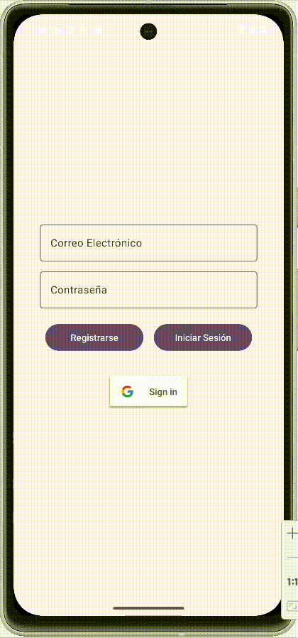
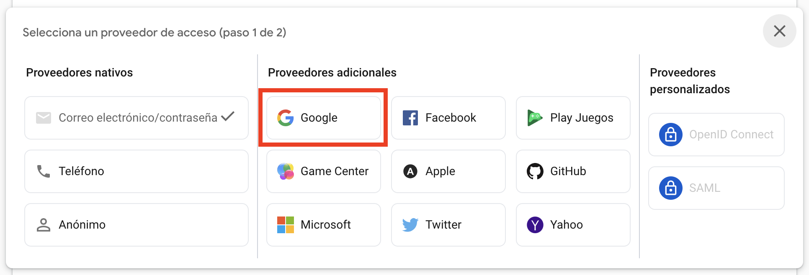
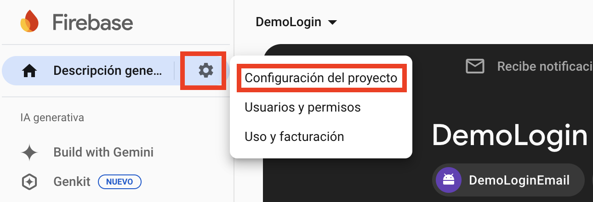

<div class="justify-text">

Vamos a **agregar la autenticación con Google** en nuestro proyecto anterior, donde implementamos login con email/contraseña.



Antes de empezar, entendamos las tecnologías que usaremos:  
- **Firebase Authentication**:  es un servicio que nos permite autenticar usuarios de forma segura sin necesidad de gestionar un backend propio.

- **OAuth 2.0**: Google utiliza **OAuth 2.0** para autenticar a los usuarios. Es un protocolo seguro que permite a las apps acceder a la información de Google del usuario sin exponer sus credenciales.

No obstante, **Firebase simplifica el proceso**, por lo que **no necesitas manejar tokens de OAuth manualmente**. Solo necesitas configurar Firebase y usar su SDK.

El uso de estas dos tecnologías independientes supone que el login con Google en Firebase tenga dos pasos fundamentales:  
- **Obtener el usuario de Google**: Se inicia el flujo de Google Sign-In para que el usuario seleccione su cuenta y se obtenga su información (correo, ID Token, etc.).  

- **Autenticar el usuario en Firebase Auth**: Se usa el ID Token obtenido para crear una credencial (`AuthCredential`), que luego se envía a Firebase para autenticar al usuario dentro de la app.  

---

## 1. Habilitar Google Sign-In en Firebase
1. Ve a la **[Firebase Console](https://console.firebase.google.com/)**.  
2. Entra en tu proyecto y ve a **Authentication** > **Método de inicio de sesión**.  
3. Habilita **Google** y **guarda los cambios**.  



4. Introduce el nombre de tu aplicación (será el que se muestre en el correo que les llega a los usuarios después de acceder por primera vez) y el correo de asistencia al proyecto.


## 2. Huella digital SHA-1

Cuando activas **autenticación con Google en Firebase**, Firebase necesita **verificar** que tu aplicación está realmente conectada a tu proyecto de Firebase y a Google Cloud.

Para ello, requiere **una huella digital SHA-1**, que es un identificador único generado a partir de la clave de firma de la app. 

Esto es necesario porque **Google Sign-In usa OAuth 2.0**, y para que Firebase pueda autenticar a los usuarios con sus cuentas de Google, necesita asociar la app con un **SHA-1 válido**.

Hay dos tipos de claves SHA-1 que puedes agregar:

1. **SHA-1 de desarrollo** (para pruebas en Android Studio).  
2. **SHA-1 de producción** (para versiones firmadas y subidas a Google Play).  

A continuación se explica cómo obtener SHA-1 de Desarrollo (Modo Debug):

#### **Paso 1: Obtener la huella SHA-1 en Android Studio**
1. **Abre Android Studio** y ve a la **terminal** (`View > Tool Windows > Terminal`).
2. Escribe el siguiente comando y presiona `Enter`:

   ```sh
   ./gradlew signingReport
   ```
   **En Windows**, usa:  
   ```sh
   gradlew signingReport
   ```

3. Espera unos segundos y verás una salida como esta:

   ```
   Variant: debug
   Config: debug
   Store: /Users/tuusuario/.android/debug.keystore
   Alias: AndroidDebugKey
   MD5:  A1:B2:C3:D4:E5:F6:G7:H8:I9:J0
   SHA1: 11:22:33:44:55:66:77:88:99:AA:BB:CC:DD:EE:FF:GG:HH:II:JJ
   SHA-256: XX:YY:ZZ...
   ```

4. **Copia el SHA-1** (solo los números después de `SHA1:`).


#### **Paso 2: Agregar SHA-1 en Firebase**
1. **Ve a la [Firebase Console](https://console.firebase.google.com/)**.
2. En tu proyecto, haz clic en ⚙ **Configuración del Proyecto**.

    

3. En la sección **Tus apps**, selecciona tu app de Android.
4. **En la parte de "Huellas digitales del certificado SHA"**, selecciona `Agregar huella digital`.

    

5. Guarda los cambios y vuelve a descargar y añadir a tu proyecto el archivo **google-services.json**.


---

## 3. Agregar Dependencias en build.gradle
Abre `build.gradle (Module: app)` y **añade estas dependencias** (si has implementado el ejercicio anterior, ya debes tener las dos primera dependencias):

```gradle
dependencies {
    // Firebase BOM (Gestiona automáticamente las versiones de las dependencias de Firebase)
    implementation(platform("com.google.firebase:firebase-bom:33.8.0"))

    // Firebase Authentication
    implementation("com.google.firebase:firebase-auth")

    // Google Sign-In (Fuera de BOM, ya que no es parte de Firebase)
    implementation("com.google.android.gms:play-services-auth:20.7.0")
}
```
Luego, **sincroniza el proyecto** (`Sync Now`).

---

## 4. Agregar el Botón de Google en LoginActivity
En `activity_login.xml`, **agrega un botón para iniciar sesión con Google**:

```xml
<com.google.android.gms.common.SignInButton
    android:id="@+id/googleSignInButton"
    android:layout_width="wrap_content"
    android:layout_height="wrap_content"
    android:layout_marginTop="30dp"/>
```

📌 **Este botón es el oficial de Google Sign-In** y se verá como el botón típico de **"Iniciar sesión con Google"**.

---

## 5. Implementar Google Sign-In en `LoginActivity.java`
Abre `LoginActivity.java` y sigue estos pasos:

### 🔹 Paso 1: Agregar Variables
Dentro de la clase `LoginActivity`, **declara estas variables**:

```java
private ActivityResultLauncher<Intent> googleSignInLauncher;
private GoogleSignInClient googleSignInClient;
private static final int RC_SIGN_IN = 9001;
```

📌 **Explicación**  
✔ **`ActivityResultLauncher<Intent>` es una API moderna de Android** que se usa para iniciar actividades y recibir resultados (ya la utilizamos para abrir la galería y recuperar una imagen). **En el contexto de Google Sign-In**, permite iniciar el flujo de autenticación y manejar la respuesta en un solo lugar.  
✔ `GoogleSignInClient` es una clase que administra el flujo de autenticación con Google.  
✔ `RC_SIGN_IN = 9001` es un **código de solicitud (`Request Code`)** que se usa para identificar el resultado del inicio de sesión con Google.   

### 🔹 Paso 2: Obtener el Web Client Id
El **Web Client ID** (o **Client ID de OAuth 2.0**) es un identificador único generado por **Google Cloud Platform (GCP)** que permite a tu aplicación comunicarse con los servidores de Google para autenticar a los usuarios mediante **Google Sign-In**.

- Es necesario para que Firebase pueda validar la identidad de los usuarios que inician sesión con Google.  
- Se usa en Android para obtener un "ID Token" que luego se intercambia con Firebase para autenticar al usuario.  
- Cada proyecto de Firebase tiene su propio Web Client ID, y debe configurarse correctamente para que Google Sign-In funcione en tu app.


Para obtener el Web Client ID en Firebase sigue estos pasos:

1. **Abre Firebase Console**: [https://console.firebase.google.com/](https://console.firebase.google.com/)  
2. **Selecciona tu proyecto**.  
3. En el menú lateral, ve a **"Configuración del Proyecto"** (⚙).  
4. Dirígete a la pestaña **"Métodos de acceso"**.  
5. Selecciona el proveedor **Google** que hemos configurado previamente.
6. Despliega el apartado **Configuración del SDK web** y copia el primer campo.

    

7. Agrégalo a `res/values/strings.xml` para mayor organización:
    ```xml
    <string name="default_web_client_id">1234567890-abcdefghij.apps.googleusercontent.com</string>
    ```

---

### 🔹 Paso 3: Configurar Google Sign-In
Agrega esta configuración dentro de `LoginActivity.java`:

```java
@Override
protected void onCreate(Bundle savedInstanceState) {
    super.onCreate(savedInstanceState);
    binding = ActivityLoginBinding.inflate(getLayoutInflater());
    setContentView(binding.getRoot());

    mAuth = FirebaseAuth.getInstance();

    configurarClienteGoogleSignIn();
    inicializarLauncherGoogleSignIn();

    // Evento para el botón de Google Sign-In
    binding.googleSignInButton.setOnClickListener(v -> signInWithGoogle());
}

private void configurarClienteGoogleSignIn() {
    // Configurar Google Sign-In
    GoogleSignInOptions gso = new GoogleSignInOptions.Builder(GoogleSignInOptions.DEFAULT_SIGN_IN)
            .requestIdToken(getString(R.string.default_web_client_id)) // Usa tu Web client ID
            .requestEmail()
            .build();

    // Inicializar Google Sign-In a partir de la configuración previa
    googleSignInClient = GoogleSignIn.getClient(this, gso);
}

private void inicializarLauncherGoogleSignIn() {
    // Inicializar el ActivityResultLauncher para manejar la respuesta de Google Sign-In
    googleSignInLauncher = registerForActivityResult(
            new ActivityResultContracts.StartActivityForResult(),
            result -> {
                if (result.getResultCode() == RESULT_OK) {
                    Intent data = result.getData();
                    Task<GoogleSignInAccount> task = GoogleSignIn.getSignedInAccountFromIntent(data);
                    gestionarResultadoSignIn(task);
                } else {
                    Toast.makeText(this, "Error en el inicio de sesión con Google", Toast.LENGTH_SHORT).show();
                }
            }
    );
}
```

📌 **Explicación**  
El método `configurarClienteGoogleSignIn()`:
- Configura Google Sign-In con `GoogleSignInOptions`, solicitando el **ID Token** y **correo** del usuario.  
- Inicializa `GoogleSignInClient` con la configuración previa, que gestiona el flujo de autenticación.  

El método `inicializarLauncherGoogleSignIn()`:
- Registra `ActivityResultLauncher<Intent>`, que manejará el resultado del inicio de sesión con Google.
- Cuando termina el proceso de inicio de sesión en los servidores de Google y regresamos a nuestra Activity se ejecutará el contenido de este método.
- El código que devuelve determina si el proceso ha sido existoso o no.
    - Si ha sido exitoso, extrae la cuenta de Google seleccionada con `GoogleSignIn.getSignedInAccountFromIntent(data)`. Posteriormente, llama a `handleSignInResult(task)`, que procesa la cuenta obtenida y la autentica con Firebase.
    - Si no se ha podido realizar el inicio de sesión, podemos mostrar un mensaje de error al usuario.

Asigna un evento al botón de Google Sign-In, ejecutando `signInWithGoogle()` al hacer clic para iniciar el proceso de autenticación.  


### 🔹 Paso 4: Iniciar el Flujo de Sign-In
Cuando se pulse el botón de inicio de sesión con Google se ejecutará el siguiente método:

```java
private void signInWithGoogle() {
    Intent signInIntent = googleSignInClient.getSignInIntent();
    googleSignInLauncher.launch(signInIntent);
}
```

📌 **Explicación**  
- Obtiene el intent de Google Sign-In usando `googleSignInClient.getSignInIntent()`.  
- Lanza el intent con `googleSignInLauncher.launch()`, iniciando el proceso de autenticación. Una vez ejecutado este método, el usuario será redirigido a la página de Google para realizar el log in.  

---

### 🔹 Paso 5: Manejar la Respuesta del Login de Google
El método `gestionarResultadoSignIn()` quedará de la siguiente manera:

```java
private void gestionarResultadoSignIn(Task<GoogleSignInAccount> task) {
    try {
        GoogleSignInAccount account = task.getResult(ApiException.class);
        firebaseAuthWithGoogle(account);
    } catch (ApiException e) {
        Toast.makeText(this, "Error al iniciar sesión con Google", Toast.LENGTH_SHORT).show();
    }
}
```

📌 **Explicación**
✔ Recibe el resultado de la autenticación con Google a través de `Task<GoogleSignInAccount>`.  
✔ Obtiene la cuenta de Google del usuario con `task.getResult(ApiException.class)`.  
✔ Si la autenticación falla, muestra un mensaje de error.  
✔ Si es exitosa, llama a `firebaseAuthWithGoogle(account)` para autenticar al usuario en Firebase.  

---

### 🔹 Paso 6: Autenticar en Firebase con la Cuenta de Google
Después de obtener la cuenta de Google, autenticamos en Firebase:

```java
private void firebaseAuthWithGoogle(GoogleSignInAccount account) {
    AuthCredential credential = GoogleAuthProvider.getCredential(account.getIdToken(), null);
    mAuth.signInWithCredential(credential)
        .addOnCompleteListener(this, task -> {
            if (task.isSuccessful()) {
                Toast.makeText(LoginActivity.this, "Inicio de sesión con Google exitoso", Toast.LENGTH_SHORT).show();
                redirectToMain();
            } else {
                Toast.makeText(LoginActivity.this, "Error: " + task.getException().getMessage(), Toast.LENGTH_SHORT).show();
            }
        });
}
```

📌 **Explicación**
✔ Crea una credencial de autenticación con `GoogleAuthProvider.getCredential()` usando el ID Token del usuario.  
✔ Llama a `signInWithCredential()` para autenticar al usuario en Firebase.  
✔ Si la autenticación es exitosa, redirige al usuario a `MainActivity`.  
✔ Si hay un error, lo muestra en un `Toast`.  

## 6. Gestionar el cierre de sesión en `MainActivity.java`

```java
public class MainActivity extends AppCompatActivity {
    ...
    private GoogleSignInClient googleSignInClient;

    @Override
    protected void onCreate(Bundle savedInstanceState) {
        ...

        // Inicializar Google Sign In
        configurarClienteGoogleSignIn();

        // Mismo botón y evento que hicimos en la demo anterior
        binding.logoutButton.setOnClickListener(new View.OnClickListener() {
            @Override
            public void onClick(View v) {
                logoutUser();
            }
        });
    }

    // Configuramos el cliente de Google Sign In
    // Mismo código que pusimos en Login Activity
    private void configurarClienteGoogleSignIn() {
        // Configurar Google Sign-In
        GoogleSignInOptions gso = new GoogleSignInOptions.Builder(GoogleSignInOptions.DEFAULT_SIGN_IN)
                .requestIdToken(getString(R.string.default_web_client_id)) // Usa tu Web client ID
                .requestEmail()
                .build();

        // Inicializar Google Sign-In a partir de la configuración previa
        googleSignInClient = GoogleSignIn.getClient(this, gso);
    }

    // Cierra la sesión del usuario
    private void logoutUser() {
        boolean loginGoogle = isGoogleLogin();
        mAuth.signOut();
        
        if (loginGoogle) { // Si ha iniciado sesión con Google, cerramos sesión en el cliente de Google
            googleSignInClient.signOut().addOnCompleteListener(this, task -> {
                Toast.makeText(MainActivity.this, "Sesión cerrada", Toast.LENGTH_SHORT).show();
                redirectToLogin();
            });
        } else {
            Toast.makeText(MainActivity.this, "Sesión cerrada", Toast.LENGTH_SHORT).show();
            redirectToLogin();
        }
    }

    // Determina si el usuario ha iniciado sesión con Google
    private boolean isGoogleLogin() {
        FirebaseUser user = mAuth.getCurrentUser();
        for (UserInfo profile : user.getProviderData()) {
            if (profile.getProviderId().equals("google.com")) {
                return true;
            }
        }
        return false;
    }
}
```

📌 **Explicación del log out**
- Obtiene el usuario actual con `mAuth.getCurrentUser()`.
- Recorre los proveedores de autenticación del usuario con `user.getProviderData()` para verificar si se usó Google (`google.com`).
- Si el usuario se autenticó con Google, también se llama a `googleSignInClient.signOut()`.
- Se cierra la sesión en Firebase con `mAuth.signOut()`.
- Después del logout, se redirige a `LoginActivity` para que el usuario vuelva a autenticarse.

</div>