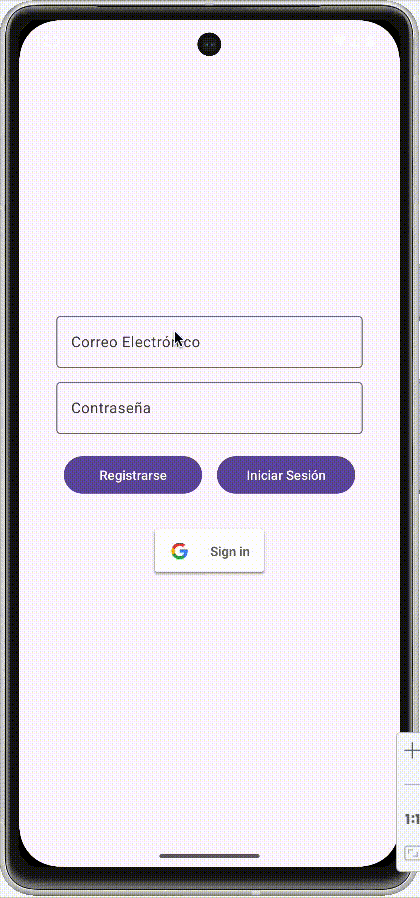
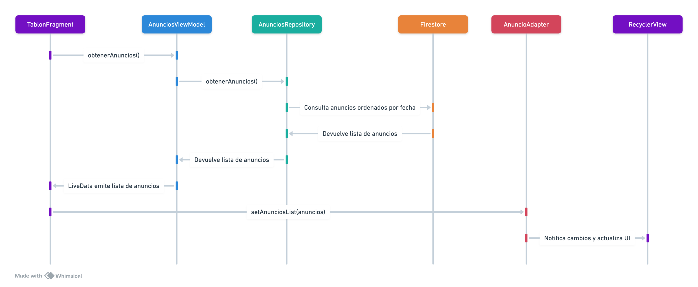

<div class="justify-text">


En este ejemplo, implementaremos un **Tablón de Anuncios**. Partiremos de la aplicación anterior en la que contamos con `LoginActivity` que se encarga de gestionar el registro del usuario. En `MainActivity` cargaremos `TablonFragment`, que permite insertar anuncios y consultar los últimos publicados. Además, el usuario propietario de un anuncio podrá eliminarlo si deliza el elemento a derecha o izquierda.



**Estructura del proyecto:**  
1. **`LoginActivity`** → Maneja el inicio de sesión con Firebase Authentication.  
2. **`MainActivity`** → Contiene el `TablonFragment`, donde se muestran los anuncios.  
3. **`TablonFragment`** → Muestra los anuncios en un `RecyclerView` y permite agregar nuevos anuncios.  
4. **`AnuncioViewModel`** → Gestiona los datos entre la UI y Firestore.  
5. **`AnuncioRepository`** → Se encarga de la conexión con Firestore.  

**Diagrama de secuencia** que ilustra el flujo de llamadas entre las clases para recuperar y mostrar los anuncios en la aplicación:



---

## 1. Configurar las dependencias del proyecto
Revisa el apartado `Configuración de Firestore` y añade las dependencias necesarias para utilizar Firebase Authentication y Firestore.

## 2. Implementar `LoginActivity`
El usuario debe autenticarse antes de acceder al tablón de anuncios. Implementa el ejemplo práctico que estudiamos en la sección `Firebase Authentication`.


## 3. Implementar `MainActivity`
Esta `Activity` contiene el **`FragmentContainerView`** donde se cargará `TablonFragment` y se mostrarán los anuncios.

### 3.1. Layout 
```xml title="activity_main.xml"
<?xml version="1.0" encoding="utf-8"?>
<androidx.constraintlayout.widget.ConstraintLayout xmlns:android="http://schemas.android.com/apk/res/android"
    xmlns:app="http://schemas.android.com/apk/res-auto"
    xmlns:tools="http://schemas.android.com/tools"
    android:id="@+id/main"
    android:layout_width="match_parent"
    android:layout_height="match_parent"
    tools:context=".MainActivity">


    <androidx.fragment.app.FragmentContainerView
        android:id="@+id/fragmentContainerView"
        app:navGraph="@navigation/navigation_graph"
        app:defaultNavHost="true"
        android:name="androidx.navigation.fragment.NavHostFragment"
        android:layout_width="0dp"
        android:layout_height="0dp"
        app:layout_constraintBottom_toBottomOf="parent"
        app:layout_constraintEnd_toEndOf="parent"
        app:layout_constraintStart_toStartOf="parent"
        app:layout_constraintTop_toTopOf="parent" />
</androidx.constraintlayout.widget.ConstraintLayout>
```

:::info RECUERDA...
Recuerda crear el grafo de navegación y añadir `TablonFragment` en él.
:::

### 3.2. Código
```java title="MainActivity.java"
public class MainActivity extends AppCompatActivity {

    private ActivityMainBinding binding;

    @Override
    protected void onCreate(Bundle savedInstanceState) {
        super.onCreate(savedInstanceState);
        binding = ActivityMainBinding.inflate(getLayoutInflater());
        setContentView(binding.getRoot());
    }

}
```

---

## 4. Implementar el modelo de datos
Se trata de la clase Java que representa la información que se almacena en cada documento de tu colección:
```java title="model/Anuncio.java"
public class Anuncio {
    private String id;
    private String contenido;
    private long fecha;
    private String emailAutor;

    // Constructor vacío requerido por Firestore
    public Anuncio() {}

    public Anuncio(String contenido, long fecha, String emailAutor) {
        this.contenido = contenido;
        this.fecha = fecha;
        this.emailAutor = emailAutor;
    }

    // Getters y setters
}
```
:::warning CUIDADO
Al igual que sucede con MongoDB, nuestro modelo debe tener el **contructor por defecto y getters y setters de todos los atributos**. A parte, podrás añadir todos los constructores parametrizados que necesites.
:::

---

## 5. Implementar el acceso a datos

### 5.1. Código de AnunciosRepository
Recuerda que el **Repository** en el patrón MVVM (Model-View-ViewModel) actúa como **intermediario entre el ViewModel y las fuentes de datos** (Firestore, API, Room, etc.). Por este motivo, AnunciosRepository contiene una instancia de `FirebaseFirestore`, a partir de la que se implementan los métodos para obtener todos los anuncios, insertar uno nuevo y eliminar uno existente. Además, contiene una instancia de `FirebaseAuth` para devolver la información del usuario conectado cuando sea necesario.

```java title="repository/AnunciosRepository.java"
public class AnunciosRepository {
    // Instancia de Firestore para acceder a la base de datos de anuncios
    private FirebaseFirestore db;
    // Instancia de Authentication para consultar el usuario conectado
    private FirebaseAuth mAuth;
    // Referencia a la colección de anuncios
    private CollectionReference coleccionAnuncios;


    public AnunciosRepository() {
        // Inicialización de los atributos de clase
        db = FirebaseFirestore.getInstance();
        mAuth = FirebaseAuth.getInstance();
        coleccionAnuncios = db.collection("anuncios");
    }

    // Devuelve el email del usuario conectado
    // Útil para saber si el usuario conectado es el propietario de un anuncio
    public String getConnectedUserEmail() {
        if (mAuth.getCurrentUser() != null) {
            return mAuth.getCurrentUser().getEmail();
        }
        return null;
    }

    public LiveData<List<Anuncio>> obtenerAnuncios() {
        // LiveData que devolveremos con la lista de anuncio
        MutableLiveData<List<Anuncio>> anunciosLiveData = new MutableLiveData<>();

        // Consulta en tiempo real, ordenada por fecha
        // Esta query devuelve todos los anuncios
        coleccionAnuncios.orderBy("fecha", Query.Direction.DESCENDING)
                .addSnapshotListener((querySnapshot, e) -> {
            if (e != null) {
                Log.e("Firestore", "Error al obtener anuncios", e);
                return;
            }

            if (querySnapshot != null) {
                List<Anuncio> lista = new ArrayList<>();
                // Recorremos todos los documentos y los añadimos a la lista
                for (DocumentSnapshot doc : querySnapshot) {
                    Anuncio anuncio = doc.toObject(Anuncio.class);
                    if (anuncio != null) {
                        lista.add(anuncio);
                    }
                }
                // Actualiza el LiveData con los datos devueltos por la consulta
                anunciosLiveData.setValue(lista);
            }
        });

        // Devuelve el LiveData que la UI observará
        return anunciosLiveData;
    }

    public void agregarAnuncio(Anuncio anuncio) {
        // Generar un nuevo ID para el documento en Firestore
        String idGenerado = coleccionAnuncios.document().getId();

        // Asignar el ID generado al anuncio antes de guardarlo
        anuncio.setId(idGenerado);

        // Insertar el anuncio con el ID generado
        coleccionAnuncios.document(idGenerado)
                .set(anuncio)
                .addOnSuccessListener(aVoid -> Log.d("Firestore", "Anuncio agregado con ID: " + idGenerado))
                .addOnFailureListener(e -> Log.e("Firestore", "Error al agregar anuncio", e));
    }

    public void eliminarAnuncio(Anuncio anuncio) {
        // Elimina el anuncio cuyo id coincide con el anuncio que se recibe por parámetro
        coleccionAnuncios.document(anuncio.getId())
                .delete()
                .addOnSuccessListener(aVoid -> Log.d("Firestore", "Anuncio eliminado correctamente"))
                .addOnFailureListener(e -> Log.e("Firestore", "Error al eliminar anuncio", e));
    }
}
```

---

### 5.2. Código de AnunciosViewModel
El ViewModel contiene una instancia de `AnunciosRepository` e invoca sus métodos, actuando así de intermediario entre la vista y la fuente de datos.

```java title="viewmodel/AnunciosViewModel.java"
public class AnunciosViewModel extends AndroidViewModel {

    private AnunciosRepository repository;

    public AnunciosViewModel(@NonNull Application application) {
        super(application);
        repository = new AnunciosRepository();
    }

    public String getConnectedUserEmail() {
        return repository.getConnectedUserEmail();
    }

    public LiveData<List<Anuncio>> obtenerAnuncios() {
        return repository.obtenerAnuncios();
    }

    public void agregarAnuncio(String contenido) {
        // Creamos la instancia del anuncio
        Anuncio anuncio = new Anuncio(contenido, System.currentTimeMillis(), FirebaseAuth.getInstance().getCurrentUser().getEmail());
        // Llamamos al método del repository
        repository.agregarAnuncio(anuncio);
    }

    public void eliminarAnuncio(Anuncio anuncio) {
        repository.eliminarAnuncio(anuncio);
    }
}
```

---

## 6. Implementar `TablonFragment`
### 6.1. Layout
En el layout vamos a contar con un EditText para escribir el contenido del anuncio, un botón para guardarlo y el RecyclerView que muestre todos los anuncios.
```xml title="fragment_tablon.xml"
<LinearLayout xmlns:android="http://schemas.android.com/apk/res/android"
    xmlns:app="http://schemas.android.com/apk/res-auto"
    android:layout_width="match_parent"
    android:layout_height="match_parent"
    android:orientation="vertical"
    android:padding="16dp">

    <EditText
        android:id="@+id/etAnuncio"
        android:layout_width="match_parent"
        android:layout_height="wrap_content"
        android:hint="Escribe un anuncio..." />

    <Button
        android:id="@+id/btnPublicar"
        android:layout_width="match_parent"
        android:layout_height="wrap_content"
        android:text="Publicar" />

    <androidx.recyclerview.widget.RecyclerView
        android:id="@+id/recyclerAnuncios"
        app:layoutManager="androidx.recyclerview.widget.LinearLayoutManager"
        android:layout_width="match_parent"
        android:layout_height="match_parent" />
</LinearLayout>
```

---

### 6.2. Layout de los ViewHolder
Este contendrá la información que se muestra de cada Anuncio en el RecyclerView.

```xml title="viewholder_anuncio.xml"
<?xml version="1.0" encoding="utf-8"?>
<androidx.cardview.widget.CardView xmlns:android="http://schemas.android.com/apk/res/android"
    xmlns:app="http://schemas.android.com/apk/res-auto"
    android:layout_width="match_parent"
    android:layout_height="wrap_content"
    android:layout_margin="8dp"
    app:cardCornerRadius="8dp"
    app:cardElevation="4dp">

    <LinearLayout
        android:layout_width="match_parent"
        android:layout_height="wrap_content"
        android:orientation="vertical"
        android:padding="16dp">

        <!-- Contenido del anuncio -->
        <TextView
            android:id="@+id/tvContenido"
            android:layout_width="wrap_content"
            android:layout_height="wrap_content"
            android:text="Contenido"
            android:textStyle="bold"
            android:textSize="16sp"
            android:textColor="@android:color/black" />

        <!-- Fecha del anuncio -->
        <TextView
            android:id="@+id/tvFecha"
            android:layout_width="wrap_content"
            android:layout_height="wrap_content"
            android:text="Fecha"
            android:textSize="14sp"
            android:textColor="@android:color/darker_gray"
            android:layout_marginTop="4dp" />

        <!-- Nombre del usuario -->
        <TextView
            android:id="@+id/tvUsuario"
            android:layout_width="wrap_content"
            android:layout_height="wrap_content"
            android:text="Usuario"
            android:textSize="14sp"
            android:textColor="@android:color/darker_gray"
            android:layout_marginTop="4dp"  />

    </LinearLayout>
</androidx.cardview.widget.CardView>
```

---

### 6.3. Código de `AnuncioAdapter`
El código del Adaptador y ViewHolder puede quedar así:
```java title="recyclerview/AnuncioAdapter"
public class AnuncioAdapter extends RecyclerView.Adapter<AnuncioAdapter.AnuncioViewHolder> {

    // Lista de anuncios que se muestra en el RecyclerView
    List<Anuncio> anunciosList;

    @NonNull
    @Override
    public AnuncioViewHolder onCreateViewHolder(@NonNull ViewGroup parent, int viewType) {
        LayoutInflater inflater = LayoutInflater.from(parent.getContext());
        return new AnuncioViewHolder(ViewholderAnuncioBinding.inflate(inflater, parent, false));
    }

    @Override
    public void onBindViewHolder(@NonNull AnuncioViewHolder holder, int position) {
        Anuncio anuncio = anunciosList.get(position);
        holder.binding.tvContenido.setText(anuncio.getContenido());
        holder.binding.tvUsuario.setText("Usuario: " + anuncio.getEmailAutor());
        holder.binding.tvFecha.setText("Fecha: " + formatearFecha(anuncio.getFecha()));
    }

    @Override
    public int getItemCount() {
        return anunciosList != null ? anunciosList.size() : 0;
    }

    public void setAnunciosList(List<Anuncio> anunciosList) {
        this.anunciosList = anunciosList;
        notifyDataSetChanged();
    }

    // Devuelve el anuncio que esté en la posición pasada por parámetro
    // Lo utilizamos para saber qué anuncio eliminar con el gesto de desplazar
    public Anuncio obtenerAnuncio(int posicion) {
        return this.anunciosList.get(posicion);
    }

    // Elimina el anuncio que esté en la posición pasada por parámetro
    // Lo utilizamos para eliminar el anuncio de la lista
    public void eliminarAnuncio(int posicion) {
        this.anunciosList.remove(posicion);
        notifyItemRemoved(posicion);
    }

    // Retorna el timestamp en una fecha con el formato legible
    private String formatearFecha(long timestamp) {
        Date date = new Date(timestamp);
        SimpleDateFormat sdf = new SimpleDateFormat("dd/MM/yyyy HH:mm", Locale.getDefault());
        return sdf.format(date);
    }

    static class AnuncioViewHolder extends RecyclerView.ViewHolder {
        private final ViewholderAnuncioBinding binding;

        // Constructor: Asigna la vista inflada al ViewHolder
        public AnuncioViewHolder(@NonNull ViewholderAnuncioBinding binding) {
            super(binding.getRoot());
            this.binding = binding;
        }
    }
}
```

### 6.4. Código de `TablonFragment`
En la inicialización del Fragmento, invocaremos el método del ViewModel que devuelve todos los anuncios, estableciendo un observador para él. Cada vez que reciba un cambio, actualizaremos la lista del RecyclerView.

Además, se añadirá la lógica necesaria para insertar un nuevo anuncio cuando se pulse el botón y eliminar un anuncio al deslizarlo a derecha o izquierda. Se incluirá la comprobación necesaria para asegurar que solo el usuario propietario puede eliminar su anuncio.

```java
public class TablonFragment extends Fragment {

    private FragmentTablonBinding binding;
    private AnunciosViewModel anunciosViewModel;
    private AnuncioAdapter adapter;

    @Override
    public View onCreateView(LayoutInflater inflater, ViewGroup container,
                             Bundle savedInstanceState) {
        // Inflate the layout for this fragment
        return (binding = FragmentTablonBinding.inflate(inflater, container, false)).getRoot();
    }

    @Override
    public void onViewCreated(@NonNull View view, @Nullable Bundle savedInstanceState) {
        super.onViewCreated(view, savedInstanceState);

        adapter = new AnuncioAdapter();
        binding.recyclerAnuncios.setAdapter(adapter);

        anunciosViewModel = new ViewModelProvider(requireActivity()).get(AnunciosViewModel.class);

        binding.btnPublicar.setOnClickListener(v -> publicarAnuncio());

        // Recuperamos los anuncios
        anunciosViewModel.obtenerAnuncios().observe(getViewLifecycleOwner(), new Observer<List<Anuncio>>() {
            @Override
            public void onChanged(List<Anuncio> anuncios) {
                // Establecemos la lista en el adapter
                adapter.setAnunciosList(anuncios);
            }
        });

        // Gesto para eliminar anuncio
        ItemTouchHelper itemTouchHelper = new ItemTouchHelper(new ItemTouchHelper.SimpleCallback(
                ItemTouchHelper.UP | ItemTouchHelper.DOWN,
                ItemTouchHelper.RIGHT | ItemTouchHelper.LEFT) {
            @Override
            public boolean onMove(@NonNull RecyclerView recyclerView, @NonNull RecyclerView.ViewHolder viewHolder, @NonNull RecyclerView.ViewHolder target) {
                return false;
            }

            @Override
            public void onSwiped(@NonNull RecyclerView.ViewHolder viewHolder, int direction) {
                // Recuperamos el anuncio seleccionado
                int posicion = viewHolder.getAdapterPosition();
                Anuncio anuncio = adapter.obtenerAnuncio(posicion);

                // Recuperamos el email del usuario conectado para evitar
                // que los usuarios eliminen anuncios de los que no son propietarios
                String emailUsuarioActual = anunciosViewModel.getConnectedUserEmail();
                if (anuncio.getEmailAutor().equalsIgnoreCase(emailUsuarioActual)) {
                    mostrarDialogoAvisoEliminado(anuncio, posicion);
                } else {
                    Toast.makeText(requireContext(), "No eres el propietario del anuncio", Toast.LENGTH_SHORT).show();
                    // Restaurar el elemento si el usuario no es el propietario
                    adapter.notifyItemChanged(posicion);
                }
            }
        });
        itemTouchHelper.attachToRecyclerView(binding.recyclerAnuncios);
    }

    private void mostrarDialogoAvisoEliminado(Anuncio anuncio, int posicion) {
        new AlertDialog.Builder(requireContext())
                .setTitle("Eliminar Anuncio")
                .setMessage("¿Estás seguro de que deseas eliminar este anuncio?")
                .setPositiveButton("Eliminar", (dialog, which) -> {
                    // Eliminamos el anuncio de la BBDD
                    anunciosViewModel.eliminarAnuncio(anuncio);
                    // Eliminamos el anuncio directamente de la lista, así evitamos repetir consulta a la BBDD
                    adapter.eliminarAnuncio(posicion);
                    Toast.makeText(requireContext(), "Anuncio eliminado", Toast.LENGTH_SHORT).show();
                })
                .setNegativeButton("Cancelar", (dialog, which) -> {
                    // Restaurar el elemento si se cancela
                    adapter.notifyItemChanged(posicion);
                })
                .setCancelable(false)
                .show();
    }


    private void publicarAnuncio() {
        String contenido = binding.etAnuncio.getText().toString();
        if (!contenido.isEmpty()) {
            // Llamamos al método del ViewModel para insertar el anuncio
            anunciosViewModel.agregarAnuncio(contenido);
            // Reseteamos el valor del EditText
            binding.etAnuncio.setText("");
        }
    }
}
```

</div>