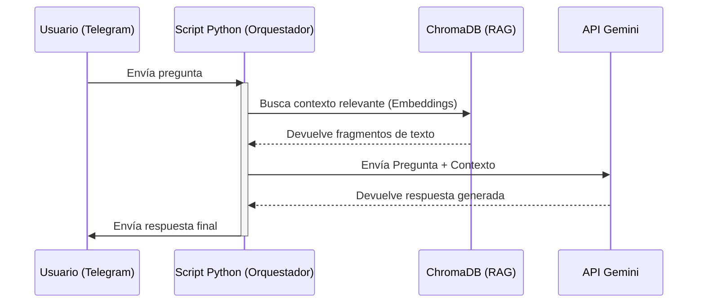

En esta última parte de la unidad, vamos a dar el salto definitivo: pasar de ejecutar scripts aislados en Google Colab a construir una aplicación real y funcional que cualquiera podría usar desde su móvil. El objetivo es desarrollar un **Asistente Virtual Inteligente** accesible a través de un Bot de Telegram.

## ¿Cómo funciona un Bot de IA con RAG?

Antes de tirar una sola línea de código, es fundamental que entiendas qué vamos a construir. No estamos haciendo un bot tonto que responde comandos fijos; estamos creando un **Agente Conversacional Inteligente** que responderá preguntas basándose en documentos específicos que tú le proporciones.

El flujo de datos sigue esta secuencia:
1. **El Usuario** envía una pregunta al bot de Telegram ("¿Qué horario tiene la oficina?").
2. **Nuestro Servidor (Python)** recibe la pregunta y la procesa.
3. **El RAG** entra en acción: convierte la pregunta en un vector y busca en **ChromaDB** los fragmentos de texto más relevantes del documento.
4. **El Orquestador** coge la pregunta del usuario + los fragmentos encontrados y se los envía a **Google Gemini** con un prompt del estilo: *"Responde a esta pregunta usando SOLO este contexto"*.
5. **Gemini** genera la respuesta y el bot se la envía al usuario.

:::tip[La metáfora del examen a libro abierto]
Es muy común confundir los términos y pensar que el RAG es un modelo de Inteligencia Artificial en sí mismo. Para tenerlo claro al 100%, imagina que te estás preparando para un examen de una materia súper específica:

* **Google Gemini (El LLM):** Eres tú. Tienes un cerebro increíble, sabes razonar, resumir y redactar textos a la perfección en varios idiomas. Sin embargo, **no te has estudiado el temario** del examen. Si te hacen una pregunta muy concreta sobre tus datos privados, intentarás adivinarla usando tu lógica general (lo que en IA llamamos *Alucinación*).
* **ChromaDB (La Base de Datos Vectorial):** Es el libro de texto de la asignatura. Contiene toda la información real, actualizada y verídica que necesitas para responder.
* **El RAG (Retrieval-Augmented Generation):** Es la **técnica** que te permite ir al examen con el libro abierto.

**¿Por qué no podemos prescindir de ninguno?**
* Si solo tuvieras a **Gemini (Tú)**: Responderías de forma muy elocuente y educada, pero probablemente te inventarías los datos específicos que no conoces.
* Si solo tuvieras a **ChromaDB (El Libro)**: El libro no sabe hablar ni razonar. Si le haces una pregunta, no puede generar una conversación fluida; solo contiene datos estáticos.

**La magia del conjunto:** Cuando el usuario hace una pregunta, el **RAG** busca rápidamente en el libro (ChromaDB) el párrafo exacto donde está la respuesta. Luego, le pasa ese párrafo a **Gemini**, quien lo lee, extrae la información clave y redacta una respuesta final conversacional y 100% verídica.
:::

### Polling vs Webhooks

Para que nuestro servidor Python se entere de que el usuario ha hablado, existen dos métodos:

* **Webhooks:** Telegram envía una petición HTTP a nuestro servidor cada vez que hay un mensaje. Requiere tener una IP pública y certificados SSL.
* **Long Polling:** Nuestro servidor le pregunta periódicamente a Telegram: *"¿Tienes mensajes nuevos?"*.

:::info
Para desarrollo local utilizaremos **Polling**. Es mucho más cómodo porque no requiere abrir puertos ni configurar túneles como `ngrok`.
:::

## Diagrama de la Arquitectura

Aquí puedes ver visualmente cómo interactúan todos los componentes:

---

## El Camino a Seguir: Tradicional vs Low-Code

Para entender el impacto de las herramientas modernas en el desarrollo de Inteligencia Artificial, vamos a implementar esta misma arquitectura siguiendo dos caminos completamente diferentes:

1. **La Vía Tradicional (Python):** Picaremos código desde cero. Gestionaremos la conexión con Telegram, crearemos el pipeline de RAG y conectaremos con la API de Gemini usando librerías estándar. Esto te dará el control total y te ayudará a entender "las tripas" del sistema.
2. **La Vía Low-Code (n8n):** Utilizaremos una herramienta de automatización visual. Veremos cómo mapear los mismos conceptos de IA a un flujo de trabajo basado en nodos, reduciendo drásticamente el tiempo de desarrollo.
