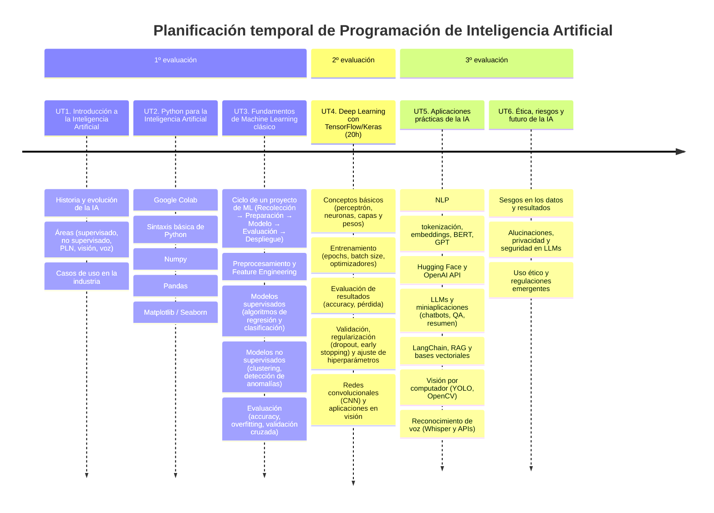

# Presentación

El módulo **Programación de Inteligencia Artificial** (PIA) se encuentra dentro del Curso de especialización en **Inteligencia Artificial y Big Data**. Esta página web servirá de repositorio para agrupar los materiales y actividades de dicho módulo, impartido en el IES Ágora de Cáceres.

## Resultados de aprendizaje

Los **resultados de aprendizaje (RA)** trabajados en este módulo son los indicados en el **Real Decreto 279/2021**:

| Código | Descripción |
|--------|-------------|
| RA1    | Caracteriza lenguajes de programación valorando su idoneidad en el desarrollo de Inteligencia Artificial. |
| RA2    | Desarrolla aplicaciones de Inteligencia Artificial utilizando entornos de modelado. |
| RA3    | Evalúa las mejoras en los negocios integrando convergencia tecnológica. |
| RA4    | Evalúa modelos de automatización industrial y de negocio relacionándolos con los resultados esperados por las empresas. |

## Unidades de trabajo

Los resultados de aprendizaje (RAs) mencionados se han organizado en 6 **unidades de trabajo (UT)**, que se desarrollarán a lo largo de las tres evaluaciones del curso.  

El módulo de PIA tiene una duración total de **200 horas**, con una **carga semanal de 7 horas**.

| UNIDAD                                   | RAs       | HORAS |
|------------------------------------------|-----------|-------|
| UT1. Introducción a la Inteligencia Artificial | RA1       | 5 h   |
| UT2. Python para la Inteligencia Artificial | RA1       | 30 h  |
| UT3. Machine learning clásico  | RA2       | 35 h  |
| UT4. Deep learning              | RA2       | 70 h  |
| UT5. Aplicaciones prácticas de la Inteligencia Artificial              | RA3       | 45 h  |
| UT6. Ética, riesgos y futuro de la IA     | RA4       | 15 h  |
| Repaso y refuerzo                        | Todos     | 20 h  |

## Temporalización

Las unidades de trabajo (UTs) y sus contenidos se han organizado a lo largo del curso de la siguiente manera:

## Materiales y recursos de software

Para el desarrollo y seguimiento de las clases, contaremos con los siguientes recursos:

**Materiales didácticos**  
- Apuntes disponibles en esta página web.  
- Enunciados de actividades y proyectos publicados en la plataforma *Evex*.  

**Software necesario**  
- Python con las librerías propias de IA (Numpy, Pandas, scikit-learn, etc.)
- Google colab  

