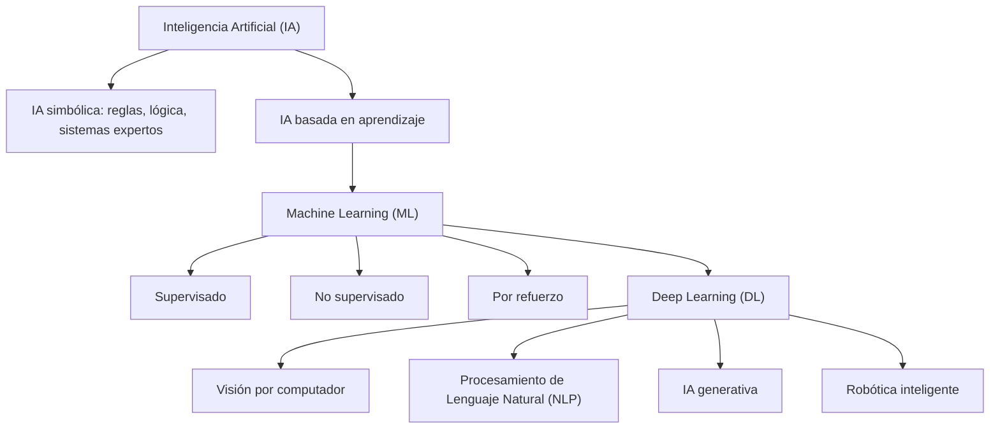

<div class="justify-text">

La **Inteligencia Artificial (IA)** es la rama de la informática que busca crear sistemas capaces de realizar tareas que normalmente requieren inteligencia humana: comprender lenguaje, aprender de la experiencia, tomar decisiones o reconocer patrones.

En otras palabras, la IA no es una “máquina pensante” mágica, sino un conjunto de **algoritmos y modelos** que permiten a los ordenadores **aprender de datos** y mejorar con el tiempo.

Los **ordenadores** son extremadamente buenos en aquello que puede expresarse como **cálculo numérico y operaciones lógicas bien definidas**. Pueden realizar millones de sumas, multiplicaciones o búsquedas en fracciones de segundo sin cometer errores. Sin embargo, no se les da bien el **razonamiento flexible** que caracteriza a los seres humanos: comprender el contexto de una conversación, interpretar ironía, tomar decisiones con información incompleta o adaptarse a situaciones nuevas.

**La Inteligencia Artificial surge precisamente como respuesta a esa limitación**: en lugar de programar todas las reglas posibles, se diseñan sistemas que **aprenden patrones a partir de ejemplos** y que pueden generalizar a nuevos casos. Así, el ordenador deja de ser solo una “calculadora muy rápida” y empieza a comportarse de manera más adaptativa e inteligente en tareas como reconocer caras en fotos, recomendar música o traducir un texto a otro idioma.

:::tip  
Ahora vamos a estudiar los **tipos** y **ramas** de la inteligencia artificial. Ten en cuenta:  
* Los **tipos de IA** (débil vs fuerte, específica vs general) se refieren a su **nivel de capacidad**.  
* Las **ramas de la IA** se refieren a los **métodos y enfoques técnicos** que se utilizan para construir sistemas inteligentes.  
:::

---

## Tipos de Inteligencia Artificial

Cuando hablamos de IA, no todas las inteligencias artificiales son iguales. Para entenderlo mejor, se suelen usar varias **clasificaciones** que distinguen el **nivel de inteligencia** de estas tecnologías.


### IA débil o específica

También llamada *Narrow AI*. Está diseñada para realizar **una tarea específica** y lo hace muy bien, incluso mejor que los humanos en algunos casos.
  * Ejemplos:

    * Un sistema que recomienda películas en Netflix.
    * Un programa que juega al ajedrez o al Go.
    * Un modelo de reconocimiento facial en tu móvil.

Son las IA que tenemos hoy en día: potentes, útiles, pero muy **limitadas a su dominio**.

### IA fuerte o general

También llamada *General AI* o *AGI (Artificial General Intelligence)*. Sería una IA con **inteligencia similar a la humana**, capaz de razonar, aprender y adaptarse a cualquier tipo de tarea, sin estar restringida a un ámbito concreto.

Ejemplo hipotético: una máquina que podría resolver un problema de matemáticas, cocinar un plato, dar consejos médicos y escribir una novela con la misma versatilidad que un humano.

**No existe todavía**. Está en fase de especulación y es objeto de debate científico, filosófico y ético.

---

## Ramas de la Inteligencia Artificial

Como hemos visto, la inteligencia artificial es un concepto muy **amplio**: se refiere a cualquier técnica que permita que una máquina realice tareas que normalmente requieren inteligencia humana.

Según el **enfoque técnico**, podemos distinguir las siguientes ramas y subramas de la IA:



Dentro de la IA hay dos grandes enfoques históricos:

* **IA simbólica o basada en reglas**: el conocimiento se representa con reglas lógicas escritas a mano. Ejemplo: un sistema experto médico que sigue una lista de “si ocurre X → entonces Y”.
* **IA conexionista o basada en aprendizaje**: en lugar de reglas explícitas, la máquina aprende de datos (esto incluye al Machine Learning y, dentro de él, al Deep Learning).

### IA simbólica
Leyendo la definición de IA simbólica te podrás preguntar: **si la IA simbólica se basa en reglas escritas a mano, ¿por qué se considera IA? ¿Qué la diferencia de un programa secuencial?**

La clave está en que, aunque las reglas las escriba una persona, lo que diferencia un programa tradicional de un **sistema experto** o una IA simbólica es:

1. **Representación explícita del conocimiento**

   * En un programa secuencial típico, las condiciones y estructuras están “duras” en el código.
   * En la IA simbólica, el conocimiento se representa en una **base de reglas** (una especie de “memoria” del sistema). Esto significa que se pueden añadir, quitar o modificar reglas sin reprogramar todo el sistema.

2. **Motor de inferencia**

   * Es el “razonador” que combina las reglas con los hechos disponibles para llegar a nuevas conclusiones.
   * Por ejemplo:

     * Regla 1: *Si fiebre y tos → posible gripe*.
     * Regla 2: *Si gripe → recomendar reposo*.
     * Hecho: *El paciente tiene fiebre y tos*.
     * El sistema infiere automáticamente *posible gripe* y, a partir de ahí, *recomendar reposo*.

   Esa capacidad de **encadenar reglas** es lo que le da un comportamiento parecido al razonamiento humano.

3. **Explicabilidad**

   * Los sistemas expertos no solo daban una respuesta, sino que podían explicar *por qué*.
   * Ejemplo: *“Diagnóstico: gripe, porque detecté fiebre y tos, y según la regla 1 eso implica gripe”*.


:::tip EJEMPLO COMPARATIVO PROGRAMA SECUENCIAL VS IA SIMBÓLICA
En el siguiente **ejemplo comparativo** en pseudocódigo puedes ver la diferencia entre un **programa secuencial con if/else** y un **sistema experto basado en reglas**.

**Programa tradicional (secuencial con condiciones)**

```pseudo
si paciente.tiene_fiebre y paciente.tiene_tos:
    diagnostico = "gripe"
    tratamiento = "reposo"
sino si paciente.tiene_fiebre y paciente.tiene_manchas:
    diagnostico = "sarampión"
    tratamiento = "antivirales"
sino:
    diagnostico = "desconocido"
```

👉 Aquí el **orden está fijado** por el programador.
Si queremos añadir una nueva enfermedad, tenemos que reescribir o ampliar el código.


**Sistema experto (IA simbólica con motor de inferencia)**

Base de conocimiento (reglas):

```
Regla 1: SI fiebre Y tos → ENTONCES gripe
Regla 2: SI gripe → ENTONCES reposo
Regla 3: SI fiebre Y manchas → ENTONCES sarampión
Regla 4: SI sarampión → ENTONCES antivirales
```

**Motor de inferencia (razona con las reglas):**

```
Hecho: paciente.tiene_fiebre = verdadero
Hecho: paciente.tiene_tos = verdadero

→ Aplica Regla 1 → Concluye "gripe"
→ Aplica Regla 2 → Concluye "reposo"
```

👉 Aquí el **razonamiento surge de encadenar reglas**.
Podemos añadir nuevas reglas sin tocar el motor de inferencia, y el sistema seguirá funcionando.

:::

:::info
En este curso no nos centraremos en este tipo de IA.
:::

---

### IA basada en el aprendizaje

La IA conexionista o basada en aprendizaje es el gran paraguas donde encajan todas las técnicas que aprenden de datos. Dentro de este enfoque entran:

#### Machine Learning (ML)

Es la rama de la IA donde los sistemas **aprenden automáticamente de los datos**, sin que un programador tenga que escribir todas las reglas.
Ejemplo sencillo: en lugar de programar cómo distinguir un perro de un gato, mostramos miles de fotos y el sistema **aprende las diferencias estadísticas** entre ambos.

Existen **subtipos de Machine Learning**:

* **Supervisado**: aprende con ejemplos etiquetados (ej. fotos de gatos y perros ya identificadas).
* **No supervisado**: busca patrones en datos sin etiquetas (ej. agrupar clientes por hábitos de compra).
* **Por refuerzo**: aprende por prueba y error, recibiendo recompensas o castigos (ej. una IA jugando a videojuegos o entrenando un robot).


#### Deep Learning (DL)

Es un **subconjunto del ML** que usa **redes neuronales artificiales con muchas capas** (“profundas”). Gracias a su capacidad de manejar grandes volúmenes de datos, es la base de los avances más espectaculares de los últimos años:

* Reconocimiento facial en móviles.
* Traducción automática de Google.
* Coches autónomos que analizan imágenes de cámaras.
* Modelos generativos como ChatGPT o DALL·E.

Las **principales áreas de uso** actuales del Deep Learning son:

* **Procesamiento de Lenguaje Natural (PLN o NLP en inglés):** parte de la IA que se centra en entender y generar lenguaje humano (chatbots, traductores automáticos, análisis de sentimientos). Ejemplos: ChatGPT, Google Translate, Siri, etc.
* **Visión por computador:** que permite a las máquinas interpretar imágenes y vídeos. Ejemplos: FaceID de Apple, búsqueda de imágenes por objetos o personas ("perro", "playa", "Juan") en Google Photos, Tesla Autopilot, etc.
* **IA generativa**: se centra en crear contenido nuevo: texto, imágenes, música, código, audio o incluso vídeo. Ejemplos: ChatGPT, DALL·E, etc. 
* **Robótica inteligente:** combina IA con hardware para actuar en el mundo físico. Ejemplos: Roomba, Da Vinci (sistema quirúrgico que combina precisión mecánica con asistencia inteligente), etc.


</div>