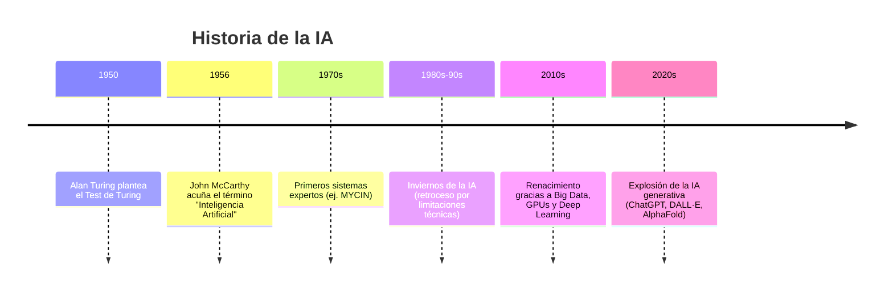

La **Inteligencia Artificial** no es un invento reciente: sus raíces se remontan a mediados del siglo XX, y su evolución ha estado marcada por avances espectaculares, grandes expectativas y también periodos de decepción conocidos como *inviernos de la IA*.

---

## Década de 1950: Los inicios

La historia de la Inteligencia Artificial como disciplina científica arranca en la década de 1950. Es una etapa marcada por **ideas visionarias** y por la primera vez en que se formula la pregunta de manera seria: *¿pueden las máquinas pensar?*

* **Alan Turing (1912–1954)**
  Fue un matemático y criptógrafo británico, considerado uno de los padres de la informática moderna. En 1950 publicó el artículo *“Computing Machinery and Intelligence”*, donde planteó la famosa pregunta:

  > *¿Pueden las máquinas pensar?*

  Como no existía una definición clara de “pensar”, propuso un experimento mental para esquivar el problema: el **Test de Turing**. La idea era sencilla pero poderosa:

  * Si un humano conversa con una máquina y no puede distinguirla de otra persona, entonces podemos considerar que la máquina “piensa” de forma práctica.
    Aunque hoy sabemos que el test tiene limitaciones, fue el primer intento serio de **definir la inteligencia de las máquinas en términos observables**.

* **Primeros programas de juego**
  La década también vio los primeros programas diseñados para jugar, un campo atractivo porque el ajedrez o las damas requieren **estrategia, planificación y razonamiento**.

  * Claude Shannon (ingeniero estadounidense) ya en 1950 había escrito un artículo explicando cómo un ordenador podría jugar al ajedrez.
  * Años después, se implementaron los primeros prototipos de programas capaces de disputar partidas sencillas. Aunque eran muy básicos comparados con los campeones humanos, demostraban que las máquinas podían resolver problemas complejos mediante cálculo sistemático.

* **Conferencia de Dartmouth (1956)**
  Este encuentro en Estados Unidos, organizado por John McCarthy, Marvin Minsky, Nathaniel Rochester y Claude Shannon, es considerado el **acto de nacimiento oficial de la Inteligencia Artificial**.
  Fue allí donde McCarthy acuñó el término *“Artificial Intelligence”*. La propuesta del taller afirmaba que “cada aspecto del aprendizaje o cualquier otra característica de la inteligencia puede, en principio, describirse con tanta precisión que una máquina puede simularlo”.

👉 La década de 1950 fue, por tanto, el punto de partida de la IA: de la especulación filosófica y matemática se pasó a **proyectos concretos y a una comunidad científica organizada**. Aunque los resultados eran todavía muy rudimentarios, se sentaron las bases que marcarían toda la evolución posterior.

---

## Años 1960–1970: Primeros éxitos y sistemas expertos

Tras la conferencia de Dartmouth (1956), la investigación en IA comenzó a crecer rápidamente. La década de 1960 estuvo marcada por el entusiasmo y la idea de que pronto se alcanzaría una **IA general**, capaz de razonar como un ser humano en cualquier situación. Aunque esa visión resultó demasiado optimista, en estos años aparecieron los primeros **prototipos funcionales** que mostraban el potencial de la disciplina.

* **Los primeros chatbots**
  En 1966, Joseph Weizenbaum (MIT) creó **ELIZA**, un programa que simulaba a un psicoterapeuta. Su funcionamiento era relativamente sencillo: detectaba palabras clave en las frases del usuario y respondía con patrones predefinidos.

  * Ejemplo: si el usuario escribía *“Estoy triste”*, ELIZA contestaba *“¿Por qué estás triste?”*.
  * Aunque muy básico, muchos usuarios llegaron a sentir que “hablaban” con una máquina que los comprendía. Este efecto psicológico —conocido como el “efecto ELIZA”— puso de manifiesto lo fácil que es para los humanos atribuir inteligencia a respuestas superficiales.

* **El auge de los sistemas expertos**
  En los años 70 surgió otra línea fundamental: los **sistemas expertos**. Estos programas estaban diseñados para resolver problemas en **dominios muy específicos** (medicina, geología, ingeniería) utilizando **bases de reglas** y un **motor de inferencia**.

  * El ejemplo más famoso fue **MYCIN** (1972, Universidad de Stanford), que ayudaba a diagnosticar infecciones bacterianas y recomendar antibióticos. Contaba con unas 450 reglas y, en ciertos casos, sus recomendaciones eran comparables a las de un médico humano.
  * La gran innovación de MYCIN fue que, además de dar una respuesta, podía **explicar su razonamiento**, indicando qué reglas había aplicado y por qué.

* **Optimismo desbordado**
  Estos primeros logros crearon un clima de enorme entusiasmo: muchos investigadores y medios de comunicación pensaban que la “IA general” estaba a la vuelta de la esquina.

  * Se creía que, en pocas décadas, las máquinas podrían igualar o superar la inteligencia humana en la mayoría de tareas.
  * Esta visión llevó a una gran inversión en proyectos de investigación y a una fuerte expansión del campo.

👉 En resumen: los años 60 y 70 demostraron que la IA podía **hacer cosas útiles en contextos limitados** (simular conversación, diagnosticar enfermedades), pero también sembraron expectativas demasiado altas. Esa tensión entre logros reales y promesas incumplidas marcaría la evolución de la disciplina en las décadas siguientes.

---

## Años 1980–1990: Inviernos de la IA

Después del entusiasmo de los años 60 y 70, la realidad alcanzó a la inteligencia artificial. Muchos de los proyectos prometían más de lo que realmente podían cumplir y, a medida que se evidenciaron las limitaciones técnicas, la financiación y el interés comenzaron a caer. Este periodo se conoce como los **“inviernos de la IA”**, una metáfora que refleja tiempos fríos y difíciles para la investigación.

* **Problemas de los sistemas expertos**
  Aunque sistemas como MYCIN habían sido muy prometedores, pronto se descubrieron sus limitaciones:

  * Añadir nuevas reglas era **costoso y complejo**, y los programas se volvían cada vez más difíciles de mantener.
  * Solo funcionaban en dominios muy restringidos: fuera de su área de conocimiento, eran inútiles.
  * Carecían de la capacidad de aprender de la experiencia: todo dependía del conocimiento escrito a mano por expertos humanos.

* **Limitaciones tecnológicas**
  Los ordenadores de la época no tenían ni la potencia de cálculo ni la memoria suficiente para soportar modelos más ambiciosos. Entrenar o simular sistemas complejos era extremadamente lento y costoso.

* **Expectativas no cumplidas**
  La comunidad científica y los medios habían transmitido la idea de que la “IA general” estaba a la vuelta de la esquina. Cuando esas promesas no se materializaron, inversores y gobiernos redujeron drásticamente su apoyo.
  Este desencanto colectivo es lo que se denominó **invierno de la IA**: una fase en la que las expectativas bajaron y el campo perdió protagonismo.

* **Avances silenciosos**
  A pesar de la desilusión general, en esta época también germinaron avances que serían fundamentales más adelante:

  * **Redes neuronales artificiales**: en los años 80 se redescubre el perceptrón multicapa gracias al algoritmo de **retropropagación (backpropagation)**, que permitía entrenar redes más complejas. Aunque la potencia de cálculo todavía era insuficiente para grandes redes, se abrió un camino que décadas después sería clave en el Deep Learning.
  * **Algoritmos genéticos**: inspirados en la evolución biológica, usaban ideas como mutación, recombinación y selección natural para resolver problemas de optimización.
  * **Aprendizaje por refuerzo**: técnicas en las que un agente aprende mediante prueba y error, recibiendo recompensas o castigos, comenzaron a formalizarse y a usarse en entornos simulados.

👉 En conclusión: los años 80 y 90 fueron una época de **retroceso en expectativas y financiación**, pero también de **innovación en ideas de base** que, con el tiempo y más potencia de cálculo, se convertirían en los pilares del renacimiento de la IA en el siglo XXI.

---

## Décadas de 2000–2010: El renacimiento

Después de los inviernos de la IA, muchos pensaban que esta disciplina quedaría relegada a un rincón académico. Sin embargo, a principios del siglo XXI se produjo un **renacimiento espectacular**, gracias a la convergencia de tres factores clave:

1. **Big Data**

   * La llegada de internet, los smartphones, las redes sociales y los sensores generó **cantidades de datos nunca vistas**.
   * Fotos en Facebook, búsquedas en Google, compras en Amazon o datos de GPS creaban un flujo constante de información.
   * Estos volúmenes masivos de datos se convirtieron en el “combustible” ideal para que los algoritmos de IA pudieran aprender patrones complejos.

2. **Mayor potencia de cálculo**

   * Las **GPUs (tarjetas gráficas)**, diseñadas originalmente para videojuegos, demostraron ser perfectas para entrenar redes neuronales, ya que podían realizar miles de operaciones en paralelo.
   * Esto permitió pasar de modelos pequeños y lentos a redes mucho más profundas y con tiempos de entrenamiento razonables.

   :::info CURIOSIDADES DE LAS GPUs
    La **GPU** (del inglés *Graphics Processing Unit* o *Unidad de Procesamiento Gráfico*) es un tipo de procesador especializado. Originalmente se diseñaron para **videojuegos y gráficos 3D**, porque son muy buenas dibujando miles de píxeles al mismo tiempo.

    La **CPU** (Central Processing Unit) es el “cerebro general” del ordenador: hace de todo, pero con pocos núcleos muy potentes. La **GPU** tiene **miles de núcleos pequeños** que trabajan en paralelo. Esto la hace ideal para tareas que requieren repetir muchas operaciones similares a la vez.

    El **entrenamiento de una red neuronal requiere multiplicar enormes matrices de números** y repetir estas operaciones millones de veces con grandes volúmenes de datos.  

    ⚡ La GPU acelera esto muchísimo porque **fue creada para procesar imágenes (que también son matrices de píxeles)**. Por eso, a mediados de los 2000, los investigadores empezaron a usar GPUs para entrenar redes neuronales y descubrieron que reducían los tiempos de semanas a días o incluso horas.
   :::

3. **Nuevos algoritmos**

   * Se desarrollaron arquitecturas más sofisticadas de redes neuronales, como las **redes convolucionales (CNN)** para visión por computador, o los **modelos recurrentes (RNN)** para secuencias de texto y voz.
   * Estos avances fueron decisivos para que la IA diera un salto cualitativo en aplicaciones prácticas.

### Hitos destacados

* **2009 – Google desarrolla el coche autónomo**
  Un proyecto que sorprendió al mundo: un coche capaz de circular por sí solo usando cámaras, sensores y algoritmos de IA. Fue el inicio de la carrera por los vehículos autónomos.

* **2011 – Watson (IBM) gana en Jeopardy!**
  Watson, un sistema de IA de IBM, derrotó a los campeones humanos en el concurso televisivo *Jeopardy!* (similar al “Saber y Ganar” en EE. UU.).

  * Lo impactante no fue solo que respondiera rápido, sino que **entendía preguntas formuladas en lenguaje natural**, algo extremadamente difícil hasta entonces.

* **2012 – La revolución de ImageNet**
  En una competición internacional de reconocimiento de imágenes, un equipo liderado por Geoffrey Hinton y Alex Krizhevsky presentó una red neuronal profunda (llamada **AlexNet**) que redujo drásticamente los errores en la clasificación de millones de fotos.

  * El resultado fue tan impresionante que marcó el inicio oficial de la era del **Deep Learning**.
  * Desde entonces, las redes profundas empezaron a superar a los humanos en varias tareas específicas de visión.

👉 **En resumen**: en los años 2000 y 2010, la IA pasó de ser un campo con resultados modestos a convertirse en una tecnología transformadora. El Big Data, las GPUs y los nuevos algoritmos encendieron la chispa que dio origen a la explosión de la IA moderna.

---

### 2015–Actualidad: La explosión de la IA

A partir de 2015, la inteligencia artificial vivió una auténtica **explosión de resultados** gracias al Deep Learning y, más recientemente, a los **modelos generativos**. Lo que antes parecía ciencia ficción empezó a convertirse en realidad cotidiana.

* **Deep Learning en acción**

  * En 2016, la empresa **DeepMind** (propiedad de Google) sorprendió al mundo con **AlphaGo**, un programa capaz de derrotar al campeón mundial de Go, un juego de estrategia considerado demasiado complejo para la IA clásica debido a sus innumerables combinaciones posibles. Fue un hito histórico comparable a la victoria de Deep Blue sobre Kasparov en ajedrez, pero aún más impactante por la dificultad del reto.

* **IA generativa: una nueva era**

  * A partir de 2020, la IA no solo reconocía o clasificaba datos, sino que **empezó a crear contenido nuevo**.
  * **Modelos de texto**: en 2022, OpenAI lanzó **ChatGPT**, un modelo de lenguaje capaz de mantener conversaciones fluidas, redactar textos complejos, programar código o responder preguntas de todo tipo.
  * **Modelos de imagen**: herramientas como **Stable Diffusion, MidJourney o DALL·E** permiten generar ilustraciones realistas a partir de simples descripciones de texto.
  * **Modelos de música y vídeo**: aplicaciones como **Suno, Runway o Pika** han demostrado que la IA también puede componer canciones o generar clips audiovisuales desde cero.

* **La IA en la vida diaria**
  La IA ya no es exclusiva de laboratorios o grandes empresas: forma parte de nuestro día a día.

  * Asistentes de voz (Alexa, Siri, Google Assistant).
  * Recomendaciones personalizadas en Netflix, YouTube o Spotify.
  * Diagnóstico asistido por imágenes en hospitales.
  * Vehículos autónomos en fase de pruebas y despliegue.

* **Retos éticos y sociales**
  Con el auge de estas tecnologías, también han aparecido **problemas y debates importantes**:

  * **Sesgos**: los modelos aprenden de los datos, y si estos están sesgados, la IA también lo estará.
  * **Impacto en el empleo**: automatización de tareas rutinarias, necesidad de nuevas habilidades.
  * **Uso indebido**: desde los *deepfakes* hasta la generación de desinformación masiva.
  * **Coste energético**: entrenar grandes modelos requiere enormes cantidades de energía y recursos computacionales.

---

👉 **En resumen**:
Desde 2015 vivimos la **era dorada de la IA**. Las redes neuronales profundas y los modelos generativos han llevado la tecnología a un nivel impensable hace solo una década. Sin embargo, junto con las oportunidades, también aparecen **nuevos riesgos** que la sociedad debe gestionar de forma ética y responsable.

