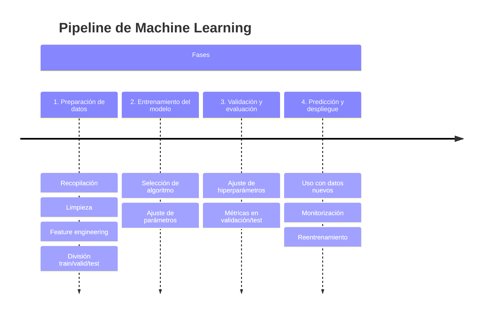
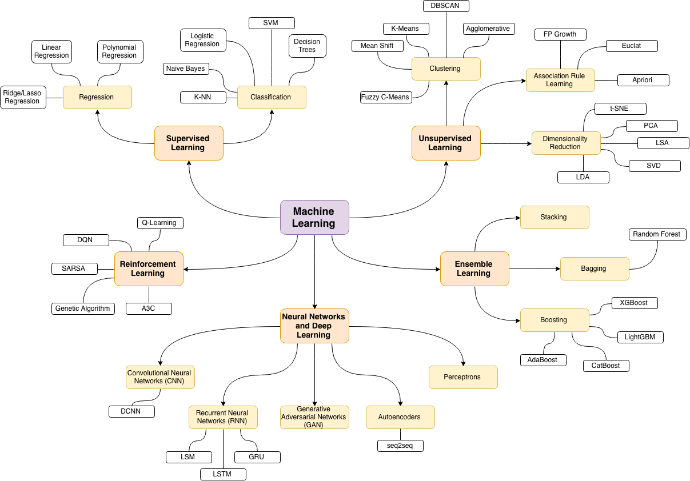

La **Inteligencia Artificial moderna** se apoya en gran medida en una de sus ramas más importantes: el **Machine Learning** (Aprendizaje Automático).

El Machine Learning se basa en una idea sencilla pero poderosa: en lugar de programar todas las reglas a mano, los **algoritmos aprenden automáticamente a partir de datos**.

Por ejemplo:

* En vez de escribir manualmente cómo distinguir un gato de un perro en una foto, mostramos al sistema miles de imágenes ya etiquetadas.
* A partir de esos ejemplos, **el algoritmo descubre por sí mismo los patrones** que diferencian a un gato de un perro.

---

## Flujo general del Machine Learning

Podemos resumir el ciclo de trabajo en **cuatro etapas principales**:

1. **Preparación de los datos**

   * **Recopilación:** reunir ejemplos relevantes (imágenes, textos, registros, sensores…).
   * **Limpieza y preparación:** eliminar errores, valores vacíos o datos duplicados.
   * **Feature engineering:** transformar los datos para que el algoritmo pueda aprovecharlos mejor (normalización, creación de variables, codificación de texto, reducción de dimensionalidad).
   * Finalmente, los datos se dividen en **train / validation / test** para poder entrenar y evaluar el modelo correctamente.

2. **Entrenamiento del modelo**

   * Se elige un algoritmo adecuado (ej. regresión lineal, árbol de decisión, red neuronal).
   * El modelo se entrena con los datos de entrenamiento ajustando sus parámetros internos.

3. **Validación y evaluación**

   * Se mide el rendimiento en el conjunto de validación y se ajustan **hiperparámetros** para mejorar los resultados.
   * Una vez afinado, se hace la evaluación final con el conjunto de **test**, que representa datos nuevos.

4. **Predicción y despliegue**

   * El modelo ya entrenado se utiliza con datos desconocidos para generar predicciones.
   * En entornos reales se monitoriza su rendimiento y, si los datos cambian con el tiempo (**data drift**), es necesario **reentrenar** con nueva información.

---

## Tipos de Machine Learning

En función de cómo se presentan los datos y cómo aprende el algoritmo, el Machine Learning se divide en cinco grandes categorías:

### Aprendizaje Supervisado

El sistema aprende a partir de ejemplos **etiquetados**: cada dato de entrada viene con la respuesta correcta. El objetivo es que, tras el entrenamiento, el modelo pueda predecir la etiqueta de datos nuevos.

**Tareas típicas:**

* **Regresión:** predecir un valor numérico continuo.

  * Ejemplos:

    * Estimar el precio de una casa según metros cuadrados y ubicación.
    * Predecir la demanda eléctrica de una ciudad.
    * Estimar la probabilidad de impago de un préstamo.
  * Algoritmos comunes: *Regresión lineal, Regresión polinómica, Árboles de regresión, Random Forest Regressor, Gradient Boosting (XGBoost, LightGBM)*.

* **Clasificación:** asignar una categoría a cada ejemplo.

  * Ejemplos:

    * Detección de spam en emails (*spam* vs *no spam*).
    * Diagnóstico médico por imágenes (radiografía → *sano* o *enfermo*).
    * Reconocimiento de voz (convertir audio en texto).
  * Algoritmos comunes: *Regresión logística, Máquinas de Vectores de Soporte (SVM), Árboles de decisión, Random Forest, k-NN, Redes neuronales*.

---

### Aprendizaje No Supervisado

El sistema recibe datos **sin etiquetas**: no hay una respuesta “correcta” en los ejemplos. El objetivo es **descubrir patrones ocultos** o estructuras en los datos.

**Ejemplos de técnicas:**

* **Clustering (agrupamiento):** dividir los datos en grupos que comparten características similares.

  * Ejemplos:

    * Segmentar clientes de una tienda online según su comportamiento de compra.
    * Agrupar noticias por temática automáticamente.
  * Algoritmos comunes: *K-means, DBSCAN, Clustering jerárquico*.

* **Reducción de dimensionalidad:** simplificar conjuntos de datos muy complejos manteniendo la información relevante.

  * Ejemplos:

    * Comprimir imágenes para analizarlas más rápido.
    * Visualizar datos de muchas variables en gráficos de 2D o 3D.
  * Algoritmos comunes: *PCA (Análisis de Componentes Principales), t-SNE, UMAP*.

:::info 🌐 Demo de Clustering  
En esta página web [Clustering Visualizer](https://clustering-visualizer.web.app/kmeans) puedes experimentar con el algoritmo **K-means** y ver cómo agrupa automáticamente los datos en distintos clusters. En clase haremos una pequeña demostración interactiva.  
:::

---

### Aprendizaje por Refuerzo

Aquí no hay ejemplos fijos, sino un **agente** que aprende mediante **ensayo y error**. El agente interactúa con un entorno, recibe **recompensas o castigos** y adapta su estrategia para maximizar la recompensa total.

**Ejemplos:**

* Robótica: un robot que aprende a caminar sin caerse.
* Videojuegos: una IA que aprende a jugar Atari o a derrotar a campeones humanos en el juego de Go (ej. **AlphaGo, 2016**).
* Sistemas de recomendación dinámicos: ajustar sugerencias en tiempo real en función de la interacción del usuario.

**Algoritmos comunes:** *Q-Learning, SARSA, Deep Q-Networks (DQN), Policy Gradients*.

---

👉 **Resumen:**

* **Supervisado** = aprender con ejemplos con respuesta.
* **No supervisado** = encontrar estructura oculta en los datos sin respuesta.
* **Por refuerzo** = aprender actuando en un entorno, con recompensas y castigos.

