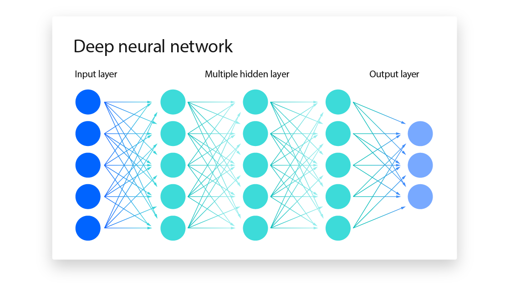

El **Deep Learning (Aprendizaje Profundo)** es una rama del *Machine Learning* que ha revolucionado la Inteligencia Artificial en la última década. Su éxito ha hecho posible avances espectaculares en reconocimiento de imágenes, traducción automática, coches autónomos o chatbots como ChatGPT.

* Se basa en **redes neuronales artificiales** con muchas capas (*deep = profundo*).
* Cada capa transforma los datos un poco más hasta que, al final, el sistema es capaz de reconocer patrones muy complejos.
* La inspiración original vino del cerebro humano, aunque las redes artificiales son mucho más simples que las biológicas.

:::tip DIFERENCIA RECONOCIMIENTO DE IMÁGENES CON ML CLÁSICO VS REDES NEURONALES
En **Machine Learning clásico**, el proceso se basaba en **feature engineering manual**:

* Si querías que un algoritmo reconociera gatos en fotos, primero **debías programar tú qué características mirar**: bordes, colores, texturas, formas, tamaños…
* El modelo (ej. un SVM o un árbol de decisión) luego usaba esas características para aprender.
  👉 Si tus *features* eran malas, el modelo no funcionaba bien.

En cambio, en **Deep Learning**, la red neuronal **aprende automáticamente las features intermedias**:

* Las primeras capas detectan patrones simples (ej. bordes en una imagen).
* Las siguientes capas combinan esos patrones en estructuras más complejas (ej. orejas, patas).
* Las últimas capas entienden el concepto completo (ej. “gato”).
  👉 El humano ya no necesita decidir qué variables son importantes: la red las descubre sola.
:::

---

## Cómo funciona una red neuronal (idea básica)

1. **Neuronas artificiales**

   * Inspiradas en las neuronas biológicas, pero mucho más simples.
   * Cada neurona recibe varios números de entrada (features), los multiplica por unos valores llamados **pesos**, suma todo, aplica una **función de activación** y produce una salida.
   * 👉 Ejemplo: una neurona podría recibir el brillo y el color de un píxel de una imagen y dar como salida “probabilidad de que sea parte de un borde”.

2. **Capas de neuronas**

   * Una red neuronal conecta muchas neuronas en **capas**:

     * **Capa de entrada**: recibe los datos originales (ej. los píxeles de una foto).
     * **Capas ocultas**: transforman la información paso a paso.
     * **Capa de salida**: da la predicción final (ej. “gato” o “perro”).
   * Al apilar muchas capas, la red puede **aprender representaciones jerárquicas**:

     * Bordes → formas → partes del objeto → objeto completo.

3. **Entrenamiento de la red**

   * La red empieza con pesos aleatorios (al principio no acierta nada).
   * Cada vez que ve un ejemplo, compara su predicción con la respuesta real (**error o función de pérdida**).
   * Gracias al algoritmo de **backpropagation** y al uso de **optimizadores** (ej. *gradient descent*), los pesos se ajustan un poquito para reducir el error.
   * Repitiendo este proceso con miles o millones de ejemplos, la red va mejorando hasta reconocer patrones muy complejos.

👉 **Analogía sencilla:**
Una red neuronal es como un **equipo de filtros encadenados**. Cada capa pule un poco más la información: de lo más simple (líneas y colores) a lo más complejo (caras, palabras o significados).

**🔹 Ejemplo de una red neuronal: Reconocimiento de dígitos manuscritos (MNIST)**

* **Datos de entrada:** imágenes 28×28 píxeles en blanco y negro (784 neuronas de entrada).
* **Capas ocultas:** 1 o 2 capas con 128–256 neuronas. (El número de capas y las neuronas de cada uno lo eliges tú, son hiperparámetros)
* **Capa de salida:** 10 neuronas (una por cada dígito del 0 al 9).
  👉 Red pequeña, se puede entrenar en un portátil en pocos minutos.

:::tip Demo interactiva: QuickDraw

Para ver en acción cómo una red neuronal aprende a reconocer patrones, usaremos:
👉 [QuickDraw de Google](https://quickdraw.withgoogle.com/)

* Es un juego en el que dibujas un objeto (ej. una bicicleta, un sol, un perro) en pocos segundos.
* Una red neuronal trata de adivinar lo que dibujaste basándose en millones de ejemplos recopilados de usuarios.
* Muestra cómo el **Deep Learning puede reconocer dibujos imperfectos** y generalizar a partir de datos ruidosos.

👉 El modelo **no memoriza dibujos concretos**, sino que aprende los patrones comunes (formas, trazos) de cada categoría.
:::

---

## Tipos de redes neuronales

Aunque todas se basan en el mismo principio (neuronas conectadas en capas), existen arquitecturas diferentes según el tipo de datos y el problema a resolver:

### Redes totalmente conectadas (MLP – *Multilayer Perceptron*)

Cada neurona de una capa está conectada con *todas* las neuronas de la capa siguiente.

* **Aplicaciones típicas:**

  * Datos tabulares (ej. predicción de ventas con variables como precio, publicidad, temporada).
  * Problemas sencillos de clasificación o regresión.

### Redes convolucionales (CNN – *Convolutional Neural Networks*)

Utilizan capas de **convolución**, que aplican filtros sobre regiones locales de la imagen.
Así pueden detectar patrones simples (bordes, colores) y combinarlos en otros más complejos (formas, objetos).

* **Aplicaciones típicas:**

  * Visión por computador: reconocimiento facial, detección de objetos en fotos o vídeos, coches autónomos.
  * Medicina: análisis de radiografías o resonancias.
  * Sistemas de vigilancia y biometría.

### Redes recurrentes (RNN – *Recurrent Neural Networks*)

Incorporan **conexiones de retroalimentación**, lo que les permite “recordar” información previa. Son ideales para trabajar con **secuencias** de datos.

* **Aplicaciones típicas:**

  * Procesamiento de lenguaje natural (NLP): análisis de sentimientos, chatbots tempranos.
  * Reconocimiento de voz.
  * Series temporales: predicción de la bolsa, demanda energética.

### Transformers

Introducen el mecanismo de **atención**, que permite a la red enfocarse en las partes más relevantes de una secuencia de datos. Superan las limitaciones de las RNN porque procesan secuencias en paralelo, de manera mucho más eficiente.

* **Aplicaciones típicas:**

  * **NLP moderno:** traducción automática (Google Translate), modelos de texto (ChatGPT, BERT, GPT-4).
  * **Visión por computador:** *Vision Transformers (ViT)* para reconocimiento de imágenes.
  * **IA generativa:** modelos de texto, imagen, música y vídeo.

---

## Limitaciones del Deep Learning

Aunque el **Deep Learning** ha impulsado avances impresionantes, también tiene limitaciones importantes que conviene conocer:

1. **Necesita muchos datos**

   * Cuanto más grande y variado es el dataset, mejor aprende la red.
   * En problemas con pocos ejemplos, el modelo puede fallar porque no generaliza bien.
   * 👉 Ejemplo: entrenar un sistema de diagnóstico médico con solo 100 radiografías sería insuficiente; harían falta miles o millones para que funcione bien.

2. **Gran consumo computacional**

   * Entrenar redes profundas requiere **GPUs o TPUs**, que son caras y consumen mucha energía.
   * Esto limita a empresas o instituciones con gran infraestructura, dejando fuera a quienes no tienen esos recursos.
   * 👉 Ejemplo: entrenar GPT-3 costó millones de dólares en hardware y electricidad.

3. **Falta de explicabilidad**

   * Las redes neuronales son a menudo una “caja negra”: sabemos la entrada y la salida, pero no siempre entendemos bien cómo llegó a esa decisión.
   * Esto es un problema en ámbitos críticos (medicina, justicia, finanzas), donde es necesario justificar una predicción.
   * 👉 Ejemplo: un banco que niega un préstamo debe poder explicar el motivo, pero un modelo profundo solo da el resultado sin un razonamiento claro.

4. **Sesgos en los datos**

   * Si los datos de entrenamiento contienen prejuicios o desigualdades, el modelo los reproducirá (e incluso los amplificará).
   * 👉 Ejemplo: un sistema de reconocimiento facial entrenado mayoritariamente con rostros de personas blancas puede fallar más con rostros de personas de otras etnias.

5. **Riesgo de sobreajuste (*overfitting*)**

   * Si el modelo es demasiado complejo para los datos disponibles, puede aprender de memoria los ejemplos en vez de generalizar.
   * 👉 Ejemplo: un modelo que acierta el 100% en los datos de entrenamiento pero falla con datos nuevos.

6. **Dependencia del contexto y cambios en los datos** (*data drift*)

   * El modelo puede dejar de ser válido si las condiciones cambian con el tiempo.
   * 👉 Ejemplo: un detector de spam entrenado en 2020 puede fallar en 2023 porque los spammers inventaron nuevas técnicas.

