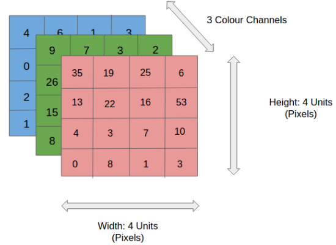
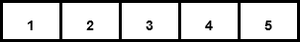
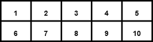

<div class="justify-text">

NumPy (Numerical Python) es una de las librerías **fundamentales** del ecosistema científico de Python. Proporciona estructuras de datos y operaciones matemáticas **altamente optimizadas**, esenciales para el **procesamiento eficiente de grandes volúmenes de datos**, algo habitual en inteligencia artificial y machine learning.

A diferencia de las listas nativas de Python, los **arrays de NumPy** son estructuras **homogéneas y compactas en memoria**, lo que permite realizar cálculos **miles de veces más rápidos** gracias a la vectorización y al uso de código optimizado en C.

## Importancia de NumPy en la IA

NumPy está en la base de casi todas las librerías modernas de IA: **Pandas, scikit-learn, TensorFlow o PyTorch** se apoyan en sus arrays para representar datos, matrices y tensores.  
A continuación se muestran dos ejemplos prácticos que ilustran por qué NumPy es tan importante en el trabajo con inteligencia artificial.

#### 🧠 Ejemplo: Manipulación eficiente de datos

En inteligencia artificial trabajamos con **grandes volúmenes de información numérica**, como imágenes, señales o series de datos.

Imagina que queremos **simular una imagen** para entrenar una red neuronal. Cada imagen puede representarse como un **array tridimensional**, donde:

* El primer valor indica la **altura** (número de filas de píxeles).
* El segundo, la **anchura** (número de columnas).
* El tercero, los **canales de color** (por ejemplo, RGB = 3 canales).



```python
import numpy as np

# Creamos una imagen aleatoria de 224x224 píxeles con 3 canales (RGB)
# Cada valor representa la intensidad de un color (de 0 a 255)
# Los parámetros de la función randint coinciden con:
# 0 → valor mínimo posible.
# 255 → valor máximo posible (el 255 no se incluye, por lo que los valores van de 0 a 254).
# (224, 224, 3) → forma del array, equivalente a:
# 224 filas (altura de la imagen)
# 224 columnas (anchura)
# 3 canales de color (RGB)
imagen = np.random.randint(0, 255, (224, 224, 3))

# Consultamos su forma: (alto, ancho, canales)
print(imagen.shape)
# (224, 224, 3)
```

👉 En este ejemplo, `np.random.randint(0, 255, (224, 224, 3))` genera una **matriz tridimensional** llena de números enteros aleatorios entre 0 y 255, imitando los valores de brillo de una imagen real.

El método `.shape` nos muestra la estructura del array:

* 224 filas (alto)
* 224 columnas (ancho)
* 3 canales (RGB)


En visión artificial y redes neuronales, es muy habitual **normalizar** las imágenes antes de procesarlas, para que los valores estén en un rango más manejable (por ejemplo, entre 0 y 1). Esto ayuda a que el modelo aprenda más rápido y de forma más estable.

```python
# Normalizamos todos los píxeles entre 0 y 1
imagen_normalizada = imagen / 255.0
```

Esta única línea divide **todos los valores del array a la vez**, sin usar bucles `for`. NumPy aplica la operación de forma **vectorizada**, aprovechando rutinas optimizadas en C que realizan millones de operaciones por segundo.

Este tipo de operaciones masivas y vectorizadas son **esenciales** en:

* **Visión por computador** (clasificación de imágenes, detección de objetos).
* **Reconocimiento facial o de gestos.**
* **Entrenamiento de redes neuronales convolucionales (CNN)**, donde cada imagen de entrada debe normalizarse antes de pasar a la red.

## Creación de arrays

### A partir de listas o tuplas (`np.array()`)

La forma más básica de crear un array en NumPy es a partir de una **lista** o **tupla** de Python.

```python
import numpy as np

lista = [1, 2, 3, 4, 5]
array = np.array(lista)

print(array)
# [1 2 3 4 5]
print(type(array))
# <class 'numpy.ndarray'>
```

En el caso del código anterior estamos creando un array de una dimensión:



También pueden crearse arrays **bidimensionales** (matrices) a partir de una lista de listas:

```python
matriz = np.array([[1, 2, 3, 4, 5],
                   [6, 7, 8, 9, 10]])
print(matriz)
# [[1 2 3 4 5]
#  [6 7 8 9 10]]
```




Todos los elementos del array tendrán el **mismo tipo de dato**.
NumPy lo determina automáticamente, aunque puede especificarse con el parámetro `dtype`:

```python
np.array([1, 2, 3], dtype=float)
# array([1., 2., 3.])
```

---

### Arrays de ceros, unos y valores aleatorios

NumPy ofrece funciones para crear arrays rápidamente sin escribir todos los valores manualmente.

#### `np.zeros()`

Crea un array lleno de **ceros** del tamaño indicado.

**Parámetros:**

* `shape`: **tupla** que indica el número de filas y columnas (por ejemplo, `(2, 3)` → 2 filas y 3 columnas).
* `dtype` *(opcional)*: tipo de dato de los elementos (por defecto `float`).

```python
import numpy as np

# Array unidimensional (vector):
np.zeros(5)
# array([0., 0., 0., 0., 0.])

# Array 2D de 2 filas y 3 columnas
np.zeros((2, 3))
# array([[0., 0., 0.],
#        [0., 0., 0.]])
```

#### `np.ones()`

Crea un array lleno de **unos**. Mismos parámetros que el método anterior.

```python
np.ones((3, 2))
# array([[1., 1.],
#        [1., 1.],
#        [1., 1.]])
```

#### `np.random.rand()`

Genera números **aleatorios entre `0` y `1`** siguiendo una **distribución uniforme**.
A diferencia de `np.zeros()` o `np.ones()`, los tamaños de las dimensiones se pasan **como argumentos separados**, no dentro de una tupla.

**Parámetros:**

* `d1, d2, ...`: dimensiones del array (filas, columnas, etc.)

```python
import numpy as np

# Array 2D de 2 filas y 3 columnas
np.random.rand(2, 3)
# array([[0.56, 0.18, 0.72],
#        [0.44, 0.85, 0.02]])

# Array 1D de 5 elementos
np.random.rand(5)
# array([0.12, 0.77, 0.33, 0.90, 0.58])
```


#### `np.random.randint()`

Genera números **enteros aleatorios** dentro de un **rango especificado**.
Es muy útil para crear datos de ejemplo o simular muestras numéricas (por ejemplo, intensidades de píxeles).

**Parámetros:**

* `low`: valor mínimo (incluido).
* `high`: valor máximo (⚠️ **excluido** → el número `high` no aparece).
* `size`: forma o dimensiones del array. Puede ser un número (para un array 1D) o una tupla (para arrays 2D o superiores).
* `dtype` *(opcional)*: tipo de dato (por defecto `int`).

```python
import numpy as np

# Array 2D de 2 filas y 4 columnas
# con valores aleatorios entre 0 y 9
np.random.randint(0, 10, (2, 4))
# array([[3, 7, 2, 9],
#        [5, 1, 0, 8]])

# Array 1D de 5 números aleatorios entre 1 y 100
np.random.randint(1, 100, 5)
# array([45, 12, 99, 7, 68])
```

---

### Rangos

#### `np.arange()`

Crea una **secuencia de números equiespaciados**, similar a la función `range()` de Python, pero devolviendo un **array de NumPy**.
Es muy útil para generar series numéricas o índices.

**Parámetros:**

* `start`: valor inicial de la secuencia (incluido).
* `stop`: valor final (⚠️ **excluido** → el último valor no se incluye).
* `step`: incremento entre valores consecutivos (por defecto `1`).
* `dtype` *(opcional)*: tipo de dato (entero o flotante).

```python
import numpy as np

# Array de 0 a 8 con paso de 2
np.arange(0, 10, 2)
# array([0, 2, 4, 6, 8])

# Array de 1 a 5 con paso de 1 (por defecto)
np.arange(1, 6)
# array([1, 2, 3, 4, 5])

# Array de números decimales
np.arange(0, 1, 0.2)
# array([0. , 0.2, 0.4, 0.6, 0.8])
```

#### `np.linspace()`

Crea una **secuencia de valores equiespaciados** entre un punto inicial y uno final, **incluyendo ambos extremos**.
A diferencia de `np.arange()`, aquí no se indica el paso, sino **cuántos valores** se desean generar.

**Parámetros:**

* `start`: valor inicial de la secuencia (incluido).
* `stop`: valor final de la secuencia (incluido).
* `num`: cantidad de valores a generar (por defecto `50`).
* `endpoint`: si es `True` (por defecto), incluye el valor final; si es `False`, lo excluye.
* `dtype` *(opcional)*: tipo de dato de los valores generados.

```python
import numpy as np

# 5 valores entre 0 y 1 (incluyendo ambos extremos)
np.linspace(0, 1, 5)
# array([0.  , 0.25, 0.5 , 0.75, 1.  ])

# 4 valores entre 10 y 20
np.linspace(10, 20, 4)
# array([10., 13.33333333, 16.66666667, 20.])

# Excluir el valor final
np.linspace(0, 1, 5, endpoint=False)
# array([0. , 0.2, 0.4, 0.6, 0.8])
```

👉 `np.linspace()` se usa mucho para **generar intervalos continuos** o **ejes de valores** en gráficos, funciones matemáticas o simulaciones numéricas.

---

### 💡 Resumen rápido

| Función                         | Descripción                  | Ejemplo   | Resultado               |
| ------------------------------- | ---------------------------- | --------- | ----------------------- |
| `np.array([1,2,3])`             | A partir de lista o tupla    | `[1,2,3]` | `[1 2 3]`               |
| `np.zeros((2,2))`               | Array de ceros               | 2×2       | `[[0. 0.],[0. 0.]]`     |
| `np.ones((3,1))`                | Array de unos                | 3×1       | `[[1.],[1.],[1.]]`      |
| `np.random.randint(0,10,(2,3))` | Aleatorios enteros           | 2×3       | `[[1 5 8],[0 2 7]]`     |
| `np.arange(0,10,2)`             | Rango con paso               | —         | `[0 2 4 6 8]`           |
| `np.linspace(0,1,5)`            | Rango dividido uniformemente | —         | `[0. 0.25 0.5 0.75 1.]` |

---

## Propiedades de los arrays

Los arrays de NumPy no solo almacenan datos, también **guardan información sobre su estructura** (forma, dimensiones, tipo de dato, etc.).
Estas propiedades son muy útiles en IA y Machine Learning para **entender la forma de los datos** que vamos a procesar (por ejemplo, el tamaño de las entradas y salidas de un modelo).


### `shape`

Indica la **forma** del array, es decir, **cuántas filas y columnas** (y, si aplica, cuántas dimensiones más) tiene.
Devuelve una **tupla** con el número de elementos en cada eje.

```python
import numpy as np

a = np.array([[1, 2, 3],
              [4, 5, 6]])

print(a.shape)
# (2, 3)
```

📘 Significado: el array tiene **2 filas y 3 columnas**.
En arrays tridimensionales (por ejemplo, imágenes RGB), `shape` podría ser `(224, 224, 3)`.

---

### `ndim`

Devuelve el **número de dimensiones** del array (también llamado “número de ejes”).

```python
a = np.array([[1, 2, 3],
              [4, 5, 6]])
print(a.ndim)
# 2
```

👉 En este caso, `a` es una **matriz 2D**.
Si fuese un vector, `ndim` sería `1`; si fuese un tensor de imágenes, podría ser `3` o más.

---

### `size`

Indica el **número total de elementos** del array (es decir, el producto de todas sus dimensiones).

```python
a = np.array([[1, 2, 3],
              [4, 5, 6]])
print(a.size)
# 6
```

📘 El array tiene 2 filas × 3 columnas = 6 elementos.

---

### `dtype`

Muestra el **tipo de dato** de los elementos del array (`int32`, `float64`, `bool`, etc.).
Todos los elementos de un array NumPy son **del mismo tipo**, lo que mejora el rendimiento.

```python
a = np.array([1, 2, 3])
b = np.array([1.0, 2.0, 3.0])

print(a.dtype)
# int64
print(b.dtype)
# float64
```

---

### 💡 Resumen rápido

Estas propiedades son fundamentales en IA para:

* Verificar la **forma de entrada y salida** de un modelo.
* Comprobar si los datos deben **reformatearse o redimensionarse**.
* Controlar el **tipo de dato** (por ejemplo, `float32` en TensorFlow para ahorrar memoria).

| Propiedad | Descripción                             | Ejemplo   | Resultado |
| --------- | --------------------------------------- | --------- | --------- |
| `shape`   | Forma del array (filas, columnas, etc.) | `a.shape` | `(2, 3)`  |
| `ndim`    | Número de dimensiones                   | `a.ndim`  | `2`       |
| `size`    | Número total de elementos               | `a.size`  | `6`       |
| `dtype`   | Tipo de datos almacenado                | `a.dtype` | `int64`   |

---

## Acceso y modificación de elementos

Una de las ventajas de los arrays de NumPy es que permiten **acceder, seleccionar y modificar datos de forma rápida y flexible**, incluso cuando se trata de grandes volúmenes de información.
Esto resulta esencial en IA, donde necesitamos **extraer subconjuntos de datos**, dividir muestras o transformar estructuras antes de entrenar modelos.


### Acceso por índice

Los elementos de un array se acceden mediante **índices numéricos**, igual que en las listas de Python, empezando desde `0`.

```python
import numpy as np

a = np.array([10, 20, 30, 40, 50])

print(a[0])  # Primer elemento
# 10

print(a[-1]) # Último elemento
# 50
```

En arrays **bidimensionales**, se utilizan dos índices:
el primero indica la **fila** y el segundo la **columna**.

```python
matriz = np.array([[1, 2, 3],
                   [4, 5, 6]])

print(matriz[0, 1])  # Elemento fila 0, columna 1
# 2

print(matriz[1, 2])  # Elemento fila 1, columna 2
# 6
```

👉 Se puede leer así: `matriz[fila, columna]`

---

### Slicing (rebanado)

El *slicing* permite **seleccionar un rango de elementos** usando la notación `[inicio:fin:paso]`, igual que en las listas, pero también puede aplicarse a **filas y columnas**.

```python
a = np.array([10, 20, 30, 40, 50])
print(a[1:4])
# [20 30 40]
```

📘 El índice inicial se incluye y el final **se excluye**.

En matrices 2D:

```python
matriz = np.array([[1, 2, 3],
                   [4, 5, 6],
                   [7, 8, 9]])

print(matriz[0:2, 1:3])
# [[2 3]
#  [5 6]]
```

👉 Se están seleccionando las **filas 0 y 1** y las **columnas 1 y 2**.
Esta operación devuelve un **subarray** (una porción del array original).

---

### Modificación de elementos

También podemos **asignar nuevos valores** directamente a posiciones o rangos específicos.

```python
a = np.array([1, 2, 3, 4, 5])
a[2] = 99
print(a)
# [ 1  2 99  4  5]
```

En matrices:

```python
matriz = np.array([[1, 2, 3],
                   [4, 5, 6]])

matriz[0, 1] = 100
print(matriz)
# [[  1 100   3]
#  [  4   5   6]]
```

También se pueden cambiar varios valores a la vez con slicing:

```python
a = np.array([1, 2, 3, 4, 5])
a[1:4] = [10, 20, 30]
print(a)
# [ 1 10 20 30  5]
```

---

### Indexación booleana (boolean indexing)

La indexación booleana permite **filtrar elementos** de un array según una condición lógica.
El resultado es un nuevo array que **solo contiene los valores que cumplen la condición**.

```python
a = np.array([10, 20, 30, 40, 50])

# Elementos mayores que 25
filtro = a > 25
print(filtro)
# [False False  True  True  True]

print(a[filtro])
# [30 40 50]
```

También puede escribirse directamente en una sola línea:

```python
print(a[a > 25])
# [30 40 50]
```

Podemos usar múltiples condiciones con operadores lógicos:

* `&` (and)
* `|` (or)
* `~` (not)

```python
print(a[(a > 15) & (a < 45)])
# [20 30 40]
```

👉 Esto es muy útil en IA para **limpiar datos**, **eliminar valores anómalos** o **seleccionar subconjuntos específicos** de un dataset.

---

### Subarrays y vistas (*views*)

Cuando seleccionamos una parte de un array (por ejemplo, con slicing), NumPy **no crea una copia independiente**, sino una **vista** (*view*) del array original.
Esto significa que **si modificamos el subarray, también cambia el original**.

```python
a = np.array([10, 20, 30, 40, 50])
sub = a[1:4]

sub[0] = 999
print(sub)
# [999  30  40]

print(a)
# [ 10 999  30  40  50]
```

👉 Cuidado: `sub` y `a` comparten los mismos datos en memoria.
Si quieres evitarlo, debes crear una **copia** explícita:

```python
b = a[1:4].copy()
b[0] = 0
print(b)
# [ 0 30 40]
print(a)
# [ 10 999  30  40  50]
```

---

### 💡 Resumen rápido

| Operación      | Descripción                 | Ejemplo      | Resultado             |
| -------------- | --------------------------- | ------------ | --------------------- |
| `a[i]`         | Accede a un elemento        | `a[2]`       | Valor del índice 2    |
| `a[i, j]`      | Accede a fila y columna     | `a[1,2]`     | Elemento (1,2)        |
| `a[start:end]` | Rango de elementos          | `a[1:4]`     | `[20 30 40]`          |
| `a[i:j, m:n]`  | Submatriz (filas, columnas) | `a[0:2,1:3]` | `[[2 3],[5 6]]`       |
| `a[a > x]`     | Filtra por condición        | `a[a>25]`    | `[30 40 50]`          |
| `a.copy()`     | Crea copia independiente    | —            | No afecta al original |

Estas técnicas de indexación —numérica, por rangos y booleana— son **básicas en el trabajo con datos numéricos** y se utilizan constantemente en librerías como **pandas**, **scikit-learn** o **TensorFlow**, donde seleccionar o transformar subconjuntos de datos es parte del flujo de trabajo diario.

---


## Operaciones básicas y funciones útiles

Los arrays de NumPy permiten realizar **operaciones matemáticas, estadísticas y lógicas** de forma vectorizada, es decir, **sin necesidad de bucles**.
Esto los hace ideales para tareas de **inteligencia artificial y machine learning**, donde se trabajan grandes volúmenes de datos y se necesitan cálculos rápidos y precisos.

### Operaciones aritméticas

Las operaciones básicas (`+`, `-`, `*`, `/`, `**`) se aplican **elemento a elemento**, tanto entre arrays como con escalares.

```python
import numpy as np

a = np.array([10, 20, 30])
b = np.array([1, 2, 3])

print(a + b)   # Suma
# [11 22 33]

print(a * b)   # Multiplicación
# [10 40 90]

print(a / 10)  # División por escalar
# [1. 2. 3.]
```

:::warning Importante
En las operaciones aritméticas entre arrays (`+`, `-`, `*`, `/`, etc.),
ambos arrays deben tener **el mismo tamaño y forma** (`shape`), o ser **compatibles mediante broadcasting**.

```python
a = np.array([10, 20, 30])
b = np.array([1, 2, 3])
print(a + b)
# [11 22 33] ✅ Correcto
```

Si las dimensiones no coinciden y no pueden adaptarse por broadcasting, NumPy mostrará un error:

```python
c = np.array([1, 2])
print(a + c)
# ❌ ValueError: operands could not be broadcast together
```

👉 Antes de realizar operaciones entre arrays, comprueba sus formas con `array.shape`.
Esto es especialmente importante en IA, donde los datos (por ejemplo, vectores de entrada o matrices de pesos) **deben tener dimensiones compatibles** para poder combinarse correctamente.
:::


También se pueden aplicar funciones matemáticas directamente sobre los arrays:

```python
np.sqrt(a)     # Raíz cuadrada
# [3.162 4.472 5.477]

np.exp(b)      # Exponencial
# [ 2.718  7.389 20.086]

np.log(a)      # Logaritmo natural
# [2.302 2.996 3.401]
```

👉 Estas operaciones son la base de muchas transformaciones en IA:
normalización de datos, cálculo de activaciones, errores o funciones de pérdida.

---

### Funciones estadísticas

NumPy incluye funciones para obtener medidas de resumen sobre los datos.
Son muy utilizadas en preprocesamiento, análisis exploratorio y evaluación de modelos.

```python
x = np.array([5, 10, 15, 20])

print(np.mean(x))    # Media
# 12.5

print(np.median(x))  # Mediana
# 12.5

print(np.std(x))     # Desviación estándar
# 5.59016994

print(np.sum(x))     # Suma de todos los elementos
# 50

print(np.min(x), np.max(x))   # Mínimo y máximo
# 5 20
```

Estas funciones son esenciales, por ejemplo, para:

* Calcular medias y desviaciones antes de **normalizar** los datos.
* Obtener el **rango de valores** para aplicar escalado *min–max*.
* Resumir resultados de predicción o métricas de rendimiento.

:::info Conceptos matemáticos

**Media (promedio):**
Representa el **valor medio** de un conjunto de datos.
Se calcula sumando todos los elementos y dividiéndolos entre el número total de valores.

$$
\text{media} = \frac{x_1 + x_2 + \dots + x_n}{n}
$$

Ejemplo:
Para los datos `[5, 10, 15, 20]`, la media es
[
(5 + 10 + 15 + 20) / 4 = 12.5
]

---

**Mediana:**
Es el **valor central** cuando los datos están ordenados.

* Si el número de elementos es **impar**, la mediana es el valor del medio.
* Si es **par**, es el **promedio de los dos valores centrales**.

Ejemplo:
Para `[5, 10, 15, 20]`, los dos valores centrales son `10` y `15`,
por lo que la mediana es ((10 + 15) / 2 = 12.5).

---

**Desviación estándar:**
Mide **cuánto se alejan los datos de la media**.
Una desviación pequeña indica que los valores están **muy concentrados**;
una desviación grande, que están **muy dispersos**.

$$
\sigma = \sqrt{\frac{1}{n}\sum_{i=1}^{n}(x_i - \bar{x})^2}
$$

Ejemplo:
En `[5, 10, 15, 20]`, la media es `12.5`.
Las diferencias al cuadrado respecto a la media son:
((5-12.5)^2, (10-12.5)^2, (15-12.5)^2, (20-12.5)^2).
La raíz cuadrada del promedio de esas diferencias da la desviación estándar ≈ **5.59**.

---

👉 En IA y Machine Learning, estos conceptos se utilizan para **entender la distribución de los datos**, detectar valores atípicos (*outliers*) y aplicar **normalización o estandarización** antes del entrenamiento.
:::


---

### Operaciones lógicas y comparaciones

NumPy permite realizar **comparaciones elemento a elemento**, devolviendo arrays de valores booleanos (`True`/`False`).

```python
a = np.array([1, 2, 3, 4, 5])

print(a > 3)
# [False False False  True  True]

print(a == 2)
# [False  True False False False]
```

Estas comparaciones pueden combinarse con operadores lógicos:

* `&` → *and*
* `|` → *or*
* `~` → *not*

```python
print((a > 1) & (a < 5))
# [False  True  True  True False]
```

👉 Las condiciones booleanas se utilizan constantemente para **filtrar o validar datos**, como ya se vio en el apartado de *indexación booleana*.

---

## Manipulación de forma

En inteligencia artificial y machine learning, a menudo necesitamos **reorganizar los datos** para adaptarlos a la forma que espera un modelo.
Por ejemplo, una red neuronal puede requerir vectores 1D, matrices 2D o tensores 3D.
NumPy facilita este proceso mediante distintas funciones para **modificar la forma (*shape*) de los arrays** sin cambiar su contenido.

### `reshape()`

Permite **cambiar la forma** de un array (su número de filas y columnas) sin alterar los datos originales.
La cantidad total de elementos debe **mantenerse constante**.

```python
import numpy as np

a = np.array([1, 2, 3, 4, 5, 6])

# Convertir el array 1D en una matriz 2x3
b = a.reshape((2, 3))
print(b)
# [[1 2 3]
#  [4 5 6]]
```

También puede usarse `-1` como valor automático para que NumPy calcule una de las dimensiones:

```python
c = a.reshape((-1, 2))
print(c)
# [[1 2]
#  [3 4]
#  [5 6]]
```

:::warning Importante
La función `reshape()` **no cambia los datos**, solo la forma.
Sin embargo, las dimensiones deben ser **compatibles** con el número total de elementos.
Por ejemplo, un array con 6 elementos no puede convertirse en una forma `(4, 2)`.
:::

---

### `flatten()`

Convierte cualquier array **multidimensional en un vector 1D** (una copia independiente).

```python
matriz = np.array([[1, 2, 3],
                   [4, 5, 6]])

v = matriz.flatten()
print(v)
# [1 2 3 4 5 6]
```

👉 `flatten()` crea una **nueva copia** de los datos.
Si se modifica el resultado, **el original no cambia**.

---

### `ravel()`

Hace lo mismo que `flatten()`, pero devuelve una **vista** (*view*) del array original cuando es posible (sin copiar datos).

```python
matriz = np.array([[1, 2, 3],
                   [4, 5, 6]])

v = matriz.ravel()
print(v)
# [1 2 3 4 5 6]

v[0] = 99
print(matriz)
# [[99  2  3]
#  [ 4  5  6]]
```

👉 `ravel()` es más eficiente en memoria, pero hay que tener cuidado:
los cambios en el array resultante pueden **afectar al original**.

---

### `transpose()` o `.T`

Devuelve la **transpuesta** del array, es decir, **intercambia filas por columnas**.
Es una operación muy común en álgebra lineal, especialmente en redes neuronales y productos punto.

```python
matriz = np.array([[1, 2, 3],
                   [4, 5, 6]])

print(matriz.T)
# [[1 4]
#  [2 5]
#  [3 6]]
```

También se puede usar el método:

```python
transpuesta = np.transpose(matriz)
```

---

### 💡 Resumen rápido

| Función              | Descripción                  | Resultado / Uso típico                   |
| -------------------- | ---------------------------- | ---------------------------------------- |
| `reshape()`          | Cambia la forma del array    | `a.reshape((2,3)) →` reorganiza en 2×3   |
| `flatten()`          | Convierte a 1D (copia nueva) | `[1 2 3 4 5 6]`                          |
| `ravel()`            | Convierte a 1D (vista)       | Más eficiente, pero modifica el original |
| `transpose()` o `.T` | Intercambia filas y columnas | Muy usado en álgebra lineal              |

Estas funciones son esenciales para **preparar los datos** antes de entrenar modelos de IA:
por ejemplo, convertir imágenes 2D en vectores de entrada 1D, apilar características en una matriz de entrenamiento o ajustar dimensiones antes de aplicar una operación matricial.


</div>

