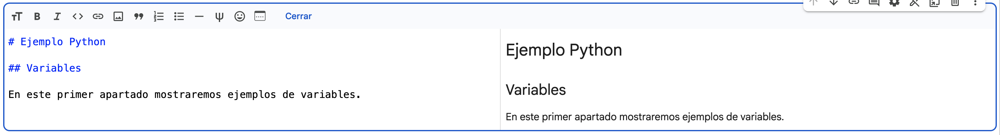
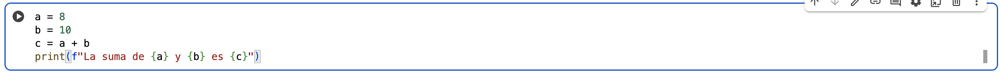
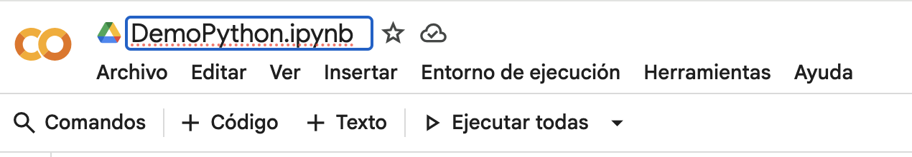
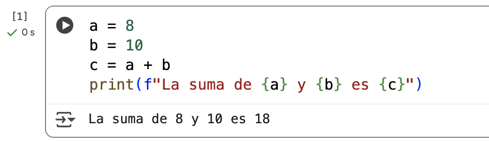
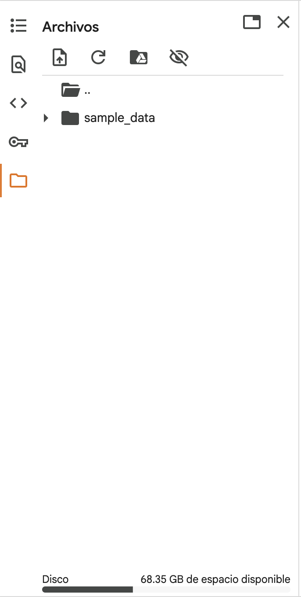
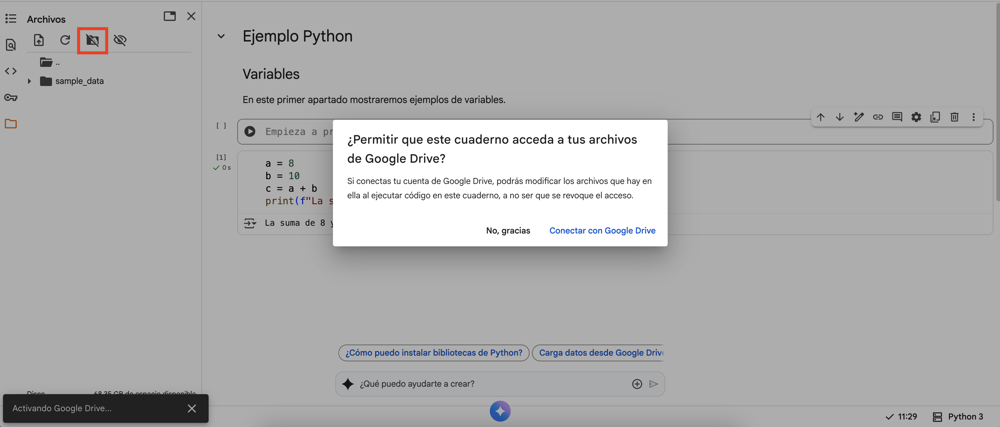
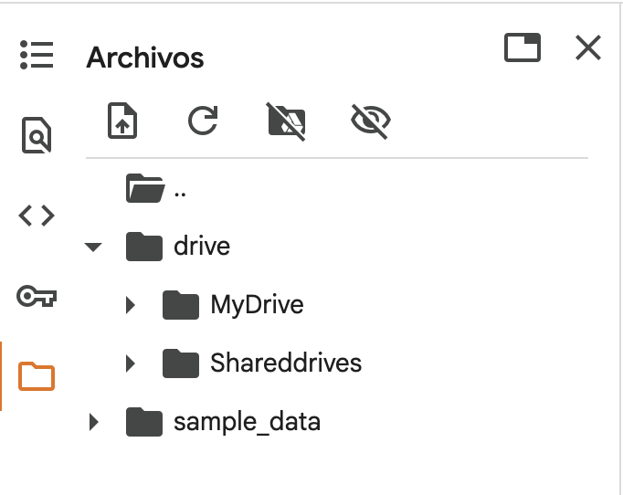

Google Colab (o *Colaboratory*) es una plataforma gratuita de Google basada en **Jupyter Notebooks**, que permite escribir y ejecutar código Python directamente en el navegador, sin necesidad de instalar nada en el ordenador. Es una herramienta muy potente en Inteligencia Artificial porque:

* Ofrece acceso gratuito a **GPUs y TPUs** para acelerar cálculos.
* Permite **colaborar en tiempo real** (como en Google Docs).
* Está integrado con **Google Drive**, facilitando guardar y compartir proyectos.

A continuación, veremos cómo utilizarlo paso a paso.

---

## Creación y organización de notebooks

Para trabajar con Google Colab seguiremos estos pasos:

1. Accede a [Google Colab](https://colab.research.google.com). Ten en cuenta que los cuadernos de Jupyter se guardará en Drive, por lo que selecciona la cuenta que más te interese.
2. Haz clic en **Archivo > Nuevo cuaderno**.

3. Se abrirá un **notebook** con una primera celda vacía donde podrás escribir código Python.

4. Dentro de un cuadero de Jupyter puedes escribir:

    * **Celdas de texto** (en formato Markdown, útiles para notas, títulos o fórmulas matemáticas). Mientras lo estés editando, en la izquierda verás el código Markdown escrito y en la derecha una preview de cómo quedará en tu cuaderno el código escrito.

    

   * **Celdas de código** (para ejecutar Python).

    
   
5. Para mantener tus proyectos organizados:

   * Renombra tu notebook desde la esquina superior izquierda.

    

   * Mueve el archivo a una carpeta de tu **Google Drive** en la opción *Archivo > Mover*.

💡 **Consejo:** usa nombres descriptivos y organiza las carpetas por temas o unidades del curso.

---

## Ejecutar código

Cuando en Google Colab ejecutas una celda por **primera vez**, el sistema necesita **conectar con un entorno de ejecución**. Ese entorno es, en realidad, una **máquina virtual basada en Linux** que Google crea en la nube exclusivamente para tu sesión. Esta máquina ya trae incorporado un intérprete de Python 3 con las librerías más comunes ya instaladas (NumPy, Pandas, Matplotlib, etc.).

Cuando ejecutamos código, el resultado de la ejecución aparece **debajo de la celda** (puede ser un valor, un gráfico, una tabla, etc.).

Para ejecutarlo, tenemos dos opciones:
* **Ejecutar celda a celda** con **Ctrl + Enter** o el botón de Play:

    

    Si te fijas en el imagen anterior, el [1] indica que ha sido la primera celda en ejecutarse en el entorno creado y los 0s indica el tiempo que tardó en ejecutar.

* **Ejecutar todo el código que haya en el Notebook**, seleccionando la opción Ejecutar todas en el menú superior. En este caso, se ejecutarán las celdas en orden secuencial, ignorando todas las celdas de texto.

---

### Orden de ejecución

El orden de ejecución en Colab no siempre coincide con el orden en el que aparecen las celdas.

* Cada vez que ejecutas una celda, se guarda el resultado en la memoria del entorno.
* Si vuelves atrás y modificas una celda anterior, tendrás que **ejecutarla de nuevo** y luego volver a ejecutar las posteriores para que el flujo sea coherente.
* El número que aparece a la izquierda de la celda (por ejemplo `[3]`) indica el orden en el que fue ejecutada.

💡 **Consejo:** cuando tu notebook tenga muchas celdas, usa la opción **Entorno de ejecución > Ejecutar todas** para asegurarte de que todo funciona de principio a fin.

---

### Reinicio del entorno

El entorno de Colab es **temporal**:

* Al cabo de unas horas de inactividad, la sesión puede cerrarse.
* También puede reiniciarse si usas demasiada memoria.

Cuando esto ocurre, todas las variables y archivos cargados se borran. Para volver a trabajar, deberás **ejecutar de nuevo todas las celdas**.

---

### Ejecución de comandos del sistema

Google Colab no solo permite ejecutar Python, también puedes lanzar comandos de sistema (Linux/Unix) anteponiendo el símbolo `!`.

Ejemplos:

* `!pwd` → muestra la carpeta actual.
* `!ls` → lista los archivos en el directorio actual.
* `!mkdir datos` → crea una carpeta llamada `datos`.
* `!pip install nombre_libreria` → instala una librería adicional en el entorno.

Esto es muy útil para manejar datasets y gestionar paquetes sin salir de Colab.

---

## Importación de datasets

Muchas veces necesitarás trabajar con conjuntos de datos externos. Google Colab ofrece varias formas de importarlos:

* **Subir un archivo desde tu ordenador**:

  * Haz clic en el icono de carpeta (barra lateral izquierda).

    

  * Selecciona **Subir** y elige un archivo (CSV, TXT, JSON, etc.).
  * El archivo estará disponible en el **entorno temporal** de Colab.

* **Cargar datos desde una URL**:

  * Puedes descargar datasets directamente con comandos como `wget` o `curl` dentro de una celda.

---

## Conexión con Google Drive

Una de las mayores ventajas de Colab es que se integra con **Google Drive**.

1. En el panel lateral izquierdo, haz clic en el icono de Drive.

    

2. Selecciona **Montar Drive**.
3. Una vez montado, verás una carpeta llamada `/drive/MyDrive`.

    

4. Dentro tendrás acceso a todos tus archivos y carpetas de Google Drive.

Esto te permitirá **leer datasets almacenados en Drive** y **guardar tus resultados directamente en la nube**, sin depender del entorno volátil que habíamos visto antes.

---

## Descarga y exportación de resultados

Al finalizar un proyecto, puedes guardar y exportar tu trabajo de distintas formas:

* **Guardar en Google Drive**: el notebook se guarda automáticamente en tu cuenta de Drive.
* **Descargar el notebook**: desde **Archivo > Descargar**, elige entre:

  * `.ipynb` (formato de Jupyter Notebook).
  * `.py` (archivo Python).
  * `.pdf` (ideal para entregar informes).
* **Guardar resultados intermedios**: también puedes exportar tablas o gráficos en formato CSV, PNG, etc., directamente a tu carpeta de Drive montada en Colab.

