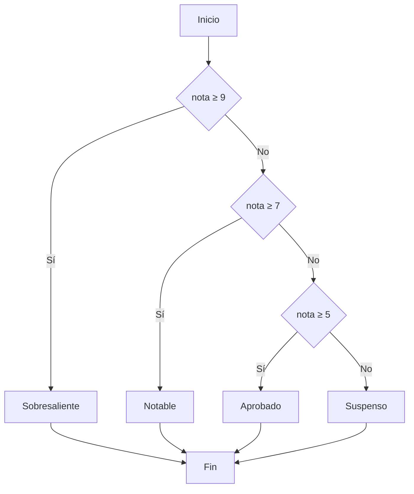
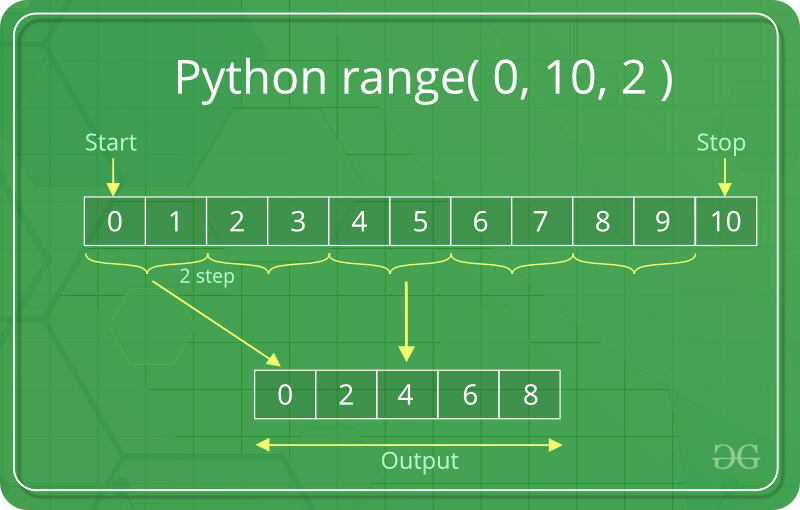
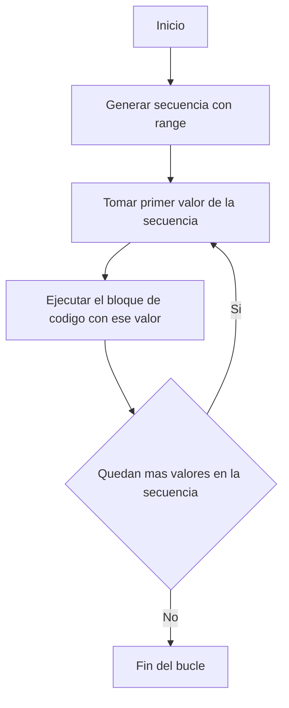
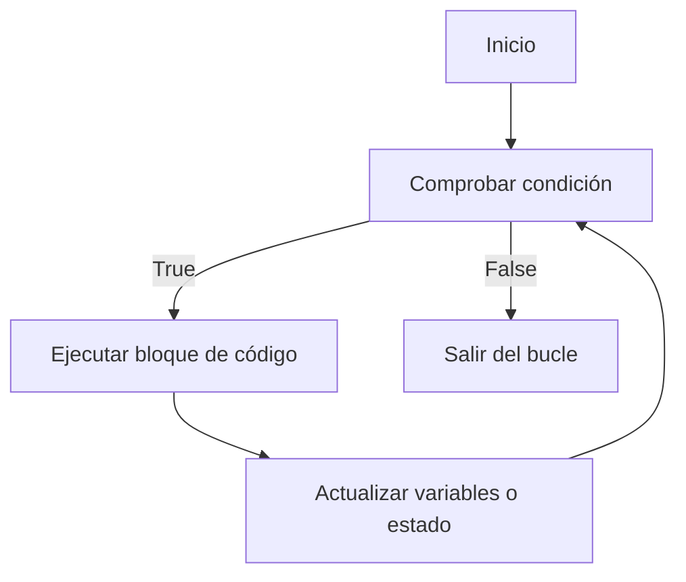

<div class="justify-text">

Antes de adentrarnos en librerías especializadas para Inteligencia Artificial, es necesario repasar algunos fundamentos de Python que utilizaremos constantemente a lo largo del curso.

Python es un lenguaje interpretado y de tipado dinámico:

* No es necesario declarar el tipo de variable.
* Los bloques de código se delimitan por **indentación**, es decir, espacios o tabulaciones (no hay llaves `{}`): cada bloque termina cuando se reduce la indentación. Por convención se usan **4 espacios** por nivel.

:::tip
Tened muy en cuenta la **indentación** porque será motivo de que el código no ejecute.
:::

---

## Variables y tipos básicos

* **Asignación**: no declaras el tipo; se infiere en tiempo de ejecución.
* **Nombres válidos**: letras, números y `_`, sin empezar por número. Python distingue mayúsculas/minúsculas.

```python
edad = 18              # int
altura_m = 1.72        # float
es_alumno = True       # bool
nombre = "Alicia"      # str
```

* **Constantes**: no existen como tal; por convención se escriben en MAYÚSCULAS.

```python
PI = 3.14159           # constante por convención
```

* **Reasignación**: puedes cambiar el tipo de una variable durante la ejecución (dinámico).

```python
edad = "dieciocho"              # str
edad = 18                       # int (reasignación en tiempo ejecución)

# Comprobación de tipos en tiempo real
type(edad)                      # <class 'int'>
```

* **Asignación múltiple**: muy usado para escribir código claro. En Python puedes asignar valores a varias variables en una sola línea:
    * A la izquierda pones varias variables separadas por comas.
    * A la derecha pones una secuencia de valores (tupla, lista o cualquier iterable).
    * Python asigna los valores en orden.

```python
# Asignación múltiple y swap
a, b = 1, 2
a, b = b, a            # ahora a=2, b=1

# Otro ejemplo de asignación múltiple
nombre, edad = "Ana", 21
print(nombre)   # Ana
print(edad)     # 21

# El siguiente código es equivalente al anterior
nombre = "Ana"
edad = 21
```

---

## Operadores esenciales

### 🔹 Aritméticos

| Operador | Significado         | Ejemplo  | Resultado |
| -------- | ------------------- | -------- | --------- |
| `+`      | Suma                | `5 + 3`  | `8`       |
| `-`      | Resta               | `5 - 3`  | `2`       |
| `*`      | Multiplicación      | `5 * 3`  | `15`      |
| `/`      | División (flotante) | `7 / 2`  | `3.5`     |
| `//`     | División entera     | `7 // 2` | `3`       |
| `%`      | Módulo (resto)      | `7 % 2`  | `1`       |
| `**`     | Potencia            | `2 ** 3` | `8`       |

---

### 🔹 Comparación

| Operador | Significado       | Ejemplo  | Resultado |
| -------- | ----------------- | -------- | --------- |
| `==`     | Igualdad          | `5 == 5` | `True`    |
| `!=`     | Distinto          | `5 != 3` | `True`    |
| `<`      | Menor que         | `5 < 3`  | `False`   |
| `<=`     | Menor o igual que | `3 <= 3` | `True`    |
| `>`      | Mayor que         | `5 > 3`  | `True`    |
| `>=`     | Mayor o igual que | `5 >= 6` | `False`   |

---

### 🔹 Lógicos

| Operador | Significado     | Ejemplo               | Resultado |
| -------- | --------------- | --------------------- | --------- |
| `and`    | Y lógico        | `(5 > 2) and (3 < 4)` | `True`    |
| `or`     | O lógico        | `(5 < 2) or (3 < 4)`  | `True`    |
| `not`    | Negación lógica | `not (5 > 2)`         | `False`   |

---

### 🔹 Asignación compuesta

| Operador | Equivalente a  | Ejemplo          | Resultado final |
| -------- | -------------- | ---------------- | --------------- |
| `=`      | Asignación     | `x = 5`          | `x = 5`         |
| `+=`     | `x = x + ...`  | `x = 5; x += 3`  | `x = 8`         |
| `-=`     | `x = x - ...`  | `x = 5; x -= 2`  | `x = 3`         |
| `*=`     | `x = x * ...`  | `x = 5; x *= 2`  | `x = 10`        |
| `/=`     | `x = x / ...`  | `x = 10; x /= 2` | `x = 5.0`       |
| `//= `   | `x = x // ...` | `x = 7; x //= 2` | `x = 3`         |
| `%=`     | `x = x % ...`  | `x = 7; x %= 2`  | `x = 1`         |
| `**=`    | `x = x ** ...` | `x = 3; x **= 2` | `x = 9`         |

---

### 🔹 Pertenencia e identidad

| Operador | Significado            | Ejemplo                  | Resultado    |
| -------- | ---------------------- | ------------------------ | ------------ |
| `in`     | Pertenece a            | `"py" in "python"`       | `True`       |
| `not in` | No pertenece a         | `"java" not in "python"` | `True`       |
| `is`     | Identidad de objeto    | `a is b`                 | `True/False` |
| `is not` | No son el mismo objeto | `a is not b`             | `True/False` |


---

## Cadenas de texto (strings)

Un **string** en Python es una **secuencia inmutable de caracteres** usada para representar texto.

* Pueden delimitarse con `'...'`, `"..."` o `"""..."""` (multilínea).

```python
cadena_simple = 'Esto es una cadena'
cadena_simple2 = "Esto es otra cadena"
cadena_multi = """Esto es una
    cadena con
    varias líneas"""
```

* Cada carácter tiene un índice (posición).

### Indexación y slicing

Un **string** en Python es una **secuencia inmutable de caracteres**, lo que significa que cada carácter tiene una posición (índice) y se puede acceder a él como si fuera un elemento de una lista.


#### 🔹 Indexación

* El **primer carácter** tiene índice `0`.
* También puedes usar **índices negativos**, donde `-1` es el último carácter, `-2` el penúltimo, y así sucesivamente.

Ejemplo:

```python
s = "Python"
print(s[0])    # 'P'  (primer carácter)
print(s[2])    # 't'  (tercer carácter)
print(s[-1])   # 'n'  (último carácter)
print(s[-3])   # 'h'  (tercer carácter desde el final)
```

⚠️ Si intentas acceder a un índice fuera del rango → error `IndexError`.

---

#### 🔹 Slicing (rebanado)

El **slicing** permite obtener un **sub-string** especificando un rango:

`cadena[inicio:fin:paso]`

* `inicio` → índice donde comienza (incluido).
* `fin` → índice donde termina (excluido).
* `paso` → número que indica el salto (opcional, por defecto `1`).

Ejemplo:

```python
s = "Python"
print(s[1:4])   # 'yth' (desde índice 1 hasta 3)
print(s[:2])    # 'Py'  (desde el inicio hasta el índice 1)
print(s[2:])    # 'thon' (desde el índice 2 hasta el final)
print(s[:])     # 'Python' (copia completa de la cadena)
```

El tercer parámetro (**paso**) permite saltar caracteres.

```python
s = "Python"
print(s[::2])   # 'Pto' (coge uno de cada dos)
print(s[1::2])  # 'yhn' (empieza en 1 y coge de dos en dos)
```

Si usas un **paso negativo**, recorres la cadena en sentido inverso.

```python
s = "Python"
print(s[::-1])   # 'nohtyP'
```

#### 🔹 Ejemplo práctico

Imagina que tienes un código de producto en formato `ABC-1234` y quieres separar letras y números:

```python
codigo = "ABC-1234"
letras = codigo[:3]     # 'ABC'
numeros = codigo[-4:]   # '1234'
print(letras, numeros)
```

✅ **Resumen:**

* `[]` → accede a un solo carácter.
* `[:]` → devuelve un rango de caracteres (subcadena).
* `::` → permite establecer un paso o incluso invertir la cadena.
* Los índices negativos son muy útiles para acceder desde el final.

---

### Concatenación de cadenas

La **concatenación** consiste en **unir varias cadenas de texto en una sola**.
En Python se hace con el operador `+`, que genera una nueva cadena sin modificar las originales (recuerda que los strings son inmutables).

```python
"IA" + " con Python"   # 'IA con Python'
```

También se puede concatenar usando variables:

```python
curso = "IA"
lenguaje = "Python"
mensaje = curso + " con " + lenguaje
print(mensaje)   # 'IA con Python'
```

👉 Ten en cuenta que solo se pueden concatenar **strings con strings**. Si intentas sumar un número con una cadena, dará error:

```python
"Edad: " + 25    # ❌ Error
"Edad: " + str(25)  # ✅ 'Edad: 25'
```

---

### Interpolación con f-strings

La **interpolación** consiste en insertar el valor de variables o expresiones dentro de un string, similar a la concatenación vista anteriormente.
En Python, desde la versión 3.6, existe una forma muy práctica de hacerlo: **f-strings** (*formatted string literals*).

Se escriben anteponiendo una `f` al inicio de la cadena y colocando las variables o expresiones entre llaves `{}`.

```python
nombre, n = "Alicia", 3
mensaje = f"Hola {nombre}, has ejecutado {n} veces"
print(mensaje)
# Salida: Hola Alicia, has ejecutado 3 veces
```

---

#### 🔹 ¿Qué ocurre en `print`?

La función `print()` muestra por pantalla (o en consola, o en Colab) el valor de una o varias variables, cadenas o expresiones.
Cuando le pasamos un f-string, **Python lo evalúa primero**, reemplazando las llaves `{}` con los valores correspondientes, y luego `print` se encarga de mostrar la cadena resultante.

---

#### 🔹 Ventajas de los f-strings

* Más **claros y legibles** que concatenar con `+`.
* Permiten incluir **expresiones directamente** dentro de las llaves:

```python
x, y = 4, 5
print(f"La suma de {x} + {y} es {x + y}")
# Salida: La suma de 4 + 5 es 9
```

* Admiten **formateo numérico**:

```python
pi = 3.14159
print(f"Valor de π con 2 decimales: {pi:.2f}")
# Salida: Valor de π con 2 decimales: 3.14
```

---

### Métodos útiles sobre cadenas

En Python, los **strings** (cadenas) tienen muchos métodos incorporados que permiten transformarlos, limpiarlos o analizarlos fácilmente.
A continuación se muestran los más usados con ejemplos prácticos:

---

#### 🔹 Longitud de una cadena: `len()`

La función integrada `len()` devuelve el número total de caracteres en un string (incluye letras, espacios, números y símbolos).

```python
texto = "IA con Python"
print(len(texto))      # 13  (incluye el espacio en blanco)

print(len(""))         # 0   (cadena vacía)
print(len("12345"))    # 5
```

👉 Aunque se usa mucho con strings, `len()` también funciona con **listas, tuplas, diccionarios y otros contenedores**.

```python
nombres = ["Ana", "Luis", "Marta"]
print(len(nombres))    # 3
```

---

#### 🔹 Eliminación de espacios: `strip()`, `lstrip()`, `rstrip()`

* `strip()` elimina espacios (y saltos de línea) al inicio y al final.
* `lstrip()` elimina solo a la izquierda.
* `rstrip()` elimina solo a la derecha.

```python
texto = "   IA con Python   "
print(texto.strip())   # 'IA con Python'
print(texto.lstrip())  # 'IA con Python   '
print(texto.rstrip())  # '   IA con Python'
```

---

#### 🔹 Mayúsculas y minúsculas

* `lower()` → todo en minúsculas.
* `upper()` → todo en mayúsculas.
* `capitalize()` → primera letra en mayúscula.
* `title()` → primera letra de cada palabra en mayúscula.

```python
t = "python para ia"
print(t.lower())      # 'python para ia'
print(t.upper())      # 'PYTHON PARA IA'
print(t.capitalize()) # 'Python para ia'
print(t.title())      # 'Python Para Ia'
```

---

#### 🔹 Búsqueda y pertenencia

* `in` → comprobar si una subcadena está presente.
* `find(sub)` → devuelve la posición inicial (o `-1` si no existe).
* `count(sub)` → cuenta cuántas veces aparece una subcadena.

```python
texto = "Aprender Python para IA"
print("Python" in texto)     # True
print(texto.find("Python"))  # 9
print(texto.count("a"))      # 3
```

---

#### 🔹 Dividir y unir cadenas

* `split(sep)` → divide el string en una lista, usando el separador `sep`.
* `join(lista)` → une los elementos de una lista en un solo string, usando el string actual como separador.

```python
frase = "uno,dos,tres"
lista = frase.split(",")
print(lista)   # ['uno', 'dos', 'tres']

nuevo = "-".join(lista)
print(nuevo)   # 'uno-dos-tres'
```

---

#### 🔹 Reemplazo de texto: `replace()`

Cambia todas las apariciones de una subcadena por otra.

```python
texto = "Aprender Python para IA"
nuevo = texto.replace("Python", "NumPy")
print(nuevo)   # 'Aprender NumPy para IA'
```

---

#### 🔹 Otros métodos interesantes

* `startswith(prefijo)` → ¿empieza con...?
* `endswith(sufijo)` → ¿termina con...?
* `isalpha()` → ¿son solo letras?
* `isdigit()` → ¿son solo números?

```python
codigo = "IA123"
print(codigo.startswith("IA"))  # True
print(codigo.endswith("123"))   # True
print("Python".isalpha())       # True
print("2025".isdigit())         # True
```

---

### Escapes y cadenas crudas (*raw strings*)

En Python, algunos caracteres tienen un **significado especial** cuando se escriben dentro de un string, precedidos por `\` (barra invertida). A esto se le llama **carácter de escape**.

Ejemplos comunes:

* `\n` → salto de línea
* `\t` → tabulación
* `\\` → para escribir una barra invertida literal

Por eso, si queremos representar una **ruta de Windows** (que usa `\`), necesitamos **duplicar** las barras:

```python
ruta = "C:\\datos\\archivo.csv"
print(ruta)  
# C:\datos\archivo.csv
```

Si antepones una `r` al string (`r"..."`), se convierte en un **raw string** (cadena cruda), es decir, **Python no interpreta los escapes**.

```python
ruta = r"C:\datos\archivo.csv"
print(ruta)  
# C:\datos\archivo.csv
```

👉 Muy útil para:

* **Rutas de archivos** en Windows.
* **Expresiones regulares**, que suelen usar muchas barras invertidas.

---

## Estructuras de control

Las **estructuras de control** son las instrucciones que permiten decidir **cómo se ejecuta el flujo de un programa**.
Sin ellas, el código se ejecutaría siempre de arriba hacia abajo, sin posibilidad de tomar decisiones ni repetir acciones.

En Python (y en la mayoría de lenguajes), existen tres grandes tipos:

1. **Condicionales (`if`, `elif`, `else`)**

   * Permiten ejecutar un bloque de código u otro según se cumpla una condición.
   * Ejemplo: mostrar “Aprobado” solo si la nota es mayor o igual a 5.

2. **Bucles (`for`, `while`)**

   * Permiten **repetir instrucciones** varias veces, ya sea recorriendo una secuencia (lista, string, rango…) o mientras una condición sea verdadera.
   * Ejemplo: imprimir los números del 1 al 10.

3. **Sentencias de control (`break`, `continue`, `pass`)**

   * Modifican el comportamiento de los bucles o actúan como marcadores.
   * Ejemplo: salir de un bucle cuando se cumple una condición.

---

### Condicionales

Los **condicionales** permiten que un programa **tome decisiones** en función de si una condición es **verdadera (True)** o **falsa (False)**.
Son la base de la programación porque hacen que un programa no siempre ejecute lo mismo, sino que responda a distintas situaciones.

Según el número de condiciones, la estructura puede ser:

#### 1) La estructura `if`

La forma básica es:

```python
if condicion:
    # código que se ejecuta si la condicion es True
```

Ejemplo:

```python
edad = 20
if edad >= 18:
    print("Eres mayor de edad")
```


#### 2) Estructura con `if` + `else`

Si la condición no se cumple, se ejecuta el bloque `else`:

```python
edad = 15
if edad >= 18:
    print("Mayor de edad")
else:
    print("Menor de edad")
```


#### 3) Estructura con `if` + `elif` + `else`

Cuando hay **más de dos posibilidades**, se usan `elif` (abreviatura de *else if*).

```python
nota = 7.5

if nota >= 9:
    calificacion = "Sobresaliente"
elif nota >= 7:
    calificacion = "Notable"
elif nota >= 5:
    calificacion = "Aprobado"
else:
    calificacion = "Suspenso"

print("Tu nota es:", calificacion)
```

---

#### 🔹 Diagrama de flujo de un condicional

Así se representa un condicional múltiple de manera visual (ejemplo: calificación por nota):



---

#### 🔹 Anidación de condiciones

La **anidación de condiciones** ocurre cuando colocamos un `if` dentro de otro.
Esto permite comprobar **condiciones más específicas** una vez que otra ya se ha cumplido.

Ejemplo clásico:

```python
edad = 20
tiene_permiso = True

if edad >= 18:
    if tiene_permiso:
        print("Puede conducir")
    else:
        print("Es mayor de edad pero no tiene permiso")
else:
    print("Es menor de edad")
```

👉 El flujo se entiende así: primero se verifica la condición externa (`edad >= 18`) y, solo si es verdadera, se evalúa la condición interna (`tiene_permiso`).

---

#### 🔹 Condicionales y operadores lógicos

En muchas situaciones necesitamos comprobar **más de una condición a la vez**.
Para ello, Python ofrece los **operadores lógicos**:

* `and` → todas las condiciones deben ser **True**.
* `or` → al menos una condición debe ser **True**.
* `not` → invierte el valor lógico (True ↔ False).

Ejemplo con `and` (dos condiciones deben cumplirse):

```python
edad = 20
tiene_permiso = True

if edad >= 18 and tiene_permiso:
    print("Puede conducir")
else:
    print("No puede conducir")
```

Ejemplo con `or` (basta con que se cumpla una):

```python
es_profesor = False
es_admin = True

if es_profesor or es_admin:
    print("Acceso permitido")
else:
    print("Acceso denegado")
```


Ejemplo con `not` (niega una condición):

```python
llueve = False

if not llueve:
    print("Podemos salir sin paraguas")
```

---

#### 🔹 Expresiones condicionales (operador ternario)

Sirven para escribir condicionales cortos en una sola línea:

```python
edad = 20
mensaje = "Mayor de edad" if edad >= 18 else "Menor de edad"
print(mensaje)   # Mayor de edad
```

---

#### 🔹 Pattern matching (Py ≥ 3.10, opcional)

El *pattern matching* es como un `switch` mejorado (presente en otros lenguajes).
Permite comprobar un valor contra múltiples casos:

```python
estado = 404

match estado:
    case 200:
        print("OK")
    case 404:
        print("No encontrado")
    case _:
        print("Otro")   # el guión bajo es el "caso por defecto"
```

---

### Bucles

Los **bucles** permiten **repetir un bloque de instrucciones varias veces**.
Son fundamentales cuando necesitamos procesar listas, recorrer datasets o ejecutar acciones hasta que se cumpla una condición.

#### 1) El bucle `for`

* Un bucle `for` sirve para **repetir un bloque de código** un número determinado de veces.
* En cada repetición, la variable del bucle (`i` en el ejemplo) toma un valor distinto de una **secuencia**.
* Una de las formas más comunes de generar esa secuencia es con la función `range()`.

La función `range()` genera una secuencia de números enteros que Python puede recorrer en un bucle `for`.

Tiene tres formas principales:

1. `range(fin)` → genera números desde `0` hasta `fin - 1`.

   ```python
   for i in range(3):
       print(i)
   # 0, 1, 2
   ```

2. `range(inicio, fin)` → genera números desde `inicio` hasta `fin - 1`.

   ```python
   for i in range(2, 5):
       print(i)
   # 2, 3, 4
   ```

3. `range(inicio, fin, paso)` → genera números desde `inicio` hasta `fin - 1`, aumentando de `paso` en `paso`.

   ```python
   for i in range(0, 10, 2):
       print(i)
   # 0, 2, 4, 6, 8
   ```

    En la siguiente imagen se ilustra su uso:

   

El diagrama de flujo de un bucle for sería:

<div style={{ display: "flex", justifyContent: "center" }}>



</div>

---

#### 🔹 2) El bucle `while`

El bucle `while` permite **repetir un bloque de código mientras una condición sea verdadera**.
Cada vez que se ejecuta el bloque, Python vuelve a comprobar la condición.
Si la condición sigue siendo **True**, el bloque se repite otra vez.
Cuando la condición pasa a ser **False**, el bucle termina y el programa continúa con la siguiente instrucción.

👉 Es útil cuando **no sabemos cuántas veces se repetirá el bucle** de antemano, ya que depende de una condición que puede cambiar en la ejecución.

Ejemplo:

```python
contador = 0
while contador < 3:
    print(contador)
    contador++
print("Salimos")
```

**Explicación del flujo:**

1. Se inicia la variable `contador` con el valor `0`.
2. Python comprueba si `contador < 3`. Como es `True`, entra en el bucle.
3. Imprime el valor de `contador`.
4. Suma 1 a `contador`.
5. Vuelve a comprobar la condición (`contador < 3`).
6. El ciclo continúa hasta que `contador` llega a `3`.
7. Cuando la condición ya no se cumple (`contador < 3` es `False`), el bucle termina y se ejecuta la instrucción final: `"Salimos"`.

:::warning IMPORTANTE

⚠️ Si la condición nunca se vuelve falsa, el bucle se convierte en un **bucle infinito**.
Ejemplo:

```python
while True:
    print("Esto nunca termina")
```

Para evitarlo, hay que asegurarse de que la condición cambie dentro del bucle.
:::

El diagrama de flujo del bucle `while` sería:



---

#### 🔹 3) Sentencias de control

A veces queremos modificar el flujo del bucle:

* `break` → sale del bucle.
* `continue` → salta a la siguiente iteración.
* `pass` → no hace nada (sirve como marcador de código pendiente).

```python
for n in range(10):
    if n == 5:
        break           # corta el bucle en 5
    if n % 2 == 0:
        continue        # salta números pares
    print(n)            # imprime 1,3
```

:::tip USO DE BREAK
En Python, a diferencia de otros lenguajes, el uso de break no es mala práctica en sí misma. Esta sentencia existe en Python justamente para dar más flexibilidad en los bucles, y se usa mucho en situaciones prácticas.
:::

---

#### 🔹 4) El `else` en bucles

En Python, los bucles `for` y `while` pueden tener un bloque `else`.
Ese `else` se ejecuta **solo si el bucle no se interrumpe con `break`**.

```python
objetivo = 42
for n in range(40, 45):
    if n == objetivo:
        print("Encontrado")
        break
else:
    print("No se encontró")
```

---

#### 🔹 5) Anidación de bucles

La **anidación de bucles** significa colocar un bucle dentro de otro.
Se usa cuando necesitamos recorrer estructuras que tienen **más de una dimensión** (por ejemplo, una tabla con filas y columnas).

```python
for i in range(3):        # bucle externo
    for j in range(2):    # bucle interno
        print(f"i={i}, j={j}")
```

**Salida:**

```
i=0, j=0
i=0, j=1
i=1, j=0
i=1, j=1
i=2, j=0
i=2, j=1
```

:::tip Consejos
* Cada nivel de anidación debe estar **bien indentado** para que el código sea claro.
* Evita anidar demasiados bucles porque puede hacer el programa más difícil de leer y menos eficiente.
:::

---

## Buenas prácticas rápidas

Algunas de las reglas más importantes de PEP8 (la guía oficial de estilo de Python) son:

* Indentación de **4 espacios**; nada de mezclar tabs y espacios.
* Procura que cada línea no tenga más de **79 caracteres**.
* Nombres descriptivos en **minúsculas_con_guiones_bajos**.
* Condiciones **claras**: evita expresiones demasiado densas.
* Prefiere **f-strings** para formatear texto.
* **Líneas en blanco**
    * Deja 2 líneas en blanco entre definiciones de funciones o clases.
    * Dentro de una función, usa líneas en blanco para separar bloques lógicos.
* **Espacios alrededor de operadores y comas**
    * Pon un espacio antes y después de los operadores.
    * Tras una coma, pon un espacio; antes de la coma, no.
    ```python
    x = a + b * 2
    lista = [1, 2, 3, 4]
    ```

</div>