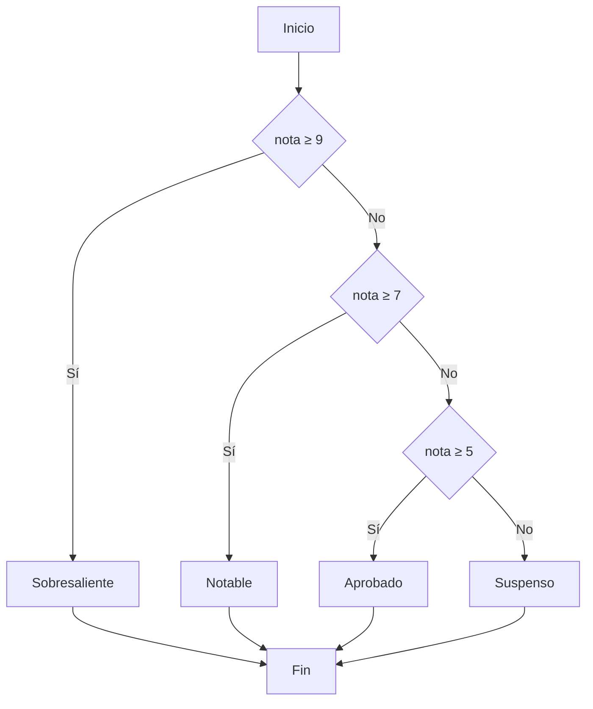
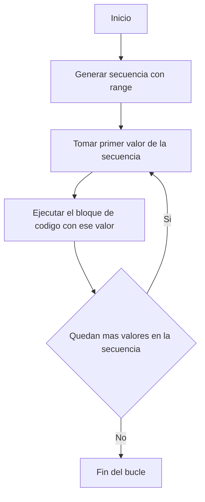
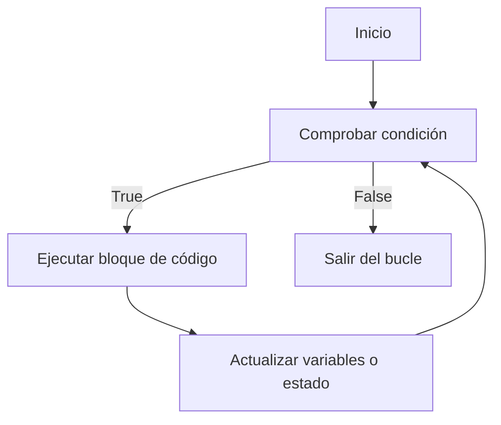

<div class="justify-text">

Las **estructuras de control** son las instrucciones que permiten decidir **cómo se ejecuta el flujo de un programa**.
Sin ellas, el código se ejecutaría siempre de arriba hacia abajo, sin posibilidad de tomar decisiones ni repetir acciones.

En Python (y en la mayoría de lenguajes), existen tres grandes tipos:

1. **Condicionales (`if`, `elif`, `else`)**

   * Permiten ejecutar un bloque de código u otro según se cumpla una condición.
   * Ejemplo: mostrar “Aprobado” solo si la nota es mayor o igual a 5.

2. **Bucles (`for`, `while`)**

   * Permiten **repetir instrucciones** varias veces, ya sea recorriendo una secuencia (lista, string, rango…) o mientras una condición sea verdadera.
   * Ejemplo: imprimir los números del 1 al 10.

3. **Sentencias de control (`break`, `continue`, `pass`)**

   * Modifican el comportamiento de los bucles o actúan como marcadores.
   * Ejemplo: salir de un bucle cuando se cumple una condición.

---

## Condicionales

Los **condicionales** permiten que un programa **tome decisiones** en función de si una condición es **verdadera (True)** o **falsa (False)**.
Son la base de la programación porque hacen que un programa no siempre ejecute lo mismo, sino que responda a distintas situaciones.

Según el número de condiciones, la estructura puede ser:

### 1) La estructura `if`

La forma básica es:

```python
if condicion:
    # código que se ejecuta si la condicion es True
```

Ejemplo:

```python
edad = 20
if edad >= 18:
    print("Eres mayor de edad")
```


### 2) Estructura con `if` + `else`

Si la condición no se cumple, se ejecuta el bloque `else`:

```python
edad = 15
if edad >= 18:
    print("Mayor de edad")
else:
    print("Menor de edad")
```


### 3) Estructura con `if` + `elif` + `else`

Cuando hay **más de dos posibilidades**, se usan `elif` (abreviatura de *else if*).

```python
nota = 7.5

if nota >= 9:
    calificacion = "Sobresaliente"
elif nota >= 7:
    calificacion = "Notable"
elif nota >= 5:
    calificacion = "Aprobado"
else:
    calificacion = "Suspenso"

print("Tu nota es:", calificacion)
```

---

### 🔹 Diagrama de flujo de un condicional

Así se representa un condicional múltiple de manera visual (ejemplo: calificación por nota):



---

### 🔹 Anidación de condiciones

La **anidación de condiciones** ocurre cuando colocamos un `if` dentro de otro.
Esto permite comprobar **condiciones más específicas** una vez que otra ya se ha cumplido.

Ejemplo clásico:

```python
edad = 20
tiene_permiso = True

if edad >= 18:
    if tiene_permiso:
        print("Puede conducir")
    else:
        print("Es mayor de edad pero no tiene permiso")
else:
    print("Es menor de edad")
```

👉 El flujo se entiende así: primero se verifica la condición externa (`edad >= 18`) y, solo si es verdadera, se evalúa la condición interna (`tiene_permiso`).

---

### 🔹 Condicionales y operadores lógicos

En muchas situaciones necesitamos comprobar **más de una condición a la vez**.
Para ello, Python ofrece los **operadores lógicos**:

* `and` → todas las condiciones deben ser **True**.
* `or` → al menos una condición debe ser **True**.
* `not` → invierte el valor lógico (True ↔ False).

Ejemplo con `and` (dos condiciones deben cumplirse):

```python
edad = 20
tiene_permiso = True

if edad >= 18 and tiene_permiso:
    print("Puede conducir")
else:
    print("No puede conducir")
```

Ejemplo con `or` (basta con que se cumpla una):

```python
es_profesor = False
es_admin = True

if es_profesor or es_admin:
    print("Acceso permitido")
else:
    print("Acceso denegado")
```


Ejemplo con `not` (niega una condición):

```python
llueve = False

if not llueve:
    print("Podemos salir sin paraguas")
```

---

### 🔹 Operador ternario

Sirven para escribir condicionales cortos en una sola línea:

```python
edad = 20
mensaje = "Mayor de edad" if edad >= 18 else "Menor de edad"
print(mensaje)   # Mayor de edad
```

---

### 🔹 Pattern matching

El *pattern matching* es como un `switch` mejorado (presente en otros lenguajes).
Permite comprobar un valor contra múltiples casos:

```python
estado = 404

match estado:
    case 200:
        print("OK")
    case 404:
        print("No encontrado")
    case _:
        print("Otro")   # el guión bajo es el "caso por defecto"
```

---

## Bucles

Los **bucles** permiten **repetir un bloque de instrucciones varias veces**.
Son fundamentales cuando necesitamos procesar listas, recorrer datasets o ejecutar acciones hasta que se cumpla una condición.

### 1) El bucle `for`

* Un bucle `for` sirve para **repetir un bloque de código** un número determinado de veces.
* En cada repetición, la variable del bucle (`i` en el ejemplo) toma un valor distinto de una **secuencia**.
* Una de las formas más comunes de generar esa secuencia es con la función `range()`.

La función `range()` genera una secuencia de números enteros que Python puede recorrer en un bucle `for`.

Tiene tres formas principales:

1. `range(fin)` → genera números desde `0` hasta `fin - 1`.

   ```python
   for i in range(3):
       print(i)
   # 0, 1, 2
   ```

2. `range(inicio, fin)` → genera números desde `inicio` hasta `fin - 1`.

   ```python
   for i in range(2, 5):
       print(i)
   # 2, 3, 4
   ```

3. `range(inicio, fin, paso)` → genera números desde `inicio` hasta `fin - 1`, aumentando de `paso` en `paso`.

   ```python
   for i in range(0, 10, 2):
       print(i)
   # 0, 2, 4, 6, 8
   ```

    En la siguiente imagen se ilustra su uso:

   

El diagrama de flujo de un bucle for sería:

<div style={{ display: "flex", justifyContent: "center" }}>



</div>

---

### 2) El bucle `while`

El bucle `while` permite **repetir un bloque de código mientras una condición sea verdadera**.
Cada vez que se ejecuta el bloque, Python vuelve a comprobar la condición.
Si la condición sigue siendo **True**, el bloque se repite otra vez.
Cuando la condición pasa a ser **False**, el bucle termina y el programa continúa con la siguiente instrucción.

👉 Es útil cuando **no sabemos cuántas veces se repetirá el bucle** de antemano, ya que depende de una condición que puede cambiar en la ejecución.

Ejemplo:

```python
contador = 0
while contador < 3:
    print(contador)
    contador++
print("Salimos")
```

**Explicación del flujo:**

1. Se inicia la variable `contador` con el valor `0`.
2. Python comprueba si `contador < 3`. Como es `True`, entra en el bucle.
3. Imprime el valor de `contador`.
4. Suma 1 a `contador`.
5. Vuelve a comprobar la condición (`contador < 3`).
6. El ciclo continúa hasta que `contador` llega a `3`.
7. Cuando la condición ya no se cumple (`contador < 3` es `False`), el bucle termina y se ejecuta la instrucción final: `"Salimos"`.

:::warning IMPORTANTE

⚠️ Si la condición nunca se vuelve falsa, el bucle se convierte en un **bucle infinito**.
Ejemplo:

```python
while True:
    print("Esto nunca termina")
```

Para evitarlo, hay que asegurarse de que la condición cambie dentro del bucle.
:::

El diagrama de flujo del bucle `while` sería:



---

### 🔹 Sentencias de control

A veces queremos modificar el flujo del bucle:

* `break` → sale del bucle.
* `continue` → salta a la siguiente iteración.
* `pass` → no hace nada (sirve como marcador de código pendiente).

```python
for n in range(10):
    if n == 5:
        break           # corta el bucle en 5
    if n % 2 == 0:
        continue        # salta números pares
    print(n)            # imprime 1,3
```

:::tip USO DE BREAK
En Python, a diferencia de otros lenguajes, el uso de break no es mala práctica en sí misma. Esta sentencia existe en Python justamente para dar más flexibilidad en los bucles, y se usa mucho en situaciones prácticas.
:::

---

### 🔹 El `else` en bucles

En Python, los bucles `for` y `while` pueden tener un bloque `else`.
Ese `else` se ejecuta **solo si el bucle no se interrumpe con `break`**.

```python
objetivo = 42
for n in range(40, 45):
    if n == objetivo:
        print("Encontrado")
        break
else:
    print("No se encontró")
```

---

### 🔹 Anidación de bucles

La **anidación de bucles** significa colocar un bucle dentro de otro.
Se usa cuando necesitamos recorrer estructuras que tienen **más de una dimensión** (por ejemplo, una tabla con filas y columnas).

```python
for i in range(3):        # bucle externo
    for j in range(2):    # bucle interno
        print(f"i={i}, j={j}")
```

**Salida:**

```
i=0, j=0
i=0, j=1
i=1, j=0
i=1, j=1
i=2, j=0
i=2, j=1
```

:::tip Consejos
* Cada nivel de anidación debe estar **bien indentado** para que el código sea claro.
* Evita anidar demasiados bucles porque puede hacer el programa más difícil de leer y menos eficiente.
:::

</div>