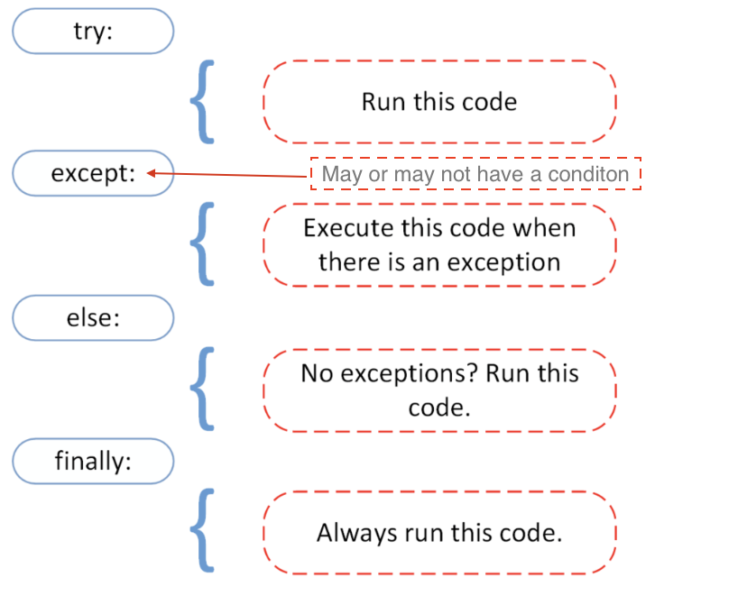

<div class="justify-text">

En Python, los **errores** son una parte natural del desarrollo: ocurren cuando el programa encuentra una situación inesperada o incorrecta.  
Por ejemplo, intentar dividir entre cero o acceder a un índice inexistente en una lista.

Python distingue entre:

* **Errores de sintaxis**, que impiden ejecutar el programa.
* **Excepciones**, que ocurren **durante la ejecución** y pueden **manejarse** para que el programa no se detenga.

---

## Errores de sintaxis

Los **errores de sintaxis** aparecen cuando el código no sigue las reglas del lenguaje.

```python
if True
    print("Hola")
```

Salida:

```
SyntaxError: expected ':'
```

❌ El error se detecta **antes de ejecutar** el código.

---

## Excepciones (errores durante la ejecución)

Una **excepción** ocurre cuando algo falla **durante la ejecución** del programa.

Por ejemplo:

```python
print(10 / 0)
```

Salida:

```
ZeroDivisionError: division by zero
```

En este caso, el programa **se detiene** al producirse el error.

---

### Tipos de excepciones comunes

| Excepción           | Cuándo ocurre                                 | Ejemplo                                   |
| ------------------- | --------------------------------------------- | ----------------------------------------- |
| `NameError`         | Variable o nombre no definido                 | `print(x)`                                |
| `TypeError`         | Tipo de dato incorrecto en una operación      | `"5" + 3`                                 |
| `ValueError`        | Valor no válido para una conversión o función | `int("abc")`                              |
| `IndexError`        | Índice fuera del rango de una lista           | `lista[10]`                               |
| `KeyError`          | Clave no existente en un diccionario          | `dic["edad"]`                             |
| `ZeroDivisionError` | División entre cero                           | `10 / 0`                                  |
| `FileNotFoundError` | Fichero no encontrado                         | *(solo aparece al trabajar con ficheros)* |

---

### Manejo de excepciones: `try` y `except`

Podemos **controlar** los errores usando los bloques `try` y `except`.

Estructura general:

```python
try:
    # Código que puede causar un error
except:
    # Código que se ejecuta si ocurre un error
```

Ejemplo:

```python
try:
    numero = int(input("Introduce un número: "))
    print(10 / numero)
except:
    print("Ha ocurrido un error.")
```

✅ Si ocurre un error (por ejemplo, dividir entre cero o escribir texto en lugar de un número), el programa **no se detiene**: ejecuta el bloque `except`.

---

### Capturar tipos de error específicos

Podemos capturar **solo** el tipo de error que queremos manejar.

```python
try:
    numero = int(input("Introduce un número: "))
    print(10 / numero)
except ValueError:
    print("Debes introducir un número válido.")
except ZeroDivisionError:
    print("No se puede dividir entre cero.")
```

👉 De esta forma el programa **reacciona de forma diferente** según el error.

---

### Varios tipos de error en un mismo bloque

Si varios tipos de error deben tratarse igual, pueden agruparse entre paréntesis:

```python
try:
    numero = int(input("Introduce un número: "))
    print(10 / numero)
except (ValueError, ZeroDivisionError):
    print("Error: dato no válido o intento de división entre cero.")
```

---

### Bloque `else`

El bloque `else` se ejecuta **solo si no ocurre ningún error** en el bloque `try`.

```python
try:
    numero = int(input("Introduce un número: "))
    resultado = 10 / numero
except ZeroDivisionError:
    print("No puedes dividir entre cero.")
else:
    print(f"El resultado es {resultado}")
```

🧠 Así, `else` sirve para el código que **solo debe ejecutarse si todo fue bien**.

---

### Bloque `finally`

El bloque `finally` **siempre se ejecuta**, haya o no error.
Se usa para liberar recursos o mostrar mensajes finales.

```python
try:
    numero = int(input("Introduce un número: "))
    print(10 / numero)
except Exception as e:
    print("Ocurrió un error:", e)
finally:
    print("Ejecución finalizada.")
```

Salida:

```
Introduce un número: 0
Ocurrió un error: division by zero
Ejecución finalizada.
```

---

### Resumen del manejo de excepciones




---

### Lanzar errores con `raise`

A veces queremos **provocar una excepción intencionadamente** para validar datos o interrumpir un flujo.

```python
def dividir(a, b):
    if b == 0:
        raise ZeroDivisionError("El divisor no puede ser cero.")
    return a / b

print(dividir(10, 2))
print(dividir(10, 0))   # genera una excepción
```

Salida:

```
5.0
ZeroDivisionError: El divisor no puede ser cero.
```

🧩 `raise` se usa para **forzar un error** y permitir que otro bloque `try/except` lo maneje más arriba en el programa.

---

### Capturar información del error

Podemos obtener el **mensaje exacto** de la excepción usando `as e`.

```python
try:
    x = int("hola")
except ValueError as e:
    print("Error:", e)
```

Salida:

```
Error: invalid literal for int() with base 10: 'hola'
```

---

### Buenas prácticas

* ✅ Captura **solo los errores que esperas** (no uses `except:` sin tipo).
* ✅ Da mensajes **claros y útiles** al usuario.
* ✅ Usa `finally` para limpiar o cerrar recursos.
* ✅ Usa `raise` para validar datos y prevenir errores lógicos.


</div>