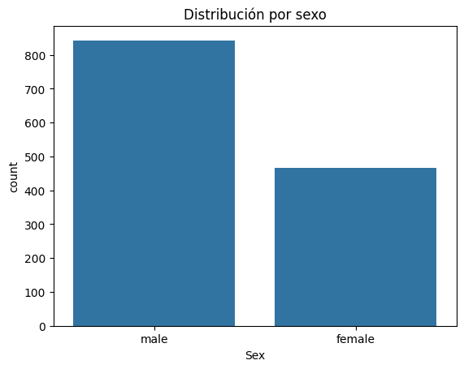
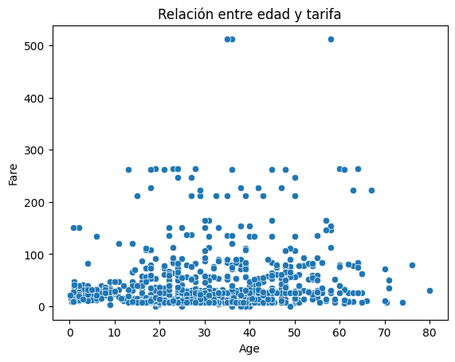
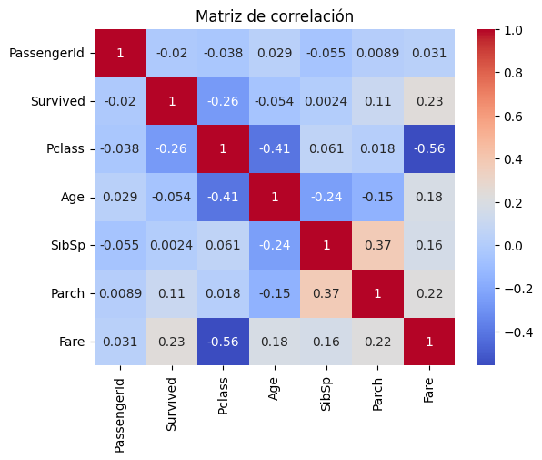

<div class="justify-text">


El **Análisis Exploratorio de Datos (EDA)** es la **primera etapa del proceso de Machine Learning**.   Consiste en **comprender los datos** con los que vamos a trabajar: su estructura, su distribución, sus relaciones y posibles errores.

El EDA no busca aún entrenar modelos, sino **descubrir patrones, anomalías y características importantes** del dataset.

<div class="hidden-summary">

## Introducción

</div>

### ¿Por qué se realiza antes del modelado?

Antes de construir un modelo predictivo, necesitamos **confiar en los datos**. Un EDA bien hecho permite:

* **Comprender la naturaleza del dataset.**  
  Saber qué tipo de variables contiene, cuántas observaciones hay y cómo están distribuidas.
* **Detectar errores, outliers y valores nulos.**  
  Identificar datos faltantes o extremos que pueden distorsionar el modelo y deben tratarse antes del modelado. 
* Entender la **distribución** de las variables (si son normales, sesgadas, categóricas, etc.).  
* **Identificar patrones y relaciones entre variables.**  
  Observar tendencias o correlaciones que puedan tener relevancia en el aprendizaje automático.

En resumen, el EDA nos ayuda a **preparar los datos correctamente** y **tomar decisiones fundamentadas** antes del preprocesamiento.


### Herramientas que usaremos

Para realizar el EDA en Python utilizaremos principalmente:

* **`pandas`** → para explorar y analizar los datos en forma de DataFrame.  
* **`matplotlib`** → para crear gráficos básicos y personalizables.  
* **`seaborn`** → para visualizar relaciones entre variables de forma más atractiva y estadística.

Estas tres librerías se complementan y forman la base del análisis exploratorio en cualquier proyecto de Machine Learning.

---

## Paso 1. Conocer el dataset

Antes de analizar o visualizar los datos, el primer paso en todo EDA es **explorar la estructura del dataset**:  
qué columnas tiene, cuántos datos hay, qué tipo de variables contiene y si existen valores perdidos o repetidos.

Este paso es fundamental para **entender el punto de partida** del análisis y detectar posibles problemas antes de aplicar transformaciones o modelos.

### Cargar y examinar los datos

Una vez que tenemos el dataset en formato CSV (u otro formato compatible), lo cargamos con **pandas**:

```python
import pandas as pd

df = pd.read_csv("titanic.csv")   # Ejemplo con el dataset Titanic
```

Para hacernos una idea general del contenido y la estructura:

```python
df.head()
```

👉 Muestra las primeras filas del dataset.
Sirve para **ver los nombres de las columnas**, el tipo de valores que contienen y detectar errores evidentes (por ejemplo, columnas mal cargadas o separadores incorrectos).

También podemos obtener una **visión general de las columnas y sus tipos de datos**:

```python
df.info()
```

Esta instrucción nos muestra:

* Número total de filas y columnas.
* Tipos de datos (`int64`, `float64`, `object`, etc.).
* Cuántos valores no nulos tiene cada columna.

💡 **Conclusiones que podemos sacar:**

* Si una columna tiene **muchos valores nulos**, será candidata a limpieza o eliminación.
* Si el tipo de dato es `object` pero contiene números, puede ser necesario **convertirla**.
* Saber si hay **columnas irrelevantes** (como identificadores o texto libre) que no aportan información.

Por último, podemos revisar un resumen estadístico de las columnas numéricas con:

```python
df.describe()
```

Esto nos da:

* **Media, desviación estándar, mínimo, máximo** y cuartiles (25%, 50%, 75%).
* Nos permite detectar valores extremos (outliers) o distribuciones anómalas.

💡 **Conclusiones:**

* Si el `max` es mucho mayor que el `75%`, puede haber **outliers**.
* Si la **media y la mediana (50%) difieren mucho**, la variable puede estar **sesgada**.
* Si el `std` es muy alto, hay gran **dispersión** en los datos.

:::tip DEFINICIONES IMPORTANTES
Los resultados que obtenemos con `describe()` nos ayudan a **detectar posibles problemas en las variables numéricas**, como:

* **Outliers:** valores extremos que se alejan mucho del resto. Por ejemplo, una tarifa o edad muy alta respecto al grupo.   
  **Los analizaremos mejor con gráficos (boxplots)**.

* **Sesgos:** cuando la **media y la mediana** son muy diferentes, la variable puede estar **asimétrica** (hay muchos valores bajos y pocos altos, o al revés). 

* **Dispersión:** si la **desviación estándar (`std`) es muy alta**, significa que los valores están muy separados entre sí.  
  Esto puede requerir **escalado o normalización** en la fase de **preprocesamiento**.

👉 Todos estos aspectos se **detectan en el EDA**, pero se **corrigen o transforman durante el preprocesamiento**, cuando preparamos los datos para el modelado.
:::

---

### Tipos de variables

Comprender los **tipos de variables** que tenemos es esencial porque condiciona **qué tipo de análisis y gráficos usaremos después**.

| Tipo de variable                | Ejemplo (Titanic)         | Descripción                                                                                            |
| ------------------------------- | ------------------------- | ------------------------------------------------------------------------------------------------------ |
| **Numérica continua**           | `Age`, `Fare`             | Valores que pueden tomar infinitos valores dentro de un rango. Se analizan con histogramas o boxplots. |
| **Numérica discreta / ordinal** | `Pclass`, `SibSp`         | Valores enteros con un orden lógico. Se pueden representar con gráficos de barras o boxplots.          |
| **Categórica**                  | `Sex`, `Embarked`         | Valores de tipo texto o categorías. Se analizan con countplots.                                        |
| **Binaria**                     | `Survived`                | Solo dos valores posibles (0/1, Sí/No).                                                                |
| **Texto libre**                 | `Name`, `Ticket`, `Cabin` | Variables con texto no estructurado; suelen limpiarse o transformarse durante Feature Engineering                   |

💡 **Conclusiones:**

* Saber si la mayoría de variables son numéricas o categóricas nos orienta sobre qué técnicas visuales usar.
* Las variables de texto suelen requerir ingeniería posterior (por ejemplo, extraer el título del nombre).
* En datasets reales, los tipos de datos pueden venir incorrectos (por ejemplo, números leídos como texto).

---

### Valores únicos en variables categóricas

Para las variables **categóricas**, es útil ver qué valores o categorías existen antes de graficarlas.  
Podemos usar el método `unique()` para mostrar los valores distintos de una columna:

```python
df["Embarked"].unique()
```

Salida:

```
array(['S', 'C', 'Q', nan], dtype=object)
```

🧠 **Interpretación:**

* Vemos que hay tres puertos de embarque: `S`, `C` y `Q`.
* También hay algunos valores nulos (`nan`).
* Si aparecieran valores extraños o errores tipográficos, podríamos corregirlos durante el preprocesamiento.

---

### Detección de valores nulos y duplicados

Durante la exploración, también debemos comprobar si el dataset tiene **valores faltantes** o **filas duplicadas**.

```python
df.isnull().sum()
```

Muestra cuántos valores nulos hay por columna.

```python
df.duplicated().sum()
```

Indica cuántas filas están repetidas exactamente.

💡 **Conclusiones:**

* Si una columna tiene un gran número de valores nulos, se evaluará si se **rellena**, **elimina** o **se reemplaza por otra variable**.
* Si hay registros duplicados, normalmente se **eliminan** para evitar sesgos en el análisis.

---

## Paso 2: Análisis visual según el tipo de variable

Una vez conocemos la estructura general del dataset, el siguiente paso del EDA es **visualizar los datos**. Los gráficos nos permiten **ver patrones, detectar errores o outliers y comprender mejor las relaciones entre variables**.

En función de cuántas variables analicemos al mismo tiempo, distinguimos tres tipos de análisis:

* **Análisis univariante**
    Estudia una única variable a la vez. El objetivo es entender **cómo se distribuyen sus valores**, si hay **valores extremos** o si **existen categorías dominantes**.

    Ejemplos de preguntas que responde el análisis univariante:
    * ¿Qué edades son más frecuentes?  
    * ¿Cuál es el rango de precios (`Fare`)?  
    * ¿Cuántos pasajeros por sexo o puerto de embarque hay?

    Este tipo de análisis es el punto de partida del EDA y se realiza con **gráficos simples**, normalmente un **histograma, boxplot o countplot**.

* **Análisis bivariante**
    Estudia la relación entre **dos variables**: normalmente una variable explicativa y la variable **objetivo (target)**.  Sirve para ver **si existe relación o diferencia** entre grupos, o **si una variable influye** en otra.

    Por ejemplo:
    * ¿La probabilidad de supervivencia cambia según el sexo?  
    * ¿Los pasajeros que pagaron más (`Fare`) sobrevivieron más? 
  
    Los gráficos más típicos son los **barplots, boxplots y scatterplots**.

* **Análisis multivariante**
    Se usa cuando queremos estudiar la relación entre **tres o más variables** a la vez. En este curso, nos centraremos solo en la **matriz de correlación**, que muestra **cómo se relacionan las variables numéricas entre sí**.

    También es posible analizar interacciones más complejas (por ejemplo, cómo la edad influye en la supervivencia según el sexo), pero **no entraremos en ese nivel de detalle** en este tema.

    El gráfico más típico es el **heatmap**


---

### Paso 2.1: Análisis univariante

En el análisis univariante nos centramos en **una sola columna del dataset** para entender su comportamiento. El tipo de gráfico dependerá del tipo de variable (numérica o categórica).

:::tip Importante
El **análisis univariante** podría aplicarse a todas las variables del dataset, pero en la práctica se centra en **aquellas que aportan información útil o que se usarán en el modelo**.  
No se trata de generar gráficos por generar, sino de **entender el comportamiento de las variables más relevantes**.

| Tipo de variable | Qué hacer | Ejemplo |
|------------------|-----------|----------|
| **Numéricas** | Revisar distribución y outliers con histograma o boxplot | `Age`, `Fare` |
| **Categóricas** | Revisar equilibrio de clases con countplot | `Sex`, `Embarked`, `Pclass` |
| **Texto o IDs** | Ignorar o analizar aparte si se van a transformar | `Name`, `Cabin`, `Ticket` |

Primero se hace una revisión general con `df.describe()` y `df.info()`, y después se profundiza en las variables **más informativas**.
:::


#### Variables numéricas

Entre estas variables se encuentran la edad, tarifa, etc. Podemos representarlas con **histogramas** o **boxplots**.

##### Histograma

El histograma muestra **cómo se distribuyen los valores** de una variable numérica, agrupándolos en intervalos.

```python
import matplotlib.pyplot as plt      # Importa la librería matplotlib para crear gráficos.
import seaborn as sns                # Importa seaborn, que simplifica y mejora los gráficos estadísticos.

# Crea un histograma para visualizar la distribución de la variable "Age"
sns.histplot(
    df["Age"],   # Datos que se van a representar (columna 'Age' del DataFrame)
    bins=20,     # Número de barras o intervalos en los que se agrupan los valores
    kde=True     # Dibuja además la curva de densidad (línea suave que representa la forma de la distribución)
)

plt.title("Distribución de la edad")  # Añade un título al gráfico
plt.show()                            # Muestra el gráfico en pantalla
```


🧠 **Interpretación:**

* Si la forma es **simétrica**, la distribución es normal.
* Si está más concentrada a un lado, hay **sesgo**.
* Si hay valores muy alejados del resto, podrían ser **outliers**.
* Permite ver si hay **vacíos** (rangos sin datos).

💬 **Conclusión:**

> “La mayoría de pasajeros tienen entre 20 y 40 años, con pocos valores por encima de 60.”

---

##### 📦 Boxplot (diagrama de caja)

El boxplot resume la **distribución, la mediana y los posibles outliers**.

```python
sns.boxplot(x=df["Fare"])  # Crea un diagrama de caja (boxplot) para la variable 'Fare'.

plt.title("Distribución de la tarifa (Fare)")  # Añade un título descriptivo al gráfico.
plt.show()                                     # Muestra el gráfico en pantalla.
```


🧠 **Interpretación:**

* La **línea central** representa la **mediana**.
* La caja muestra el **rango intercuartílico** (del 25% al 75%).
* Los puntos aislados indican **valores atípicos (outliers)**.

💬 **Conclusión:**

> La mayoría de tarifas están por debajo de 100, pero hay valores muy altos que podrían ser *outliers*.  
> Para determinar si realmente lo son, debemos pensar en el **contexto**:  
> las tarifas tan altas pueden corresponder a pasajeros de primera clase, mientras que si encontráramos una edad de 250 años sabríamos que es un error.  
> En ese caso, el valor debería corregirse durante el **preprocesamiento**.

---

#### Variables categóricas, binarias y numéricas discretas

Entre estas variables se encuentran sexo, embarque, supervivencia, etc. En las variables categóricas interesa saber **cuántas veces aparece cada categoría**.
Para ello usamos un **countplot**, que cuenta el número de observaciones por grupo.

```python
sns.countplot(x="Sex", data=df)     # Crea un gráfico de barras (countplot) para la variable categórica 'Sex'.
                                    # Cada barra representa la cantidad de registros en cada categoría (hombres y mujeres).

plt.title("Distribución por sexo")  # Añade un título al gráfico para hacerlo más descriptivo.
plt.show()                          # Muestra el gráfico en pantalla.
```



🧠 **Interpretación:**

* Muestra si hay **categorías desbalanceadas** (por ejemplo, más hombres que mujeres).
* Ayuda a detectar **errores de codificación** (categorías mal escritas o muy raras).
* Si analizamos el target (`Survived`), nos muestra si hay **desequilibrio de clases**, algo importante para el modelado. (Esto ya sería análisis bivariante)

💬 **Conclusión:**

> “El dataset tiene más hombres que mujeres.”


:::tip TIPOS DE GRÁFICOS
En el análisis univariante los gráficos más comunes son el **histograma, el boxplot y el countplot**.
También se pueden usar variantes como el **violin plot** o el **kde plot**, que muestran la forma de la distribución con más detalle, o un **pie chart** para variables categóricas simples.
Lo importante no es el tipo de gráfico, sino **lo que te permite interpretar sobre los datos**.
:::

---

### Paso 2.2: Análisis bivariante

En el **análisis bivariante** estudiamos la relación entre **dos variables** al mismo tiempo. Normalmente, una de ellas es la **variable objetivo (target)** y la otra es una **variable explicativa**.

El objetivo es descubrir **si existe alguna relación o patrón** entre ellas: si una influye en la otra, si hay diferencias entre grupos o si los valores se comportan de forma similar.

:::tip Resumen de gráficos bivariantes

En el **análisis bivariante**, el tipo de gráfico que utilizamos depende de **la naturaleza de las dos variables** que queremos comparar.  
A continuación se resumen los más comunes y su propósito:

<div class="texto-sin-justificar">

| Tipo de relación | Gráfico recomendado | Librería / función | Qué permite observar |
|------------------|---------------------|--------------------|----------------------|
| **Categórica ↔ Categórica** | Countplot con `hue` | `sns.countplot(x="var1", hue="var2", data=df)` | Comparar frecuencias por grupo (por ejemplo, cuántos hombres y mujeres por puerto de embarque). |
| **Categórica ↔ Numérica** | Barplot | `sns.barplot(x="var_cat", y="var_num", data=df)` | Comparar medias o valores promedio por categoría. |
| **Numérica ↔ Numérica** | Scatterplot | `sns.scatterplot(x="var1", y="var2", data=df)` | Detectar correlaciones o tendencias entre dos variables numéricas. |

</div>

💡 **Consejo:**  
No es necesario usar todos estos gráficos. Elige los que **mejor ayuden a responder tus preguntas sobre los datos**, como por ejemplo:  
*“¿Qué variables parecen influir más en el resultado?”* o *“Existen relaciones o patrones visibles entre variables?”*
:::

---

#### Categórica ↔ Categórica

Se utiliza cuando queremos comparar una **variable categórica** (por ejemplo, `Sex`) con otra **variable categórica** (`Survived`).

```python
sns.countplot(x="Sex", hue="Survived", data=df)   # Crea un gráfico de barras (countplot) para comparar dos variables categóricas:
                                                  # 'x="Sex"' coloca las categorías de la variable 'Sex' (hombre/mujer) en el eje X.
                                                  # 'hue="Survived"' añade una segunda variable ('Survived') que se representa con colores distintos.
                                                  # Así, cada barra se divide según si el pasajero sobrevivió (1) o no (0).

plt.title("Supervivencia según el sexo")          # Añade un título descriptivo al gráfico.
plt.show()                                        # Muestra el gráfico en pantalla.
```


🧠 **Interpretación:**

* Cada grupo (hombres y mujeres) se divide según el valor de la variable objetivo (`Survived = 0` o `1`).
* Permite ver si la supervivencia fue mayor en algún grupo concreto.

💬 **Conclusión:**

> “Las mujeres sobrevivieron en mayor proporción que los hombres, por lo que el sexo parece influir en la supervivencia. Determina que el sexo es una variable importante a la hora de entrenar el modelo.”

---

#### Numérica ↔ Categórica

Este tipo de análisis se utiliza cuando queremos comparar una **variable numérica** (por ejemplo, `Age` o `Fare`) con una **variable categórica** (como `Survived`, `Sex` o `Pclass`).  
Nos permite ver si los valores numéricos cambian significativamente entre categorías.

Podemos representarlo de **dos maneras complementarias**:

##### Barplot — Comparar medias por categoría

El **barplot** muestra el **valor medio** (o por defecto, la media) de la variable numérica en cada categoría. Se suele utilizar cuando la variable explicativa (feature) es numérica y la variable objetivo (target) es categórica.

```python
sns.barplot(x="Survived", y="Age", data=df)   # 'x="Survived"' coloca las categorías (0 = no sobrevivió, 1 = sí sobrevivió) en el eje X.
                                              # 'y="Age"' indica que se calculará el valor medio de la edad en cada grupo.
                                              # Por defecto, sns.barplot muestra la MEDIA de la variable numérica para cada categoría del eje X.

plt.title("Edad media según supervivencia")   # Añade un título descriptivo al gráfico.
plt.show()                                   # Muestra el gráfico en pantalla.
```


🧠 **Interpretación:**

* La altura de cada barra representa la **media** de la edad dentro de cada grupo (`Survived = 0` o `1`).
* Permite comparar **diferencias en el promedio** entre categorías, aunque no muestra la dispersión.

💬 **Conclusión:**

> “La edad media de los pasajeros que sobrevivieron es algo menor que la de los que no lo hicieron.”

---

##### Barplot — Agrupaciones

También podemos agrupar las edades en intervalos para facilitar la interpretación:

```python
df["Age_bin"] = pd.cut(df["Age"], bins=[0, 12, 18, 50, 100],
                       labels=["Niño", "Adolescente", "Adulto", "Mayor"])

sns.barplot(x="Age_bin", y="Survived", data=df)
plt.title("Supervivencia por grupos de edad")
plt.show()
```


🧠 **Interpretación:**

* Los niños presentan una mayor tasa de supervivencia.
* A medida que aumenta la edad, la probabilidad de supervivencia disminuye.

💬 **Conclusión:**

> “La edad influye claramente en la supervivencia: los pasajeros más jóvenes tenían más posibilidades de sobrevivir.”

---

#### Numérica ↔ Numérica

Se utiliza para estudiar la **relación entre dos variables numéricas**.

```python
sns.scatterplot(x="Age", y="Fare", data=df)   # Crea un diagrama de dispersión (scatterplot) para representar dos variables numéricas.
                                              # 'x="Age"' coloca la edad en el eje horizontal.
                                              # 'y="Fare"' coloca la tarifa en el eje vertical.
                                              # Cada punto del gráfico representa un pasajero, con su edad y la tarifa que pagó.

plt.title("Relación entre edad y tarifa")     # Añade un título descriptivo al gráfico.
plt.show()                                    # Muestra el gráfico en pantalla.
```



🧠 **Interpretación:**

* Cada punto representa un pasajero.
* Si los puntos se alinean en una dirección (ascendente o descendente), hay **correlación**.
* Si están dispersos sin patrón claro, **no hay relación**.

💬 **Conclusión:**

> “No se aprecia una relación clara entre la edad y la tarifa, por lo que ambas variables parecen independientes.”

---

:::info Conclusiones típicas del análisis bivariante

* Permite descubrir **qué variables podrían influir en la variable objetivo**.
* Muestra **relaciones positivas, negativas o nulas** entre variables.
* Facilita la detección de **grupos o patrones** dentro de los datos.
* Es el paso previo a los **gráficos multivariantes** o al uso de **métodos estadísticos** que cuantifican esas relaciones.

✅ **En resumen:**
El análisis bivariante es clave para **encontrar relaciones entre variables** y entender qué factores pueden estar asociados al resultado final (target).
En el Titanic, por ejemplo, este análisis nos ayuda a ver **cómo el sexo, la edad o la clase del pasajero influyeron en la supervivencia**.
:::

---

### Paso 2.3: Análisis multivariante

El **análisis multivariante** se utiliza para estudiar la relación entre **varias variables numéricas al mismo tiempo**.  
Su objetivo es detectar **correlaciones** (relaciones lineales) entre las variables del dataset.

En este curso, lo centraremos en la **matriz de correlación**, una herramienta muy útil para identificar variables que se comportan de forma similar o redundante.


#### Matriz de correlación

La matriz de correlación muestra cómo se relaciona cada variable numérica con las demás.  
Cada celda contiene un valor entre **-1 y 1**:

* **1** → correlación positiva perfecta (ambas variables aumentan juntas).  
* **-1** → correlación negativa perfecta (una aumenta mientras la otra disminuye).  
* **0** → no hay relación lineal entre las variables.

Podemos calcularla fácilmente con `pandas` y representarla gráficamente con un **heatmap** de `seaborn`.

```python
corr = df.corr(numeric_only=True)                 # Calcula la matriz de correlación entre todas las variables numéricas.

sns.heatmap(corr, annot=True, cmap="coolwarm")    # Representa la matriz de correlación como un mapa de calor (heatmap).
                                                  # 'annot=True' muestra los valores numéricos dentro de cada celda.
                                                  # 'cmap="coolwarm"' define la paleta de colores.
plt.title("Matriz de correlación")                # Añade un título descriptivo al gráfico.
plt.show()                                        # Muestra el gráfico en pantalla.
```



🧠 **Interpretación:**

* Los colores **rojos** indican correlaciones **positivas** (ambas variables crecen o disminuyen juntas).
* Los colores **azules** indican correlaciones **negativas** (una crece mientras la otra disminuye).
* Los valores cercanos a **0** indican **poca o ninguna relación**.
* Si dos variables tienen un valor de correlación muy alto (por ejemplo, `> 0.8`), probablemente aporten **información redundante**.


💬 **Conclusión:**

> “Las variables `SibSp` y `Parch` están moderadamente correlacionadas, lo que indica que podrían medir un aspecto similar (tamaño de la familia). Se podrían mejorar mediante *Feature Engineering*.  

> No se observan correlaciones excesivamente altas entre variables, lo que indica que no hay multicolinealidad. La Multicolinealidad ocurre cuando dos o más variables predictoras están muy correlacionadas entre sí, es decir,
cuando aportan prácticamente la misma información al modelo.  
En la matriz de correlación lo verías así: dos variables con un valor de correlación muy alto (por ejemplo, > 0.8 o < -0.8).

> Además, al analizar la correlación de cada variable con la variable objetivo (`Survived`), podemos identificar cuáles podrían ser **más relevantes para el modelo**.  
> Por ejemplo, `Fare` suele mostrar correlación positiva con la supervivencia, mientras que `Pclass` presenta correlación negativa, lo que sugiere que el precio del billete y la clase del pasajero están relacionados con las probabilidades de sobrevivir.”

---

## Paso 3: Conclusiones del EDA

El **Análisis Exploratorio de Datos (EDA)** nos permite obtener una comprensión global del dataset antes de pasar al modelado.  
Tras explorar las variables, realizar gráficos y analizar relaciones, es el momento de **resumir los hallazgos más importantes**.

### Resumen de hallazgos

Durante el EDA hemos identificado distintos aspectos clave del dataset:

* **Valores nulos o ausentes:**  
  Determinar qué columnas contienen datos incompletos y si será necesario imputarlos, reemplazarlos o eliminarlos en la fase de preprocesamiento.

* **Outliers (valores atípicos):**  
  Detectar valores que se alejan significativamente del resto (por ejemplo, tarifas o edades muy altas).  
  En esta fase solo se **identifican**, pero se **tratan** en el preprocesamiento.

* **Distribuciones y sesgos:**  
  Observar si las variables numéricas presentan sesgo (asimetría) o dispersión muy alta.  
  Esto nos ayuda a decidir si será necesario aplicar transformaciones o escalado.

* **Variables relevantes:**  
  A partir de los análisis bivariantes, identificar las variables que **parecen influir en el target**.  
  Por ejemplo, en el Titanic:
  - `Sex` influye claramente en la supervivencia (las mujeres sobreviven más).  
  - `Pclass` y `Fare` también están relacionadas con la probabilidad de sobrevivir.  
  - `Age` muestra un efecto moderado: los niños tienen mayor supervivencia.

* **Relaciones entre variables:**  
  Analizar la matriz de correlación nos permite detectar variables **redundantes** o **fuertemente correlacionadas**.  
  En el Titanic, `SibSp` y `Parch` están relacionadas y podrían combinarse en una nueva variable (*FamilySize*).

* **Hipótesis iniciales para el modelo:**  
  A partir de las observaciones, podemos formular ideas que luego verificaremos en el modelado.  
  Por ejemplo:
  - “Los pasajeros de primera clase tienen mayor probabilidad de supervivencia.”  
  - “Las mujeres y los niños sobrevivieron más que los hombres adultos.”  
  - “El precio del billete (`Fare`) podría ser un indicador indirecto del nivel socioeconómico.”

---

### Pasos siguientes: hacia el preprocesamiento

Una vez terminado el EDA, ya conocemos **el estado y el comportamiento del dataset**, y estamos listos para preparar los datos para el modelado.  
En la siguiente etapa, el **preprocesamiento**, realizaremos las acciones necesarias para **limpiar, transformar y escalar** las variables:

* Rellenar o eliminar valores nulos.  
* Tratar outliers y errores evidentes.  
* Codificar variables categóricas.  
* Escalar o normalizar variables numéricas.  
* Crear nuevas variables (feature engineering) si es necesario.  

💡 **Objetivo:**  
Dejar el dataset **limpio, coherente y listo para entrenar un modelo** de Machine Learning.

---

## Ejemplo completo: Titanic

A continuación, puedes practicar todo el proceso de **Análisis Exploratorio de Datos (EDA)** utilizando el famoso dataset del **Titanic**, el mismo que hemos ido comentando en los ejemplos anteriores.

Haz clic en el siguiente enlace para abrir el cuaderno Jupyter y ejecutar el código paso a paso:

👉 [Cuaderno de EDA — Titanic](./0-datasets/EDA_Titanic.ipynb)

📂 Dataset: [`titanic.csv`](./0-datasets/titanic.csv)

---

## Actividad de Seguimiento: Retención de empleados

El objetivo de la actividad es realizar un **Análisis Exploratorio de Datos (EDA)** completo sobre el dataset **Employee Attrition**, con el fin de **comprender las características de los empleados y los factores que pueden influir en la rotación laboral** (abandono o permanencia en la empresa).

### Dataset

**Fichero:** [`employee.csv`](./0-datasets/employee.csv)    
**Más información:** [Kaggle](https://www.kaggle.com/datasets/pavansubhasht/ibm-hr-analytics-attrition-dataset)   
**Variable objetivo (target):** `Attrition`
* `Yes` → el empleado dejó la empresa
* `No` → el empleado sigue trabajando


### Entregable

Un **cuaderno de Google Colab** con todos los apartados vistos para EDA:

* **Análisis inicial** del dataset
* **Análisis univariante** para todas las features que puedan ser relevantes, con conclusión por cada gráfico
* **Análisis bivariante** para todas las features que puedan ser relevantes, con conclusión por cada gráfico
  * Añade el análisis de estos dos gráficos adicionales:
    * Boxplot de MonthlyIncome según JobRole
    ```python
    sns.boxplot(x="JobRole", y="MonthlyIncome", data=df)
    ```
    * Scatterplot de MonthlyIncome vs YearsAtCompany (busca información sobre estos gráficos)
    ```python
    sns.scatterplot(x="YearsAtCompany", y="MonthlyIncome", hue="Attrition", data=df)
    ```
* **Análisis multivariante**
* Una **sección final de conclusiones** con tus observaciones principales (si en el preprocesamiento habrá que tratar nulos, si hay variables categóricas a transformar, features irrelevantes, features muy sesgadas, etc.)

Puedes fijarte en la estructura del ejemplo de Titanic del apartado anterior.

</div>
