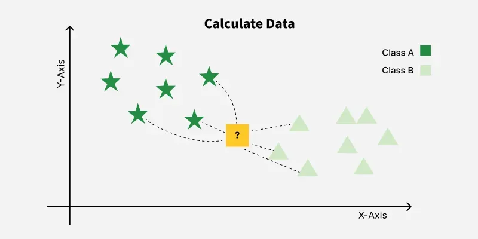
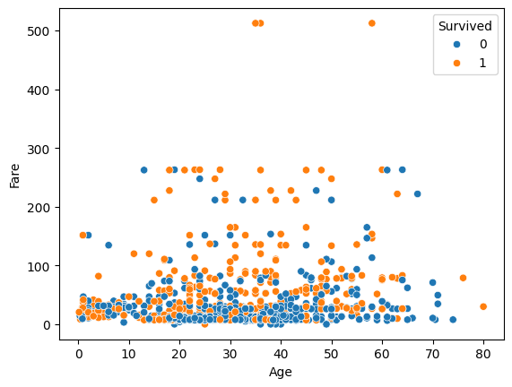

El algoritmo **K-Nearest Neighbors (KNN)** es uno de los modelos más sencillos e intuitivos de todo el aprendizaje supervisado.
Su idea principal es muy fácil de entender:

> **Para predecir la clase de una nueva observación, el modelo “mira” a los k puntos más cercanos y decide según lo que digan sus vecinos.**

No construye una fórmula, ni ajusta parámetros, ni aprende pesos.
Simplemente **compara distancias** entre observaciones. Por eso se le llama un modelo **basado en instancias**.

## Cómo funciona KNN

El algoritmo **K-Nearest Neighbors (KNN)** toma sus decisiones basándose en una idea muy sencilla:
**si un punto nuevo se parece a otros puntos que ya conocemos, debería pertenecer a la misma clase que ellos.**

Para aplicar esta idea, KNN utiliza tres elementos clave:

1. **Una medida de distancia** para saber qué observaciones están cerca.
2. **Un parámetro k**, que indica cuántos vecinos mirar.
3. **Un proceso de votación**, donde los vecinos “deciden” la clase final.

A continuación explicamos cada uno de estos elementos.

---

### Distancias

Para que el modelo pueda saber cuáles son los puntos “más cercanos”, es necesario medir la distancia entre observaciones.
La más utilizada por defecto es la **distancia euclídea**, que se corresponde con la distancia recta entre dos puntos:

$$
d(p, q) = \sqrt{(p_1 - q_1)^2 + (p_2 - q_2)^2 + \ldots + (p_n - q_n)^2}
$$

Esto significa que dos observaciones serán consideradas “similares” si:

* sus valores numéricos están cerca entre sí,
* y sus variables categóricas han sido codificadas adecuadamente.

---

### El parámetro k y su efecto en el modelo

El valor de **k** determina cuántos vecinos toma en cuenta KNN para votar la clase final. Elegir un buen valor es fundamental porque controla el equilibrio entre **sobreajuste (overfitting)** y **subajuste (underfitting)** en el modelo:

**k muy pequeño → Overfitting (sobreajuste)**.  
El modelo se fija demasiado en los vecinos más cercanos.
- Es muy sensible al ruido.
- Cambiar un solo punto puede modificar la predicción.
- Se adapta demasiado al conjunto de entrenamiento y generaliza peor.

➡ Resultado: **accuracy muy alta en train, baja en test**.

**k muy grande → Underfitting (subajuste)**.  
El modelo suaviza demasiado las decisiones.
- Considera tantos vecinos que pierde detalles importantes.
- Mezcla puntos de clases diferentes.
- La frontera de decisión es demasiado simple.

➡ Resultado: **accuracy baja tanto en train como en test**.

El **objetivo** es encontrar un k intermedio que permita:
- un modelo estable,
- que generalice bien,
- sin sensibilidad excesiva al ruido.

Ese valor se suele encontrar probando varios valores de k y comparando el error en test. Más adelante haremos un gráfico “*accuracy vs k*” que lo muestra visualmente.

---

### Proceso de predicción paso a paso

Cuando KNN tiene que decidir la clase de una nueva observación, sigue tres pasos muy claros:

**1. Calcular todas las distancias**

Compara la observación nueva con **todas** las del conjunto de entrenamiento.
Para cada observación calcula una distancia (euclídea, Manhattan, etc.).


**2. Seleccionar los k vecinos más cercanos**

Ordena todas las distancias de menor a mayor y se queda con los **k puntos más cercanos**.

Ejemplo:
Si k = 5 → se toman los 5 puntos más próximos.



**3. Votar la clase mayoritaria**

Los vecinos “votan” su clase.
La clase que más se repita entre esos k vecinos es la que el modelo asigna.

Ejemplos:

* Si los 5 vecinos son `[1, 0, 1, 1, 0]` → la clase predicha es **1**.
* Si están empatados, KNN utiliza criterios internos para romper el empate (dependiendo de la implementación).


:::info PARTICULARIDAD DE KNN
💡 **KNN no entrena un modelo**
KNN **no ajusta parámetros** como hacen la regresión logística o las redes neuronales.

> Solo guarda los datos de entrenamiento y los usa para comparar distancias durante la predicción.

Esto hace que:

* El entrenamiento sea prácticamente instantáneo.
* Pero la predicción sea más costosa si hay muchos datos.
:::

---

## Cuándo se utiliza y principales características

KNN es un modelo útil cuando:

* Queremos un primer modelo sencillo, rápido de implementar.
* El dataset no es muy grande (KNN calcula distancias para cada predicción).
* Las variables son significativas en términos de **similitud** (lo similar debe estar cerca).

:::tip ¿Qué significa la similitud?

KNN funciona bien cuando se cumple la siguiente idea:

> **Si dos observaciones son similares en sus features, deberían pertenecer a la misma clase.**

Ejemplos (Titanic):
* Pasajeros con **Pclass = 1**, **Sex = female**, **Fare alto** → suelen estar en la clase “*sobrevivió*”.
* Pasajeros **varones** en **tercera clase** → suelen estar en “*no sobrevivió*”.

Puedes comprobarlo visualmente utilizando un **scatterplot coloreado por clase**, representando dos variables numéricas relevantes:

```python
sns.scatterplot(x="Age", y="Fare", hue="Survived", data=df)
```



**Interpretación:**

* Si los puntos de la misma clase forman **grupos visibles** → la similitud es útil y KNN probablemente funcionará bien.
* Si las clases están totalmente **mezcladas** → la distancia no ayuda y KNN no será un buen modelo.

Este gráfico es lo más parecido a “ver” cómo funcionará KNN antes de ejecutarlo.

Ten en cuenta que:
👉 “Con estas dos features, la similitud NO es útil.”
👉 “Si añades variables categóricas transformadas, la cosa cambia.”
:::

Características importantes de KNN:

* **No aprende una ecuación**, solo almacena los datos.
* El entrenamiento es prácticamente inmediato.
* El coste computacional ocurre durante la **predicción**, no durante el entrenamiento.
* Funciona especialmente bien cuando el dataset está **limpio, bien escalado y sin ruido**.

---

## Ventajas

* **Muy fácil de entender**.
* Sirve como modelo base para comparar con modelos más complejos.
* Capaz de capturar relaciones no lineales.
* Suele ofrecer buenos resultados si el preprocesamiento es correcto.

## Limitaciones

* **Depende completamente de las distancias**, así que necesita:
  * escalado de variables,
  * ausencia de outliers muy fuertes,
  * buena codificación categórica.
* Es lento cuando el dataset tiene miles o millones de registros (tiene que calcular muchas distancias).
* Sensible al ruido: un solo vecino “raro” puede afectar la predicción.
* Elegir un buen valor de **k** es crucial (muy pequeño → sobreajuste, muy grande → subajuste).

---

## Importancia del preprocesamiento

KNN es uno de los modelos más sensibles al preprocesamiento de los datos.
Esto se debe a que **todas sus decisiones se basan en distancias**, y cualquier detalle en las features puede alterar completamente el resultado.

A continuación vemos por qué el preprocesamiento es especialmente crítico en este modelo.

### Escalado de variables

En KNN, cada variable contribuye a la distancia.
Si una columna tiene valores mucho más grandes que otra, dominará la distancia aunque no sea la más relevante.

Ejemplo típico en Titanic:

* `Fare` puede llegar a 500
* `Age` solo llega a 80

Si no escalamos:

* Fare “arrastra” la distancia,
* Age deja de tener peso,
* y KNN toma decisiones distorsionadas.

💡 **Conclusión:**
El escalado (StandardScaler o MinMaxScaler) es **obligatorio** en KNN.
Sin él, el modelo no funciona bien.

---

### Codificación de variables categóricas

KNN calcula distancias entre filas. Para que pueda hacerlo, **todas las variables deben ser numéricas**.

Pero además:

* Una codificación incorrecta puede inventar relaciones que no existen.
* Por ejemplo, si `Embarked` se codifica como `S=0`, `C=1`, `Q=2`, KNN interpretará que Q está “más lejos” de S que C, lo cual **no tiene sentido**.

Por eso, en variables **nominales** se requiere One-Hot Encoding.
Esto evita introducir un orden artificial que arruinaría la distancia.

💡 **Conclusión:**
La codificación correcta evita que KNN aprenda relaciones geométricas que no son reales.

---

## Implementación en Python

Partimos del punto en el que el **preprocesamiento ya está completado**.
Recuerda que en el **Paso 2** del preprocesamiento dividíamos el dataset en entrenamiento y prueba:

```python
X_train, X_test, y_train, y_test = train_test_split(
    X,
    y,
    test_size=0.2,
    random_state=42,
    stratify=y
)
```

Y en el **Paso 3** aplicábamos todas las transformaciones necesarias únicamente sobre el conjunto de *train* (imputación de nulos, codificación, escalado…) y luego las trasladábamos a *test* utilizando los parámetros aprendidos.

En este apartado asumimos que **todo ese proceso ya está hecho**, por lo que comenzamos directamente a trabajar con los datos **ya preprocesados** para entrenar y evaluar el modelo KNN.

---

### Paso 1. Búsqueda de la mejor *k*

Antes de entrenar definitivamente el modelo KNN, necesitamos elegir el valor óptimo de **k**, es decir, cuántos vecinos tendrá en cuenta el algoritmo para tomar decisiones. Recuerda que la elección de *k* influye directamente en el rendimiento del modelo.

Para determinar qué valor funciona mejor, utilizaremos un proceso llamado **validación cruzada** (*cross-validation*).
Aquí veremos dos métodos:

* **Opción 1: 5-Fold Cross-Validation** (búsqueda manual de k)
* **Opción 2: GridSearchCV** (método más avanzado)

---

#### Opción 1. 5-Fold Cross-Validation

La **validación cruzada** es una técnica para evaluar un modelo de manera más fiable y evitar depender de una única división train/test.

En lugar de entrenar el modelo una sola vez, hacemos:

1. Dividir el conjunto de entrenamiento (X_train) en **5 subconjuntos** (folds).
2. Entrenar el modelo con 4 de ellos.
3. Validar con el fold restante.
4. Repetir el proceso cambiando el fold de validación hasta completar las 5 combinaciones.
5. Calcular la **media de accuracy** obtenida.

Esto nos da una estimación mucho más robusta del rendimiento del modelo.


El objetivo es:

> Probar varios valores de **k**, medir su rendimiento medio con cross-validation y elegir el que obtenga el mejor resultado.

---

##### Aplicación de 5-FOLD CV con varias k

A continuación se muestra un ejemplo desde k = 1 hasta k = 30:

```python
from sklearn.model_selection import cross_val_score
from sklearn.neighbors import KNeighborsClassifier
import numpy as np

# Rango de valores de k que queremos probar (del 1 al 30)
k_values = range(1, 31)

# Aquí iremos guardando la accuracy media de cada k
accuracy_scores = []

# Recorremos todos los posibles valores de k
for k in k_values:
    # Creamos un modelo KNN con ese valor de k
    knn = KNeighborsClassifier(n_neighbors=k)
    
    # Aplicamos validación cruzada (5-fold) solo sobre el conjunto de entrenamiento
    #   - cross_val_score entrena y valida el modelo 5 veces (cv=5)
    #   - devuelve un array con 5 valores de accuracy (uno por cada fold)
    scores = cross_val_score(knn, X_train, y_train, cv=5)
    
    # Calculamos la media de esos 5 valores y la guardamos
    accuracy_scores.append(scores.mean())
```

Después de ejecutar este código, habremos evaluado **30 modelos diferentes**, uno por cada valor de *k* (desde 1 hasta 30).
Para cada uno de esos modelos se realiza un proceso llamado **5-Fold Cross-Validation**, que funciona así:

1. El conjunto de entrenamiento (*X_train_scaled*, *y_train*) se divide en **5 partes iguales** llamadas *folds*.
2. Para un valor concreto de k:
   * Se entrena el modelo **5 veces**, cada vez utilizando 4 folds para entrenar y **1 fold distinto** para validar.
   * En cada una de esas 5 repeticiones se obtiene una accuracy diferente.
3. Al final, calculamos la **media** de esas 5 accuracies.
   Esa media representa lo bien que funciona ese valor de k.
4. Repetimos el proceso para **cada k** del rango 1–30.

Este procedimiento nos da una estimación mucho más fiable que entrenar el modelo una sola vez, ya que utiliza diferentes particiones del conjunto de entrenamiento y reduce el riesgo de depender de un único train/validation.

---

##### Gráfico: Accuracy vs k

Una vez obtenida la accuracy media para cada valor de **k** mediante 5-Fold Cross-Validation, es muy útil visualizar cómo cambia esa accuracy en función de k.
Este gráfico nos permite ver:
* cuándo el modelo mejora,
* cuándo deja de mejorar,
* y cuándo empieza a empeorar si usamos un k demasiado grande.

En lugar de representar el error, esta vez representamos directamente la **accuracy media**:

```python
import matplotlib.pyplot as plt

plt.figure(figsize=(10, 5))
plt.plot(k_values, accuracy_scores, marker='o')
plt.xlabel("Valor de k")
plt.ylabel("Accuracy medio (5-Fold)")
plt.title("Accuracy vs k (5-Fold Cross-Validation)")
plt.grid(True)
plt.show()
```


El comportamiento típico de la accuracy es:

* **k pequeño → accuracy baja**
  El modelo usa pocos vecinos y es demasiado sensible al ruido.

* **Zona intermedia → accuracy máxima**
  Aquí el modelo logra un equilibrio entre simplicidad y estabilidad.
  Este suele ser el **mejor valor de k**.

* **k grande → la accuracy vuelve a bajar**
  El modelo empieza a mezclar demasiados vecinos y las clases se confunden.

---

##### Selección de la mejor *k*

El valor óptimo de k es aquel que:

> **consigue la mayor accuracy media en validación cruzada**,
> sin que la curva empiece a caer después.

En otras palabras:

* buscamos el **pico máximo** del gráfico,
* pero siempre comprobando que no sea un valor extremo (por ejemplo, k=1 suele dar accuracy artificialmente alta en train y mala en test).

En código, podemos recuperar el valor así:

```python
best_k = k_values[np.argmax(accuracy_scores)]
print("Mejor valor de k:", best_k)
```

---

#### Opción 2. GridSearchCV

`GridSearchCV` realiza **automáticamente** todo el proceso anterior:

* Prueba varios valores de k
* Evalúa el modelo con cross-validation
* Devuelve el mejor

Sin embargo, es una técnica más avanzada que veremos más adelante.

<!--

`GridSearchCV` es una herramienta de scikit-learn que **automatiza todo el proceso de búsqueda de hiperparámetros**, incluido el valor óptimo de *k* en KNN.  
Hace exactamente lo mismo que el método manual anterior, pero de manera más cómoda y estructurada:

- Prueba automáticamente una lista de valores de k.  
- Aplica validación cruzada para cada uno (por ejemplo, 5-fold).  
- Calcula la métrica media (accuracy por defecto).  
- Devuelve el mejor modelo y el mejor valor de k.

Es decir:

> **GridSearchCV = Validación cruzada + Búsqueda de hiperparámetros en un solo paso.**


```python
from sklearn.model_selection import GridSearchCV
from sklearn.neighbors import KNeighborsClassifier

# Definimos los valores de k que queremos probar
param_grid = {
    'n_neighbors': range(1, 31)
}

# Creamos el modelo base
knn = KNeighborsClassifier()

# Configuramos GridSearchCV:
# - knn: el modelo
# - param_grid: valores de k a probar
# - cv=5: validación cruzada 5-fold
# - scoring='accuracy': métrica que optimiza
grid = GridSearchCV(
    estimator=knn,
    param_grid=param_grid,
    cv=5,
    scoring='accuracy'
)

# Entrenamos GridSearchCV con el conjunto de entrenamiento preprocesado
grid.fit(X_train, y_train)

# Extraemos el mejor valor de k
print("Mejor k encontrado:", grid.best_params_['n_neighbors'])

# Extraemos el mejor modelo ya entrenado
knn_best = grid.best_estimator_
```

**Ventajas de GridSearchCV**

* Automatiza la validación cruzada.
* Devuelve directamente el modelo óptimo.
* Facilita probar múltiples hiperparámetros (no solo k).
* Muy útil cuando los modelos son más complejos (SVM, Random Forest, etc.).

:::info Nota sobre GridSearchCV

Si utilizas **GridSearchCV**, no necesitas realizar el **Paso 2 (Entrenamiento con la mejor k)**.

¿Por qué?  
Porque el método:

1. Prueba todos los valores de k especificados.  
2. Aplica validación cruzada para cada uno.  
3. Selecciona el mejor valor de k.  
4. **Entrena automáticamente el modelo final** con ese mejor valor usando todo el conjunto de entrenamiento.

El modelo final ya está disponible en:

```python
knn_best = grid.best_estimator_
```

Este modelo se encuentra **totalmente entrenado y listo para predecir**, por lo que no es necesario volver a llamarlo a `fit()`.

:::

-->

---

### Paso 2. Entrenamiento con la mejor *k*

Una vez identificado el valor óptimo de **k** mediante validación cruzada, el siguiente paso es entrenar el modelo KNN definitivo utilizando **todo el conjunto de entrenamiento preprocesado** (`X_train` y `y_train`).

La lógica es simple:

1. Elegimos `best_k` (el valor de k que obtuvo la mayor accuracy media en el paso anterior).
2. Creamos un modelo KNN con ese valor.
3. Lo entrenamos utilizando **todos los datos de entrenamiento**, no solo los folds.

De esta forma aprovechamos al máximo la información disponible antes de evaluar en test.

```python
# Entrenar el modelo definitivo con toda la parte de entrenamiento
from sklearn.neighbors import KNeighborsClassifier

knn_final = KNeighborsClassifier(n_neighbors=best_k)
knn_final.fit(X_train, y_train)
```

**¿Por qué entrenamos de nuevo?**

Durante la validación cruzada, el modelo se entrenó **muchas veces**, pero:

* cada entrenamiento usó solo **4/5** del conjunto de entrenamiento,
* y los folds iban cambiando.

Ahora que ya sabemos cuál es el mejor *k*, debemos entrenar el modelo final usando **el 100% del conjunto de entrenamiento**, para que aprenda con la máxima cantidad de datos posible antes de evaluar en test.

**Resultado de este paso**

Ahora ya tenemos un modelo KNN completamente entrenado con el mejor valor de *k*, listo para:

* hacer predicciones sobre `X_test`,
* y evaluar su rendimiento con las métricas del siguiente apartado.

---

### Paso 3. Evaluación mediante métricas

Una vez entrenado el modelo con el mejor valor de **k**, el siguiente paso es evaluar su rendimiento en el conjunto de **test**.
Para ello utilizaremos las métricas más importantes en problemas de **clasificación**:

* **Accuracy**
* **Matriz de confusión**
* **Precision**
* **Recall**
* **F1-score**
* **Support**

Estas métricas nos permiten saber **qué tan bien está funcionando el modelo**, si se está equivocando más en una clase que en otra, y si tiene problemas de equilibrio entre clases.

Antes de evaluar el modelo, necesitamos generar las predicciones sobre el conjunto de test:

```python
y_pred = knn_final.predict(X_test)
```

---

#### Accuracy

La **accuracy** mide el porcentaje de predicciones correctas sobre el total:

$$
\text{accuracy} = \frac{\text{aciertos}}{\text{total}}
$$

```python
from sklearn.metrics import accuracy_score

y_pred = knn_final.predict(X_test)
accuracy = accuracy_score(y_test, y_pred)

print("Accuracy:", accuracy)
```

Salida conseguida:

```
Accuracy: 0.8549618320610687
```

**Interpretación**

* **Accuracy muy alta (≈ 0.95 o superior)** → puede parecer excelente, pero hay que tener cuidado: podría indicar sobreajuste (el modelo memoriza el entrenamiento y no generaliza bien), o un fuerte desbalanceo de clases (el modelo acierta porque predice siempre la clase mayoritaria).
* **Accuracy alta (≈ 0.85 - 0.95)** → indica buen rendimiento global, pero no garantiza que el modelo funcione bien para *todas* las clases.
* **Accuracy moderada (≈ 0.70 – 0.85)** → el modelo capta parte del patrón, pero aún puede estar fallando en clases minoritarias o con datos ruidosos.
* **Accuracy baja (< 0.70)** → el modelo no está identificando correctamente la estructura del problema o las clases están muy mezcladas.

💡 **Pero cuidado:**
La accuracy por sí sola puede ser engañosa, especialmente si las clases están desbalanceadas o si el modelo tiende a predecir siempre la clase mayoritaria.

---

#### Matriz de confusión

La **matriz de confusión** es una herramienta fundamental en clasificación, porque permite ver exactamente **cómo** y **dónde** se equivoca el modelo.
No solo indica cuántos aciertos tiene, sino *qué tipo de errores* comete:

* **TP (True Positives)** → predijo positivo y era positivo
* **TN (True Negatives)** → predijo negativo y era negativo
* **FP (False Positives)** → predijo positivo pero era negativo
* **FN (False Negatives)** → predijo negativo pero era positivo

Representarla como un **mapa de calor** facilita enormemente la interpretación.

```python
from sklearn.metrics import confusion_matrix
import seaborn as sns
import matplotlib.pyplot as plt

# Calcular la matriz de confusión
cm = confusion_matrix(y_test, y_pred)

# Representación como mapa de calor
plt.figure(figsize=(6, 4))
sns.heatmap(cm, annot=True, fmt="d", cmap="Blues",
            xticklabels=["Predicción: 0", "Predicción: 1"],
            yticklabels=["Real: 0", "Real: 1"])
plt.title("Matriz de Confusión")
plt.xlabel("Predicciones")
plt.ylabel("Valores reales")
plt.show()
```

**Cómo interpretar el mapa de calor**


**Interpretación general:**

* **TN (arriba izquierda)**: número de negativos bien clasificados
* **TP (abajo derecha)**: número de positivos bien clasificados
* **FP (arriba derecha)**: el modelo predijo positivo pero era negativo
  * error típico cuando el modelo es demasiado “optimista”
* **FN (abajo izquierda)**: el modelo predijo negativo pero era positivo
  * error crítico en muchos problemas (fraude, enfermedad, fallos, etc.)

**¿Qué nos indica una buena matriz de confusión?**

* Los números grandes deben estar en la **diagonal principal** (TN y TP).
* Los valores **fuera de la diagonal** deben ser lo más pequeños posible.
* Muchos **FN** → el modelo está “dejando pasar” positivos → problema si queremos detectar casos sensibles (fraudes, enfermedades…).
* Muchos **FP** → el modelo dispara demasiadas alarmas falsas.


**💡 Conclusión**

> La matriz de confusión no solo dice “cuánto acierta el modelo”,
> sino **en qué acierta y en qué falla**, lo cual es esencial para entender si el modelo es realmente útil para la tarea.

<!--

---


#### Classification report

Estas métricas aparecen juntas en el **classification_report**, una herramienta muy útil que resume el rendimiento por clase.

```python
from sklearn.metrics import classification_report

print(classification_report(y_test, y_pred))
```

La salida típica es así:

```
              precision    recall  f1-score   support
0              0.86        0.92      0.89       163
1              0.85        0.75      0.80        99
```

Vamos a ver qué significa cada métrica:

---

##### Precision

$$
\text{precision} = \frac{TP}{TP + FP}
$$

**Qué mide:**
De todas las predicciones positivas y negativas realizadas por el modelo, ¿cuántas son correctas?

**Precision baja** → el modelo da **falsos positivos**.

**Conclusión de precisión en la tabla anterior:**

Los valores de **precision** obtenidos para ambas clases son altos y muy similares:

* **Clase 0**: precision = **0.86**
* **Clase 1**: precision = **0.85**

Esto significa que:

> Cuando el modelo predice una clase (ya sea 0 o 1), suele acertar con una alta fiabilidad.

En otras palabras:

* **El modelo comete pocos falsos positivos** en ambas clases.
* Las predicciones positivas (para cada clase) son bastante “de confianza”.
* No existe un sesgo claro hacia una de las dos clases en términos de precision.

---

##### Recall

$$
\text{recall} = \frac{TP}{TP + FN}
$$

**Qué mide:**
De todos los supervivientes reales, ¿cuántos detecta el modelo?

**Recall baja** → el modelo falla y comete **falsos negativos** (los más graves en este contexto).

**Conclusión recall**:

Los valores de **recall** muestran un comportamiento más desigual entre las dos clases:

* **Clase 0**: recall = **0.92**
* **Clase 1**: recall = **0.75**

Esto significa que:

> El modelo identifica muy bien los casos de la **clase 0**, pero deja escapar una parte más significativa de los casos reales de la **clase 1**.

En otras palabras:

* El modelo comete **pocos falsos negativos** en la clase 0 (predice correctamente la mayoría de los “0” reales).
* En la clase 1, el modelo tiene más dificultades para detectar todos los positivos reales → **hay más falsos negativos**.
* Esta diferencia indica que la **sensibilidad del modelo es mayor para la clase 0** que para la clase 1.

No es necesariamente un problema grave, pero señala que:

* La clase 1 es más difícil de identificar.
* El modelo puede beneficiarse de ajustes (k distinto, o modelos más complejos) si la clase positiva fuera especialmente importante en el problema.

:::tip Precision vs Recall

Vamos a partir de esta idea:

**Precision = de lo que predije como positivo, ¿cuántos eran realmente positivos?**  
**Recall = de todos los positivos reales, ¿cuántos detecté como positivos?**

Aunque ambas métricas parecen parecidas, miden aspectos muy distintos del rendimiento de un modelo de clasificación.

Imagina una cesta llena de manzanas rojas y verdes. Tu tarea es identificar solo las **manzanas rojas** (clase positiva).

**PRECISION: “De las que saqué como rojas, ¿cuántas eran realmente rojas?”**
- Si saco 10 manzanas y 9 son rojas → **precision = 0.9 (alta)**  
- Si saco 10 y solo 3 son rojas → **precision baja**

👉 La precision mide **cuán fiables son tus predicciones positivas**.

**RECALL: “De TODAS las manzanas rojas que había en la cesta, ¿cuántas encontré?”**
- Si había 20 rojas y saco 18 → **recall = 0.9 (alto)**  
- Si saco solo 5 → **recall = 0.25 (bajo)**

👉 El recall mide **cuántos positivos reales has logrado detectar**.

**Resumen fácil**

- **Precision** → calidad de los positivos predichos (evitar falsos positivos).  
- **Recall** → cantidad de positivos encontrados (evitar falsos negativos).

:::

---

##### F1-score

$$
\text{F1} = 2 \cdot \frac{\text{precision} \cdot \text{recall}}{\text{precision} + \text{recall}}
$$

**Qué mide:**
Equilibrio entre precision y recall.
Muy útil cuando:

* las clases están desbalanceadas
* hay un coste diferente de los errores

**Conclusión sobre la tabla anterior**

El **F1-score** combina precision y recall en una sola métrica, de forma que solo será alto cuando **ambas** lo sean.
En la tabla anterior:

* **Clase 0 (F1 = 0.89)** → el modelo logra un excelente equilibrio entre acertar cuando predice 0 y detectar correctamente los 0 reales.
* **Clase 1 (F1 = 0.80)** → el equilibrio es bueno, pero peor que en la clase 0, porque el modelo **deja escapar algunos positivos reales** (recall más bajo).

Esto significa que:

* El modelo tiene un rendimiento muy **equilibrado y sólido** en la clase 0, ya que tanto su precision como su recall son altos.
* En la clase 1, aunque la precision es buena, el recall es más bajo, y eso hace que el F1-score también baje. Esta clase es **más difícil** para el modelo, normalmente porque hay menos ejemplos o más variabilidad.
* Aun así, un F1-score de 0.80 sigue siendo **un buen resultado** para un modelo básico como KNN.

---

##### Support

Indica cuántos ejemplos reales hay de cada clase en el test.

Ejemplo:

* support of 0 = 105 pasajeros “no sobrevivió”
* support of 1 = 74 pasajeros “sobrevivió”

**Conclusión**
Si una clase tiene menos support (como “1” en Titanic), el modelo suele tener más dificultades para predecirla bien.

-->

---

## Actividad de Seguimiento: Retención de empleados

El objetivo de la actividad es realizar el **Preprocesamiento** sobre el dataset **Employee Attrition** y aplicar el modelo KNN sobre él, con el fin de **predecir la rotación laboral** (abandono o permanencia en la empresa).

### Dataset

**Fichero:** [`employee.csv`](./0-datasets/employee.csv)    
**Más información:** [Kaggle](https://www.kaggle.com/datasets/pavansubhasht/ibm-hr-analytics-attrition-dataset)   
**Variable objetivo (target):** `Attrition`
* `Yes` → el empleado dejó la empresa
* `No` → el empleado sigue trabajando   

**Nota**: recuerda que ya hiciste el EDA de este dataset, parte de ese análisis para no repetir trabajo.


### Entregable

Un **cuaderno de Google Colab** con:

* **Preprocesamiento completo** del dataset
* **Aplicación del modelo KNN**:
  * Búsqueda de la mejor k
  * Entrenamiento con la mejor k
  * Evaluación mediante métricas
* Recuerda incluir **conclusiones y comentarios** sobre las tareas que vas realizando.
