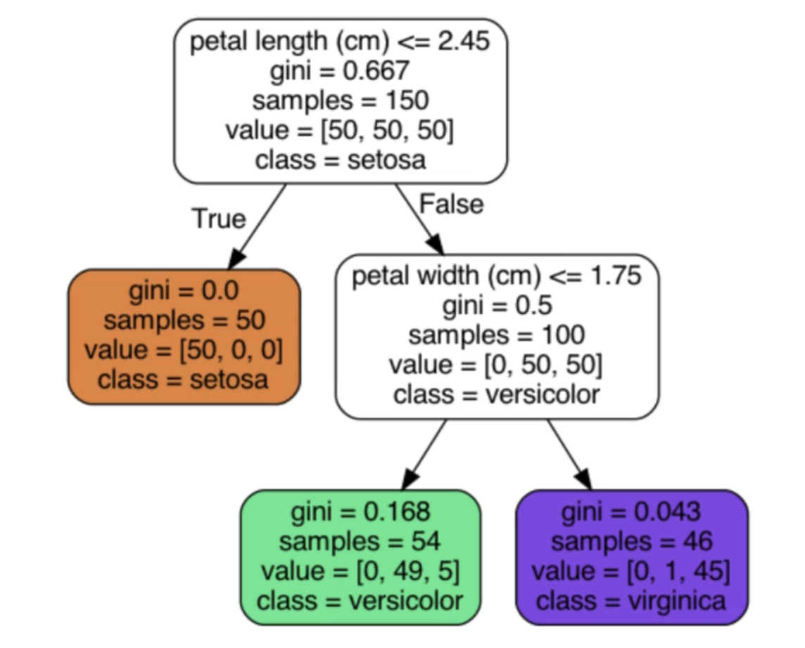
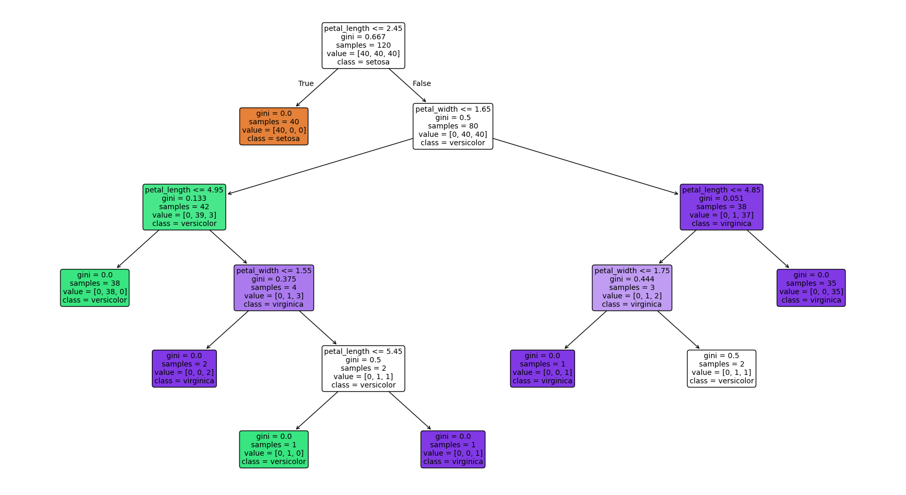
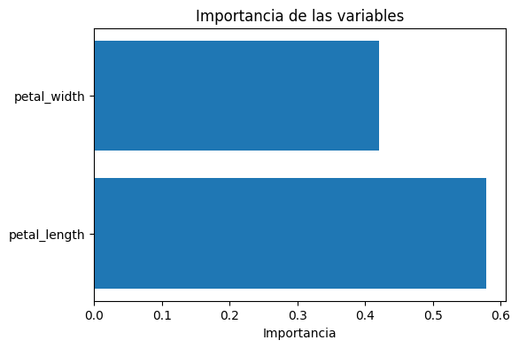

Los **Árboles de Decisión** son uno de los modelos más intuitivos y visuales de todo el Machine Learning.
En lugar de usar fórmulas o distancias, toman decisiones siguiendo **reglas tipo “si… entonces…”** que dividen los datos en grupos cada vez más homogéneos.


Un Árbol de Decisión es un modelo que:

* divide el espacio de datos en regiones según preguntas simples (*“¿petal_length ≤ 2.45?””*)
* llega a una **hoja**, donde asigna una clase (en clasificación)
* aprende automáticamente qué preguntas hacer y en qué orden

Se usan para **clasificación** (por ejemplo, qué especie de flor es Iris) y para **regresión** (predecir valores numéricos).


Un árbol decide paso a paso:

1. ¿Los ingresos del cliente superan los 50.000€?
2. Si no, ¿tiene más de 30 años?
3. Finalmente, ¿a qué clase pertenecen los datos que quedan?

Cada decisión crea una **rama**.
El camino completo desde la raíz hasta la hoja es una **regla** del tipo:

> “Si *age* > 30 entonces No compra”.

Esto hace que el modelo sea fácil de explicar y de leer.

---

## Ventajas principales

Los Árboles de Decisión destacan por:

* **Interpretabilidad:** puedes ver exactamente qué reglas está usando el modelo.
* **Visualización sencilla:** se pueden dibujar y entender en segundos.
* **No requieren escalado:** esto se debe a que no miden distancias, a diferencia de KNN o SVM.
* **Pueden capturar relaciones no lineales** sin esfuerzo.
* **Funcionan bien como modelo base** y preparan el camino para Random Forest y Gradient Boosting.

---

## Dataset de ejemplo: Iris

En estos apuntes utilizaremos el **dataset Iris**, uno de los conjuntos de datos más conocidos en Machine Learning por su simplicidad y porque permite visualizar muy bien cómo funcionan los modelos de clasificación.

El dataset contiene **150 observaciones**, cada una correspondiente a una flor del género *Iris*, y está dividido en **3 especies**:

* **Iris setosa**
* **Iris versicolor**
* **Iris virginica**


Cada flor está descrita mediante **4 características numéricas**, medidas en centímetros:

| sepal_length | sepal_width | petal_length | petal_width | species    |
| ------------ | ----------- | ------------ | ----------- | ---------- |
| 5.1          | 3.5         | 1.4          | 0.2         | setosa     |
| 7.0          | 3.2         | 4.7          | 1.4         | versicolor |
| 6.3          | 3.3         | 6.0          | 2.5         | virginica  |
| 4.9          | 3.1         | 1.5          | 0.1         | setosa     |
| 5.8          | 2.7         | 5.1          | 1.9         | virginica  |

Estas variables son ideales para aprender Árboles de Decisión porque:

* Las clases están **bien separadas**, sobre todo usando *petal_length* y *petal_width*.
* Se pueden generar árboles simples que explican muy bien cómo funciona el modelo.
* Todo el dataset es **numérico y no tiene valores nulos**, por lo que no requiere preprocesamiento.

:::info
En los ejemplos visuales utilizaremos únicamente **petal_length** y **petal_width** para que se entienda claramente cómo el árbol divide los datos.
:::

---

## Funcionamiento y componentes

Los Árboles de Decisión funcionan dividiendo progresivamente los datos mediante **preguntas simples**, hasta que cada grupo final contiene observaciones mayoritariamente de una sola clase.


---

### Componentes

Un árbol está formado por:

* **Nodo raíz**. Es el punto de partida. Por este nodo pasan todos los elementos del dataset.   
    Aquí el modelo formula la **primera pregunta**, por ejemplo:

    ```
    ¿petal_length ≤ 2.45?
    ```

* **Ramas**. Cada respuesta a la condición crea una rama:

    * Si se cumple → rama izquierda
    * Si NO se cumple → rama derecha

* **Hojas**. Son los nodos finales. Aquí el árbol **asigna la clase** (setosa, versicolor, virginica…).    
    En una hoja ya no se hacen más preguntas.

---

### Split

Un ***split*** es simplemente una **división del nodo actual** basada en una pregunta.

Ejemplo:

```
petal_width ≤ 1.75
```

Cada split:

* reduce la mezcla de clases
* produce nodos más “puros”
* mejora la capacidad del modelo para separar especies

El árbol prueba muchos splits posibles y selecciona el que mejor separa las clases.

---

### Criterios de división: Gini

Para decidir **qué pregunta hacer** en cada nodo, el árbol prueba distintas posibles divisiones (*splits*) y elige la que mejor separa las clases.
La forma más común de medir qué tan “buena” es una división es usando la **impureza Gini**, que indica cuán mezcladas están las clases dentro de un nodo.




La **impureza Gini** mide **lo mezcladas que están las clases** en un nodo.

* **Gini = 0** → nodo completamente puro (solo una clase)
* **Gini alto** → mucha mezcla de clases

En el ejemplo de la imagen:

* Nodo raíz → `gini = 0.667` (máxima mezcla: 50 setosa, 50 versicolor, 50 virginica)
* Nodo naranja → `gini = 0.0` (todas son setosa → pureza total)
* Nodo verde → `gini = 0.168` (casi todas versicolor)
* Nodo morado → `gini = 0.043` (casi todas virginica)

El árbol elige el split que **reduce más la impureza**, es decir, el que consigue nodos hijos más homogéneos.

:::info
Existe otro criterio de decisión llamado **entropía**, que mide la mezcla de clases de forma similar, pero es más avanzado.
En este curso solo usaremos **Gini**, que es más fácil de interpretar y es el valor por defecto en scikit-learn.
:::

---

### Ejemplo funcionamiento

Cuando llega una nueva observación, el árbol:

1. Empieza en la **raíz**.
2. Evalúa la condición del nodo:
   * Si se cumple → rama izquierda
   * Si no → rama derecha
3. Repite el proceso en los nodos siguientes.
4. Termina en una **hoja**, que contiene la clase predicha.

Es literalmente seguir un camino de decisiones **“si… entonces…”**.

---

## Importancia del preprocesamiento

Aunque los Árboles de Decisión son modelos muy flexibles y funcionan bien incluso sin un preprocesamiento complejo, es importante conocer sus necesidades básicas para evitar errores y obtener buenos resultados.

Las reglas principales son las siguientes:

| Aspecto                                | ¿Es necesario?    | Explicación                                                                                                                                                  |
| -------------------------------------- | ----------------- | ------------------------------------------------------------------------------------------------------------------------------------------------------------ |
| **Escalado (StandardScaler / MinMax)** | **❌ No**          | Los árboles no usan distancias, solo comparaciones del tipo “¿feature ≤ umbral?”. La escala no afecta a las decisiones.                                      |
| **Codificación de categóricas**        | **✔ Sí**          | Los árboles solo aceptan números. Se puede usar **Label Encoding** o **One-Hot**, ambas funcionan porque el árbol **no interpreta orden** entre los valores. |
| **Tratamiento de outliers**            | **✔ A veces**     | Los árboles son robustos, pero outliers muy extremos pueden causar splits raros. Menos crítico que en modelos basados en distancia.                          |
| **Eliminar nulos o imputarlos**        | **✔ Sí**          | Los Árboles de Decisión de scikit-learn **no aceptan nulos**. Es obligatorio imputar o eliminar filas.                                                       |
| **Eliminar columnas irrelevantes**     | **✔ Recomendado** | Features totalmente inútiles pueden generar splits basados en ruido. No es crítico, pero mejora la calidad del árbol.                                        |

---

## Ejemplo básico en Python

Para entender mejor cómo se comporta un Árbol de Decisión, puedes ejecutar este ejemplo práctico con el dataset **Iris**.
En él entrenamos un árbol **sin limitar profundidad** (muy grande → sobreajuste).

👉 **Puedes abrir el cuaderno aquí:**
[Colab: Árbol de Decisión con Iris](../../0-datasets/ejemplo_decision_tree_iris.ipynb)

👉 **Dataset utilizado:**
[iris.csv](../../0-datasets/iris.csv)

Este ejemplo será la base para entender los conceptos de **profundidad**, **sobreajuste**, **subajuste**, y los **hiperparámetros principales** que veremos a continuación.

---

## Visualización del árbol

Una de las ventajas más grandes de los Árboles de Decisión es que podemos **ver el modelo completo**: todas sus decisiones, separaciones y clases finales. Esto hace que el aprendizaje sea muy visual y ayuda a entender cómo “piensa” el árbol.

Scikit-learn permite dibujar el árbol directamente con `plot_tree`:

```python
# Creamos una figura grande para que el árbol se vea bien
plt.figure(figsize=(22, 12))

# Dibujamos el árbol de decisión entrenado
plot_tree(
    tree_full,                # El modelo ya entrenado
    feature_names=features,   # Nombres de las columnas que estamos usando como X
    class_names=iris["species"].unique(),  # Nombres de las clases (setosa, versicolor, virginica)
    filled=True,              # Colorea los nodos según la clase predominante
    rounded=True,             # Esquinas redondeadas para mejorar la visualización
    fontsize=10               # Tamaño del texto dentro del árbol
)

# Mostramos la figura en pantalla
plt.show()
```

Parámetros importantes:

* **feature_names** → nombres de las columnas usadas para X (features)
* **class_names** → nombres de las clases
* **filled=True** → colorea los nodos según la especie predominante
* **rounded=True** → mejora la legibilidad



🧠 **Interpretación del gráfico**

En cada nodo puedes ver:

* **la condición** que divide los datos (por ejemplo, `petal_length ≤ 2.45`)
* **el valor de Gini**, que indica la mezcla de clases
* **cuántas muestras** llegan a ese nodo (`samples`)
* **la distribución por clases** (`value = [...]`)
* y la **clase asignada** si es una hoja

Gracias a esto podemos seguir el flujo de decisiones desde la raíz hasta cada hoja y entender **exactamente** por qué el árbol clasifica una flor como *setosa*, *versicolor* o *virginica*.

---

## Profundidad e hiperparámetros

Si observas el árbol que hemos generado en el ejemplo anterior, verás que tiene **muchos nodos**, algunas hojas con **muy pocas muestras** (incluso 1 o 2) y un gran número de decisiones encadenadas.

Este tipo de árbol ocurre cuando dejamos que el modelo crezca **sin ningún límite**, intentando capturar todos los detalles de los datos. El problema es que esto suele llevar a un comportamiento llamado **sobreajuste** (*overfitting*): el modelo se adapta tanto al conjunto de entrenamiento que pierde capacidad para generalizar en datos nuevos.

Para evitarlo, los Árboles de Decisión permiten ajustar distintos **hiperparámetros**, que actúan como “frenos” para controlar cuánto puede crecer el árbol.

---

### Profundidad: sobreajuste vs subajuste

La **profundidad** de un árbol es el número de decisiones (splits) que hay desde la raíz hasta una hoja.

* **Árbol muy profundo → Overfitting**

  * Aprende reglas demasiado específicas.
  * Crea nodos con muy pocas muestras.
  * Captura ruido en lugar de patrones.
  * Es exactamente lo que ocurre en el árbol grande de la imagen.

* **Árbol poco profundo → Underfitting**

  * Modelo demasiado simple.
  * No captura la estructura real de los datos.
  * Su accuracy suele ser baja.

* **Objetivo:**
  Encontrar un equilibrio: un árbol **lo bastante profundo** para aprender, pero **no tanto** como para memorizar.

---

### Hiperparámetros principales

Estos hiperparámetros permiten controlar el tamaño del árbol y evitar el sobreajuste. Son muy fáciles de entender si pensamos que todos ellos **limitan cuánto puede dividirse el árbol**.

#### `max_depth`

Es el hiperparámetro más importante. Controla la **profundidad máxima** del árbol.

* Si es muy grande → árbol enorme → *overfitting*.
* Si es muy pequeño → árbol demasiado simple → *underfitting*.
* Es la herramienta principal para equilibrar el modelo.

#### `min_samples_split`

Número mínimo de muestras necesarias para dividir un nodo.

* Si lo aumentas → el árbol solo divide cuando hay suficientes datos.
* Evita splits innecesarios o aleatorios.

Ejemplo intuitivo:

> “No dividas este nodo si solo hay 3 muestras, espera a tener más.”

#### `min_samples_leaf`

Número mínimo de muestras que debe contener una hoja.

* Evita hojas con 1 o 2 datos (muy inestables).
* Suaviza el árbol y reduce ruido.
* Mejora la generalización.

Ejemplo intuitivo:

> “No permitas hojas que representen casos demasiado específicos.”

---

### ¿Cómo saber si hay overfitting o underfitting?

Es muy fácil usando **train vs test accuracy**. La regla general es esta:

**OVERFITTING (sobreajuste)**

> El modelo aprende demasiado bien el conjunto de *train* y generaliza mal.

Señales claras:

* Accuracy **muy alta en train**
* Accuracy **claramente más baja en test**

Ejemplo típico:

| Conjunto | Accuracy |
| -------- | -------- |
| Train    | 1.00     |
| Test     | 0.88     |

🔎 Interpretación:   
El modelo **memoriza** los datos de entrenamiento (árbol muy profundo, nodos con 1 muestra, reglas muy específicas).

**UNDERFITTING (subajuste)**

> Modelo demasiado simple: no aprende los patrones.

Señales claras:

* Accuracy **baja en train**
* Accuracy **similarmente baja en test**

Ejemplo típico:

| Conjunto | Accuracy |
| -------- | -------- |
| Train    | 0.75     |
| Test     | 0.72     |

🔎 Interpretación:   
El modelo no está capturando bien la estructura de los datos (árbol demasiado pequeño, `max_depth` muy bajo).

**Buen ajuste (lo ideal)**

> Train y test tienen accuracy **parecida** y **ambas son razonablemente altas**.

Ejemplo:

| Conjunto | Accuracy |
| -------- | -------- |
| Train    | 0.94     |
| Test     | 0.92     |

✔ No memoriza   
✔ Generaliza bien  
✔ No está infraentrenado

---

**Código Python para detectar overfitting o underfitting**

A nivel de código, podemos comprobar si hay overfitting o underfitting comparando la **accuracy en train** con la **accuracy en test**.
Para ello basta con evaluar el modelo con `score()` sobre ambos conjuntos:

```python
# Accuracy en entrenamiento y en test
print("Accuracy TRAIN:", tree_full.score(X_train, y_train))
print("Accuracy TEST :", tree_full.score(X_test, y_test))
```

**¿Qué hace este código?**

* `tree_full.score(X_train, y_train)`
  → Calcula el porcentaje de aciertos del modelo sobre los datos **con los que se entrenó**.
  → Si esta accuracy es muy alta (por ejemplo 1.00), el modelo está “memorizando”.

* `tree_full.score(X_test, y_test)`
  → Calcula el porcentaje de aciertos del modelo sobre **datos nuevos** que no ha visto antes.
  → Si esta accuracy es claramente más baja que la de train, indica **sobreajuste**.

---

## Ejemplo con ajuste de hiperparámetros

En este segundo ejemplo trabajaremos con el mismo **Google Colab** y el mismo **dataset Iris** utilizados anteriormente.
El objetivo es ver cómo los hiperparámetros (`max_depth`, `min_samples_split`, `min_samples_leaf`) permiten controlar el tamaño del árbol y mejorar su capacidad de generalización.

En el Colab encontrarás un apartado específico llamado “Ajuste de hiperparámetros – Decision Trees”.

---

## Métricas de evaluación

Para evaluar un Árbol de Decisión podemos utilizar **las mismas métricas de clasificación** que ya estudiamos en el apartado de **KNN**.

* **Accuracy**
  Proporción de aciertos del modelo.

* **Matriz de confusión**
  Permite ver qué clases se confunden entre sí.

* **Classification report** - **Precision, Recall y F1-score** (Más avanzadas)
  Útiles especialmente cuando las clases están desbalanceadas.

Estas métricas te permitirán saber si el árbol está funcionando bien, si confunde especies entre sí y si necesita un mejor ajuste de hiperparámetros.

---

## Análisis de importancia

Una de las grandes ventajas de los Árboles de Decisión es que no solo permiten visualizar las reglas que aprende el modelo, sino también **medir qué variables han sido más importantes** para tomar decisiones. Esto hace que los árboles sean modelos muy **interpretables**, especialmente en comparación con otros algoritmos.

**Obtener la importancia de las variables**

Una vez entrenado el árbol, scikit-learn nos da un atributo llamado `.feature_importances_`, que indica cuánto ha contribuido cada variable a las divisiones del árbol.

```python
importances = tree_test.feature_importances_

for name, value in zip(features, importances):
    print(name, ":", value)
```

Los valores están entre **0 y 1** y **suman 1**.
Cuanto mayor es el valor, más ha utilizado el árbol esa feature para separar las clases.

Podemos visualizar estas importancias con un **gráfico** muy sencillo:

```python
plt.figure(figsize=(6, 4))
plt.barh(features, importances)
plt.xlabel("Importancia")
plt.title("Importancia de las variables")
plt.show()
```

Este tipo de gráfico es ideal para ver de un vistazo cuáles son las variables clave.



🧠 **Interpretación**

La importancia de una variable indica:

* **cuántas veces** se ha usado esa feature para dividir el dataset
* **cuánto ha mejorado** la pureza del árbol cuando se ha usado
* **qué papel juega** en la separación de las clases

Por ejemplo, si `petal_length` tiene la mayor importancia, significa que es la variable más útil para separar *setosa*, *versicolor* y *virginica*.

:::warning Importante
La *importancia* de una variable **no implica causalidad**.  
Solo indica **lo útil que ha sido esa feature para que el árbol separe las clases**.  
El modelo usa esa variable porque funciona bien **en este dataset**, no porque provoque el resultado.
:::

---

## Automatización búsqueda hiperparámetros (GridSearchCV)

Para encontrar la mejor combinación de hiperparámetros de un Árbol de Decisión, podemos utilizar **GridSearchCV**, una herramienta de scikit-learn que prueba automáticamente múltiples configuraciones y selecciona la que ofrece mejor rendimiento.

Este método es especialmente útil cuando no sabemos qué valores de `max_depth`, `min_samples_split` o `min_samples_leaf` son los más adecuados.

**Cómo hacer una búsqueda de hiperparámetros**

GridSearchCV funciona así:

1. Le damos un modelo base (por ejemplo, `DecisionTreeClassifier()`).
2. Le pasamos un **diccionario de hiperparámetros** con los valores que queremos probar.
3. Realiza validación cruzada para todas las combinaciones posibles. Ver 5-fold Cross-Validation en los apuntes de KNN.
4. Devuelve el modelo que obtuvo mejor rendimiento.

---

### Ejemplo de diccionario de parámetros

```python
param_grid = {
    "max_depth": [2, 3, 4, 5, None],        # 5 opciones
    "min_samples_split": [2, 5, 10],        # 3 opciones
    "min_samples_leaf": [1, 2, 5]           # 3 opciones
}
```

**GridSearchCV va a probar absolutamente todas las combinaciones posibles** de los valores que pongas en `param_grid`.
Es decir: hace una **búsqueda exhaustiva** (*grid search*) por la rejilla de hiperparámetros.

GridSearchCV hará:

```
5 × 3 × 3 = 45 combinaciones
```

Es decir, **45 árboles distintos**. Si además usamos `cv=5`, entonces entrena cada uno **5 veces**, así que:

```
45 modelos × 5 validaciones = 225 entrenamientos
```

Por eso **no debes poner listas enormes**, porque puede tardar mucho.

---

### Cómo obtener el mejor árbol

```python
from sklearn.model_selection import GridSearchCV
from sklearn.tree import DecisionTreeClassifier

# Creamos un árbol base (sin configurar hiperparámetros)
# GridSearchCV será quien pruebe distintas combinaciones
tree = DecisionTreeClassifier(random_state=42)

# Configuramos GridSearchCV
grid = GridSearchCV(
    estimator=tree,      # Modelo base que queremos optimizar
    param_grid=param_grid,  # Diccionario con las combinaciones de hiperparámetros a probar
    cv=5,                # Validación cruzada de 5 particiones
    scoring="accuracy"   # Métrica que usaremos para elegir el mejor modelo
)

# Entrenamos el GridSearch: prueba todas las combinaciones en param_grid
grid.fit(X_train, y_train)

# Mostramos la mejor combinación encontrada
print("Mejores hiperparámetros:", grid.best_params_)

# Obtenemos directamente el árbol entrenado con los mejores parámetros
best_tree = grid.best_estimator_
```

`best_tree` contiene el modelo óptimo encontrado por GridSearchCV, ya entrenado y listo para evaluar en el conjunto de test.

:::tip Cómo elegir los valores para GridSearch
No hay una fórmula mágica para elegir los valores de GridSearch.  
Empieza con rangos **pequeños y realistas** según el dataset,  
observa el comportamiento del árbol y amplía solo si hace falta.

En datasets sencillos como **Iris** suelen bastar profundidades entre **2 y 5**.  
En datasets reales y más complejos puedes probar valores algo mayores, como **5 a 12**.
:::

---

## Flujo recomendado en un problema de Árbol de Decisión

El proceso para resolver un problema con **Decision Trees** es muy intuitivo y permite interpretar las reglas que el modelo aprende. Además, es importante ajustar sus hiperparámetros para evitar que el árbol crezca demasiado y sobreajuste.

| Paso                                                 | ¿Qué se hace?                                                                                            | ¿Por qué es importante?                                                                                  |
| ---------------------------------------------------- | -------------------------------------------------------------------------------------------------------- | -------------------------------------------------------------------------------------------------------- |
| **Paso 1. EDA**                                      | Analizar cada variable, distribuciones, relación con la target, identificar variables relevantes.        | Permite anticipar qué columnas podrían ser útiles para los splits del árbol.                             |
| **Paso 2. Preprocesamiento**                         | Imputar nulos, codificar categóricas (One-Hot o LabelEncoding), eliminar columnas irrelevantes.          | Los árboles no aceptan nulos y necesitan todas las variables en formato numérico. No requieren escalado. |
| **Paso 3. Ajuste de hiperparámetros (GridSearchCV)** | Usar una rejilla con `max_depth`, `min_samples_split`, `min_samples_leaf` para encontrar el mejor árbol. | Evita que el árbol crezca sin control, reduce el sobreajuste y mejora la generalización.                 |
| **Paso 4. Entrenamiento del modelo final**           | Entrenar un árbol con los **mejores hiperparámetros** encontrados en el paso anterior.                   | Garantiza que usamos el árbol óptimo para ese dataset.                                                   |
| **Paso 5. Análisis overfitting / underfitting**      | Comparar accuracy en **train** y **test**. Si se buscaron los mejores hiperparámetros, el modelo debería estar equilibrado.                                                              | Árbol demasiado profundo → overfitting. Árbol muy limitado → underfitting.                               |
| **Paso 6. Visualización y análisis del árbol**                  | Mostrar y analizar el árbol entrenado con `plot_tree` (con profundidad limitada para que sea legible).              | Permite ver cómo decide el modelo, qué splits realiza y qué reglas aprende.                              |
| **Paso 7. Importancia de las variables**             | Revisar `feature_importances_` y representar sus valores.                                                | Muestra qué variables son las más relevantes para el árbol y permite interpretar el modelo.              |
| **Paso 8. Métricas de evaluación**                   | Accuracy, matriz de confusión.                                      | Permite medir el rendimiento final del modelo en datos nuevos.                                           |

---

## Actividad de seguimiento: Iris

Realiza un pequeño proyecto completo con el dataset **Iris** completo siguiendo los pasos vistos en clase.

1. **EDA básico**
2. **Preprocesamiento**
3. **Modelado:**
   * Entrena **KNN** (usando GridSearchCV)
   * Entrena un **Árbol de Decisión**: busca la mejor selección de hiperparámetros, muestra la importancia de las features, el árbol de decisión generado, etc.
4. **Evaluación:**
   * Accuracy
   * Matriz de confusión
   * Breve comparación entre ambos modelos

**Entrega:** Notebook (Colab) con todos los pasos y conclusiones.