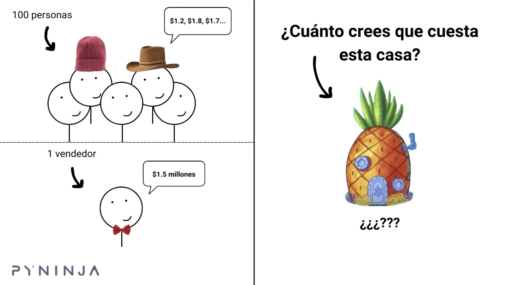
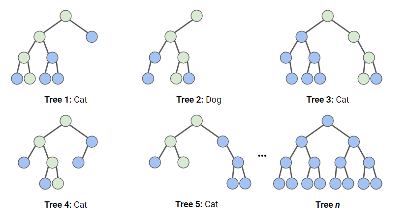
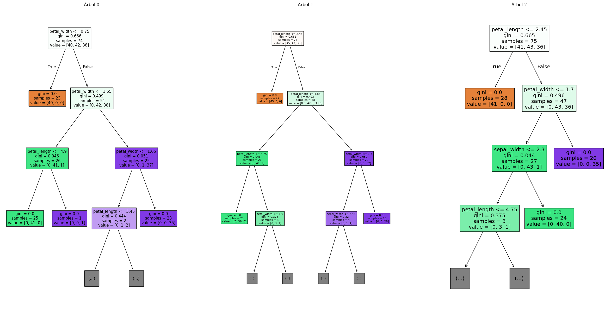

<div class="justify-text">

Los **Random Forest** (Bosques Aleatorios) son una mejora directa de los Árboles de Decisión.
En lugar de entrenar **un solo árbol**, que puede ser inestable y propenso al sobreajuste, Random Forest crea **muchos árboles diferentes** y combina sus predicciones mediante **votación**.

La idea es sencilla pero muy poderosa:

> **Un grupo de modelos simples y diversos suele predecir mejor que un único modelo complejo.**

Este principio se conoce como **sabiduría de la multitud**: cuando muchas “opiniones” independientes se combinan, los errores individuales se compensan y la predicción final es más estable.

:::tip Video recomendado
Si quieres una explicación muy clara e intuitiva de cómo funciona Random Forest, te recomiendo este vídeo:

👉 [Cómo funciona Random Forest (YouTube)](https://www.youtube.com/watch?v=v6VJ2RO66Ag)

En menos de 10 minutos muestra visualmente la idea de los árboles aleatorios, el bagging y la votación del bosque.
:::


---

## ¿Por qué surge Random Forest?

Los Árboles de Decisión tienen muchas ventajas (interpretabilidad, facilidad de uso…), pero también un problema importante:

> **Si los dejas crecer sin límites, tienden a sobreajustar los datos.**

Un único árbol aprende reglas demasiado específicas, se vuelve muy sensible a pequeñas variaciones y generaliza mal. Random Forest aparece como solución:

* crea muchos árboles **distintos**
* cada uno ve una parte diferente de los datos
* cada árbol también usa un subconjunto aleatorio de características
* después, todos los árboles votan la clase final

El resultado:   
✔ menos sobreajuste   
✔ modelo más estable   
✔ mejores predicciones en datos nuevos

Los Random Forest se basan en el concepto de **sabiduría de la multitud**:



Imagina que un Árbol de Decisión es una persona haciendo una predicción. 

Si solo preguntas a una persona, puede equivocarse.   
Pero si preguntas a **100 personas independientes** y haces una votación:

* los errores se compensan
* la predicción final suele ser muy acertada

Random Forest funciona igual:
**cada árbol es un “votante”**, y la predicción final es la decisión mayoritaria.

---

## ¿Por qué usar Random Forest vs Árboles de decisión?

Random Forest supera a un Árbol de Decisión individual en casi todos los aspectos importantes:

* **Más robusto**   
    Pequeños cambios en los datos no afectan tanto.   
    Cada árbol ve una versión diferente del dataset, así que el modelo final es estable.

* **Menos sobreajuste**  
    Promediar muchos árboles reduce la varianza del modelo.   
    Es decir, **memorizan menos y generalizan mejor**.

* **Mejor rendimiento en general**   
    En la mayoría de datasets, Random Forest obtiene:
    * mayor accuracy
    * menor error
    * mejores predicciones en test

* **Combina varios modelos débiles en un modelo fuerte**   
    Cada árbol es simple y puede cometer errores.   
    Pero juntos —gracias al método de *bagging*— forman un modelo más potente y preciso.   

---

## Funcionamiento del modelo

Random Forest no es un modelo misterioso:
es simplemente un conjunto de **muchos Árboles de Decisión**, entrenados de manera inteligente para que sean **diferentes entre sí** y, al combinarlos, formen un modelo final más robusto.

La clave está en dos ideas:
**bagging** y **aleatoriedad**.

---

### Bagging (Bootstrap Aggregation)

El primer ingrediente de Random Forest es el **bagging**, una técnica cuyo objetivo es **reducir la varianza** del modelo.

El proceso es:

1. Se crea un **subconjunto de datos** tomando muestras *con reemplazo* (bootstrap).
2. Con ese subconjunto, se entrena un árbol.
3. Se repite el proceso muchas veces.
4. Cada árbol aprende cosas ligeramente diferentes.
5. Al final, todas las predicciones se combinan (votación).

Esto hace que cada árbol sea imperfecto en una forma distinta, pero **la combinación final sea muy estable**.

---

### Sampling aleatorio de datos

Para cada árbol del bosque:

* El modelo elige de forma aleatoria un subconjunto de observaciones del dataset original.
* Como es sampling *con reemplazo*, algunas observaciones se repiten y otras no aparecen en ese árbol.

Resultado:

> **Cada árbol ve una versión diferente del dataset**, lo que introduce diversidad en el bosque.

---

### Sampling aleatorio de features

Además de elegir datos distintos, Random Forest también elige **features distintas** en cada split de cada árbol.

Por ejemplo:

* Un árbol puede basarse en *petal_length* y *sepal_width*
* Otro puede usar *petal_width* y *sepal_length*
* Otro puede ignorar completamente *sepal_width*

Esta aleatoriedad adicional es fundamental:

✔ evita que todos los árboles aprendan lo mismo  
✔ fuerza a que los árboles busquen caminos alternativos   
✔ mejora la generalización del modelo   

**Cada árbol ve un mundo diferente**, combinando:

* bootstrap (datos diferentes)
* selección aleatoria de columnas (features diferentes)

se consigue que **cada árbol tenga su propia perspectiva** sobre el problema.

> Ningún árbol es perfecto, pero sus errores NO son los mismos.
> Esto permite que la votación final sea mucho más precisa.

---

### Votación del bosque: predicción final

Una vez entrenados todos los árboles:

1. Cada árbol hace su predicción de forma independiente.
2. En clasificación, se utiliza **votación mayoritaria**:
   → la clase más votada por todos los árboles es la predicción final.
3. En regresión, se utiliza la **media** de las predicciones.

Esta combinación final es el corazón del Random Forest:

> **promediar varios modelos débiles produce un modelo fuerte, estable y difícil de sobreajustar.**




---

## Importancia del preprocesamiento en Random Forest

Aunque Random Forest es uno de los modelos **menos exigentes** en preprocesamiento, conviene recordar algunas reglas básicas para evitar errores y garantizar un buen rendimiento.

<div class="texto-sin-justificar">

| Aspecto                                  | ¿Es necesario?                               | Explicación                                                                                                                                                            |
| ---------------------------------------- | -------------------------------------------- | ---------------------------------------------------------------------------------------------------------------------------------------------------------------------- |
| **Escalado (StandardScaler / MinMax)**   | **❌ No**                                     | Igual que los árboles individuales, Random Forest solo compara valores del tipo “¿feature ≤ umbral?”, así que las escalas no afectan al modelo.                        |
| **Codificación de categóricas**          | **✔ Sí**                                     | El modelo solo acepta números. Puedes usar **Label Encoding o One-Hot**, ambas funcionan porque el árbol no interpreta orden.                                          |
| **Tratamiento de outliers**              | **✔ Opcional** (recomendado si son extremos) | Random Forest es robusto a ruido, pero outliers muy extremos pueden influir en splits poco óptimos en algunos árboles. No es tan crítico como en KNN, SVM o regresión. |
| **Eliminación de nulos**                 | **✔ Sí**                                     | Random Forest no admite valores nulos. Deben rellenarse (mean/median/mode) o eliminarse filas.                                                                         |
| **Eliminación de features irrelevantes** | **✔ Recomendado**                            | Un exceso de features irrelevantes hace que los árboles prueben divisiones menos útiles. No es grave, pero puede empeorar la precisión.                                |
| **One-Hot vs Label Encoding**            | **✔ Cualquiera**                             | A diferencia de KNN, la elección no cambia el significado para el modelo. Label Encoding funciona bien incluso sin orden real.                                         |

</div>

---

## Ejemplo básico en Python

Para ver cómo funciona un **Random Forest** en la práctica, puedes ejecutar este ejemplo sencillo utilizando el dataset **Iris**.
Entrenaremos un Random Forest **sin ajustar hiperparámetros**.

👉 **Puedes abrir el cuaderno aquí:**
[Colab: Random Forest con Iris](../../0-datasets/ejemplo_random_forest_iris.ipynb)

👉 **Dataset utilizado:**
[iris.csv](../../0-datasets/iris.csv)

---

## Visualización de los árboles

En un Random Forest se entrenan **decenas o cientos de árboles**, cada uno ligeramente distinto gracias al *bootstrap* y a la selección aleatoria de features.

Por ello:

* **No tiene sentido visualizar todo el bosque** → sería imposible de interpretar.
* **Sí es útil visualizar un par de árboles individuales** para ver cómo cada uno aprende reglas diferentes.

Esto ayuda a entender que:

> **El bosque no depende de un único árbol, sino de la votación de muchos modelos diversos.**

Si quieres, puedes mostrar solo los primeros árboles:

```python
# Importamos las librerías necesarias
import matplotlib.pyplot as plt
from sklearn import tree

# Creamos una figura con 3 subplots (uno por cada árbol)
plt.figure(figsize=(30, 15))

# Recorremos los primeros 3 árboles del Random Forest
for i in range(3):
    # Seleccionamos el subplot en la posición i+1
    plt.subplot(1, 3, i + 1)
    
    # Dibujamos el árbol número i dentro del bosque
    tree.plot_tree(
        rf.estimators_[i],      # Árbol individual dentro de Random Forest
        feature_names=X.columns,  # Nombres de las columnas para legibilidad
        filled=True,              # Colorear nodos según clase predominante
        max_depth=3               # Limitar profundidad para que el árbol no sea gigantesco
    )
    
    # Título para identificar qué árbol estamos viendo
    plt.title(f"Árbol {i}")

# Mostramos todos los gráficos
plt.show()
```




---

## Hiperparámetros principales

Después de ver el funcionamiento básico del Random Forest, es importante entender cómo podemos controlar su comportamiento para evitar sobreajuste, mejorar la estabilidad del modelo y ajustar su rendimiento.

En un Random Forest, los hiperparámetros ya no controlan **un único árbol**, sino **cómo se comportan todos los árboles del bosque**.
Los más importantes son los que permiten regular:

* cuántos árboles se entrenan
* cuán complejos pueden ser esos árboles
* cuánta aleatoriedad añadimos
* cuán homogéneas deben ser las hojas del bosque

---

### `n_estimators` — número de árboles del bosque

Es uno de los hiperparámetros clave del modelo.

Indica **cuántos árboles individuales** va a entrenar el Random Forest.

**Idea intuitiva:**

* Más árboles → modelo más estable
* Menos árboles → modelo más rápido, pero menos robusto
* No existe riesgo real de sobreajuste por poner demasiados árboles

Ejemplo:

* `n_estimators=10` → bosque muy pequeño, poco estable
* `n_estimators=100` → valor típico
* `n_estimators=300` → excelente estabilidad en la mayoría de casos

**Regla práctica:**

> “Pon más árboles si quieres un modelo más estable. El único coste es el tiempo de entrenamiento.”

---

### `max_depth` — profundidad máxima de cada árbol

Este hiperparámetro funciona de manera casi idéntica a como lo viste en Árbol de Decisión.

Controla **cuán profundos** pueden ser los árboles del bosque.

* Árboles muy profundos → riesgo de *overfitting* individual
* Árboles muy poco profundos → bosque demasiado simple (*underfitting*)
* Lo normal es permitir árboles relativamente profundos, pero no infinitos

En Random Forest, incluso con árboles profundos, el modelo **no sobreajusta tanto** gracias a la aleatoriedad del bosque.
Aún así, limitar la profundidad suele mejorar la generalización.

**Regla práctica:**

> “Para datasets pequeños como Iris, profundidades entre 4 y 6 funcionan muy bien.”

---

### `min_samples_leaf` — muestras mínimas en cada hoja

Indica el **número mínimo de observaciones** que debe contener una hoja del árbol.

* Valores muy pequeños (1–2) → árboles muy específicos
* Valores más altos → reglas más estables y menos sensibles al ruido

Es uno de los hiperparámetros más importantes para **suavizar** un Random Forest.

**Regla práctica:**

> “Valores 1–2 funcionan bien para datasets pequeños. Para datasets ruidosos, usa 3–5.”

---

### `max_features` — número de columnas que cada árbol puede usar

Este hiperparámetro es **la clave que diferencia un Bagging normal de un Random Forest**.

Determina cuántas **features** puede usar cada árbol en **cada división del árbol**:

* Valores bajos → árboles más distintos entre sí → más diversidad → **menos sobreajuste**
* Valores altos → árboles más parecidos → **más riesgo de sobreajuste**

Valores típicos:

* `"sqrt"` → usa la raíz cuadrada del número de features
* `"log2"` → usa el logaritmo
* o elegir un número fijo (`1`, `2`, `3`)

Para Iris (4 features), `"sqrt"` equivale a 2 columnas por split → suele ir muy bien.

**Regla práctica:**

> “`max_features="sqrt"` es el valor estándar y suele funcionar de maravilla.”

---

### ¿Cómo saber si hay overfitting o underfitting?

Al igual que en Árbol de Decisión, la forma más sencilla de detectar si un Random Forest está sobreajustando o infraajustando es comparar la **accuracy en train** con la **accuracy en test**.

**OVERFITTING (sobreajuste)**

El modelo aprende demasiado bien el entrenamiento y generaliza peor.

Señales:

* Accuracy **muy alta en train** (a veces 1.00)
* Accuracy **claramente más baja en test**

Ejemplo típico:

| Conjunto | Accuracy |
| -------- | -------- |
| Train    | 1.00     |
| Test     | 0.90     |

Interpretación:
Los árboles del bosque son demasiado complejos. Aunque el Random Forest reduce el sobreajuste respecto a un solo árbol, todavía puede memorizar parte de los datos.

**UNDERFITTING (subajuste)**

El modelo es demasiado simple.

Señales:

* Accuracy **baja en train**
* Accuracy **similarmente baja en test**

Ejemplo:

| Conjunto | Accuracy |
| -------- | -------- |
| Train    | 0.80     |
| Test     | 0.78     |

Interpretación:
El bosque es pequeño (`n_estimators` muy bajo) o los árboles son demasiado poco profundos.

**Buen ajuste**

Lo ideal:

* train y test **parecidos**
* ambos valores **altos**

Ejemplo:

| Conjunto | Accuracy |
| -------- | -------- |
| Train    | 0.97     |
| Test     | 0.95     |

Interpretación:
El modelo es estable, generaliza bien y no memoriza en exceso.
Esto es lo habitual en Random Forest bien configurado.

---

**Código para comprobarlo**

Exactamente lo mismo que estudiamos para los árboles de decisión:

```python
# Accuracy en entrenamiento y en test
print("Accuracy TRAIN:", rf.score(X_train, y_train))
print("Accuracy TEST :", rf.score(X_test, y_test))
```

---

## Ejemplo con ajuste de hiperparámetros

En este segundo ejemplo trabajaremos con el mismo **Google Colab** y el mismo **dataset Iris** utilizados en el ejemplo básico.
El objetivo ahora es observar cómo los hiperparámetros más importantes de un Random Forest (`n_estimators`, `max_depth`, `min_samples_leaf`, `max_features`) influyen en el rendimiento del modelo.

En el Colab encontrarás un apartado específico llamado **“Ajuste de hiperparámetros”**.

---

## Métricas de evaluación

Las métricas que utilizamos para evaluar un Random Forest son **exactamente las mismas** que ya estudiamos en Árbol de Decisión y en KNN:

* **Accuracy**
* **Matriz de confusión**
* **Precision, Recall y F1-score** (classification_report)

---

## Análisis de importancia

Igual que con los Árboles de Decisión, un Random Forest permite obtener la **importancia de cada variable** mediante el atributo:

```python
rf_tuned.feature_importances_
```

La idea y la interpretación son exactamente las mismas que ya estudiamos.

---

## Automatización búsqueda de hiperparámetros (GridSearchCV)

Igual que en el Árbol de Decisión, podemos utilizar **GridSearchCV** para encontrar la mejor combinación de hiperparámetros de un **Random Forest**.
El funcionamiento es el mismo: GridSearchCV prueba todas las combinaciones posibles del diccionario de parámetros y selecciona la que obtiene mejor rendimiento mediante validación cruzada.

La única diferencia es que en Random Forest los hiperparámetros que ajustamos suelen ser otros (como `n_estimators`, `max_depth`, `max_features` o `min_samples_leaf`).

---

### Ejemplo de diccionario de hiperparámetros

Ajustamos solo los hiperparámetros más importantes:

```python
param_grid = {
    "n_estimators": [100, 200, 300],   # nº de árboles
    "max_depth": [3, 4, 5, None],      # profundidad máxima
    "min_samples_leaf": [1, 2, 3],     # hojas mínimas
    "max_features": [1, 2, "sqrt"]     # nº de columnas usadas en cada split
}
```

⚠️ Igual que antes, **no pongas listas enormes**:
cada valor extra multiplica el número de modelos que se entrenan.

---

### Ejecutar GridSearchCV con Random Forest

```python
from sklearn.model_selection import GridSearchCV

# Modelo base
rf = RandomForestClassifier(random_state=42)

# Configuramos GridSearchCV
grid = GridSearchCV(
    estimator=rf,
    param_grid=param_grid,
    cv=5,                  # Validación cruzada 5-fold
    scoring="accuracy",    # Métrica a optimizar
    n_jobs=-1              # Usa todos los núcleos disponibles (opcional)
)

# Entrenamos la búsqueda de hiperparámetros
grid.fit(X_train, y_train)

# Mostramos la mejor combinación encontrada
print("Mejores hiperparámetros:", grid.best_params_)

# Obtenemos directamente el Random Forest óptimo
best_rf = grid.best_estimator_
```

`best_rf` es el modelo óptimo ya entrenado, listo para evaluar en test o para analizar importancias de variables.

---

## Flujo recomendado en un problema de Random Forest

El proceso para resolver un problema con **Random Forest** se basa en los mismos pasos que los Árboles de Decisión, pero con el añadido de ajustar los hiperparámetros que controlan el comportamiento del bosque completo. Random Forest es robusto, maneja bien el ruido y suele generalizar mejor que un único árbol.

<div class="texto-sin-justificar">

| Paso                                                 | ¿Qué se hace?                                                                                                         | ¿Por qué es importante?                                                                                              |
| ---------------------------------------------------- | --------------------------------------------------------------------------------------------------------------------- | -------------------------------------------------------------------------------------------------------------------- |
| **Paso 1. EDA**                                      | Analizar cada variable, distribuciones, relación con la target, detectar variables relevantes.                        | Permite entender el dataset y anticipar qué columnas pueden tener mayor importancia en el bosque.                    |
| **Paso 2. Preprocesamiento**                         | Imputar nulos, codificar categóricas (One-Hot o LabelEncoding), eliminar columnas irrelevantes. No requiere escalado. | Random Forest no acepta nulos y necesita variables numéricas. El exceso de columnas inútiles puede introducir ruido. |
| **Paso 3. Ajuste de hiperparámetros (GridSearchCV)** | Probar valores de `n_estimators`, `max_depth`, `min_samples_leaf`, `max_features`.                                    | Permite equilibrar el modelo: demasiada profundidad → sobreajuste, demasiada simplicidad → bajo rendimiento.         |
| **Paso 4. Entrenamiento del modelo final**           | Entrenar un Random Forest con los **mejores hiperparámetros** encontrados.                                            | Garantiza que usamos el bosque más estable y efectivo para ese dataset.                                              |
| **Paso 5. Análisis overfitting / underfitting**      | Comparar accuracy en **train** y **test**.                                                                            | Si train ≫ test → sobreajuste. Si ambos bajos → underfitting. Random Forest normalmente generaliza muy bien.         |
| **Paso 6. Importancia de las variables**             | Revisar `feature_importances_` y representar sus valores.                                                             | Permite entender qué variables han sido más utilizadas por el bosque para tomar decisiones.                          |
| **Paso 7. Métricas de evaluación**                   | Accuracy y matriz de confusión.                                                     | Permite evaluar el rendimiento final del modelo y ver qué clases confunde.                                           |

</div>

---

## Actividad de seguimiento: Titanic

Realiza un proyecto completo con el dataset **Titanic** siguiendo los pasos vistos en clase.

1. **EDA básico** (ya realizado en entregas anteriores)
2. **Preprocesamiento** (ya realizado en entregas anteriores)
3. **Modelado:**
   * Entrena un **Árbol de Decisión**
   * Entrena un **Random Forest**
   * Busca los mejores parámetros, muestras los árboles generados, etc.
4. **Evaluación:**
   * Accuracy
   * Matriz de confusión
   * Comparación entre ambos modelos

**Entrega:** Notebook (Colab) con todos los pasos y conclusiones.

</div>