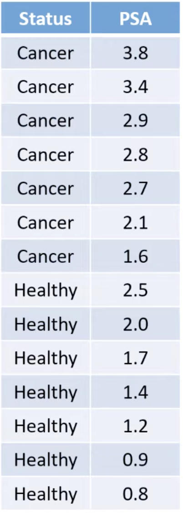
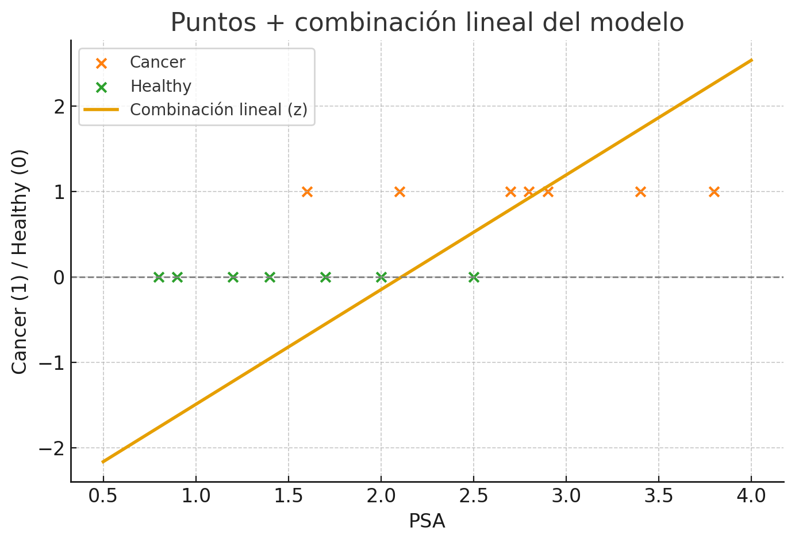
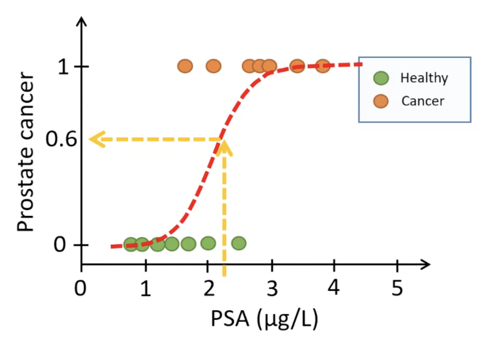
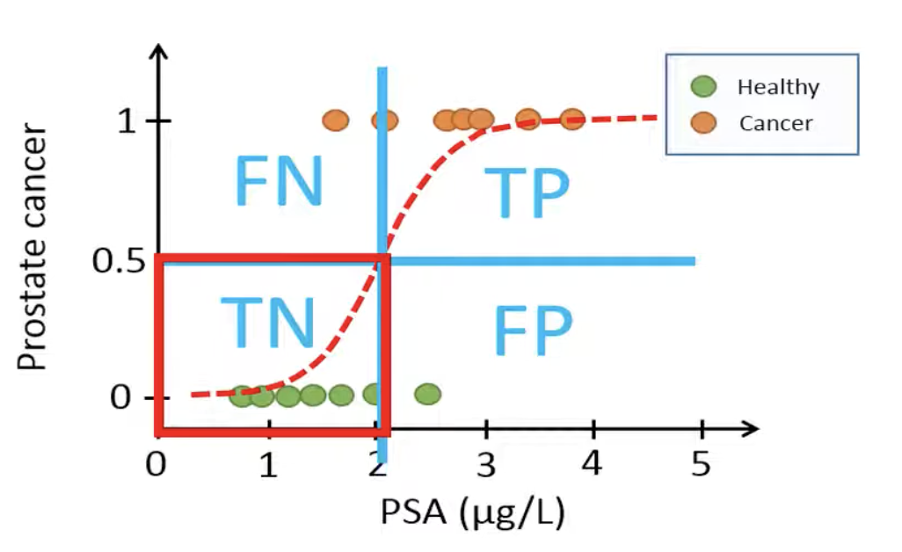
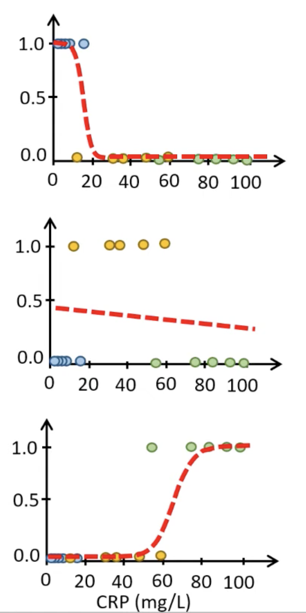
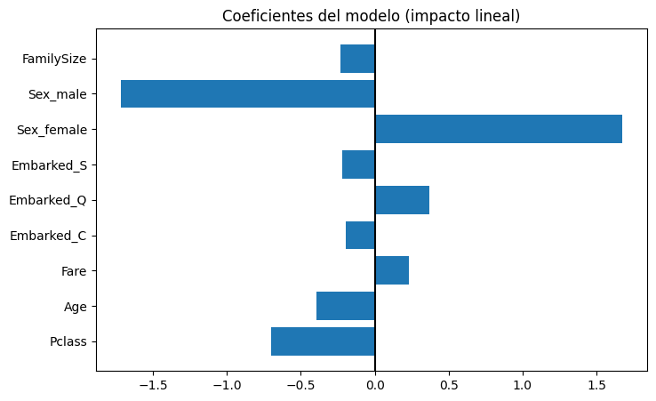
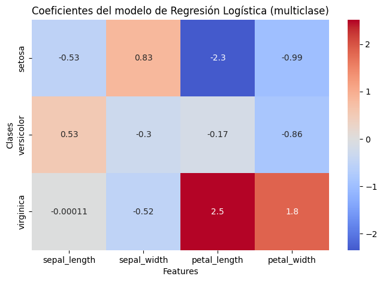

La **Regresión Logística** es uno de los modelos más utilizados en Machine Learning para resolver **problemas de clasificación**.
A pesar de su nombre, **no sirve para predecir valores continuos**, sino **clases** (por ejemplo, *sobrevive / no sobrevive*, *spam / no spam*, *cliente fiel / abandona*…).

Por todo ello, suele ser el **primer modelo de referencia** (“baseline”) en muchos proyectos reales, es decir, el primer modelo sencillo con el que medimos el rendimiento mínimo razonable.

Sirve para decidir si necesitamos modelos más complejos o si una solución simple ya es suficiente.

La idea central es muy sencilla:

> La Regresión Logística **no predice directamente una clase**, sino la **probabilidad** de pertenecer a ella.

Primero calcula una combinación lineal de las variables, y luego aplica una función sigmoide que convierte ese valor en una probabilidad entre 0 y 1.
Finalmente, se decide una clase usando un umbral (normalmente 0.5).


Esta forma de trabajar la convierte en un modelo:

* interpretable (ves qué variables aumentan o disminuyen la probabilidad)
* estable
* fácil de entrenar
* especialmente útil cuando las relaciones son *aproximadamente lineales*

La encontrarás en multitud de aplicaciones reales, como:

* **Titanic** → predecir si una persona sobrevive (0/1)
* **Churn** → si un cliente abandonará la empresa
* **Salud** → si un paciente presenta una enfermedad
* **Finanzas** → si una operación es fraudulenta
* **Marketing** → si un usuario hará clic en un anuncio

En todos estos casos, el objetivo final es el mismo: **predecir una probabilidad y clasificar según ella**.

---

## Regresión Logística Binaria vs. Multiclase

Aunque se estudia casi siempre como un modelo para dos clases, la Regresión Logística tiene **dos variantes**:

✔ **Regresión Logística Binaria**

Se usa cuando solo existen **dos clases posibles**:

* sobrevivir vs. no sobrevivir (Titanic)
* spam vs. no spam
* cliente abandona vs. cliente permanece
* fraudulento vs. no fraudulento

Es la forma más sencilla y la base sobre la que se construye la multiclase.

✔ **Regresión Logística Multiclase (multinomial)**

Es una extensión para cuando hay **más de dos categorías**, por ejemplo:

* Tipo de flor (*setosa*, *versicolor*, *virginica*) en Iris
* Tipo de prenda (*camiseta*, *pantalón*, *abrigo*)
* Nivel de riesgo (*bajo*, *medio*, *alto*)

Funciona de forma similar a la binaria, pero usa la función **softmax** en lugar de la sigmoide para obtener probabilidades para cada clase.

:::info DIFERENCIAS A NIVEL DE USUARIO
Regresión Logística Binaria y Multiclase funcionan igual para el usuario.   
La diferencia está por dentro: la versión binaria usa sigmoide y la multinomial usa softmax para calcular probabilidades.   
En la práctica, solo cambias un parámetro en Scikit-Learn.
:::

---

## Funcionamiento del modelo 

:::tip Vídeo recomendado
Si quieres una explicación muy clara e intuitiva de la Regresión Logística —tanto binaria como multiclase— te recomiendo este vídeo:

👉 https://youtu.be/KbK_Nb9OS70

Hasta el **minuto 7:42** es perfecto para nuestro nivel: explica la idea de probabilidad, la sigmoide y cómo extiende al caso multiclase sin entrar en matemáticas avanzadas.  
A partir de ahí ya entra en detalles que no necesitamos ver en este curso.
:::


### Modelo binario

La Regresión Logística binaria se basa en una idea muy sencilla:

1. Primero combina las variables de forma **lineal**.
2. Después transforma ese resultado en una **probabilidad** usando la función sigmoide.
3. Finalmente decide la clase comparando con un **umbral** (normalmente 0.5).

Este proceso hace que el modelo sea interpretable y muy adecuado para problemas donde la relación entre *features* y *probabilidad* es aproximadamente lineal.

En el ejemplo partimos de este dataset, que representa el valor de PSA en pacientes varones, que permite determinar (junto con muchos más factores), si parece cáncer de próstata.



---

#### Combinación lineal de variables

El modelo empieza calculando una combinación lineal de las variables:

$$
z = w_0 + w_1x_1 + w_2x_2 + \dots + w_nx_n
$$

Donde:

* (x_i) = valores de las features
* (w_i) = coeficientes que el modelo aprende
* (w_0) = intercept (sesgo)

Este valor (z) por sí solo **no es una probabilidad**, ya que puede ser negativo, positivo o muy grande.
Por eso necesitamos una transformación.



---

#### Función sigmoide

Para convertir ese valor lineal en una probabilidad entre 0 y 1 usamos la **función sigmoide**:

$$
\sigma(z) = \frac{1}{1 + e^{-z}}
$$

La sigmoide “aprieta” valores muy grandes o muy pequeños hacia el rango ([0, 1]).

**Interpretación gráfica típica:**

* Si (z) es muy negativo → probabilidad ≈ 0
* Si (z) es 0 → probabilidad = 0.5
* Si (z) es muy positivo → probabilidad ≈ 1

El resultado es:

$$
p = \sigma(z)
$$

Y ahora sí:

> **p es la probabilidad de pertenecer a la clase 1.**


---

#### Probabilidad como salida

La Regresión Logística **no devuelve directamente una clase**, sino una probabilidad:

* Si (p = 0.83) → 83% de probabilidad de ser clase 1
* Si (p = 0.12) → 12% de probabilidad de ser clase 1

Esto se puede obtener con:

```python
model.predict_proba(X)
```

Por ejemplo, supongamos que llega un nuevo registro de PSA con valor 2.3ng/mL y debemos determinar si el paciente es susceptible de tener cáncer o no.



Según la función obtenida, tiene un 60% de probabilidades de padecer cáncer. La clase en la que se clasifica depende del umbral establecido.

---

#### Umbral de decisión

La decisión final se toma comparando la probabilidad con un **umbral**:

$$
\hat{y} =
\begin{cases}
1 & \text{si } p \ge 0.5 \\
0 & \text{si } p < 0.5
\end{cases}
$$

El umbral por defecto es **0.5**, pero se puede modificar.

**¿Por qué cambiarlo?**

* Si quieres **menos falsos negativos** → baja el umbral (p. ej. 0.3).
* Si quieres **menos falsos positivos** → súbelo (p. ej. 0.7).

Esto es muy útil en problemas desequilibrados.



---

#### Interpretación básica de coeficientes

Una de las ventajas clave de la Regresión Logística es que **sus coeficientes son interpretables**.

* Si (w_i > 0):
  aumentar (x_i) **incrementa** la probabilidad de clase 1.
* Si (w_i < 0):
  aumentar (x_i) **reduce** la probabilidad.
* Si (w_i = 0):
  la variable **no influye**.

> Cuanto mayor sea el valor absoluto del coeficiente → más importante es la variable.

**Ejemplos típicos:**

* En Titanic:
  `Sex_female` suele tener un coeficiente **muy positivo** (ser mujer aumenta la probabilidad de sobrevivir).
* `Pclass` suele tener coeficiente **negativo** (clases más bajas → menos probabilidad).
* `Age` suele tener coeficiente **negativo** (más edad → menor probabilidad).

Para verlos en Python:

```python
model.coef_
model.intercept_
```

---

### Modelo multiclase

La Regresión Logística no solo sirve para clasificar entre dos clases (0 y 1).
También puede utilizarse cuando existen **tres o más categorías**, como en el clásico dataset **Iris**:

* *Setosa*
* *Versicolor*
* *Virginica*

En estos casos hablamos de **Regresión Logística Multiclase** o **multinomial**.

Lo más importante es entender que:

> **El modelo funciona igual para el usuario, pero por dentro calcula una probabilidad para cada clase, no solo para una.**

---

#### Generalización al caso multiclase

En la versión binaria, el modelo calcula **una única probabilidad**:
la de pertenecer a la clase 1, usando la sigmoide.

En el caso multiclase:

* El modelo calcula **una probabilidad por cada clase**.
* Estas probabilidades siempre suman **1**.
* La clase predicha es la que tiene **mayor probabilidad**.

Para conseguir esto, se usa una función llamada **softmax**, que es equivalente a la sigmoide pero adaptada a varios valores.

> No necesitamos entrar en su fórmula: basta saber que convierte varios valores en probabilidades que suman 1.


#### Ejemplo

Supongamos que tenemos este dataset:


El modelo aprende **tres combinaciones lineales**, una por clase:

* una para *no infección*
* una para *infección vírica*
* una para *infección bacteriana*

Cada una de ellas pasa por la función softmax para generar probabilidades:

* Probabilidad de no infección
* Probabilidad de infección vírica
* Probabilidad de infección bacteriana



Si llega un paciente con CRP de 25, la salida de softmax será la siguiente:

| Clase      | Probabilidad |
| ---------- | ------------ |
| No infección     | 0.016         |
| Infección vírica | 0.982         |
| Infección bacteriana  | 0.002         |

El modelo clasifica como **infección vírica** (98.2% de probabilidad)

---

## Cuándo usar Regresión Logística

La Regresión Logística es un modelo muy útil, pero no sirve para cualquier tipo de problema.

Es ideal cuando la probabilidad de pertenecer a una clase **aumenta o disminuye de forma más o menos lineal** según las variables.

Ejemplos típicos:

* Cuanto mayor es el PSA → más probabilidad de cáncer.
* Cuanto menor es la edad → más probabilidad de sobrevivir en Titanic.
* Cuanto mayor es la tarifa (`Fare`) → más probabilidad de salvarse.

No necesitamos que la relación sea perfectamente lineal, solo **que no sea radicalmente curva o caótica**.


:::info Exploratory Data Analysis
Recuerda que las relaciones entre las variables y la target las analizábamos en la fase de EDA. En ese primer momento, podremos intuir si la Regresión Logística será correcta para nuestro problema o no.
:::

---

### Criterios para saber si la Regresión Logística “no rinde bien”

#### Criterio 1: comparar con modelos más flexibles

En la práctica, la forma más sencilla y fiable de saber si la Regresión Logística es adecuada es:

> **Entrenar también un modelo más flexible** (Random Forest, KNN, Árbol de Decisión)
> **y comparar resultados.**

Interpretación:

* Si Logistic Regression obtiene **rendimiento similar** → el problema es casi lineal ✔
* Si modelos más flexibles lo superan claramente → el problema NO es lineal ❌

Ejemplo:

| Modelo              | Accuracy test |
| ------------------- | ------------- |
| Logistic Regression | 0.78          |
| Random Forest       | 0.90          |

Interpretación:
**LR no rinde bien → el problema NO es lineal.**

Esta regla es muy utilizada en ciencia de datos real: la LR sirve como **baseline**.

---

#### Criterio 2: Accuracy razonablemente baja en test

```python
from sklearn.metrics import accuracy_score

# Predicciones
y_pred = model.predict(X_test)

# Accuracy en test
test_acc = accuracy_score(y_test, y_pred)

print("Accuracy TEST:", test_acc)
```

No existen valores universales, pero como guía:

* **< 70%** → probablemente el modelo no es adecuado
* **70–80%** → aceptable según el dataset
* **> 80%** → suele ser buen rendimiento para problemas tabulares clásicos

**OJO:** depende del dataset.
En Titanic, por ejemplo, una LR con **75–80%** ya se considera buena.

---

#### Criterio 3: Mucha diferencia entre train y test

```python
# Accuracy en entrenamiento
train_acc = model.score(X_train, y_train)

# Accuracy en test
test_acc = model.score(X_test, y_test)

print("Accuracy TRAIN:", train_acc)
print("Accuracy TEST :", test_acc)
```

Si ves algo como:

| Métrica        | Valor |
| -------------- | ----- |
| Accuracy TRAIN | 0.92  |
| Accuracy TEST  | 0.72  |

→ **mala generalización**.
En LR esto suele ocurrir cuando las relaciones no son lineales y el modelo no consigue ajustar ambas partes.

---

## Importancia del preprocesamiento

Aunque la Regresión Logística es un modelo sencillo y estable, sí requiere ciertos pasos de preprocesamiento para funcionar correctamente.

| Aspecto                                    | ¿Es necesario?        | Explicación                                                                                                                                                                                                                                     |
| ------------------------------------------ | --------------------- | ----------------------------------------------------------------------------------------------------------------------------------------------------------------------------------------------------------------------------------------------- |
| **Escalado (StandardScaler / MinMax)**     | **✔ Obligatorio**     | La Regresión Logística optimiza sus parámetros mediante métodos numéricos (gradiente), y si las variables están en escalas muy diferentes, la optimización se vuelve inestable. Escalar mejora la convergencia y evita que una variable domine. |
| **Codificación de categóricas**            | **✔ Sí**    | La LR no admite texto. Además, al ser lineal, es importante usar **One-Hot** y **LabelEncoder** de forma correcta.                                                 |
| **Tratamiento de outliers**                | **✔ Recomendado**     | Outliers muy grandes pueden empujar la recta de decisión de forma exagerada, afectando los coeficientes y la probabilidad final. No es tan grave como en KNN, pero sí afecta.                                                                   |
| **Eliminar o imputar nulos**               | **✔ Sí**              | La LR no permite valores nulos.                                                                                                                             |
| **Eliminar columnas irrelevantes**         | **✔ Muy recomendado** | En modelos lineales, cada variable tiene un peso directo. Variables inútiles añaden ruido y empeoran la estabilidad del modelo, especialmente cuando hay pocas muestras.                                                                        |


:::warning
La Regresión Logística es uno de los modelos más sensibles al preprocesamiento. Un mal preprocesado suele dar lugar a coeficientes inestables y mala generalización.
:::

---

## Regularización e hiperparámetros principales

La Regresión Logística es un modelo muy sencillo, pero tiene un aspecto clave para que funcione bien:
la **regularización**.
Este mecanismo evita que los coeficientes crezcan demasiado y que el modelo **sobreajuste** los datos de entrenamiento.

En Scikit-Learn, la regularización se controla principalmente mediante los hiperparámetros **`C`**, **`penalty`**, **`solver`** y **`max_iter`**.

A continuación explicamos los más importantes.

---

### ¿Qué es la regularización y por qué se usa?

Cuando el modelo intenta ajustarse demasiado a los datos de entrenamiento (ruido, valores extremos, pequeñas fluctuaciones), sus coeficientes pueden hacerse **muy grandes**.
Esto provoca:

* sobreajuste,
* mala generalización,
* inestabilidad en las predicciones.

La **regularización** añade una “penalización” al tamaño de los coeficientes, obligándolos a mantenerse razonables.

> **Objetivo:** evitar que el modelo memorice y conseguir que generalice mejor.

En la práctica:
**más regularización → coeficientes más pequeños → modelo más estable.**

---

### Parámetro `C`

`C` es el hiperparámetro más importante de la Regresión Logística.

* **C grande** → **poca** regularización → el modelo se ajusta mucho → riesgo de *overfitting*
* **C pequeño** → **mucha** regularización → el modelo se suaviza → riesgo de *underfitting*

En Scikit-Learn:

```python
LogisticRegression(C=1.0)
```

Ten en cuenta que **no existe un “C correcto” universal**, pero sí hay rangos recomendados y comportamientos típicos según el dataset.

| Tipo de dataset                     | Valores típicos de `C` | Explicación                                               |
| ----------------------------------- | ---------------------- | --------------------------------------------------------- |
| Pequeño, ruidoso, con outliers      | **0.1 – 1**            | Más regularización evita que los coeficientes se disparen |
| Limpio, tabular, relaciones claras  | **1 – 10**             | C estándar para buena generalización                      |
| Muy complejo o con muchas variables | **≥10**                | Solo si buscas ajustar más (riesgo de overfitting)        |
| Datasets enormes                    | **0.1 – 1**            | Más regularización ayuda a la estabilidad                 |

En la práctica:

> **Empieza siempre con `C = 1`.   
> Si rinde mal, prueba `C = 0.1` o `C = 10`.**

:::tip Detectar overfitting o underfitting
Puedes analizar si la Regresión Logística está sobreajustando o subajustando comparando la **accuracy en entrenamiento** y en **test**:

```python
print("Accuracy TRAIN:", model.score(X_train, y_train))
print("Accuracy TEST :", model.score(X_test, y_test))
```

**Interpretación rápida:**

* TRAIN ≫ TEST → **overfitting** (el modelo memoriza, no generaliza).
* TRAIN ≈ TEST pero ambas bajas → **underfitting** (el modelo es demasiado simple).
* TRAIN ≈ TEST y ambas altas → **buen ajuste**.

:::

---

### Parámetro `max_iter`

En algunos datasets, especialmente cuando:

* las variables no están bien escaladas, o
* el modelo necesita más pasos de optimización,

puede aparecer un aviso:

```
ConvergenceWarning: Increase max_iter
```

Solo significa que el algoritmo necesita más iteraciones.

Basta con subirlo:

```python
LogisticRegression(max_iter=500)
```

---

## Métricas de evaluación

Las métricas que utilizamos para evaluar una **Regresión Logística** son **exactamente las mismas** que ya estudiamos en los otros problemas de clasificación:

* **Accuracy**
* **Matriz de confusión**
* **Precision, Recall y F1-score** (`classification_report`)

---

## Atributos útiles

La Regresión Logística dispone de **tres elementos muy útiles** para entender cómo está tomando decisiones:

1. **Predicción de clases (`predict`)**
2. **Predicción de probabilidades (`predict_proba`)**
3. **Coeficientes del modelo (`coef_` e `intercept_`)**

Estos atributos permiten interpretar mejor el modelo y tomar decisiones basadas en probabilidades, algo especialmente importante en problemas clínicos, financieros o desbalanceados.

---

### `predict()` — Predice la clase final

Devuelve la **clase asignada** (0 o 1) usando el umbral por defecto 0.5.

```python
# Predecimos la CLASE final (0 o 1) para los registros del conjunto de test
# Esta predicción usa el umbral por defecto de 0.5.
y_pred = model.predict(X_test)

# Mostramos las primeras 5 predicciones para ver el formato del resultado
print(y_pred[:5])
```

Interpretación:

* El modelo asigna 1 si la probabilidad ≥ 0.5.
* Asigna 0 si la probabilidad < 0.5.

Es la predicción “directa”, pero **no es la más informativa**.

---

### `predict_proba()` — Devuelve probabilidades

Este es el atributo **más importante** de la Regresión Logística.

```python
probs = model.predict_proba(X_test)
print(probs[:5]) # Mostramos solo la probabilidad de los 5 primeros
```

Salida típica:

```
[[0.32, 0.68],
 [0.71, 0.29],
 ...]
```

Interpretación:

* La primera columna es la probabilidad de **clase 0**.
* La segunda columna es la probabilidad de **clase 1**.

Esto permite cambiar el **umbral** manualmente y evitar errores en problemas desbalanceados.

---

### `coef_` — Importancia (lineal) de cada feature

`coef_` contiene los coeficientes del modelo.
Es equivalente a una “importancia lineal”.

```python
print(model.coef_)
```

Interpretación (muy simple):

* `coef_` **positivo** → aumenta la probabilidad de clase 1.
* `coef_` **negativo** → reduce la probabilidad de clase 1.
* valor cercano a 0 → poca influencia.

Ejemplo típico (Titanic):

* `Sex_female` → coeficiente **positivo** (ser mujer aumenta supervivencia)
* `Pclass` → coeficiente **negativo** (clase baja reduce supervivencia)

Esto ayuda a entender **cómo** está aprendiendo el modelo.

Puedes representarlo gráficamente con el siguiente código para **regresión logística binaria**:

```python
import matplotlib.pyplot as plt
import numpy as np

coef = model.coef_[0]
features = X_train.columns

plt.figure(figsize=(8,5))
plt.barh(features, coef)
plt.axvline(0, color='black')
plt.title("Coeficientes del modelo (impacto lineal)")
plt.show()
```

Interpretación sencilla:
* barras > 0 → aumenta la probabilidad de clase 1
* barras < 0 → reduce la probabilidad de clase 1
* barras pequeñas → poca influencia sobre la probabilidad de clase 1



O con el siguiente código para **regresión logística multiclase**:

```python
# Cada fila de coef_ corresponde a una clase (en el mismo orden que best_model.classes_)
# Cada columna corresponde a una feature
coef_df = pd.DataFrame(
    best_model.coef_,
    index=best_model.classes_,   # nombres de las clases
    columns=X_train.columns      # nombres de las variables
)

plt.figure(figsize=(8,5))
sns.heatmap(
    coef_df,
    annot=True,          # mostrar valores numéricos
    cmap="coolwarm",     # azul = negativo, rojo = positivo
    center=0             # que los colores se centren en 0, ideal para interpretar coeficientes
)

plt.title("Coeficientes del modelo de Regresión Logística (multiclase)")
plt.xlabel("Features")
plt.ylabel("Clases")
plt.show()
```

Interpretación sencilla:
* Filas → cada especie (setosa, versicolor, virginica)
* Columnas → cada una de las 4 features
* Color rojo → coeficiente positivo → aumenta probabilidad de esa clase
* Color azul → coeficiente negativo → reduce probabilidad de esa clase
Más intenso = mayor impacto



---

## Ajuste de hiperparámetros (GridSearchCV)

En Regresión Logística, el hiperparámetro más importante es **`C`**, que controla la regularización del modelo.
Como no sabemos de antemano qué valor funcionará mejor, podemos usar **GridSearchCV** para probar varios y seleccionar automáticamente el que obtiene mejor rendimiento.

---

### Diccionario recomendado

Usamos una pequeña rejilla de valores típicos para `C` y un valor cómodo para `max_iter` (por si el modelo necesita más iteraciones para ajustarse):

```python
param_grid = {
    "C": [0.01, 0.1, 1, 10],
    "max_iter": [300]   # suficiente para asegurar convergencia
}
```

* Valores **pequeños** (0.01, 0.1) → más regularización → modelo más suave
* Valor **medio** (1) → equilibrio (suele funcionar muy bien)
* Valor **grande** (10) → menos regularización → modelo más flexible

GridSearchCV probará todos estos valores y elegirá el que obtenga **mejor accuracy**.

---

### Ejecutar GridSearchCV

```python
from sklearn.model_selection import GridSearchCV
from sklearn.linear_model import LogisticRegression

# Modelo base
log_reg = LogisticRegression()

# Configuración del GridSearch
grid = GridSearchCV(
    estimator=log_reg,
    param_grid=param_grid,
    cv=5,                # validación cruzada 5-fold
    scoring="accuracy"   # métrica a optimizar
)

# Entrenar la búsqueda
grid.fit(X_train, y_train)

# Mostrar los mejores hiperparámetros
print("Mejores parámetros:", grid.best_params_)
```

---

### Obtención del mejor modelo

Una vez finalizada la búsqueda, puedes obtener directamente el modelo óptimo ya entrenado:

```python
best_model = grid.best_estimator_
```

`best_model` es una Regresión Logística con los mejores valores de `C` y `max_iter`, lista para usar.

---

## Flujo recomendado en un problema de Regresión Logística

| Paso                                                 | ¿Qué se hace?                                                                         | ¿Por qué es importante?                                                                           |
| ---------------------------------------------------- | ------------------------------------------------------------------------------------- | ------------------------------------------------------------------------------------------------- |
| **Paso 1. EDA**                                           | Analizar cada variable, revisar distribuciones, relación con la target.               | Detecta patrones lineales, outliers, columnas inútiles, nulos… y permite estimar si LR puede funcionar. |
| **Paso 2. Preprocesamiento**                              | Imputación de nulos, escalado, One-Hot, eliminación de variables irrelevantes...        | La LR necesita datos limpios y escalados para ser estable y generalizar bien.                     |
| **Paso 3. Entrenamiento (modelo base o GridSearch)**      | Entrenar la LR. | Permite obtener el modelo que mejor se ajusta al dataset.                                         |
| **Paso 4. Análisis de overfitting/underfitting**          | Comparar accuracy en train y test.                                                    | Permite saber si el modelo está memorizando o si es demasiado simple. Si hemos usado GridSearch deberíamos tener un modelo equilibrado.                             |
| **Paso 5. Atributos útiles**                              | Revisar `predict_proba`, `coef_` y la interpretación de los signos.                   | Ayuda a entender cómo está tomando decisiones el modelo.                                          |
| **Paso 6. Métricas de evaluación**                        | Accuracy, matriz de confusión.                                                        | Mide el rendimiento real del modelo.                                                              |
| **Paso 7. Comparación con un modelo baseline** | Comparar con Árbol o KNN simples.                                                     | Útil para ver si el problema es lineal o si LR está limitada.                                     |

---

## Ejemplo Regresión Lineal binaria

Para ver cómo funciona un **Linear Regression binario** en la práctica, puedes ejecutar este ejemplo utilizando el dataset **Titanic sucio**.

👉 **Puedes abrir el cuaderno aquí:**
[Colab: Linear Regression con Titanic](../../0-datasets/4_LR_Titanic.ipynb)

👉 **Dataset utilizado:**
[titanic_sucio.csv](../../0-datasets/titanic_sucio.csv)

---

## Ejemplo Regresión Lineal multiclase

Para ver cómo funciona un **Linear Regression multiclase** en la práctica, puedes ejecutar este ejemplo utilizando el dataset **iris**.

👉 **Puedes abrir el cuaderno aquí:**
[Colab: Linear Regression con iris](../../0-datasets/4_1_LR_iris.ipynb)

👉 **Dataset utilizado:**
[iris.csv](../../0-datasets/iris.csv)