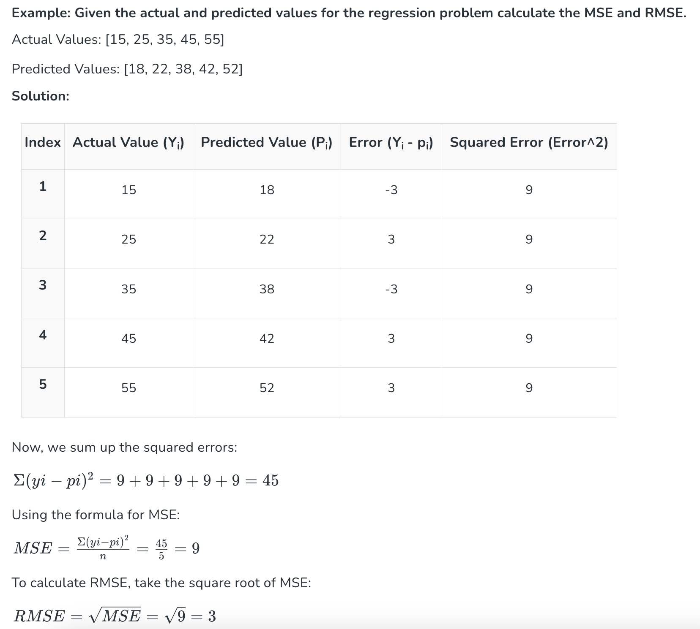

Un **problema de regresión** es un tipo de problema de **aprendizaje supervisado** en el que el objetivo es **predecir un valor numérico continuo**.

En estos problemas:
- El dataset contiene **features** (variables de entrada).
- Existe una variable objetivo (**target**) **numérica**.
- El modelo aprende una relación entre las features y el target.

## Ejemplos de problemas de regresión
- Predecir el **precio de una vivienda**
- Estimar la **temperatura** de mañana
- Calcular el **consumo eléctrico**
- Predecir la **nota final** de un estudiante

---

## Diferencias entre regresión y clasificación

Aunque ambos son problemas de aprendizaje supervisado, existen diferencias clave:

| Característica | Regresión | Clasificación |
|----------------|----------|---------------|
| Tipo de salida | Numérica continua | Categoría o clase |
| Ejemplo de target | 1250.75 | "spam", "no spam" |
| Métricas comunes | MSE, MAE, R² | Accuracy, Precision, Recall |
| Visualización | Rectas, curvas | Regiones de decisión |

👉 La **principal diferencia** está en el **tipo de variable objetivo**.

---

## Modelos de regresión

En regresión, el objetivo es predecir un **valor numérico continuo**.
Algunos modelos lo hacen ajustando una **función global** (como una recta o un plano),
mientras que otros realizan predicciones locales basadas en los datos más cercanos,
como ocurre en k-NN.


| Modelo | Tipo | Lineal | Paramétrico | Interpretabilidad |
|------|------|--------|-------------|------------------|
| Regresión Lineal | Base | Sí | Sí | Alta |
| Regresión Polinómica | Extensión | No | Sí | Media |
| k-NN Regresión | Basado en instancias | No | No | Baja |
| Árbol de Decisión | Basado en reglas | No | No | Media |
| Random Forest | Ensemble | No | No | Baja |
| Ridge | Lineal regularizado | Sí | Sí | Media |
| Lasso | Lineal regularizado | Sí | Sí | Media |

:::info ¿Qué significan estas características?
En la tabla se utilizan los siguientes conceptos:

- **Lineal**: indica si el modelo asume una relación lineal entre las variables de entrada y la variable objetivo.  
  Un modelo lineal puede representarse mediante una combinación lineal de las features.

- **Paramétrico**: indica si el modelo aprende un número fijo de parámetros (como coeficientes).  
  Los modelos paramétricos asumen una forma concreta del modelo y no dependen directamente del número de datos.

- **Interpretabilidad**: hace referencia a lo fácil que es entender cómo el modelo realiza sus predicciones.  
  Modelos simples y lineales suelen ser más interpretables, mientras que modelos más complejos suelen ofrecer mayor rendimiento pero menor explicación.
:::


Una vez ajustado el modelo, necesitamos medir qué tan bien se adapta a los datos.
Para ello se utilizan distintas métricas de evaluación.


---

## Métricas de evaluación en regresión

Para evaluar modelos de regresión se utilizan métricas que miden **el error entre el valor real y el valor predicho**.

### Mean Squared Error (MSE)

El **Mean Squared Error (MSE)** es una de las métricas más utilizadas en problemas de regresión. Mide el **promedio del cuadrado de la diferencia entre los valores reales y los valores predichos por el modelo**.

En otras palabras, cuantifica **cuánto se equivoca el modelo al predecir**, dando **más peso a los errores grandes**.

Si tenemos un conjunto de $ n $ observaciones:

* $ y_i $: valor real
* $ \hat{y}_i $: valor predicho por el modelo

El MSE se define como:

$$
\text{MSE} = \frac{1}{n} \sum_{i=1}^{n} (y_i - \hat{y}_i)^2
$$

:::tip
Cuanto **menor** sea el MSE, **mejor** es el modelo,  
porque indica que, en promedio, las predicciones del modelo están más
cerca de los valores reales y que los errores grandes son menos frecuentes.
:::

Ejemplo de cálculo del MSE con un dataset de prueba:




Si el modelo comete errores grandes en pocas observaciones, el MSE **aumenta mucho**.

---

#### Relación con el entrenamiento del modelo

En muchos modelos de regresión, el entrenamiento del modelo consiste en
encontrar los **parámetros internos** (por ejemplo, los **coeficientes**) que
minimizan una **función de coste**, siendo el MSE una de las más utilizadas.

En este contexto, el MSE:
- Se utiliza como función de coste durante el entrenamiento
- Guía el ajuste de los parámetros del modelo

Además, el MSE también puede utilizarse como métrica de evaluación en
procesos de selección de hiperparámetros, como GridSearch, donde se emplea
para comparar distintos modelos entrenados.

:::info ¿Qué es la función de coste?
La **función de coste** es una función matemática que mide el **error del modelo**, comparando los valores reales con los valores predichos.

Durante el entrenamiento, el objetivo del algoritmo es **minimizar la función de coste**, ajustando los parámetros del modelo.  
En problemas de regresión, una de las funciones de coste más utilizadas es el **Mean Squared Error (MSE)**.
:::

---

### Mean Absolute Error (MAE)

El **Mean Absolute Error (MAE)** mide el **promedio del valor absoluto de la diferencia entre los valores reales y los valores predichos por el modelo**.

A diferencia del MSE, el MAE **no eleva el error al cuadrado**, por lo que **todos los errores contribuyen de forma proporcional** al resultado final.

Si tenemos un conjunto de $ n $ observaciones:

* $ y_i $: valor real
* $ \hat{y}_i $: valor predicho por el modelo

El MAE se define como:

$$
\text{MAE} = \frac{1}{n} \sum_{i=1}^{n} \lvert y_i - \hat{y}_i \rvert
$$

:::tip
Cuanto **menor** sea el MAE, **mejor** es el modelo, porque indica que, de media, el error de las predicciones es menor y el modelo se equivoca menos en las mismas unidades que la variable objetivo.
:::

El MAE indica, de media, **cuántas unidades se equivoca el modelo en sus predicciones**.

Por ejemplo:

* Un MAE de **5** en un problema de predicción de precios significa que,
  de media, el modelo se equivoca **5 unidades monetarias**.

Esto hace que el MAE sea una métrica **muy fácil de interpretar**, ya que se
expresa en las **mismas unidades que la variable objetivo**.

---

### Coeficiente de determinación (R²)

El **coeficiente de determinación (R²)** es una métrica utilizada en regresión que indica **qué proporción de la variabilidad de la variable objetivo es explicada por el modelo**.

A diferencia del MSE o el MAE, el R² **no mide el error directamente**, sino **la calidad del ajuste global del modelo**.

El R² compara el modelo entrenado con un modelo muy simple que **siempre predice la media del target**.

* Si el modelo explica bien los datos, el R² será alto.
* Si el modelo no mejora esa predicción básica, el R² será bajo o incluso negativo.

Los valores posibles del R² son:

* **R² = 1**
  El modelo explica el 100 % de la variabilidad del target (ajuste perfecto).

* **R² = 0**
  El modelo no mejora respecto a predecir siempre la media del target.

* **R² < 0**
  El modelo es peor que predecir la media, lo que indica un ajuste muy deficiente.

Por ejemplo:

* Un **R² = 0.80** significa que el modelo explica el **80 % de la variabilidad**
  de la variable objetivo.
* El **20 % restante** se debe a factores no capturados por el modelo.


:::info ¿Qué es el concepto de variabilidad?

La **variabilidad** de una variable es **cuánto cambian sus valores** dentro del dataset.


Imagina dos datasets con la misma media:

* Dataset A

    ```text
    10, 10, 10, 10, 10
    ```

    * Media = 10
    * Variabilidad = **muy baja** (todos los valores son iguales)

* Dataset B

    ```text
    2, 8, 10, 15, 25
    ```

    * Media ≈ 12
    * Variabilidad = **alta** (los valores están muy dispersos)

👉 Ambos tienen media similar, pero **no se comportan igual**.

En regresión, la variabilidad del target indica:

* Cuánto **varían los valores reales**
* Qué tan difícil es el problema
* Cuánto margen tiene el modelo para “explicar” los datos

Si el target casi no cambia, **no hay mucho que explicar**.
Si cambia mucho, el modelo debe capturar **patrones más complejos**.

El R² responde a esta pregunta:

> ¿Cuánta de esa variabilidad total consigue explicar el modelo?

* **R² = 0**
  El modelo no explica nada más que la media.

* **R² = 0.7**
  El modelo explica el **70 % de la variabilidad** del target.

* **R² = 1**
  El modelo explica toda la variabilidad.


Piensa en las notas de una clase:

* Si todos sacan un 7 → poca variabilidad
* Si hay notas entre 2 y 10 → mucha variabilidad

Un buen modelo sería aquel que **explica por qué unos sacan más y otros menos**.
:::

---

### Comparación entre MSE, MAE y R²

| Métrica | Qué mide | Penalización de errores grandes | Sensible a outliers | Interpretabilidad | Uso habitual |
|--------|---------|----------------------------------|---------------------|------------------|--------------|
| **MSE** | Error medio al cuadrado | Alta | Alta | Media | Función de coste y entrenamiento |
| **MAE** | Error medio absoluto | Baja | Media | Alta | Evaluación e interpretación |
| **R²** | Variabilidad explicada | No aplica | Baja | Alta | Comparación de modelos |


---

### Interpretación práctica de MAE y MSE

A diferencia de métricas como la accuracy en clasificación, en regresión **no existen valores absolutos de MAE o MSE que se consideren “buenos” o “malos” de forma universal**.  
Su interpretación depende de la **escala y el rango de la variable objetivo**.

---

#### MAE en relación con el rango del target

Una forma habitual y práctica de interpretar el **MAE** es compararlo con el **rango de valores de la variable objetivo**.

| MAE respecto al rango del target | Interpretación |
|--------------------------------|----------------|
| < 5 % | Muy bueno |
| 5–10 % | Bueno |
| 10–20 % | Aceptable |
| > 20 % | Malo |

Por ejemplo, en el dataset **California Housing**:

- Rango aproximado del target: **0 – 5**
- MAE ≈ **0.53**

Esto supone un error medio de alrededor del **10 % del rango**, lo que se considera un resultado **aceptable o razonable** para un modelo baseline como la Regresión Lineal.

Este tipo de comparación permite contextualizar el error y evitar interpretaciones incorrectas basadas únicamente en el valor numérico del MAE.

---

#### Cómo interpretar el MSE correctamente

El **Mean Squared Error (MSE)** penaliza de forma más severa los errores grandes, ya que eleva al cuadrado las diferencias entre valores reales y predichos.  
Por este motivo, **no es una métrica intuitiva en términos de unidades**, pero resulta muy útil para analizar el comportamiento del modelo.

En la práctica, el MSE se utiliza sobre todo para:

- comparar distintos modelos entre sí
- detectar la presencia de errores grandes u outliers

Una interpretación práctica consiste en compararlo con el MAE:

- **MSE ≫ MAE** → existen errores grandes frecuentes
- **MSE ≈ MAE** → los errores son moderados y no hay muchos outliers extremos

En el caso de California Housing:

- MAE ≈ **0.53**
- MSE ≈ **0.56**

Esto indica que no hay una explosión de errores muy grandes, aunque sí existen algunos casos problemáticos que afectan al rendimiento global del modelo.

---

<!--

## Detección de overfitting y underfitting

Una forma práctica y habitual de detectar **overfitting** o **underfitting** en modelos de regresión consiste en **comparar las métricas de evaluación en el conjunto de entrenamiento y en el conjunto de test**.

Para ello, se calculan las predicciones y las métricas en ambos conjuntos.

---

### Cálculo de métricas en train y test

```python
from sklearn.metrics import mean_absolute_error, r2_score

# Predicciones
y_train_pred = model.predict(X_train)
y_test_pred = model.predict(X_test)

# Métricas
mae_train = mean_absolute_error(y_train, y_train_pred)
mae_test = mean_absolute_error(y_test, y_test_pred)

r2_train = r2_score(y_train, y_train_pred)
r2_test = r2_score(y_test, y_test_pred)

print(f"MAE TRAIN: {mae_train:.3f}")
print(f"MAE TEST : {mae_test:.3f}")
print(f"R² TRAIN : {r2_train:.3f}")
print(f"R² TEST  : {r2_test:.3f}")
```

Este código permite evaluar **cómo cambia el rendimiento del modelo** al pasar de datos vistos (train) a datos no vistos (test).

---

### Interpretación de métricas (train vs test)

La comparación de las métricas obtenidas en **entrenamiento** y **test** permite diagnosticar si un modelo presenta **overfitting**, **underfitting** o un **buen ajuste**.

| Situación        | Qué se observa en las métricas                                                               | Ejemplo típico                                                           | Interpretación                                                                        |
| ---------------- | -------------------------------------------------------------------------------------------- | ------------------------------------------------------------------------ | ------------------------------------------------------------------------------------- |
| **Overfitting**  | MAE muy bajo en train y claramente mayor en test. R² alto en train y mucho más bajo en test. | MAE TRAIN = 0.20 - MAE TEST = 0.55 - R² TRAIN = 0.92 - R² TEST = 0.58 | El modelo se ajusta demasiado a los datos de entrenamiento y no generaliza bien.      |
| **Underfitting** | MAE similar en train y test, pero ambos altos. R² bajo en ambos conjuntos.                   | MAE TRAIN = 0.60 - MAE TEST = 0.62 - R² TRAIN = 0.45 - R² TEST = 0.43 | El modelo es demasiado simple y no captura la relación real entre variables y target. |
| **Buen ajuste**  | MAE similar y bajo en train y test. R² similar y razonablemente alto en ambos.               | MAE TRAIN = 0.48 - MAE TEST = 0.50 - R² TRAIN = 0.62 - R² TEST = 0.60 | El modelo aprende patrones útiles y generaliza correctamente.                         |

---

### Conclusión práctica

Comparar métricas entre entrenamiento y test es una forma sencilla y efectiva de diagnosticar el comportamiento de un modelo de regresión:

* **Gran diferencia train–test** → overfitting
* **Mal rendimiento en ambos conjuntos** → underfitting
* **Rendimiento similar y razonable** → buen ajuste

Este análisis es fundamental antes de probar modelos más complejos o introducir regularización.

---

-->

## Análisis gráfico del rendimiento en regresión

Además de las métricas numéricas (MAE, MSE y R²), es habitual analizar el comportamiento de un modelo de regresión mediante **gráficos**, que permiten entender **dónde y cómo se equivoca el modelo**.

Estas visualizaciones no sustituyen a las métricas, sino que las **complementan**, ofreciendo una interpretación más intuitiva del rendimiento del modelo.

---

### Valores reales vs valores predichos

En este gráfico, cada punto representa una observación del conjunto de datos:

- El eje horizontal muestra el **valor real** de la variable objetivo.
- El eje vertical muestra el **valor predicho** por el modelo.

La línea diagonal representa la **predicción perfecta**, es decir, los casos en los que el valor predicho coincide exactamente con el valor real.


**Interpretación:**

- Cuanto más cerca estén los puntos de la línea diagonal, **menor es el error de predicción**.
- Si los puntos siguen una tendencia ascendente, el modelo captura la relación general entre las variables y la target.
- Una gran dispersión alrededor de la línea indica que el modelo **no explica completamente la variabilidad** de los datos.

Este gráfico está directamente relacionado con el **coeficiente de determinación (R²)**:
- Un R² alto implica puntos más próximos a la diagonal.
- Un R² bajo implica mayor dispersión y un ajuste más pobre.

El objetivo de un buen modelo de regresión es conseguir que los puntos estén **lo más próximos posible a la línea diagonal**.

---

### Gráfico de residuos vs predicción

El residuo se define como la diferencia entre el valor real y el valor predicho:

$$
\text{residuo} = y - \hat{y}
$$

En este gráfico:

- El eje horizontal representa el **valor predicho**.
- El eje vertical representa el **residuo**.
- La línea horizontal en cero indica **error nulo**.


**Interpretación:**

- En un modelo adecuado, los residuos deberían distribuirse de forma **aleatoria** alrededor de cero, sin patrones claros.
- La presencia de patrones (pendientes, formas de abanico, agrupaciones) indica que el modelo **no captura correctamente la relación real** entre las variables.
- Residuos grandes implican errores elevados, que influyen especialmente en métricas como el **MSE**.

Este gráfico permite detectar de forma visual:
- relaciones no lineales
- errores sistemáticos
- limitaciones del modelo utilizado

---

### Relación entre métricas y gráficos

Las métricas numéricas resumen el rendimiento global del modelo, mientras que los gráficos permiten analizar **la distribución y el comportamiento de los errores**.

- **MAE y MSE** cuantifican cuánto se equivoca el modelo.
- **R²** indica cuánta variabilidad explica el modelo.
- Los gráficos muestran **dónde** se producen esos errores y **cómo** se distribuyen.

Por este motivo, el análisis gráfico es una herramienta fundamental para evaluar modelos de regresión, independientemente del algoritmo utilizado.
