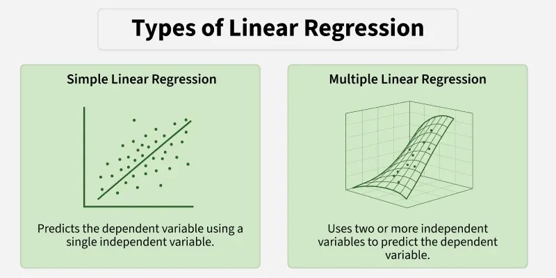
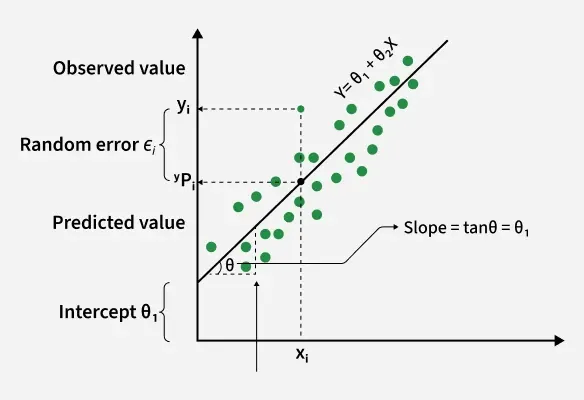
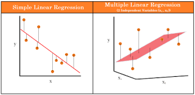
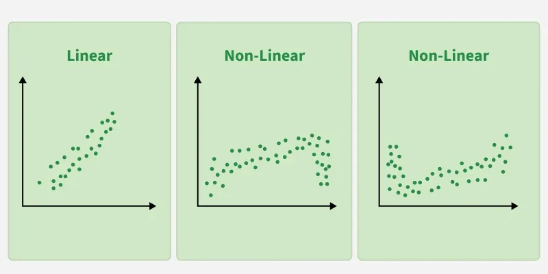

La **Regresión Lineal** es uno de los modelos más simples y fundamentales de Machine Learning. 

Por su sencillez y estabilidad, la Regresión Lineal suele utilizarse como **modelo baseline** en problemas de regresión, es decir, el **primer modelo** que entrenamos para tener una referencia mínima de rendimiento antes de probar modelos más complejos.

---

## Regresión Lineal Simple vs. Múltiple

La Regresión Lineal puede presentarse en dos formas principales, según el número de variables explicativas.

### Regresión Lineal Simple

La **Regresión Lineal Simple** se utiliza cuando existe **una única variable independiente** (*feature*) que explica la variable objetivo.

Ejemplo clásico:

* horas de estudio → nota obtenida
* metros cuadrados → precio de una vivienda
* antigüedad → salario

El modelo aprende una **recta** que relaciona la variable de entrada con la salida.

Conceptualmente:

> “A medida que aumenta X, ¿cómo cambia Y?”

:::info
Aunque en la práctica real **la regresión lineal simple rara vez se utiliza como modelo final**, es fundamental estudiarla por varias razones:

* Es la **base conceptual** de la regresión lineal múltiple (es el mismo modelo con más variables).
* Permite **visualizar** fácilmente la relación entre una variable y la target.
* Se utiliza con frecuencia en **EDA** para analizar relaciones individuales y detectar tendencias u outliers.
* Facilita la **interpretación de los coeficientes**, que luego se extiende al caso multivariable.

Por ello, aunque los modelos reales suelen ser **multivariables**, la regresión lineal simple es clave para **entender, interpretar y construir** modelos de regresión más complejos.
:::

---

### Regresión Lineal Múltiple

La **Regresión Lineal Múltiple** es una extensión natural del modelo simple.
Se utiliza cuando la variable objetivo depende de **varias variables explicativas**.

Ejemplos reales:

* Precio vivienda = m² + nº habitaciones + zona + antigüedad
* Salario = experiencia + estudios + edad
* Ventas = publicidad + estacionalidad + precio

Aunque el modelo es más complejo internamente, **para el usuario funciona igual**:
solo cambia el número de variables que entran al modelo.

---

## Funcionamiento del modelo

La Regresión Lineal se basa en una idea muy sencilla:
**combinar las variables de forma lineal para predecir un valor numérico**.

El modelo aprende una función de la forma:

$$
\hat{y} = w_0 + w_1x_1 + w_2x_2 + \dots + w_nx_n
$$

Donde:

* $ x_i $ → valores de las variables de entrada (features)
* $ w_i $ → coeficientes aprendidos por el modelo
* $ w_0 $ → intercept o término independiente
* $ \hat{y} $ → valor predicho

El objetivo del entrenamiento es encontrar los valores de $ w_i $ que **minimicen el error** entre los valores reales y los predichos.

---

### Interpretación geométrica

Según el número de variables:

* 1 variable → **recta**
* 2 variables → **plano**
* más variables → **hiperplano**

No es necesario profundizar en la geometría:
lo importante es entender que el modelo busca la **mejor superficie lineal** que se ajuste a los datos.

---

### Interpretación de coeficientes

Una de las grandes ventajas de la Regresión Lineal es que es **altamente interpretable**.

* Si (w_i > 0):
  aumentar (x_i) **incrementa** el valor predicho.
* Si (w_i < 0):
  aumentar (x_i) **reduce** el valor predicho.
* Si (w_i = 0):
  la variable **no influye** en la predicción.

> El coeficiente indica **cuánto cambia la predicción cuando la variable aumenta una unidad**, manteniendo el resto constante.

---

## Uso de la Regresión Lineal

La Regresión Lineal se apoya en varios supuestos teóricos, cuyo cumplimiento determinarán si el problema es adecuado para este algoritmo:

1. **Linealidad**: la relación entre X e Y es aproximadamente lineal

2. **Homoscedasticidad**: el error tiene varianza constante

3. **Baja multicolinealidad**: las variables no están altamente correlacionadas. Si en la matriz de correlación observas dos features con una correlación muy alta, deberás tratarlas mediante feature engineering, eliminando una de ellas, etc.

### Cuándo SÍ usarla

La Regresión Lineal es adecuada cuando:

* Existe una **relación aproximadamente lineal** entre variables y target
* El dataset no es excesivamente complejo
* Se necesita **interpretabilidad**
* Se busca un **modelo base rápido y estable**

Ejemplos típicos:

* Precio aumenta con metros cuadrados
* Ventas aumentan con inversión publicitaria
* Salario aumenta con experiencia

---

### Cuándo NO funciona bien

La Regresión Lineal suele rendir mal cuando:

* Las relaciones son claramente **no lineales**
* Hay muchos **outliers**
* Existen **interacciones complejas** entre variables

En la práctica:

> Siempre conviene comparar la Regresión Lineal con modelos más flexibles
> (Árboles, Random Forest, KNN).

---

## Importancia del preprocesamiento

La Regresión Lineal es muy sensible a la calidad de los datos.

| Aspecto                | ¿Es necesario?   | Explicación                           |
| ---------------------- | ---------------- | ------------------------------------- |
| Tratamiento de nulos   | ✔ Sí             | El modelo no admite valores nulos     |
| Escalado               | ✔ Recomendado    | Facilita interpretación y estabilidad |
| Outliers               | ✔ Muy importante | Distorsionan la recta                 |
| Eliminar variables irrelevantes | ✔ Recomendado    | Añaden ruido                          |

---

## Principales hiperparámetros

La Regresión Lineal clásica **no tiene hiperparámetros relevantes**, ya que calcula directamente la solución óptima que minimiza el error cuadrático medio.
Los hiperparámetros aparecen en extensiones regularizadas como Ridge o Lasso.

---

## Métricas de evaluación

Son las métricas estudiadas en el apartado Ideas generales:

* **MAE** (Mean Absolute Error)
* **MSE** (Mean Squared Error)
* **R²**

:::tip Resumen rápido
* Cuanto **menor** sea el MSE, **mejor** es el modelo
* Cuanto **menor** sea el MAE, **mejor** es el modelo
* R² Cuanto **más cercano a 1**, **mejor** es el modelo.
:::

---

## Atributos útiles del modelo

La Regresión Lineal proporciona varios atributos clave:

* `coef_` → coeficientes del modelo
* `intercept_` → término independiente

Estos atributos permiten **entender cómo el modelo está tomando decisiones**.

---

## Flujo recomendado en un problema de Regresión Lineal

| Paso                | Qué se hace                     | Por qué es importante         |
| ------------------- | ------------------------------- | ----------------------------- |
| 1. EDA              | Analizar variables y relaciones | Detecta linealidad y outliers |
| 2. Preprocesamiento | Limpieza, escalado, selección   | Mejora estabilidad            |
| 3. Entrenamiento    | Ajustar el modelo               | Obtener coeficientes          |
| 4. Evaluación       | MAE, MSE, R²  + Análisis gráfico del rendimiento                   | Medir rendimiento             |
| 5. Interpretación   | Analizar coeficientes           | Entender el modelo            |
| 6. Comparación      | Probar modelos flexibles        | Ver si el problema es lineal  |

---

## Ejemplo Regresión Lineal

Para ver cómo funciona un **Linear Regression** en la práctica, puedes ejecutar este ejemplo utilizando el dataset **California Housing**.

👉 **Puedes abrir el cuaderno aquí:**
[Colab: Linear Regression con California Housing](../../0-datasets/ejemplo_regresion_lineal.ipynb)

👉 **Dataset utilizado:**

Se utiliza el dataset **California Housing**, incluido directamente en la librería **scikit-learn**.  
Este dataset está basado en datos del **censo de California de 1990**.

El objetivo es predecir el **valor medio de la vivienda** (`MedHouseVal`) a partir de variables socioeconómicas y geográficas de cada bloque censal, como:

- ingresos medios (`MedInc`)
- antigüedad media de las viviendas (`HouseAge`)
- número medio de habitaciones (`AveRooms`) y dormitorios (`AveBedrms`)
- población y ocupación media (`Population`, `AveOccup`)
- localización geográfica (`Latitude`, `Longitude`)

Todas las variables son **numéricas**, lo que lo convierte en un dataset adecuado para introducir modelos de regresión lineales y comparar posteriormente con modelos más complejos.

---

## Actividad de seguimiento: Bike Sharing Dataset

Realiza un pequeño proyecto completo con el dataset [**Bike Sharing**](https://archive.ics.uci.edu/dataset/275/bike+sharing+dataset) siguiendo los pasos vistos en clase. El dataset es un conjunto de datos realista que recoge información sobre el número de bicicletas alquiladas en un sistema de bike sharing.

El objetivo es predecir el **número de alquileres** (atributo `cnt`) a partir de variables meteorológicas (temperatura, humedad, viento), variables temporales (estación, mes, día de la semana, hora) y variables contextuales (si es día laborable, condiciones climáticas).

:::info Features de tipo fecha
El dataset incluye una columna de fecha (`dteday`), que se proporciona con fines informativos y de análisis exploratorio, pero **no se utiliza directamente como variable de entrada**.  
En su lugar, se emplean variables temporales derivadas ya incluidas en el dataset, que son más adecuadas para los modelos de Machine Learning.
:::

Pasos a seguir:

1. **EDA básico**
2. **Preprocesamiento**
3. **Modelado:** entrena **Linear Regression**
4. **Evaluación**
5. **Análisis de atributos relevantes**

**Entrega:** Notebook (Colab) con todos los pasos y conclusiones.