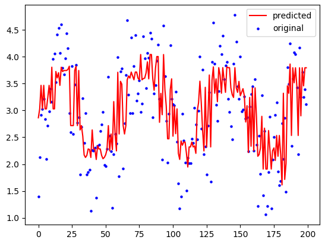
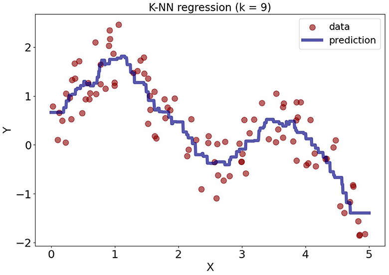
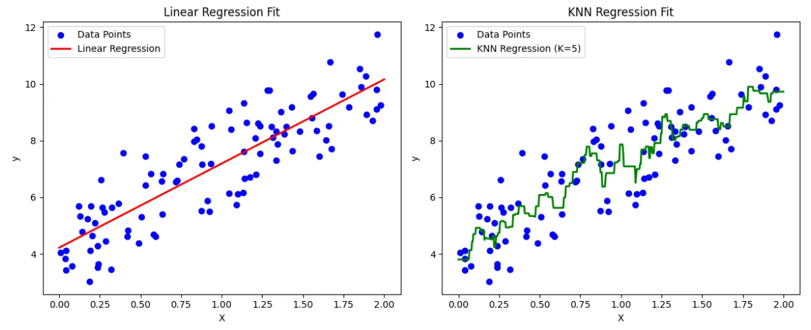

La **KNN Regresión (K-Nearest Neighbors Regression)** es un algoritmo de Machine Learning utilizado para **predecir valores numéricos** basándose en la información de los datos más cercanos.

A diferencia de la Regresión Lineal, **KNN no aprende una fórmula matemática**, sino que realiza las predicciones **directamente a partir de los datos de entrenamiento**.

Por su simplicidad conceptual, KNN Regresión suele utilizarse como:

* Primer **modelo no lineal**
* Modelo de comparación frente a regresión lineal
* Algoritmo introductorio para entender modelos basados en distancia

:::info Lectura recomendada
Para reforzar la comprensión de las diferencias entre **Regresión Lineal** y **KNN**, se recomienda la siguiente lectura:

👉 **KNN vs Linear Regression: How to Choose the Right ML Algorithm**  
https://medium.com/@skytoinds/knn-vs-linear-regression-how-to-choose-the-right-ml-algorithm-4f6bf01a4202

El artículo compara ambos modelos desde un punto de vista conceptual, destacando aspectos como la forma de la función de predicción, la flexibilidad del modelo y el papel de los datos en cada enfoque.
:::


---

## Idea principal del algoritmo

La idea de KNN Regresión es muy intuitiva:

> “Si varios puntos cercanos tienen valores parecidos, un nuevo punto debería tener un valor similar.”

Para predecir un nuevo valor:

1. Se buscan los **k puntos más cercanos**
2. Se calcula la **media** de sus valores objetivo
3. Esa media es la predicción final



---

## Funcionamiento del modelo

El funcionamiento interno de KNN Regresión sigue siempre los mismos pasos:

1. Elegir el valor de **k**
2. Calcular la **distancia** entre el punto nuevo y todos los puntos del dataset
3. Seleccionar los **k vecinos más cercanos**
4. Calcular la **media** (o media ponderada) de sus valores objetivo

```text
Nuevo punto → buscar vecinos → promediar valores → predicción
```

### Cálculo de la distancia

Para decidir qué puntos son “cercanos”, KNN utiliza una **métrica de distancia**.
La más habitual es la **distancia euclídea**, aunque existen otras como Manhattan.

La distancia se calcula teniendo en cuenta **todas las variables de entrada**, por lo que:

* Las variables deben estar en la **misma escala**
* Variables con valores grandes pueden dominar la distancia

Por este motivo, el **escalado de los datos es obligatorio** en KNN.

---

### Entrenamiento vs predicción

KNN Regresión es un algoritmo basado en instancias:

* Durante el **entrenamiento**, el modelo **no aprende parámetros**
* Simplemente **almacena el dataset de entrenamiento**
* El trabajo computacional ocurre en la **fase de predicción**

Cada vez que se realiza una predicción, el modelo debe:

* Calcular distancias a todos los puntos
* Buscar los vecinos más cercanos
* Calcular la predicción final

Esto explica por qué KNN es muy barato de entrenar pero costoso en tiempo y memoria al predecir

---

### Interpretación geométrica

KNN Regresión **no ajusta una recta ni un plano**.
La predicción depende únicamente de la **región local** del espacio de datos donde cae el nuevo punto.

Esto lo convierte en un modelo:

* Flexible
* No lineal
* Muy dependiente de la distribución de los datos



:::info Modelos paramétricos vs no paramétricos

En Machine Learning, los modelos de regresión pueden clasificarse, de forma general, en **modelos paramétricos** y **modelos no paramétricos**.

Esta distinción no tiene que ver con si el modelo es simple o complejo, sino con **cómo representa la relación entre las variables de entrada y la variable objetivo**.

---

#### Modelos paramétricos

Los **modelos paramétricos** asumen de antemano una **forma concreta** para la función de predicción.
Esa función se describe mediante un **número fijo de parámetros**, independientemente de cuántos datos tengamos.

La **Regresión Lineal** es un ejemplo claro de modelo paramétrico:

$$
\hat{y} = w_0 + w_1x_1 + \dots + w_nx_n
$$

El modelo siempre tiene la misma estructura (una combinación lineal de las variables).
Durante el entrenamiento, **solo se ajustan los valores de los coeficientes**.

Aunque aumente la cantidad de datos, **la forma del modelo no cambia**, únicamente cambian sus parámetros.

---

#### Modelos no paramétricos

Los **modelos no paramétricos** no asumen una forma concreta para la función de predicción.
En su lugar, permiten que la **estructura del modelo dependa directamente de los datos**.

**KNN Regresión** es un modelo no paramétrico:

* No aprende coeficientes
* No ajusta una función explícita
* Utiliza directamente los datos de entrenamiento para realizar las predicciones

La forma de la función de predicción depende de:
* la distribución de los datos
* el valor de $ (k) $
* la métrica de distancia utilizada



:::

---

## Uso de KNN Regresión

### Cuándo SÍ usarlo

KNN Regresión puede funcionar bien cuando:

* La relación entre variables es **no lineal**
* El dataset no es excesivamente grande
* Los datos están bien distribuidos
* Se dispone de un buen preprocesamiento

---

### Cuándo NO funciona bien

KNN Regresión suele rendir mal cuando:

* El dataset es muy grande (coste computacional)
* Hay mucho ruido
* Existen muchos outliers
* El número de variables es elevado (curse of dimensionality)

En la práctica:

> KNN es un buen modelo de referencia, pero rara vez es el mejor modelo final.

---

## Importancia del preprocesamiento

En KNN Regresión, el preprocesamiento **es obligatorio**.

| Aspecto                | ¿Es necesario?   | Explicación                       |
| ---------------------- | ---------------- | --------------------------------- |
| Tratamiento de nulos   | ✔ Sí             | No admite valores nulos           |
| Escalado               | ✔ Obligatorio    | La distancia depende de la escala |
| Outliers               | ✔ Muy importante | Pueden dominar la predicción      |
| Selección de variables | ✔ Recomendado    | Reduce ruido y dimensionalidad    |

:::warning Escalado obligatorio
Si las variables no están en la misma escala, **la distancia no tiene sentido** y el modelo producirá predicciones erróneas.
:::

---

## Principales hiperparámetros

KNN Regresión depende fuertemente de sus hiperparámetros, ya que estos determinan **cómo se definen los vecinos y cómo se calcula la predicción**.

Por este motivo, es habitual **buscar automáticamente la mejor combinación de hiperparámetros** utilizando **validación cruzada**, del mismo modo que ya se ha hecho en los algoritmos de clasificación.

En la práctica, esto se realiza mediante herramientas como **GridSearchCV**, que permiten evaluar distintas combinaciones y seleccionar la que ofrece mejor rendimiento medio.

---

### Número de vecinos (`n_neighbors`)

* **k pequeño** → modelo muy sensible al ruido (overfitting)
* **k grande** → modelo muy suavizado (underfitting)

No existe un valor universal de \(k\).
El valor óptimo debe ajustarse mediante **validación cruzada**, evaluando el rendimiento del modelo en distintos subconjuntos de datos.

---

### Pesos (`weights`)

* `uniform` → todos los vecinos pesan igual
* `distance` → los vecinos más cercanos tienen mayor influencia en la predicción

En muchos casos, `weights="distance"` mejora el rendimiento, especialmente cuando los datos no están uniformemente distribuidos.

---

### Ajuste de hiperparámetros

Al igual que en clasificación, en problemas de regresión es posible combinar **KNN Regresión**, **validación cruzada** y **GridSearchCV** para:

* Probar distintos valores de `n_neighbors`
* Comparar diferentes esquemas de pesos
* Seleccionar automáticamente la mejor configuración

Esto permite obtener un modelo más robusto y reducir el riesgo de **overfitting** o **underfitting**.

---

## Métricas de evaluación

En KNN Regresión se utilizan las mismas métricas que en otros modelos de regresión:

* **MAE** (Mean Absolute Error)
* **MSE** (Mean Squared Error)
* **R²** (Coeficiente de determinación)

---

## Flujo recomendado en un problema de KNN Regresión

| Paso                | Qué se hace                 | Por qué es importante    |
| ------------------- | --------------------------- | ------------------------ |
| 1. EDA              | Analizar escalas y outliers | KNN es sensible a ambos  |
| 2. Preprocesamiento | Limpieza y escalado         | Hace válida la distancia |
| 3. Entrenamiento    | Ajustar hiperparámetros         | Controla el sesgo        |
| 4. Evaluación       | MAE, MSE, R² + Análisis gráfico del rendimiento               | Medir rendimiento        |
| 5. Comparación      | Comparar con otros modelos  | Determina qué modelo se adapta mejor a nuestro dataset |

---

## Ejemplo KNN Regresión

Para ver cómo funciona un **KNN Regression** en la práctica, puedes ejecutar este ejemplo utilizando el dataset **California Housing**.

👉 **Puedes abrir el cuaderno aquí:**
[Colab: KNN Regression con California Housing](../../0-datasets/ejemplo_knn_regresion.ipynb)

---

## Actividad de seguimiento: Bike Sharing Dataset

Utiliza el **Bike Sharing Dataset** y compara:

* Regresión Lineal
* KNN Regresión

Recuerda que debes realizar:

* Entrenamiento con GridSearch
* Análisis mejores hiperparámetros
* Métricas de evaluación
* Gráfica de análisis de resultados (Valores reales vs predichos; Residuos)

**Usa el mismo Colab que la entrega anterior**.

**Entrega:** Notebook (Colab) con conclusiones razonadas.
