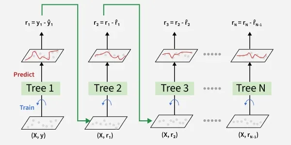

Los **Gradient Boosting para Regresión (Gradient Boosting Regression)** son algoritmos de Machine Learning utilizados para **predecir valores numéricos** combinando las predicciones de **muchos árboles de decisión entrenados de forma secuencial**.

A diferencia de Random Forest, donde los árboles son independientes, en Gradient Boosting:

* Los árboles se entrenan **uno detrás de otro**
* Cada nuevo árbol aprende a **corregir los errores del modelo anterior**
* La predicción final es la **suma de las contribuciones de todos los árboles**

En la práctica, Gradient Boosting suele lograr **muy buen rendimiento en problemas tabulares**, especialmente cuando se ajustan bien sus hiperparámetros.

---

## Idea principal del algoritmo

La idea central de Gradient Boosting es la siguiente:

> “Entrenar modelos simples de forma secuencial, donde cada nuevo modelo se centra en corregir los errores cometidos hasta ese momento.”

En lugar de construir muchos árboles independientes, Gradient Boosting construye un modelo **paso a paso**, mejorándolo progresivamente.

Este enfoque se conoce como **boosting**.

---

## Gradient Boosting como modelo ensemble

Gradient Boosting es un modelo **ensemble**, pero de tipo **secuencial**, no paralelo.

* Cada árbol individual es un **modelo débil** (*weak learner*)
* El conjunto de muchos árboles produce un **modelo fuerte**
* La mejora se consigue reduciendo principalmente el **sesgo** del modelo

:::info Boosting vs Bagging

* **Bagging (Random Forest)**: muchos modelos independientes que se promedian
* **Boosting (Gradient Boosting)**: modelos entrenados secuencialmente que corrigen errores
:::

---

## Funcionamiento interno del modelo

El entrenamiento de Gradient Boosting se basa en la idea de **residuos** (errores).

### Paso 1: Modelo inicial

El algoritmo comienza con una predicción muy simple a partir de un **árbol de decisión**. Este primer modelo ya permite hacer una **predicción inicial**.

---

### Paso 2: Cálculo de los errores (residuos)

Una vez hecha la predicción inicial:

* Se calcula el **error** de cada observación
* En regresión, el error suele ser:

$$
\text{residuo} = y_{\text{real}} - y_{\text{predicho}}
$$

Estos residuos indican **dónde y cuánto se equivoca el modelo**.

---

### Paso 3: Entrenar un árbol para corregir errores

* Se entrena un **árbol de decisión** usando como target los **residuos**
* El árbol aprende patrones sobre **qué tipo de datos generan más error**

Este árbol no predice el valor final, sino **una corrección**.

---

### Paso 4: Actualizar la predicción

La predicción del modelo se actualiza:

$$
\text{nueva predicción} = \text{predicción anterior} + \text{learning rate} \times \text{predicción del árbol}
$$

El **learning rate** controla cuánto influye cada nuevo árbol.

---

### Paso 5: Repetir el proceso

El proceso se repite tantas veces como indique `n_estimators`:

* Cada árbol intenta corregir los errores que aún quedan
* El modelo mejora progresivamente

---

### Resultado final

Una vez entrenados todos los árboles, la predicción final se obtiene **sumando las contribuciones de cada árbol**.

La predicción del modelo viene dada por la siguiente expresión:

$$
y_{\text{pred}} = y_1 + \eta \cdot r_1 + \eta \cdot r_2 + \cdots + \eta \cdot r_N
$$

donde:

* $ (y_1) $ es la **predicción inicial** del modelo (normalmente la media del target),
* $ (\eta) $ (*learning rate*) controla **cuánto aporta cada árbol**,
* $ (r_1, r_2, \ldots, r_N) $ son las **correcciones (errores o residuos)** predichas por cada uno de los árboles entrenados.

Cada árbol no predice directamente el valor final, sino una **corrección** que se añade a la predicción anterior.
La suma de todas estas pequeñas correcciones da lugar a la **predicción final** del modelo.

---

## Entrenamiento vs predicción

### Entrenamiento

Durante el entrenamiento, Gradient Boosting:

1. Parte de una predicción inicial simple
2. Calcula errores
3. Entrena un árbol para corregirlos
4. Actualiza el modelo
5. Repite el proceso

Este entrenamiento es **secuencial**, por lo que **no puede paralelizarse fácilmente**.

---

### Predicción

Para predecir un nuevo dato:

1. Se aplica la predicción inicial
2. Se suman las correcciones de todos los árboles (ponderadas por el learning rate)
3. Se obtiene la predicción final

Es decir, se aplica la fórmula descrita anteriormente:

$$
y_{\text{pred}} = y_1 + \eta \cdot r_1 + \eta \cdot r_2 + \cdots + \eta \cdot r_N
$$

> En regresión, Gradient Boosting predice sumando pequeñas correcciones sucesivas.

---

## Gradient Boosting en regresión vs clasificación

La estructura general es la misma:

* entrenamiento secuencial
* corrección de errores
* combinación de múltiples árboles

La diferencia está en:

* **Regresión** → se corrigen errores numéricos (residuos)
* **Clasificación** → se corrigen errores de probabilidad/clase

---

## Uso de Gradient Boosting en Regresión

### Cuándo SÍ usarlo

Gradient Boosting suele funcionar muy bien cuando:

* Hay relaciones complejas y no lineales
* Se busca **alto rendimiento predictivo**
* Se acepta un mayor coste de entrenamiento a cambio de precisión

Es habitual que supere a Random Forest si está bien ajustado.

---

### Cuándo NO es la mejor opción

Puede no ser ideal cuando:

* El dataset es muy grande (entrenamiento lento)
* No se quiere ajustar muchos hiperparámetros
* Se necesita un modelo muy interpretable

---

## Importancia del preprocesamiento

| Aspecto               | ¿Es necesario? | Explicación                   |
| --------------------- | -------------- | ----------------------------- |
| Tratamiento de nulos  | ✔ Sí           | No admite valores nulos       |
| Escalado              | ❌ No           | No usa distancias             |
| Variables categóricas | ✔ Sí     | Deben codificarse             |
| Outliers              | ⚠️ Importante  | Puede sobreajustar a outliers |

---

## Principales hiperparámetros

Gradient Boosting es **más sensible a los hiperparámetros** que Random Forest.

Los más importantes son:

* `n_estimators`
* `learning_rate`
* `max_depth`
* `min_samples_split`
* `min_samples_leaf`
* `subsample`

---

### Número de árboles (`n_estimators`)

Indica cuántos árboles se entrenan secuencialmente.

* Más árboles → mayor capacidad
* Demasiados árboles → riesgo de overfitting si no se regula

---

### Learning rate (`learning_rate`)

Controla cuánto contribuye cada árbol al modelo final.

* Valores pequeños (0.01–0.1) → aprendizaje lento y robusto
* Valores grandes (>0.2) → aprendizaje rápido pero inestable

Existe una relación clara:

> **learning rate pequeño → más árboles necesarios**

---

### Profundidad del árbol (`max_depth`)

Los árboles en Gradient Boosting suelen ser **poco profundos**.

* Profundidades típicas: 2–5
* Árboles simples → mejor generalización

---

### Submuestreo (`subsample`)

Indica qué porcentaje de datos se usa para entrenar cada árbol.

* Valores < 1 introducen aleatoriedad
* Ayuda a reducir overfitting

---

## Ajuste de hiperparámetros

Es habitual usar:

* validación cruzada
* `GridSearchCV` o `RandomizedSearchCV`

Tabla orientativa:

| Dataset | `learning_rate` | `n_estimators` | `max_depth` | Comentario         |
| ------- | --------------- | -------------- | ----------- | ------------------ |
| Pequeño | 0.05 – 0.1      | 100 – 300      | 2 – 4       | Evitar overfitting |
| Mediano | 0.05 – 0.1      | 200 – 500      | 3 – 5       | Buen equilibrio    |
| Grande  | 0.01 – 0.05     | 500 – 1000     | 3 – 6       | Mayor capacidad    |

---

## Importancia de variables

Gradient Boosting permite calcular **importancia de variables**, basada en:

* cuánto reduce el error cada variable
* frecuencia de uso en los splits

Esto ayuda a:

* entender parcialmente el modelo
* detectar variables relevantes

---

## Métricas de evaluación

Se usan las métricas habituales de regresión:

* **MAE**
* **MSE**
* **R²**

Es especialmente importante **evaluar si hay overfitting**. Se evalúa comparando las métricas obtenidas en entrenamiento y en test:

* Si el rendimiento es muy bueno en train pero empeora claramente en test, el modelo está sobreajustando.
* Si los resultados son similares en ambos conjuntos, el ajuste es adecuado.

Como normal general podemos decir:

| Diferencia de (R^2) (train − test) | Interpretación                         |
| ---------------------------------- | -------------------------------------- |
| (> 0.10)                           | **Overfitting claro**                  |
| (0.05 – 0.10)                      | **Overfitting leve / moderado**        |
| (< 0.05)                           | **Buen ajuste y buena generalización** |

En la práctica, se comprueban también las diferencias entre los MSE y MAE de ambos conjuntos.

---

## Flujo recomendado en un problema de Gradient Boosting (Regresión)

| Paso                | Qué se hace                     | Por qué               |
| ------------------- | ------------------------------- | --------------------- |
| 1. EDA              | Nulos, outliers, distribuciones | Evitar errores graves |
| 2. Preprocesamiento | Limpieza + encoding             | Requisito del modelo  |
| 3. Entrenamiento    | Ajuste de hiperparámetros       | Modelo sensible       |
| 4. Evaluación       | MAE, MSE, R² + gráficos         | Detectar overfitting  |
| 5. Interpretación   | Importancia de variables        | Entender el modelo    |
| 6. Comparación      | Comparar con RF y otros         | Elegir mejor modelo   |

---

## Comparación rápida: Random Forest vs Gradient Boosting

| Aspecto                        | Random Forest  | Gradient Boosting        |
| ------------------------------ | -------------- | ------------------------ |
| Entrenamiento                  | Paralelo       | Secuencial               |
| Árboles                        | Independientes | Dependientes             |
| Riesgo principal               | Subajuste      | Sobreajuste              |
| Sensibilidad a hiperparámetros | Baja           | Alta                     |
| Rendimiento máximo             | Bueno          | Muy alto (bien ajustado) |

---

## Ejemplo: Gradient Boosting para Regresión

Para ver cómo funciona un **Gradient Boosting Regressor** en la práctica, puedes ejecutar este ejemplo utilizando el dataset **California Housing**.

👉 **Puedes abrir el cuaderno aquí:**
[Colab: Gradient Boosting Regression](../../0-datasets/ejemplo_gradient_boosting.ipynb)

---

## Actividad de seguimiento: Bike Sharing Dataset

Utiliza el **Bike Sharing Dataset** y compara:

- Regresión Lineal
- KNN Regresión
- Árbol de Decisión (Regresión)
- Random Forest (Regresión)
- Gradient Boosting

Incluye:

- Ajuste de hiperparámetros (`n_estimators`, `max_depth`, `max_features`, etc.)
- Métricas de evaluación
- Importancia de variables
- Análisis de overfitting
- Conclusiones razonadas

**Entrega:** Notebook (Colab) con conclusiones claras y justificadas.