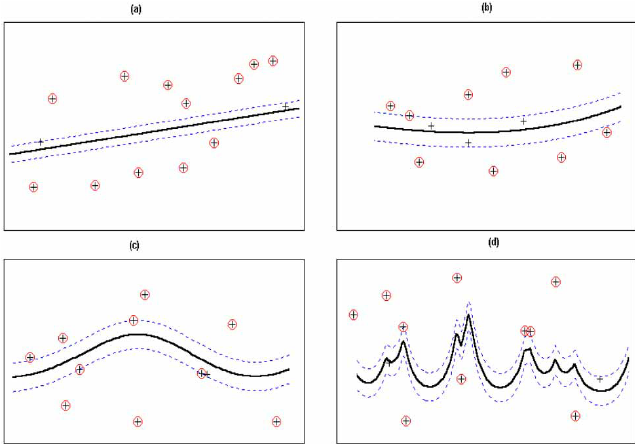

La **Support Vector Regression (SVR)** es un algoritmo de Machine Learning utilizado para **predecir valores numéricos**.

A diferencia de otros modelos de regresión, SVR no intenta minimizar directamente el error total, sino que busca:

> **Encontrar una función lo más simple posible que se ajuste a los datos, permitiendo pequeños errores controlados.**

SVR es un modelo **potente**, especialmente en datasets pequeños o medianos, pero también **sensible al preprocesamiento y a los hiperparámetros**.

---

## Idea principal del algoritmo

La idea central de SVR es la siguiente:

> “Ajustar una función que prediga bien, manteniéndose lo más plana posible, y tolerando errores pequeños.”

Para ello, SVR introduce el concepto de **margen epsilon (ε)**:

* Se define un **tubo alrededor de la función**
* Los errores **dentro del tubo no se penalizan**
* Solo se penalizan los puntos que quedan **fuera del margen**

Estos puntos se denominan **vectores soporte** y son los que realmente determinan el modelo.

---

## SVR como modelo basado en márgenes

SVR pertenece a la familia de modelos **basados en márgenes**:

* No intenta pasar exactamente por todos los puntos
* Busca un compromiso entre:
  * buen ajuste
  * simplicidad del modelo
* Solo algunos puntos influyen en la solución final

Esto hace que SVR sea:
* robusto frente a cierto ruido
* sensible a outliers si no se regula bien

---

## Funcionamiento interno del modelo

El entrenamiento de SVR se basa en los siguientes conceptos:

### Margen epsilon (ε)

* Define una zona de tolerancia alrededor de la función
* Errores menores que ε **no se penalizan**
* Cuanto mayor es ε:
  * más tolerancia al error
  * modelo más simple

---

### Vectores soporte

* Son los puntos que quedan:
  * fuera del margen ε
  * o justo en el borde
* Solo estos puntos influyen en la función final
* El resto de observaciones **no afectan al modelo**

---

### Regularización (C)

SVR introduce el parámetro **C**, que controla cuánto se penalizan los errores grandes:

* C grande → el modelo intenta ajustarse mucho a los datos
* C pequeño → se permite más error para ganar generalización

---

## Entrenamiento vs predicción

### Entrenamiento

Durante el entrenamiento, SVR:

1. Define un margen ε alrededor de la función
2. Busca una función lo más plana posible
3. Penaliza solo los errores que superan ε
4. Ajusta la función usando los vectores soporte

El proceso se basa en una **optimización matemática**, no en reglas ni árboles.

---

### Predicción

Para predecir un nuevo dato se evalúa la función aprendida

---

## Uso de SVR en regresión

### Cuándo SÍ usarlo

SVR puede ser una buena opción cuando:

* El dataset es pequeño o mediano
* Hay relaciones no lineales
* Se dispone de buen preprocesamiento
* Se busca un modelo potente sin usar ensembles

---

### Cuándo NO es la mejor opción

SVR puede no ser ideal cuando:

* El dataset es muy grande (entrenamiento lento)
* Hay muchas variables sin escalar
* Se requiere interpretabilidad
* Hay muchos outliers no tratados

---

## Importancia del preprocesamiento

En SVR, el preprocesamiento es **crítico**:

| Aspecto               | ¿Es necesario? | Explicación                               |
| --------------------- | -------------- | ----------------------------------------- |
| Tratamiento de nulos  | ✔ Sí           | No admite valores nulos                   |
| Escalado              | ✔ **Obligatorio** | Usa distancias y productos escalares     |
| Variables categóricas | ✔ Sí           | Deben codificarse                         |
| Outliers              | ⚠️ Muy importante | Afectan directamente al margen          |

> En la práctica, SVR **siempre debe combinarse con escalado**.

---

## Principales hiperparámetros

SVR es **muy sensible a los hiperparámetros**.

Los más importantes son:

* `C`
* `epsilon`
* `kernel`
* `gamma` (según el kernel)

---

### Parámetro C

Controla el equilibrio entre:

* ajuste a los datos
* simplicidad del modelo

* C grande → riesgo de overfitting
* C pequeño → posible underfitting

---

### Margen epsilon (`epsilon`)

Define cuánto error se tolera sin penalizar:

* ε pequeño → ajuste más estricto
* ε grande → modelo más suave

---

### Kernel

El kernel define la forma de la función aprendida.

Los más comunes son:

* `linear`
* `rbf` (el más utilizado)
* `poly`

El kernel permite a SVR modelar **relaciones no lineales**.

En el gráfico anterior:

* (a) Linear 
* (b) Polynomial 
* (c) Gaussian RBF 
* (d) Exponential RBF 

La imagen muestra cómo **SVR cambia la forma de la función aprendida según el kernel utilizado**. Con el **kernel lineal** (a), el modelo ajusta una recta con margen, por lo que solo puede capturar relaciones lineales. Con el **kernel polinómico** (b), la función se curva suavemente y permite modelar relaciones no lineales simples. El **kernel Gaussiano RBF** (c) ofrece mayor flexibilidad, adaptándose mejor a patrones no lineales complejos manteniendo una curva suave. Por último, el **kernel RBF exponencial** (d) genera un ajuste muy flexible y local, capaz de seguir variaciones muy finas de los datos, con mayor riesgo de sobreajuste si no se regulan bien los hiperparámetros.

---

### Parámetro gamma (en kernels no lineales)

`gamma` indica **hasta qué distancia “se nota” la influencia de cada punto de entrenamiento** en los kernels no lineales (como RBF o polinómico).

* **gamma grande** → cada punto solo influye en una zona muy cercana. El modelo se vuelve muy sensible a cambios locales y puede generar curvas muy onduladas, con **riesgo de sobreajuste**.
* **gamma pequeño** → cada punto influye en una región amplia. El modelo es más suave y generaliza mejor, pero puede **no capturar detalles importantes** y subajustar.

En la práctica, `gamma` controla la **flexibilidad del modelo**: valores altos hacen el modelo más complejo y valores bajos lo hacen más simple.

---

## Ajuste de hiperparámetros

Es habitual usar:

* validación cruzada
* `GridSearchCV` o `RandomizedSearchCV`

Tabla orientativa:

| Dataset | C        | epsilon | kernel | Comentario                  |
| ------ | -------- | ------- | ------ | --------------------------- |
| Pequeño | 1 – 10   | 0.05–0.2 | rbf    | Buen equilibrio              |
| Mediano | 1 – 100  | 0.05–0.1 | rbf    | Ajustar gamma con cuidado   |
| Grande  | ❌       | ❌       | ❌     | SVR suele ser poco eficiente|

---

## Interpretabilidad del modelo

SVR **no es fácilmente interpretable**:

* No tiene coeficientes claros (salvo kernel lineal)
* No hay reglas ni árboles
* No ofrece importancia de variables

Su interpretación es principalmente **geométrica** (márgenes).

---

## Métricas de evaluación

Se usan las métricas habituales de regresión:

* **MAE**
* **MSE**
* **R²**

Es importante evaluar el modelo en **train y test** para detectar:

* overfitting (C o gamma demasiado altos)
* underfitting (C o epsilon demasiado bajos)

---

## Flujo recomendado en un problema de SVR (Regresión)

| Paso                | Qué se hace                     | Por qué                         |
| ------------------- | ------------------------------- | ------------------------------- |
| 1. EDA              | Nulos, outliers, escalas        | SVR es sensible a la escala     |
| 2. Preprocesamiento | Escalado + encoding             | Requisito fundamental           |
| 3. Entrenamiento    | Ajuste de C, epsilon y kernel   | Modelo sensible                 |
| 4. Evaluación       | MAE, MSE, R² + gráficos         | Detectar overfitting            |
| 5. Comparación      | Comparar con otros modelos      | Elegir mejor modelo             |

---

## Ejemplo: SVR para Regresión

Para ver cómo funciona un **Support Vector Regressor** en la práctica, puedes ejecutar un ejemplo utilizando el dataset **California Housing**.

👉 **Puedes abrir el cuaderno aquí:**
[Colab: Support Vector Regression](../../0-datasets/ejemplo_svr.ipynb)

---

## Actividad de seguimiento: Bike Sharing Dataset

Utiliza el **Bike Sharing Dataset** y compara:

- Regresión Lineal
- KNN Regresión
- Árbol de Decisión (Regresión)
- Random Forest (Regresión)
- Gradient Boosting
- SVR

Incluye:

- Ajuste de hiperparámetros
- Métricas de evaluación
- Análisis de overfitting
- Conclusiones razonadas

**Entrega:** Notebook (Colab) con conclusiones claras y justificadas.
