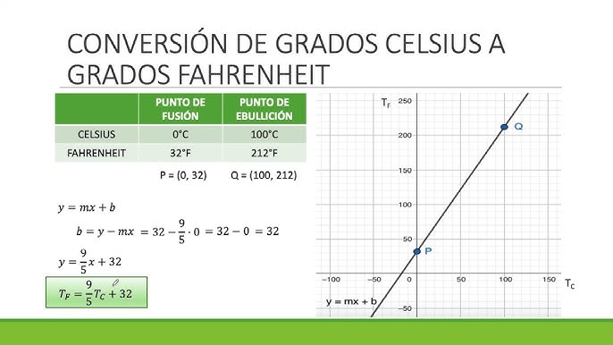

En este apartado vamos a entender cómo funciona una red neuronal por dentro.  
No vamos a usar todavía matemáticas complejas, pero sí vamos a abrir la “caja negra”.

Nuestro objetivo es que entiendas:

- Qué calcula realmente una neurona
- Qué son los pesos y el sesgo
- Cómo se mide el error
- Qué significa entrenar un modelo
- Qué papel juega el *learning rate*

Usaremos como ejemplo una red muy sencilla que aprende a convertir grados **Celsius a Fahrenheit**.

:::info Vídeo recomendado

Si quieres reforzar lo explicado en este apartado, este vídeo explica de forma muy clara y visual las bases de las redes neuronales y cómo aprende una primera red sencilla:

https://www.youtube.com/watch?v=iX_on3VxZzk

Es especialmente útil para entender el ejemplo de Celsius a Fahrenheit y visualizar cómo se ajustan los pesos durante el entrenamiento.
:::


---

## ¿Qué significa entrenar una red neuronal?

Entrenar una red neuronal significa **ajustar sus parámetros internos para que haga buenas predicciones**.

Para poder hacer esto necesitamos datos etiquetados, es decir, ejemplos en los que conocemos tanto la entrada como la respuesta correcta. A este tipo de enfoque se le llama **aprendizaje supervisado**, porque el modelo aprende comparando sus predicciones con un valor real que actúa como referencia.

El proceso general es siempre el mismo:

1. Introducimos un dato o conjuntos de datos (entrada).
2. La red calcula una predicción.
3. Comparamos la predicción con el valor real.
4. Medimos el error.
5. Ajustamos los parámetros internos.
6. Repetimos muchas veces.

En el ejemplo que veremos en Colab:

- Entrada → grados Celsius  
- Salida esperada → grados Fahrenheit  

La red intentará aprender la relación correcta entre ambas.

---

## El perceptrón: la neurona más simple

Un perceptrón es la forma más simple de red neuronal: una única neurona conectada a las entradas, sin capas ocultas. Es el bloque básico sobre el que se construyen las redes neuronales profundas.

Su funcionamiento es muy sencillo:

- Recibe uno o varios valores de entrada.
- Cada entrada tiene un peso asociado.
- Calcula una suma ponderada.
- Produce una salida.


Matemáticamente, el cálculo básico es:

$$
salida = \sum_{i=1}^{n} x_i w_i + sesgo
$$

Si solo tenemos una entrada (como Celsius), el modelo es simplemente:

$
F = (C × w) + b
$

Donde:
- `w` es el peso
- `b` es el sesgo (bias)

Curiosamente, la fórmula real de conversión es:

$
F = 1.8C + 32
$

Eso significa que la red deberá aprender:
- Peso (`w`) ≈ 1.8  
- Sesgo (`b`) ≈ 32  

:::warning Limitación importante

El perceptrón solo puede resolver **problemas lineales**.

Esto significa que únicamente puede aprender relaciones que puedan representarse mediante una recta (o un hiperplano en dimensiones mayores). En nuestro ejemplo de Celsius → Fahrenheit esto funciona perfectamente, porque la relación entre ambas variables es lineal.

Sin embargo, si el problema requiere una frontera de decisión curva o una relación no lineal más compleja, un único perceptrón no será suficiente. Para resolver esos casos necesitaremos redes con varias capas, capaces de modelar relaciones más sofisticadas.
:::

---

### La neurona artificial

Una neurona artificial moderna sigue la misma idea que el perceptrón, pero se usa como bloque de construcción de redes más grandes.

Cada neurona:

1. Recibe entradas.
2. Multiplica cada entrada por su peso.
3. Suma los resultados.
4. Añade un sesgo.
5. Produce una salida.

En redes más complejas se añade una **función de activación**, pero en nuestro ejemplo de Celsius → Fahrenheit estamos ante un problema lineal, por lo que basta con una relación lineal simple.

Lo importante aquí es entender que:

👉 Una neurona no “entiende” los datos.  
👉 Solo hace operaciones matemáticas simples.

---

### Pesos y sesgo

Los **pesos** determinan cuánto influye cada entrada en el resultado final.

* Si un peso es grande, esa entrada tiene mucha influencia.  
* Si es pequeño, tiene poca.

El **sesgo (bias)** permite desplazar la función.  
Sin él, la recta siempre pasaría por el origen.



En nuestro ejemplo:

- El peso ajusta la pendiente.
- El sesgo ajusta el desplazamiento vertical.

Y lo más importante:

👉 Los pesos y el sesgo son lo que la red aprende durante el entrenamiento.

:::info Relación con la regresión lineal

Como ya has trabajado con regresión lineal, notarás que esto es exactamente la misma estructura matemática:

$$
y = mx + b
$$

En regresión lineal:
- `m` es la pendiente.
- `b` es la ordenada en el origen.

En una neurona:
- El peso (`w`) cumple el papel de la pendiente.
- El sesgo (`b`) cumple el papel del término independiente.

De hecho, un perceptrón sin función de activación no lineal es, en esencia, un modelo de regresión lineal expresado en forma de neurona artificial.
:::

---

## De una neurona a una red

Una red neuronal no es más que muchas neuronas conectadas entre sí y organizadas en capas:

- Capa de entrada
- Capas ocultas
- Capa de salida

La información fluye desde la entrada hasta la salida. A este proceso se le llama **forward pass**.

En nuestro primer ejemplo solo usamos:

- Una entrada
- Una neurona
- Una salida

Pero el mecanismo interno es el mismo que en redes más profundas.

---

## Función de pérdida (loss function)

Para que la red pueda mejorar, necesita saber qué tan mal lo está haciendo. Ahí entra la **función de pérdida (loss function)**.

La función de pérdida mide la diferencia entre:

- El valor real
- El valor predicho

En problemas de **regresión**, como Celsius → Fahrenheit, es común usar el **error cuadrático medio (MSE)**. Esta función penaliza más los errores grandes y permite medir qué tan lejos están nuestras predicciones de los valores reales.

En problemas de **clasificación**, las funciones de pérdida más habituales son **Binary Cross-Entropy** (para clasificación binaria) y **Categorical Cross-Entropy** (para múltiples clases). Estas funciones no miden simplemente una distancia numérica, sino qué tan buena es la probabilidad que el modelo asigna a la clase correcta.

Por ello, el resultado de la función de pérdida dependerá de: 

* Si la predicción está muy lejos del valor real → pérdida alta.  
* Si está cerca → pérdida baja.

El objetivo del entrenamiento es **minimizar la función de pérdida**.

Ahora bien, ¿debe llegar a cero?

- En algunos problemas simples (como nuestro ejemplo lineal), podría acercarse mucho a 0.
- En problemas reales, especialmente con datos complejos, lo normal es que nunca llegue exactamente a 0.

De hecho, una pérdida exactamente 0 en datos de entrenamiento puede ser una señal de que el modelo está memorizando los datos en lugar de aprender patrones generales. Por eso, más adelante veremos la importancia de evaluar también el rendimiento en datos que el modelo no ha visto (test).

En la práctica, el modelo se entrena con un conjunto de datos (train) y se evalúa con otro distinto (test) para comprobar que generaliza correctamente.

En resumen, la red intenta encontrar los valores de los pesos y el sesgo que hagan que la pérdida sea lo más pequeña posible.

---

## Épocas (Epochs)

Una red neuronal no aprende con una sola pasada por los datos.

El entrenamiento consiste en repetir el proceso completo varias veces. Cada vez que el modelo recorre todo el conjunto de datos una vez, decimos que ha completado una **época (epoch)**.

En cada época:

1. La red hace predicciones.
2. Se calcula la pérdida.
3. Se ajustan los pesos y el sesgo.

Al principio la pérdida suele ser alta.  
A medida que avanzan las épocas, el modelo debería ir reduciendo esa pérdida progresivamente.

Elegir el número de épocas es importante:

- Muy pocas → el modelo no aprende lo suficiente.
- Demasiadas → puede empezar a memorizar los datos (sobreajuste).

En nuestro ejemplo de Celsius → Fahrenheit, veremos cómo tras varias épocas el modelo ajusta sus parámetros hasta aproximarse a la fórmula correcta.

---

## Learning rate

El **learning rate (tasa de aprendizaje)** controla cuánto se ajustan los pesos en cada época.

Si es:

- 🔺 Muy grande → el modelo puede volverse inestable y no converger.
- 🔻 Muy pequeño → el entrenamiento será muy lento.

Es como bajar una montaña:

- Pasos demasiado grandes → puedes tropezar y caerte.
- Pasos demasiado pequeños → tardas mucho en llegar.

Elegir bien el learning rate es clave para que el modelo aprenda correctamente.

:::info ¿Cómo se ajustan realmente los pesos?

El ajuste de los pesos no ocurre “mágicamente”. Intervienen dos elementos clave:

1. **Backpropagation**: calcula cuánto ha contribuido cada peso al error cometido. Es decir, determina en qué dirección deberían modificarse los pesos para reducir la pérdida.
2. **Optimizador** (como el descenso por gradiente o Adam): utiliza esa información para actualizar los pesos y el sesgo.

Aquí es donde entra el **learning rate**: controla el tamaño del paso que da el optimizador en cada actualización.

- Si el learning rate es grande → los pesos cambian mucho en cada paso.
- Si es pequeño → los cambios son más suaves y controlados.

En resumen:
Backpropagation calcula *cómo* deben cambiar los pesos, el optimizador decide *actualizarlos*, y el learning rate determina *cuánto* se modifican en cada paso.

En el siguiente apartado veremos este proceso con más detalle.
:::


---

## El ciclo de entrenamiento

Podemos resumir todo el proceso así:

1. La red recibe una entrada.
2. Calcula una predicción.
3. Se calcula la pérdida.
4. Se ajustan pesos y sesgo.
5. Se repite muchas veces.

Tras suficientes iteraciones, el modelo encuentra valores de peso y sesgo que minimizan el error.

En nuestro ejemplo, idealmente terminará cerca de:

```

peso ≈ 1.8
sesgo ≈ 32

```

---

## Ejemplo práctico: Celsius → Fahrenheit

En el Colab implementaremos una red neuronal muy simple (un perceptrón) con:

- Una entrada
- Una neurona
- Un peso
- Un sesgo

El modelo comenzará con valores aleatorios, por lo que al principio sus predicciones serán incorrectas. A medida que avancen las épocas, irá ajustando el peso y el sesgo para reducir la pérdida y aproximarse a la relación real entre Celsius y Fahrenheit.

Sin que le proporcionemos explícitamente la ecuación, la red terminará encontrando valores cercanos a:

$$
F = 1.8C + 32
$$

Eso es entrenar una red neuronal: ajustar parámetros internos hasta minimizar el error.

Más adelante probaremos también una red ligeramente más compleja, con una capa oculta. Resolverá el mismo problema, pero con una estructura más potente. Sin embargo, al aumentar el número de pesos y sesgos, la solución deja de ser tan fácilmente interpretable como una simple ecuación lineal.

👉 **Puedes abrir el cuaderno aquí:**
[Colab: Primera red neuronal](../0-colab/primera_red_neuronal.ipynb)

---

## Actividad de seguimiento

Piensa en **otro problema que tenga una relación lineal** entre la entrada y la salida.

Una vez elegido el problema:

1. Define un pequeño conjunto de datos de ejemplo (entrada y salida esperada).
2. Crea una red neuronal sencilla (un perceptrón).
3. Entrena el modelo.
4. Comprueba qué peso y sesgo ha aprendido.
5. Verifica si se aproxima a la fórmula real.
6. Prueba con una arquitectura más compleja.

Ve jugando con los hiperparámetros para conseguir los mejores resultados.

