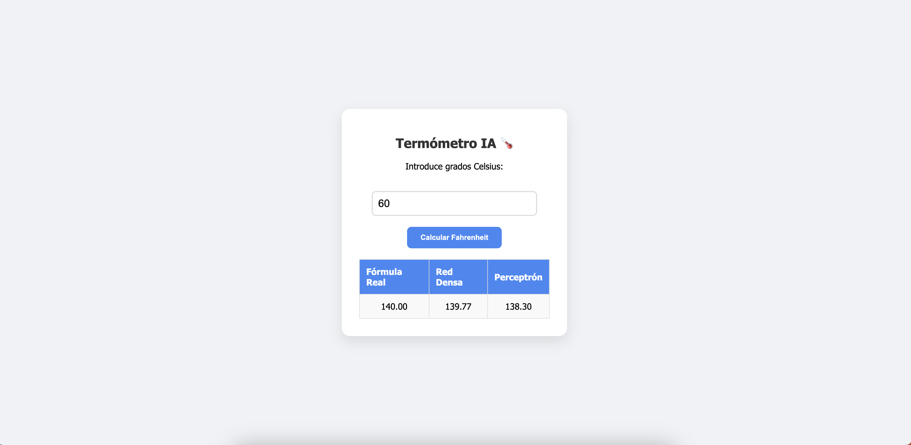

Exportar un modelo de inteligencia artificial para usarlo en la web es un proceso muy común que divide el trabajo en dos partes: **preparar el modelo** y **crear la interfaz web**.

Vamos a explorar cómo podríamos llevar esto a cabo basándonos en la red de conversión de grados Celsius a Fahrenheit que creamos en el primer apartado del tema.

## Exportar el modelo desde Python

Para llevar tu red neuronal de un entorno de desarrollo como Colab a una aplicación web utilizando las últimas versiones de TensorFlow y Keras, el camino más eficiente y moderno es utilizar **TensorFlow.js**. Esta librería divide el modelo en un archivo JSON (la arquitectura) y archivos binarios (los pesos entrenados).


### Preparación del modelo

Primero, necesitamos exportar el modelo que ya tienes programado. En las versiones recientes de TensorFlow/Keras, el formato estándar es `.keras` o el directorio `SavedModel`, pero para la web necesitamos un formato específico.

Instala la herramienta de conversión en tu celda de Colab:

```python
!pip install tensorflowjs
```

:::warning símbolo `!` en un Jupyter Notebook
En entornos como **Google Colab** o **Jupyter Notebooks**, el símbolo `!` tiene una función muy específica que nos permite "salir" momentáneamente del mundo de Python.

* **Python estándar:** Cuando escribes código como `print("Hola")` o `modelo.predict()`, le estás hablando directamente al **intérprete de Python**.
* **El Sistema Operativo:** Hay tareas que no son propias del lenguaje Python, sino de la computadora (o servidor) donde se está ejecutando. Por ejemplo, instalar programas, crear carpetas o mover archivos.

El signo de exclamación le dice a Colab: *"No intentes leer esto como código Python; pásale este comando directamente a la terminal del sistema operativo (Linux)"*.
:::

Luego, guarda tu modelo y conviértelo:

```python
import tensorflowjs as tfjs

# Suponiendo que tu modelo se llama 'model'
# 1. Guardar el modelo en formato Keras
model.save('modelo_celsius.keras')

# 2. Convertirlo al formato compatible con la web
tfjs.converters.save_keras_model(model, 'modelo_web')
```

Esto creará una carpeta llamada `modelo_web` que contiene un archivo `model.json` (la estructura) y archivos `.bin` (los pesos). Descarga esta carpeta a tu computadora.

### Estructura generada

Cuando exportas un modelo para la web, TensorFlow.js divide la información en dos partes porque el navegador las maneja de forma distinta.


La función de cada uno es:

1. **`model.json` (El Cerebro/Esqueleto):**
    * Contiene la **estructura** de tu red (cuántas capas tiene, cuántas neuronas hay en cada una y qué funciones de activación usas).
    * También le dice al navegador cómo debe unir los pesos que están en los otros archivos.


2. **Archivos `.bin` (La Memoria/Experiencia):**
    * Contiene los **pesos (weights)** y los sesgos que tu modelo aprendió durante el entrenamiento (esos números que se ajustaron durante el número de epochs que especificaste).
    * Están en formato binario para que la página web los descargue de forma muy rápida, ya que pueden ser archivos pesados.


#### ¿Cómo los usa la página web?

Imagina que la web es un constructor. Primero lee el manual (`model.json`) para saber qué va a construir, y luego va por los ladrillos específicos (`group1-shard1of1.bin`) para darle contenido y que el modelo pueda "recordar" cómo convertir Celsius a Fahrenheit.

---

## Construir la página web

Ahora que ya tenemos los archivos del modelo (`model.json` y los pesos `.bin`), el siguiente objetivo es crear una "casa" para ellos en la web.

Para que esto funcione, utilizaremos **TensorFlow.js**, que es la versión de la librería preparada para correr directamente en el navegador del usuario. Esto es importante porque la predicción se hace en la computadora de quien visita la página, sin necesidad de un servidor costoso.

### La Estructura (HTML)

Como estamos usando **TensorFlow.js**, la página se ejecutará enteramente en el navegador. Para que quede bien, usaremos **HTML** para los elementos (cajas, botones) y **CSS** para el diseño (colores, sombras, disposición).

Aquí tienes una propuesta de estructura inicial:

```html
<!DOCTYPE html>
<html lang="es">
<head>
    <meta charset="UTF-8">
    <meta name="viewport" content="width=device-width, initial-scale=1.0">
    <title>Conversor IA: Celsius a Fahrenheit</title>

    <!-- Línea que "conecta" tu página con el cerebro de Google para que pueda entender redes neuronales -->
    <script src="https://cdn.jsdelivr.net/npm/@tensorflow/tfjs@latest"></script>

    <!-- Importamos el script que hemos creado para predecir -->
    <script src="predecir.js"></script>

    <!-- Estilos para que se vea bonito -->
    <link rel="stylesheet" href="styles.css">
</head>
<body>

    <div class="container">
        <h1>Termómetro IA 🌡️</h1>
        <p>Introduce grados Celsius:</p>
        <input type="number" id="celsius" placeholder="Ej: 25">
        <br>

        <!-- Cuando el usuario pulse en el botón, llamaremos a nuestro modelo para que realice la predicción-->
        <button onclick="predecir()">Calcular Fahrenheit</button>

        <!-- En este campo mostraremos el resultado de la predicción una vez devuelto por el modelo -->
        <div id="resultado">Esperando datos...</div>
    </div>

</body>
</html>
```

### La Lógica (JavaScript)

Para que la función `predecir()` que pusimos en el botón del HTML funcione, necesitamos que tu archivo Javascript haga tres cosas fundamentales:

1. **Cargar el modelo:** Traer los archivos `model.json` y los pesos `.bin` a la memoria del navegador.
2. **Preparar el dato:** Convertir el número que escribe el usuario en un **Tensor**, que es el formato que entiende TensorFlow.
3. **Obtener el resultado:** Usar el modelo para calcular y mostrar el valor en la pantalla.

Aquí tienes la estructura lógica que debería ir dentro de tu `predecir.js`:

```javascript
var modelo = null;

// Cargamos el modelo al abrir la página
(async () => {
    console.log("Cargando modelo...");
    // Sustituye la ruta por la ubicación de tu carpeta 'modelo_web'
    modelo = await tf.loadLayersModel("modelo_web/model.json");
    console.log("Modelo cargado.");
})();

function predecir() {
    if (modelo != null) {
        // 1. Obtener el valor del input HTML
        var celsius = document.getElementById("celsius").value;
        
        // 2. Convertir a Tensor (TensorFlow espera arrays de 2 dimensiones)
        // Ejemplo: [ [25] ]
        var tensor = tf.tensor2d([[parseFloat(celsius)]]);

        // 3. Hacer la predicción
        var prediccion = modelo.predict(tensor);

        // 4. Obtener el valor numérico y redondearlo
        // dataSync() extrae los datos del tensor a JavaScript
        var resultado = prediccion.dataSync()[0];
        resultado = Math.round(resultado * 100) / 100;

        // 5. Mostrar en el HTML
        document.getElementById("resultado").innerHTML = 
            celsius + "°C son " + resultado + "°F";
    } else {
        document.getElementById("resultado").innerHTML = "El modelo aún no carga...";
    }
}

```

:::info Un detalle técnico importante:

Fíjate en la línea `tf.tensor2d([[parseFloat(celsius)]])`. En el entrenamiento que hiciste en Python, probablemente alimentaste a la red con una lista de números. TensorFlow.js es muy estricto con las "dimensiones".

**¿Por qué necesitamos usar un tensor de dos dimensiones `[[ valor ]]` en lugar de simplemente pasarle el número directamente al modelo?**

La respuesta tiene que ver con cómo están diseñadas las "piezas" de la biblioteca (TensorFlow) para procesar información de forma masiva.

Imagina que una red neuronal es como una fábrica con una cinta transportadora. La fábrica no está hecha para recibir un solo tornillo suelto en la mano; está diseñada para recibir **cajas** de piezas. 📦

Las redes neuronales de TensorFlow siempre esperan una **matriz (tensor de 2 dimensiones)** por estas razones:

1. **Lote de datos (Batching):** La primera dimensión representa la cantidad de ejemplos que estás enviando a la vez. Aunque solo quieras predecir un número, la red necesita que le digas: "aquí hay una lista que contiene un solo ejemplo".
* `[25]` sería una lista simple (1D).
* `[[25]]` es una lista que dentro tiene otra lista (2D), cumpliendo con el formato `[ejemplos, características]`.


2. **Consistencia matemática:** Internamente, el modelo realiza multiplicaciones de matrices. Para que las matemáticas de la red funcionen, la entrada debe tener una forma específica (shape). Si le pasas un número suelto, la red "se confunde" porque no sabe dónde empieza y termina el grupo de datos.
:::


### Ejecutar la página web

La extensión más popular y recomendada para ejecutar tu página web directamente desde Visual Studio Code se llama **Live Server**. Puedes instalarla desde el Marketplace de Extensiones.

Su función principal es crear un servidor local temporal. Esto permite que, cada vez que guardes un cambio en tu código (HTML, CSS o JS), la página en el navegador se actualice automáticamente sin que tengas que refrescarla a mano.

Una vez instalada, en la parte inferior derecha aparecerá un botón "Go Live". Pulsa ahí y tu página web se ejecutará tras unos segundos.



---

## Despliegue

Para desplegar una página web estática (HTML, CSS y JS) que utiliza TensorFlow.js, lo ideal es buscar plataformas que ofrezcan **hosting gratuito**, rapidez y certificados SSL (el `https://` que es obligatorio para muchas funciones de IA en el navegador).

### Estudio de plataformas de despliegue

Las tres opciones más sencillas y populares son:

#### 1. GitHub Pages

Es la opción favorita de los desarrolladores. Si ya guardas tu código en un repositorio de GitHub, activar la web es cuestión de un par de clics.

* **Ideal si:** Ya usas Git o quieres aprender la herramienta estándar de la industria.
* **Ventaja:** Es totalmente gratuito y se integra con tu historial de cambios.

#### 2. Netlify

Es extremadamente simple. No necesitas saber programar comandos de consola; tiene una función de **"Drag and Drop"** (arrastrar y soltar).

* **Ideal si:** Quieres tener tu web en línea en menos de 30 segundos.
* **Ventaja:** Simplemente arrastras la carpeta de tu proyecto a su panel web y te dan una URL al instante.

#### 3. Firebase Hosting (de Google)

Ya que estás usando TensorFlow (de Google) y Colab, Firebase es parte del mismo ecosistema.

* **Ideal si:** Planeas que tu aplicación crezca y necesite en el futuro bases de datos o autenticación de usuarios.
* **Ventaja:** Es muy profesional y tiene una capa gratuita muy generosa.

### Despliegue en Netlify

**Netlify** es extremadamente sencillo porque permite desplegar sitios web simplemente arrastrando y soltando una carpeta.

Sigue estos pasos para ponerla en línea:

1. Ve a [Netlify Drop](https://app.netlify.com/drop). No necesitas registrarte inmediatamente para probarlo, aunque es recomendable hacerlo para que tu web no expire.
2. Arrastra la carpeta completa de tu proyecto web al recuadro que dice **"Drag and drop your site folder here"**.
3. ¡Listo! En unos segundos, Netlify te dará una URL pública (algo como `nombre-aleatorio.netlify.app`).

---

## Código fuente del ejemplo

Puedes descargar el código fuente de este ejemplo en los siguientes enlaces:

👉 **Colab con la exporación del modelo**
[Colab: Primera red neuronal exportada](../0-colab/primera-red-neuronal-exportada.ipynb)

👉 **Código fuente de la página web**
[VS Code: Celsius a Farenheit](../0-colab/Celsius_Farenheit.zip)

👉 **Puedes probar la página web desarrollada en este** [enlace](https://celsius-farenheit-ia.netlify.app/)

---

## Actividad de seguimiento

**Exporta los modelos** que creaste en la actividad de seguimiento del apartado [Conceptos teóricos y primera red neuronal](conceptos-teoricos-primera-red#actividad-de-seguimiento) y:

* Crea una **web funcional** para probarlo.
* **Despliega esta página web** en Netlify u otro servicio.

Entrega:
* Código fuente de la página web en .zip
* URL de la web desplegada