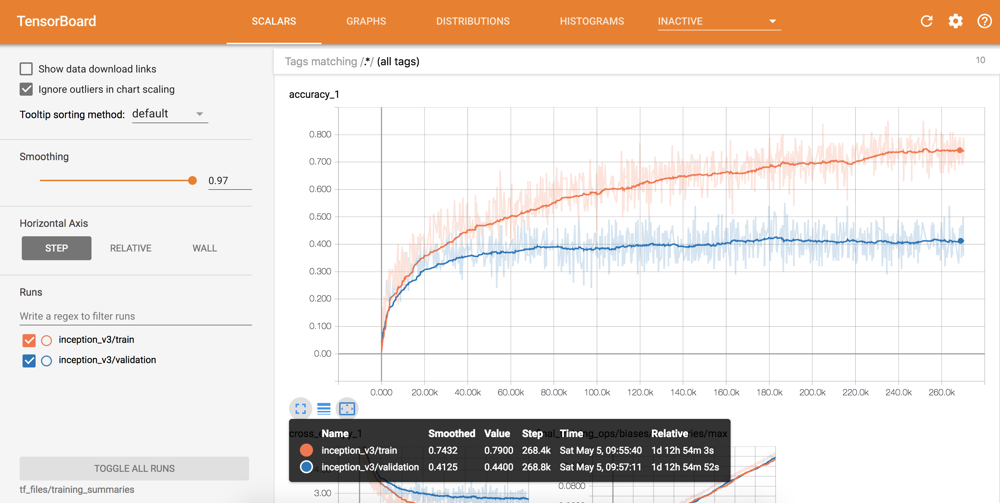
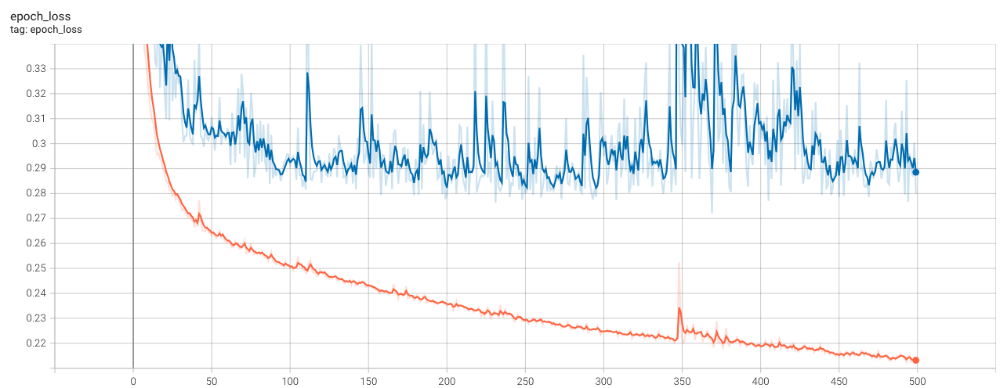

En los apartados anteriores hemos visto cómo diseñar arquitecturas tanto para problemas de regresión como de clasificación. Al monitorizar el entrenamiento con TensorBoard, es muy probable que te hayas topado con un fenómeno recurrente: el **Overfitting** (sobreajuste).

Las redes neuronales densas son modelos con una capacidad de aprendizaje masiva (a menudo tienen miles o cientos de miles de parámetros). Si las dejamos entrenar el tiempo suficiente sin control, tenderán a "memorizar" los datos de entrenamiento exactos en lugar de aprender los patrones generales que subyacen en ellos.



En este apartado veremos cómo utilizar técnicas de **Regularización**, cuyo objetivo principal es restringir, penalizar o aplicar "ruido" a la red para forzarla a generalizar mejor en datos que nunca ha visto.

---

## El Diagnóstico del Overfitting

Sabemos que nuestra arquitectura sufre de overfitting cuando observamos una divergencia clara en el panel "Time Series" de TensorBoard:

*   La pérdida en el conjunto de entrenamiento (`loss`) sigue bajando acercándose a cero.
*   La pérdida en el conjunto de validación (`val_loss`) llega a un punto mínimo, se estanca o, lo que es peor, **empieza a subir**.



En el momento en que la curva de validación empieza a empeorar, cada nueva época de entrenamiento está perjudicando activamente al modelo final. Nuestro objetivo con las siguientes técnicas es "cerrar la brecha" (gap) entre estas dos curvas.

---

## Parada Temprana (Early Stopping)

Es la técnica de regularización más recomendada, sencilla y efectiva. Si sabemos matemáticamente que el modelo empezará a empeorar a partir de cierta época, ¿por qué no pedimos a Keras que detenga el entrenamiento exactamente en ese punto?

El **Early Stopping** monitoriza una métrica (normalmente `val_loss`) e interrumpe el bucle de entrenamiento automáticamente si dicha métrica deja de mejorar después de un número determinado de épocas de "paciencia".

### Implementación en Keras
Se implementa como un objeto *Callback* (igual que vimos con TensorBoard), que luego le pasamos al método `.fit()` en forma de lista:

```python
from tensorflow.keras import callbacks

early_stopping = callbacks.EarlyStopping(
    monitor='val_loss', # Métrica que queremos vigilar
    patience=10,        # Cuántas épocas esperar sin mejora antes de detenerse
    restore_best_weights=True # ¡Crítico! Nos quedamos con los pesos del punto óptimo
)

# Añadimos el callback a la lista junto al callback de TensorBoard (si lo tenemos)
model.fit(
    X_train, y_train,
    epochs=500, # Podemos establecer un límite enorme; el Early Stopping lo parará antes
    validation_data=(X_valid, y_valid),
    callbacks=[early_stopping, tensorboard_callback]
)
```

:::tip La importancia crítica de `restore_best_weights`
Imagina que en la época 40 el modelo alcanzó su mejor (mínimo) valor de `val_loss`. Como hemos configurado una paciencia de 10 épocas, el entrenamiento continuará, pero al no mejorar, se detendrá en la época 50. 
Si **NO** activamos `restore_best_weights=True`, el modelo final en memoria almacenará los pesos de la época 50 (donde ya había empezado a empeorar fuertemente). Al ponerlo a `True`, consideramos esa "paciencia" como una simple ventana de exploración, y Keras "rebobina" y recupera automáticamente los pesos de la época 40 por nosotros. ¡Nunca lo olvides!
:::

---

## Dropout (Deserción)

El **Dropout** es posiblemente la innovación en regularización más popular y replicada del Deep Learning moderno. Su funcionamiento conceptual es sorprendentemente simple pero increíblemente efectivo: consiste en **"apagar" u omitir aleatoriamente un porcentaje de las neuronas** durante cada paso de actualización (*batch*) del entrenamiento.

Al desconectar neuronas al azar, la red se da cuenta de que no puede depender de manera absoluta en ninguna conexión específica o característica individual, ya que podrían fallar o desaparecer en cualquier momento. Esto obliga a la red a "distribuir" el conocimiento, forzando a que las neuronas vecinas aprendan representaciones redundantes y robustas.

### Implementación en Keras
En lugar de configurarlo al compilar, el Dropout se añade directamente como una capa intermedia más dentro de nuestra arquitectura `Sequential`. Esta capa especial afecta exclusivamente a las salidas de la capa inmediatamente anterior:

```python
from tensorflow.keras import layers

model = tf.keras.Sequential([
    layers.Dense(128, activation='relu', input_shape=[n_features]),
    
    # Apagamos el 30% de las neuronas de la capa anterior aleatoriamente
    layers.Dropout(0.3), 
    
    layers.Dense(64, activation='relu'),
    
    # Podemos aplicar varios Dropouts en la red (suelen ponerse después de las Dense)
    layers.Dropout(0.2),
    
    layers.Dense(1, activation='sigmoid') # Capa de salida (estas NUNCA llevan Dropout)
])
```

:::important El Dropout solo actúa en Fase de Entrenamiento
Keras gestiona internamente el ciclo de vida del modelo de forma inteligente. Reconoce que el Dropout solo debe actuar activamente introduciendo ese ruido durante el ajuste de pesos (`.fit()`). 
Cuando pasamos a la fase de evaluación del modelo (`.evaluate()`) o lanzamos predicciones reales (`.predict()`), **el Dropout se desactiva de manera transparente y automática**. Otorga a la red su 100% de fuerza conjunta y ajusta la escala matemática interna de sus salidas para compensar la reaparición sorpresiva de esas neuronas que faltaban.
:::

---

## Regularización de Pesos (L1 y L2)

A diferencia del Dropout, que altera las rutas computacionales dinámicamente, L1 y L2 son penalizaciones directas incluidas en la Función de Pérdida final que se intenta optimizar. Añaden un castigo matemático proporcional a la magnitud (*tamaño*) de los pesos de nuestra red.

*   **L1 (Lasso):** Castiga la suma "absoluta" de los pesos, con un efecto colateral característico: fuerza la dispersión, obligando activamente a que muchos de los pesos terminen siendo puramente o matemáticamente **cero**. Es idóneo si sospechamos con antelación que disponemos de un volumen muy alto de parámetros sin ninguna aportación de valor predictivo.
*   **L2 (Ridge):** Castiga la suma de los valores de los pesos en su forma cuadrática. En este caso no suele reducir valores de peso a cero, pero desincentiva brutalmente que exista cualquier peso en particular con un tamaño desorbitado y empuja, como objetivo, a obtener arquitecturas densas en las que todos los pesos estén repartidos equitativamente y cercanos a la franja del 0.

### Implementación en Keras
Se inyecta como un flag o parámetro de configuración explícito dentro de la propia declaración de la capa de neuronas subyacente que queremos regularizar:

```python
from tensorflow.keras import regularizers

model = tf.keras.Sequential([
    # Penalizamos que los parámetros asuman un peso inmensamente grande aplicando L2
    layers.Dense(64, activation='relu', kernel_regularizer=regularizers.l2(0.01)),
    layers.Dense(1)
])
```

---

## Batch Normalization (Normalización por Lotes)

:::note Diferencias fundamentales en terminología
Es imprescindible recordar que la capa especial de *Batch Normalization* no tiene absolutamente nada en común con configurar en Keras nuestro tamaño de lote en el `.fit()` (`batch_size=32`).
:::

Tal y como aprendimos durante la exploración de modelos tradicionales de ML de la necesidad casi obligatoria del preprocesamiento y estandarización a nuestros datos iniciales pre-capa de entrada, el **Batch Normalization** tiene exactamente la misma labor. De forma sencilla, actúa como un "StandardScaler" intercalado que estandariza forzosamente para que devuelva medias 0 y desviaciones típicas 1 a **las salidas intermedias** ocultas entre las capas.

La ventaja competitiva de su incorporación se centra de facto en acelerar desproporcionadamente tiempos de aprendizaje (más convergencia y curvas menos vibrantes en modelos masivos muy extendidos hacia el fondo de las capas). Secundariamente arrastra en este proceso un sutil componente colateral y aleatorio que restringe levemente al modelo aportando cierto porcentaje extra de resiliencia final que sirve también y amortigua un minúsculo porcentaje del overfitting general.

### Implementación en Keras
Difiere tradicionalmente según las modas de la época. Para redes fully-connected se recomienda intercalarla o anteceder a la fase posterior, o incluso en mitad de separaciones (interrumpiendo separadamente un activation call).

```python
model = tf.keras.Sequential([
    layers.Dense(64, activation='relu'),
    layers.BatchNormalization(), # Escala en línea pura este lote específico 
    layers.Dense(32, activation='relu'),
    layers.Dense(1)
])
```

---

## Metodología de Trabajo

A la hora de enfrentarnos a un nuevo problema de Deep Learning, la tentación de crear desde el primer momento una red gigantesca repleta de capas de Dropout y Batch Normalization es enorme. Sin embargo, en la práctica profesional se sigue una metodología iterativa y estructurada. El flujo de trabajo habitual se resume en los siguientes pasos:

1. **Construir un modelo base simple (Baseline):**
   Comienza con una arquitectura muy sencilla, sin regularización. Tu único objetivo inicial es lograr que el modelo "aprenda" algo, es decir, que la pérdida en entrenamiento (`loss`) empiece a disminuir y sus métricas superen el rendimiento de hacer predicciones aleatorias.

2. **Forzar el Overfitting (Escalar la capacidad):**
   Para poder regularizar una red, primero debes asegurarte de que tiene la capacidad suficiente para asimilar toda la complejidad de los datos (y de sobra). Si tu modelo base no sufre de *overfitting*, amplía la arquitectura (añade más capas o más neuronas por capa). Debes llegar a ese punto en el que TensorBoard te muestre de manera evidente que el modelo está memorizando: el `loss` de entrenamiento cae hacia cero, mientras que el `val_loss` se estanca o asciende.

3. **Aplicar Regularización para "domar" el modelo:**
   Una vez que dispones de un modelo musculoso que claramente está sobreajustando, es el momento de aplicar las técnicas descritas en este apartado para cerrarle el paso a la memorización en crudo y obligarlo a generalizar:
   * **Reduce su tamaño:** La regularización más elemental es simplemente podar capas o neuronas si la ampliación del paso 2 fue desmesurada.
   * **Introduce Early Stopping:** Añádelo siempre como medida de seguridad, aunque sea con una "paciencia" holgada.
   * **Introduce Dropout:** Añádelo gradualmente (ej. tasas del 20% al 30%) a continuación de las capas densas más voluminosas.
   * **Suma Batch Normalization:** Si aprecias mucha inestabilidad o picos abruptos en las curvas durante el entrenamiento.

4. **Iterar y refinar (Tuning):**
   Aquí entra el ciclo de validación empírica. Analiza las gráficas en TensorBoard de cada prueba, ajusta la severidad de tus capas de Dropout o prueba alternativas como regularizadores de peso (L2) si es imperativo. El estado óptimo se alcanza cuando las curvas de entrenamiento y validación logran descender de la mano manteniéndose lo más cerca la una de la otra antes de que el Early Stopping decida intervenir.

:::tip En resumen
La filosofía de trabajo se condensa en tres fases:   
**1.** Haz un modelo mínimo que sea capaz de aprender algo.   
**2.** Hazlo tan grande que acabe memorizando (y sobreajustando).   
**3.** Somételo a regularización matemática para forzarlo a generalizar.  
:::


## Caso Práctico

En este caso práctico, vamos a consolidar lo aprendido trabajando nuevamente sobre el conjunto de datos de viviendas. Nuestro objetivo será construir primero una red demasiado compleja para forzar de manera deliberada el sobreajuste (*overfitting*). A continuación, aplicaremos la metodología de trabajo introduciendo progresivamente **Early Stopping** y **Dropout** para observar empíricamente en TensorBoard cómo logramos controlar esas curvas de validación.

Puedes acceder al notebook con el código completo desde este enlace:

👉 [Google Colab: Regularización en California Housing](../0-colab/regularizacion_california_housing_redes_densas.ipynb)

---

## Actividad de Seguimiento (Entregable)

Es tu turno de aplicar las técnicas de regularización aprendidas (especialmente **Dropout** y **Early Stopping**) a los problemas que resolvimos anteriormente: **Bike Sharing** (Regresión) y **Employees** (Clasificación).

### Instrucciones
1.  **Optimización**: Recupera los notebooks de las prácticas anteriores y aplica Dropout y Early Stopping para mejorar la generalización de los modelos.
2.  **Despliegue Web**: Elige al menos uno de los dos modelos entrenados y despliega una pequeña página web que permita realizar predicciones en tiempo real usando **TensorFlow.js**.

### Entrega
Debes entregar los siguientes elementos:
- 🔗 **URL pública** de la página web desplegada (ej: Netlify, Vercel, GitHub Pages).
- 📦 Archivo **ZIP** con el código fuente de la web y el modelo exportado.
- 📓 El cuaderno **Colab** (.ipynb) con el entrenamiento y las gráficas de comparación.


