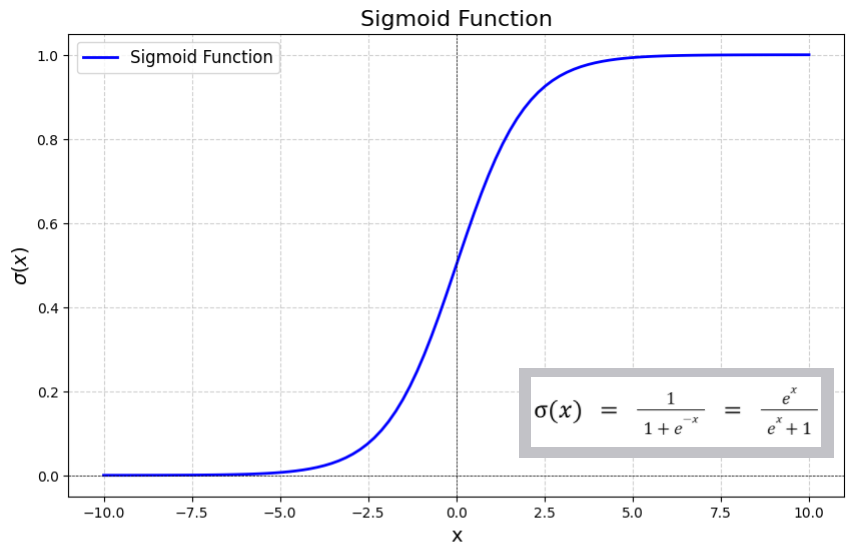
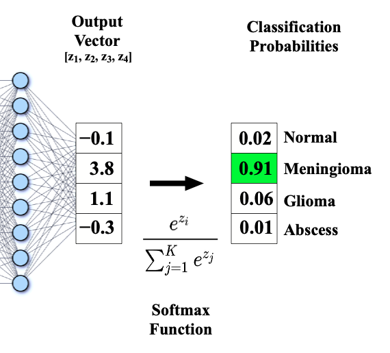

En el apartado anterior vimos cómo utilizar una Red Neuronal Densa (MLP) para resolver problemas de regresión (predecir un número continuo).

**La arquitectura base y el proceso de entrenamiento son casi idénticos** para problemas de clasificación. Seguimos necesitando:
* una capa de entrada acorde a nuestras *features*
* capas ocultas con función de activación ReLU
* un bucle de entrenamiento por *batches* validado época a época.

Sin embargo, cuando el objetivo cambia de "predecir un número" a "predecir una categoría" (por ejemplo, si un email es spam o no, o de qué especie es una planta), necesitamos ajustar la fase final de nuestra red.

En este apartado vamos a centrarnos exclusivamente en **qué cambia** cuando pasamos a la clasificación.

---

## Recordatorio: Los Dos Grandes Tipos de Clasificación

En Machine Learning, los problemas de clasificación se dividen principalmente en dos grupos, y la configuración de nuestra red dependerá de ante cuál estemos:

1.  **Clasificación Binaria:** Solo hay dos resultados posibles.
    *   *Ejemplo:* ¿Sobrevivirá este pasajero del Titanic? (Sí / No).
    *   *Ejemplo:* ¿Es este tumor maligno? (Maligno / Benigno).
2.  **Clasificación Multiclase:** Hay tres o más resultados posibles, y son excluyentes entre sí.
    *   *Ejemplo:* ¿De qué especie es esta flor Iris? (Setosa / Versicolor / Virginica).
    *   *Ejemplo:* ¿Qué número aparece en esta imagen? (0, 1, 2, 3, 4, 5, 6, 7, 8 o 9).

---

## Arquitectura para Clasificación: La Capa de Salida

Mientras que las capas ocultas siguen usando ReLU (o tanh, puedes ir probando diferentes funciones de activación) y se dimensionan según la complejidad del problema, la capa de salida cambia drásticamente respecto a la regresión.

### A. Para Clasificación Binaria

En clasificación binaria, queremos que la red nos devuelva la **probabilidad** de que el ejemplo pertenezca a la clase positiva (clase 1).

*   **Número de neuronas:** **1** (nos basta un número para expresar una probabilidad, ej: 0.85 significa 85% de probabilidad de ser clase 1).
*   **Función de Activación:** **`sigmoid`**.
    *   La función *Sigmoide* "aplasta" cualquier número real de entrada y lo transforma en un valor exactamente entre 0 y 1.

```python
# Capa de salida para Clasificación Binaria
layers.Dense(1, activation='sigmoid')
```



### B. Para Clasificación Multiclase

En clasificación multiclase, queremos que la red nos devuelva un vector con las probabilidades de pertenecer a *cada una* de las clases posibles.

*   **Número de neuronas:** **N** (tantas neuronas como clases posibles haya en el target). Si predecimos 3 especies de flores, necesitamos 3 neuronas.
*   **Función de Activación:** **`softmax`**.
    *   La función *Softmax* toma las salidas de las N neuronas y las transforma en probabilidades (entre 0 y 1) de forma que **la suma de todas ellas sea exactamente 1.0 (100%)**.
    *   La clase predicha será la que obtenga la probabilidad más alta.

```python
# Capa de salida para Clasificación Multiclase (ej: 3 clases)
layers.Dense(3, activation='softmax')
```



---

## Configuración del Entrenamiento

Dado que ya no predecimos números continuos, métricas como el MSE (Error Cuadrático Medio) no tienen sentido. Necesitamos nuevas formas de medir el error (Loss) y el éxito (Metrics).

### Cambios en la Función de Pérdida (Loss)

*   **Para Clasificación Binaria:** Usamos **`binary_crossentropy`**.
    *   Mide lo lejos que está la probabilidad predicha (ej. 0.9) del valor real (que siempre es 0 o 1). 
    * Penaliza fuertemente a la red si predice con mucha confianza la clase equivocada.
*   **Para Clasificación Multiclase:** Usamos **`categorical_crossentropy`** o **`sparse_categorical_crossentropy`**.
    *   La elección entre una y otra depende exclusivamente de cómo hayamos preprocesado nuestra variable objetivo (Target Y), como veremos en la siguiente sección.

### Nuevas Métricas

*   **`accuracy` (Exactitud):** Es la métrica estándar. Nos dice qué porcentaje de predicciones fueron correctas. Si de 100 predice bien 85, el *accuracy* es del 85%.

```python
# 1. Compilar modelo Binario
model.compile(optimizer='adam', loss='binary_crossentropy', metrics=['accuracy'])

# 2. Compilar modelo Multiclase
model.compile(optimizer='adam', loss='sparse_categorical_crossentropy', metrics=['accuracy'])
```

---

## Preprocesamiento: El Tratamiento del Target

En regresión, la variable objetivo ya era un número (ej. dólares). En clasificación, suele venir como texto ('sobrevive', 'muere' o 'setosa', 'virginica'). Las redes neuronales **solo entienden números**, así que hay que transformarlo.

### A. Target para Clasificación Binaria

Debemos convertir las dos clases en `0` y `1`. Suele bastar con un simple mapeo o un `LabelEncoder`.

### B. Target para Clasificación Multiclase

Aquí tenemos dos opciones para codificar la variable objetivo, y esta decisión dictará qué "*loss function*" debemos usar:

1.  **Label Encoding (Targets como enteros):** Convertimos las clases en números enteros (Ej: Setosa=0, Versicolor=1, Virginica=2).
    *   Si preprocesamos así, en `compile` debemos usar la loss: **`sparse_categorical_crossentropy`**.
2.  **One-Hot Encoding (Targets como vectores booleanos):** Convertimos la columna del target en N columnas con ceros y un uno. (Ej: Setosa = [1, 0, 0], Versicolor = [0, 1, 0]).
    *   Si preprocesamos así, en `compile` debemos usar la loss: **`categorical_crossentropy`** (sin el *sparse*).

:::tip ¿Qué codificación elegimos?
Ambas aproximaciones entrenan igual de bien, pero **hoy en día se prefiere usar enteros (`LabelEncoder`)** porque ahorra memoria RAM.
:::

---

## Evaluación de Modelos: Más allá del Accuracy

Aunque el `accuracy` es la métrica principal para Keras, en el mundo real a menudo es engañosa. 

Imagina un test médico para detectar una enfermedad muy rara que solo tiene 1 de cada 100 personas. Si un modelo simplemente predice "Nadie está enfermo" (predice clase 0 siempre), su `accuracy` será del 99%. Parece un modelo excelente, pero en realidad es inútil: no detecta ningún enfermo.

Por eso, una vez entrenado el modelo, utilizamos herramientas clásicas de Machine Learning para evaluarlo correctamente.

### La Matriz de Confusión

La matriz de confusión nos permite ver exactamente en qué se equivoca nuestro modelo, desglosando los errores en:

*   **Verdaderos Positivos (TP):** Predijo 1 y era 1.
*   **Verdaderos Negativos (TN):** Predijo 0 y era 0.
*   **Falsos Positivos (FP):** Predijo 1 pero era 0 (Error Tipo I). *Ej: Le dices a alguien sano que está enfermo.*
*   **Falsos Negativos (FN):** Predijo 0 pero era 1 (Error Tipo II). *Ej: Le dices a un enfermo que está sano.*

Dependiendo del problema de negocio, nos interesará minimizar más los FP o los FN.

---

## En qué fijarnos en Tensorboard

En problemas de clasificación, Tensorboard nos ofrece gráficas clave para evaluar cómo está aprendiendo nuestro modelo durante el entrenamiento. Al igual que vimos en regresión, **la vista recomendada es la pestaña "Time Series"** (o "Scalars" en su defecto) para monitorizar la evolución a lo largo de las épocas.

Es fundamental monitorizar tanto el conjunto de entrenamiento (`train`) como el de validación (`validation`) para detectar posibles problemas durante el aprendizaje.

Las dos gráficas principales a las que debemos prestar atención son:

### 1. Gráfica de `epoch_accuracy` (Exactitud)

*   **¿Qué información aporta?:** Muestra el porcentaje de predicciones correctas que realiza el modelo en cada época. 
*   **¿Qué debemos buscar?:** 
    *   Queremos que la curva suba rápidamente en las primeras épocas y luego se estabilice en un valor alto.
    *   La línea de validación debe mantenerse siempre cerca de la línea de entrenamiento.
    *   **Peligro de Overfitting:** Si el `accuracy` de entrenamiento sigue subiendo hacia el 100% pero el `accuracy` de validación se estanca o incluso empieza a bajar, el modelo está memorizando los datos de entrenamiento y perdiendo su capacidad para generalizar en datos nuevos.

### 2. Gráfica de `epoch_loss` (Pérdida)

*   **¿Qué información aporta?:** Muestra el valor de la función de pérdida (`binary_crossentropy` o `categorical_crossentropy`). Representa la magnitud de los errores cometidos. Valores más bajos indican un mejor ajuste a los datos.
*   **¿Qué debemos buscar?:**
    *   Al igual que en regresión, ambas curvas (entrenamiento y validación) deben descender progresivamente a medida que avanzan las épocas.
    *   **Peligro de Overfitting:** Este es el indicador más claro. Si la pérdida de entrenamiento sigue bajando pero la curva de pérdida de validación llega a un mínimo y luego **comienza a subir**, el modelo ha empezado a sobreajustarse. Ese punto mínimo es el ideal para detener el entrenamiento y recuperar los pesos, lo cual logramos fácilmente aplicando *Early Stopping*.

---

## Demostraciones Prácticas

A continuación tienes dos cuadernos de Colab listos para ejecutarse donde se aplican estos conceptos:

### Caso Práctico 1: Clasificación Binaria (Titanic)
El dataset del Titanic es el ejemplo clásico de clasificación binaria. A partir de la edad, sexo y tipo de billete, intentamos predecir si un pasajero **sobrevivió (1) o no (0)**.
En esta demo verás:
*   Preprocesamiento para clases binarias.
*   Construcción de la red con salida `sigmoid`.
*   Uso de `binary_crossentropy` y `accuracy`.
*   Dibujado de la Matriz de Confusión.

👉 **[Ver cuaderno Titanic en Colab](../0-colab/titanic_binaria_redes_densas.ipynb)**   

### Caso Práctico 2: Clasificación Multiclase (Iris Species)
El dataset Iris consiste en predecir de qué **especie (Setosa, Versicolor o Virginica)** es una flor midiendo la longitud y anchura de sus pétalos.
En esta demo verás:
*   Preprocesamiento del target con `LabelEncoder` (clases 0, 1, 2).
*   Construcción de la red con 3 neuronas de salida y activación `softmax`.
*   Uso de `sparse_categorical_crossentropy`.

👉 **[Ver cuaderno Iris en Colab](../0-colab/iris_multiclase_redes_densas.ipynb)**

---

## Actividad de seguimiento

Para poner en práctica los conocimientos de clasificación binaria, utiliza el dataset de **Empleados (Attrition)** que utilizamos en unidades anteriores.

👉 **[CSV empleados](../0-colab/employee.csv)**

El objetivo es entrenar una Red Neuronal Densa que prediga si un empleado **abandonará la empresa o no** (`Attrition` = Yes o No).

1.  **Carga y Preprocesamiento:** Carga el dataset, trata los valores nulos (si los hay), codifica las variables categóricas (como *Department* o *JobRole*) y estandariza las variables numéricas. Esto ya lo deberías tener hecho. No olvides recodificar la variable objetivo (Attrition) a 0 y 1 (si no lo está ya).
2.  **Entrenamiento Controlado:** Divide tu dataset en entrenamiento y test. Define varias arquitecturas de redes neuronales apropiadas. Entrena tu modelo utilizando **TensorBoard** y monitoriza el progreso.
3.  **Evaluación Realista:** Una vez finalizado el entrenamiento, muestra las gráficas de pérdida (loss) desde TensorBoard. A continuación, evalúa el modelo utilizando el conjunto de Test. Además del *accuracy*, dibuja la **Matriz de Confusión** y determina cuál es la arquitectura que obtiene mejores resultados para tu dataset.