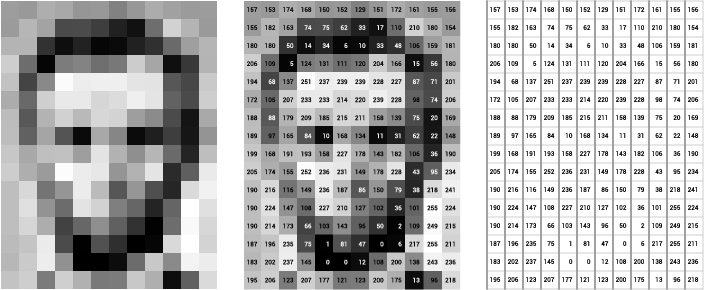
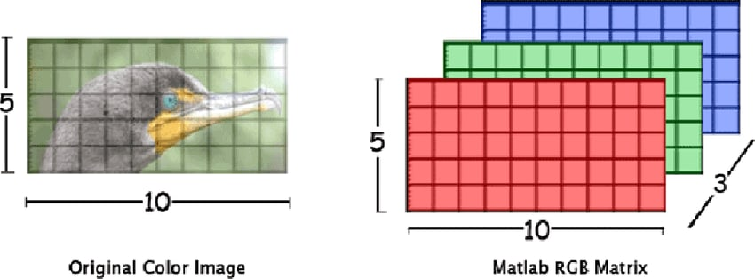
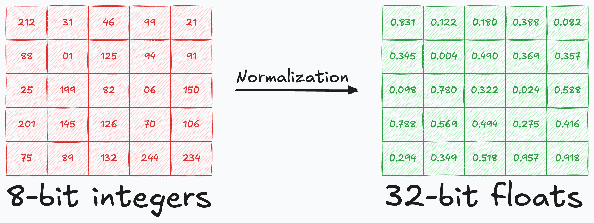
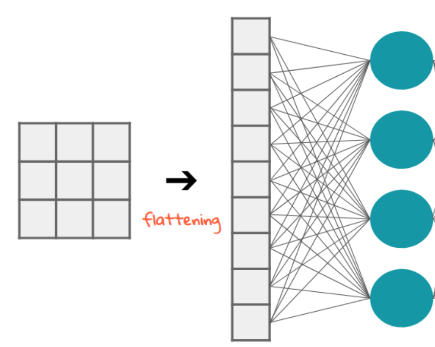

Hasta ahora hemos trabajado con datos tabulares (filas y columnas de números). Sin embargo, en **Visión Artificial**, nuestra materia prima son las **imágenes**. 

¿Cómo entiende una red neuronal una fotografía? ¿Podemos usar las mismas redes densas que vimos para predecir el precio de una casa o la especie de una flor? La respuesta es **sí, pero con matices importantes**.

---

## 1. Las Imágenes como Tensores

Para un ordenador, una imagen no es más que una matriz de números (un **tensor**). 

*   **Escala de Grises:** Una matriz 2D de píxeles. Cada píxel suele tener un valor entre `0` (negro) y `255` (blanco).




*   **Color (RGB):** Un tensor 3D con tres "canales" (Rojo, Verde, Azul). Su forma (*shape*) es `(Alto, Ancho, 3)`.



:::tip ¿Color o Blanco y Negro?
La elección depende de si el **color es una característica clave** para resolver el problema:

*   **Pasamos a Blanco y Negro si...** ahorramos recursos y el color no aporta nada (ej: el número "7" es el mismo en azul que en rojo, o una radiografía médica donde lo importante es la densidad ósea/tejidos). En **redes densas** esto es vital, ya que reducimos el número de entradas en un 66%.
*   **Trabajamos a Color (RGB) si...** es crítico para diferenciar objetos (ej: reconocer frutas maduras, señales de tráfico o diferenciar especies de pájaros por su plumaje).
:::

---

## 2. Preprocesamiento Crítico: Normalización

Antes de pasar una imagen por una red neuronal, es **obligatorio** realizar una normalización básica. Las imágenes vienen en un rango `[0, 255]`, pero las redes neuronales convergen mucho mejor (y más rápido) si los datos están en el rango **`[0, 1]`**.

```python
# Normalización típica
x_train = x_train / 255.0
x_valid = x_valid / 255.0
x_test = x_test / 255.0
```



Al realizar esta división, estamos "aplastando" cada valor de intensidad (ya sea de un único canal en gris o de los tres canales RGB) al rango **`[0, 1]`**. 

Si no normalizamos, los gradientes pueden volverse inestables y la red tardará mucho más en aprender o, peor aún, no llegará a aprender nada.

---

## 3. El Problema de la Estructura: Flattening

Las capas `Dense` (densas) necesitan un **vector 1D** como entrada. Sin embargo, una imagen de 28x28 píxeles es una matriz 2D. 

Para poder procesarla, necesitamos realizar un proceso de **Flattening** (aplanado): "estirar" la matriz fila por fila hasta convertirla en una sola línea de números.

*   **En Gris (2D):** Una imagen de 28x28 se convierte en un vector de $28 \times 28 = 784$ elementos.
*   **En Color (3D):** Una imagen de 28x28x3 se convierte en un vector de $28 \times 28 \times 3 = 2.352$ elementos.

En Keras, esto se hace de forma sencilla con una capa especial:

```python
from tensorflow.keras import layers

# Para imágenes en Blanco y Negro
model_gris = models.Sequential([
    layers.Flatten(input_shape=(28, 28)), # Entrada de 784
    layers.Dense(128, activation='relu'),
    layers.Dense(10, activation='softmax')
])

# Para imágenes en Color (RGB)
model_color = models.Sequential([
    layers.Flatten(input_shape=(28, 28, 3)), # Entrada de 2.352
    layers.Dense(128, activation='relu'),
    layers.Dense(10, activation='softmax')
])
```



---

## 4. Demo: El "Hola Mundo" de la Visión (MNIST Dígitos)

Para esta demo utilizaremos el dataset **MNIST** original, que consiste en 70.000 imágenes de dígitos del 0 al 9 escritos a mano. Es el ejemplo canónico en Deep Learning.

:::info ¿De dónde sale el dataset?
Keras incluye utilidades para descargar automáticamente los datasets más comunes (como MNIST y Fashion MNIST) desde los repositorios oficiales si no los tienes ya en tu máquina. Puedes ver aquí la documentación oficial: [Keras Datasets](https://keras.io/api/datasets/)
:::

Usaremos una arquitectura de clasificación multiclase (10 neuronas de salida con Softmax):

1.  **Capa de entrada (Flatten):** Convierte los 28x28 píxeles en 784 entradas.
2.  **Capa oculta:** vamos a probar varias arquitecturas.
3.  **Capa de salida:** 10 neuronas con **Softmax** (para distinguir los dígitos del 0 - 9)

👉 **[Abrir Cuaderno: MNIST Dígitos con Redes Densas](../0-colab/mnist_digitos_densas.ipynb)**

🌐 **[Web App: Predictor de Dígitos (MNIST)](https://pia-mnist.netlify.app/)**

📦 **[Descargar Código Fuente Web (ZIP)](../0-colab/mnist_web.zip)**

---

## 5. ¿Por qué las Redes Densas NO son ideales para Imágenes?

Aunque el modelo anterior funciona muy bien para números (podemos superar el 95% de accuracy), las redes densas tienen tres problemas fundamentales cuando la complejidad visual aumenta:

### A. Pérdida de la Relación Espacial
Al realizar el **Flatten**, estamos tratando cada píxel como una variable independiente y aislada del resto. 

*   **En una imagen 2D**, un píxel tiene una relación directa con sus vecinos (arriba, abajo, izquierda, derecha). Estos grupos de píxeles cercanos forman estructuras: un borde, una sombra o una textura.
*   **En el vector 1D**, un píxel que estaba justo encima de otro en la imagen original puede acabar a cientos de posiciones de distancia en el vector "aplanado". 

La red densa "olvida" la geometría. Para ella, la entrada es solo una lista de 784 números. No entiende que el píxel 34 y el 35 están uno al lado del otro y que juntos podrían estar formando parte de la curva de un número "8". Es como intentar montar un puzzle mirando las piezas de una en una a través de un tubo estrecho, sin ver cómo encajan con las de alrededor.

### B. Explosión de Parámetros
Para una imagen pequeña de 28x28 (784 píxeles), una capa oculta de 512 neuronas genera unos 400.000 pesos. 
*   ¿Qué pasa con una foto de móvil de **1000x1000** píxeles? 
*   $1.000.000$ de entradas $\times 512$ neuronas = **¡512 millones de parámetros!** solo en la primera capa. Es computacionalmente inviable.

### C. Falta de Invarianza a la Traslación
Una red densa aprende que una "oreja de gato" está en los píxeles (10, 10). Si en otra foto el gato se mueve y la oreja está en el píxel (50, 50), la red densa **no sabrá que es la misma oreja**. No es capaz de reconocer patrones independientemente de dónde aparezcan en la imagen.

:::tip Importancia de las Redes Neuronales Convolucionales
Para solucionar estos problemas, en el siguiente apartado introduciremos las **Convolutional Neural Networks (CNN)**.
:::

---

## Actividad de Seguimiento: Fashion MNIST

Ahora que has visto cómo funciona el proceso con dígitos, es tu turno. Para esta actividad utilizaremos **Fashion MNIST**, un dataset con 10 categorías de ropa (camisetas, botas, bolsos...). Es idéntico en forma al de dígitos (28x28, gris) pero sensiblemente más difícil de clasificar.

1.  **Carga el dataset**: Utiliza `datasets.fashion_mnist.load_data()`.
2.  **Visualiza**: Muestra algunas muestras y sus etiquetas correspondientes.
3.  **Normaliza**: Recuerda el paso de dividir por 255.0.
4.  **Crea la Red**: Define una arquitectura densa similar a la de la demo y prueba a añadir más capas ocultas.
5.  **Entrena y Monitoriza**: Utiliza TensorBoard para vigilar el overfitting y las técnicas de regularización.
6.  **Evalúa**: Muestra la **Matriz de Confusión**. ¿En qué prendas se equivoca más el modelo?
7.  **Exporta el modelo** y crea una **Web App** para probarlo.

¿Podrás superar el 85% de accuracy con una red puramente densa?