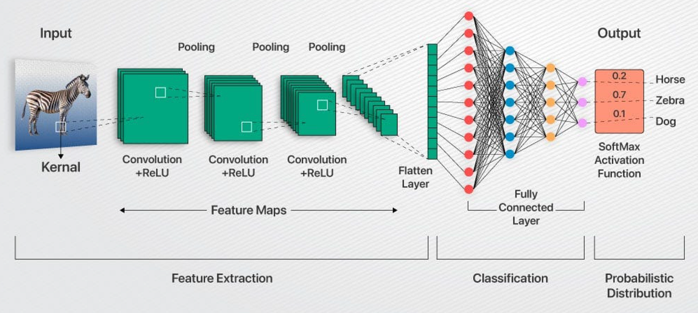
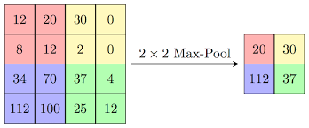
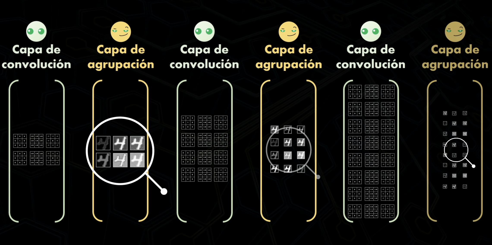

En el apartado anterior vimos que las redes densas (MLP) sufren con las imágenes: pierden la estructura espacial, desperdician parámetros y no son invariantes a la traslación. 

Las **Redes Neuronales Convolucionales (CNN)** fueron diseñadas específicamente para imitar el funcionamiento de la corteza visual humana, procesando la información de forma local y jerárquica.

Para entenderlas, debemos dividirlas en **dos grandes fases**:

1.  **Fase de Extracción (Convolución + Pooling)**: Es la parte "visual". La red busca patrones (bordes, texturas, formas) y va reduciendo la imagen para quedarse solo con lo importante.
2.  **Fase de Clasificación (Capas Densas)**: Es la parte "lógica". Una vez extraídas las características, se pasan a una red densa tradicional que decide si la imagen es un "7", un "gato" o una "botas".



:::info Refuerzo Teórico
Para una explicación visual y detallada de cómo funcionan las CNN, te recomendamos ver este vídeo de **Ringa Tech**: [YouTube: Redes Neuronales Convolucionales - Clasificación avanzada de imágenes con IA / ML (CNN)](https://www.youtube.com/watch?v=4sWhhQwHqug&list=PLZ8REt5zt2Pn0vfJjTAPaDVSACDvnuGiG&index=4)
:::

---

## 1. El Bloque Constructivo: La Convolución

La operación de **convolución** consiste en pasar un "ojo pequeño" (**filtro** o **kernel**) sobre la imagen para buscar patrones específicos.

### 1.1. ¿Qué es un Filtro (Kernel)?
Un filtro es una matriz numérica (normalmente de 3x3 o 5x5) que actúa como un **detector de características**. 

*   **Detección de Bordes**: Algunos filtros están diseñados para resaltar líneas verticales, horizontales o diagonales.
*   **Texturas y Formas**: A medida que profundizamos en la red, los filtros aprenden a reconocer patrones más complejos como esquinas, círculos o texturas específicas (pelo, metal, etc.).

### 1.2. ¿Cómo funciona la operación?
El filtro se desliza (*stride*) por toda la imagen realizando una multiplicación punto a punto y sumando los resultados. El valor resultante se coloca en una nueva matriz llamada **Feature Map** (mapa de características).


### 1.3. ¿Por qué apilar varias capas Conv2D?
Es común ver arquitecturas donde ponemos dos o más capas `Conv2D` antes de un `MaxPooling2D`. Esto tiene tres ventajas clave:

1.  **Más No-Linealidad**: Cada capa tiene su propia activación (ReLU). 
2.  **Menos Parámetros**: Por ejemplo, dos capas de 3x3 usan menos parámetros que una de 5x5 para el mismo campo de visión.
3.  **Abstracción progresiva**: Permite que la red combine características simples en características más complejas.

### 1.4. Hiperparámetros Clave: Padding y Stride

*   **Stride (Zancada)**: Es el número de píxeles que el filtro "salta" en cada paso. Mayor stride = salida más pequeña.
*   **Padding (Relleno)**: Al aplicar filtros, la imagen tiende a encogerse. 
    *   **"Valid" (por defecto)**: No hay relleno. La imagen se reduce un poco en cada capa.
    *   **"Same"**: Se añade un marco de ceros para que la salida tenga el mismo tamaño que la entrada.
    
> [!IMPORTANT]
> **¿Es obligatorio el padding "same" en la primera capa?**  
> No es obligatorio, pero es **muy recomendable**.  
> Si no ponemos padding, perdemos información de los bordes justo al empezar. Al poner "same" en la primera capa, nos aseguramos de que toda la imagen (incluyendo las esquinas) sea procesada por igual antes de empezar a reducirla.

:::tip La magia del Deep Learning
En el pasado, los ingenieros diseñaban estos filtros a mano (filtros Sobel, Canny). ¡Ahora la red los aprende sola durante el entrenamiento!
:::

:::info Campo Receptivo
A diferencia de las redes densas, donde cada neurona mira TODOS los píxeles, en una CNN cada neurona de una capa convolucional solo mira una pequeña región (su **campo receptivo**).
:::

---

## 2. Reduciendo la Información: Pooling

Después de extraer características con la convolución, solemos aplicar una capa de **Pooling** (submuestreo). Su objetivo es reducir el tamaño de las representaciones y hacer que la red sea más robusta a pequeñas variaciones.

*   **Max Pooling:** Es la variante más común. Divide la imagen en rejillas (ej: 2x2) y se queda solo con el valor máximo de cada una.
*   **Beneficios:**
    *   Reduce drásticamente el número de parámetros.
    *   Proporciona **invarianza a la traslación**: si una característica (como un ojo) se mueve unos píxeles, el valor máximo seguirá siendo el mismo o muy parecido.



:::info Resultado final
El resultado final de las capas de convolución y pooling es una representación de la imagen que contiene las características más importantes de la misma.



:::

---

## 3. Arquitectura Típica de una CNN

Una CNN suele seguir un patrón repetitivo antes de llegar a la decisión final:

1.  **Bloques Conv + ReLu + Pool**: Se repiten varias veces. Las primeras capas detectan bordes simples; las últimas detectan objetos complejos (caras, ruedas, etc.).
2.  **Flatten**: Una vez que hemos filtrado y reducido la imagen a un tamaño pequeño, "aplanamos" los datos.
3.  **Capas Densas (MLP)**: Actúan como el "cerebro" final que clasifica la imagen basándose en las características que los filtros han extraído.

```python
from tensorflow.keras import layers, models

model = models.Sequential([
    # Bloque 1
    layers.Conv2D(32, (3, 3), activation='relu', input_shape=(28, 28, 1)),
    layers.MaxPooling2D((2, 2)),
    
    # Bloque 2
    layers.Conv2D(64, (3, 3), activation='relu'),
    layers.MaxPooling2D((2, 2)),

    # Clasificador final
    layers.Flatten(),
    layers.Dense(64, activation='relu'),
    layers.Dense(10, activation='softmax')
])
```

---

## 4. Profundizando: ¿Por qué más capas?

Podemos añadir más bloques de convolución y pooling para resolver problemas más complejos. 

*   **Jerarquía de Características**: Las primeras capas detectan líneas; las intermedias, formas geométricas; y las profundas, objetos completos.
*   **Regla de Oro**: A medida que la red se hace más profunda, solemos **aumentar el número de filtros** (ej: de 32 a 64, luego a 128) pero el tamaño de la imagen disminuye por el pooling.

| Nivel | Lo que "ve" la red | Ejemplos |
| :--- | :--- | :--- |
| **Bajo** | Bordes y colores | Rayas, puntos, degradados |
| **Medio** | Partes de objetos | Ojos, ruedas, esquinas |
| **Alto** | Objetos completos | Caras, coches, animales |

---

## 5. Demo: MNIST con CNN

Ahora que conocemos la teoría, vamos a aplicarla al mismo problema de los dígitos escrito a mano. Verás que conseguimos una precisión mucho mayor.

*   👉 **[Abrir Cuaderno: MNIST Dígitos con CNN](../0-colab/mnist_digitos_cnn.ipynb)**
*   🌐 **[Web App: Prueba el modelo desplegado](https://pia-mnist-cnn.netlify.app/)**
*   📦 **[Descargar Código Fuente de la Web](../0-colab/mnist_cnn_web.zip)**

---

## Actividad: Clasificador de Ropa (Fashion MNIST) y Despliegue Web

Es hora de aplicar todo lo aprendido a un dataset más complejo: **Fashion MNIST**. En lugar de números, clasificaremos artículos de ropa (camisetas, zapatillas, bolsos...).

### 1. Entrenamiento del Modelo
1. Crea un nuevo cuaderno Colab.
2. Carga el dataset `fashion_mnist` desde Keras.
3. Diseña una **arquitectura CNN profunda** (puedes inspirarte en el modelo profundo de la demo y probar nuevas arquitecturas).
4. Entrena el modelo y verifica que su precisión sea superior al 90%.

### 2. Exportación y Web
1. Exporta tu modelo entrenado en formato **TensorFlow.js**.
2. Crea una pequeña página web (HTML + JS) que permita:
   - Cargar una imagen de una prenda o dibujarla.
   - Mostrar la predicción del modelo en tiempo real.
3. Despliega la página en un servicio gratuito (Vercel, GitHub Pages o Netlify).
