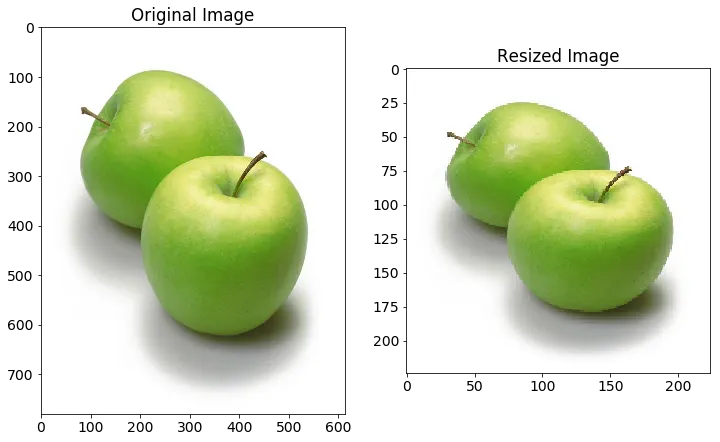
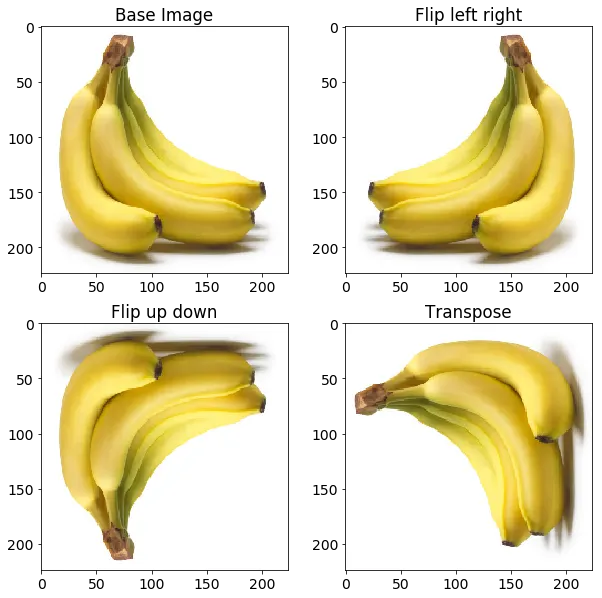
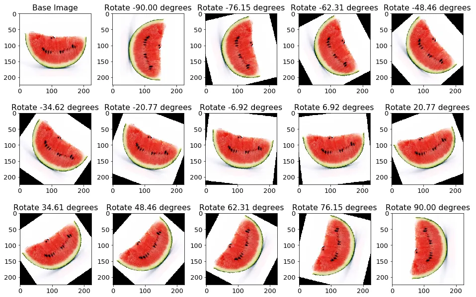
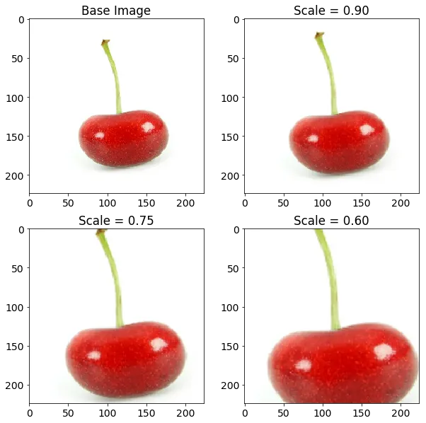
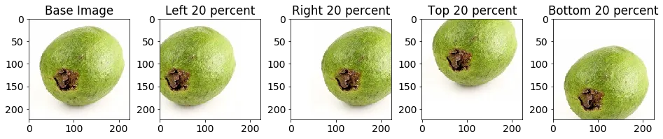
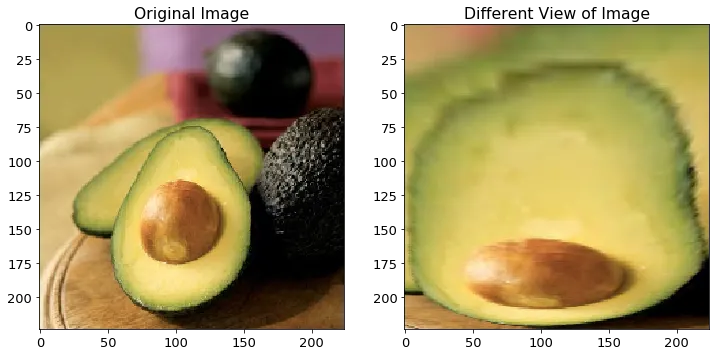
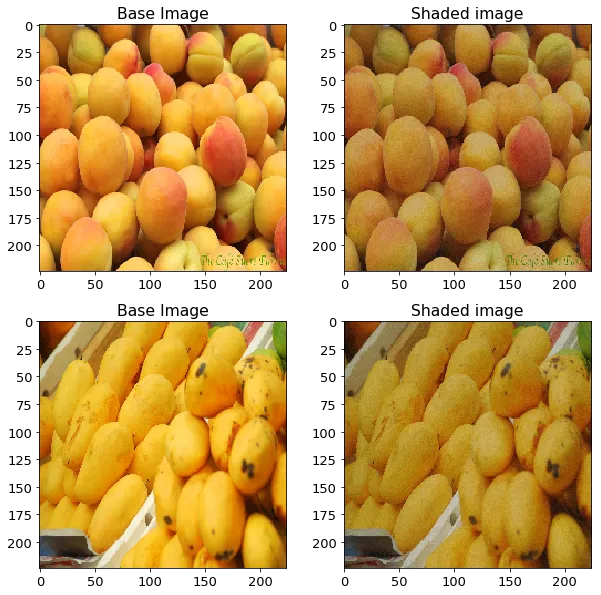
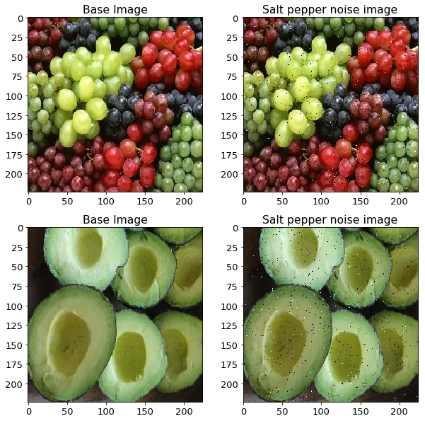

En los apartados anteriores vimos cómo funcionan las CNN y cómo pueden identificar patrones. Sin embargo, las redes profundas tienen un "defecto": son **extremadamente hambrientas de datos**. 

Si entrenamos un modelo complejo con un dataset pequeño, la red acabará memorizando las fotos concretas en lugar de aprender los conceptos generales. Esto es lo que conocemos como **Overfitting** (sobreajuste).

---

## 1. Preprocesamiento Base: Unificando la Entrada

Antes de hablar de "aumentar" los datos, debemos asegurar que todos nuestros datos tengan el mismo formato. En un proyecto real, las imágenes pueden venir de diferentes cámaras, móviles o internet, cada una con una resolución distinta.

Las redes neuronales convolucionales requieren que la entrada sea **fija** (ej: todas las imágenes deben ser de 180x180 píxeles).

### Resizing y Rescaling
Para que la red aprenda mejor, solemos aplicar tres pasos en este orden:

1.  **Resizing**: Ajusta el tamaño de la imagen (ej: 180x180). Tip: usa `crop_to_aspect_ratio=True` para no distorsionar.



2.  **Rescaling**: Comprime los píxeles de [0, 255] al rango [0, 1].

```python
from tensorflow.keras import layers

# Estas capas se añaden al principio del modelo
preprocessing_base = tf.keras.Sequential([
  layers.Resizing(180, 180, crop_to_aspect_ratio=True), # Todas a 180x180
  layers.Rescaling(1./255) # De [0, 255] a [0, 1]
])
```

### Visualizar para Verificar
¿Cómo sabemos si el `Resizing` ha cortado la imagen por donde queríamos o si el `Rescaling` ha funcionado? Podemos pasar una imagen por estas capas y mostrarla.

Ver código en colab.

:::tip **Datasets "User-Friendly" (como MNIST)**  
En el aprendizaje académico, usamos datasets como **MNIST** o **Fashion MNIST** que ya vienen "limpios": todas las imágenes son de 28x28 píxeles y están centradas. En estos casos, el `Resizing` no es necesario, pero en cualquier proyecto real con fotos "reales", es el primer paso obligatorio.
:::

---

## 2. El Problema: El Overfitting y la Escasez de Datos

Cuando una red neuronal tiene millones de parámetros pero solo unos pocos miles de imágenes para entrenar, ocurre lo siguiente:
*   La red detecta detalles irrelevantes (ej: una mancha específica en el fondo de una foto de un perro).
*   En el entrenamiento obtenemos un 99% de acierto, pero en validación/test el resultado es pobre.
*   El modelo no es capaz de **generalizar**.

**Data Augmentation** es una de las técnicas de regularización más potentes en visión artificial para solucionar esto sin necesidad de salir a la calle a sacar miles de fotos nuevas.

---

## 3. ¿Qué es el Data Augmentation?

Consiste en **generar nuevas muestras de entrenamiento a partir de las existentes**, aplicándoles transformaciones aleatorias que no cambian el significado de la imagen (la etiqueta).

Si a una foto de un gato le aplicamos una rotación de 10 grados, **sigue siendo un gato**. Para la red neuronal, sin embargo, es un conjunto de píxeles totalmente nuevo que debe aprender a clasificar.

---

## 4. Técnicas de Transformación Comunes

### 4.1. Transformaciones Geométricas
Son las más utilizadas ya que alteran la posición o la perspectiva de los objetos.

| Técnica | Descripción | Capa de Keras | Ejemplo |
| :--- | :--- | :--- | :--- |
| **Flip** | Voltea la imagen como un espejo. | `layers.RandomFlip("horizontal")` |  |
| **Rotation** | Gira la imagen aleatoriamente. | `layers.RandomRotation(0.1)` |  |
| **Zoom** | Acerca o aleja la imagen. | `layers.RandomZoom(0.1)` |  |
| **Shift** | Desplaza la imagen. | `layers.RandomTranslation(0.1, 0.1)` |  |
| **Shear** | Inclina la imagen deformada. | *(Manual o librería externa)* |  |

:::info
> **Rotation vs Shear**: Mientras que la **rotación** simplemente gira el objeto sin deformarlo, el **shear** lo inclina (como si lo viéramos de lado), cambiando sus ángulos internos.
:::

### 4.2. Transformaciones de Color y Brillo
Ayudan a que el modelo sea robusto a las condiciones ambientales y de iluminación.

| Técnica | Descripción | Capa de Keras | Ejemplo |
| :--- | :--- | :--- | :--- |
| **Brillo** | Varía la intensidad lumínica. | `layers.RandomBrightness(0.2)` |  |
| **Contraste** | Diferencia entre claros y oscuros. | `layers.RandomContrast(0.2)` |  |
| **Ruido** | Añade grano aleatorio. | `layers.GaussianNoise(0.1)` |  |

---

## 5. ¿Qué técnicas elegir? La Regla de Oro

No todas las técnicas son útiles para todos los problemas. La elección depende totalmente de la naturaleza de tus datos.

> [!IMPORTANT]
> **La Regla de Oro**: Aplica solo aquellas transformaciones que preserven el significado de la etiqueta y que representen variaciones realistas que el modelo se encontrará en el mundo real.

| Dataset | Recomendado | ¡Peligro! | Razón |
| :--- | :--- | :--- | :--- |
| **Dígitos (0-9)** | Zoom, Rotation (ligera) | Flips, Shear fuerte | Un "7" invertido no existe; un "6" invertido es un "9". |
| **Animales / Objetos** | Flips horizontales, Brillo, Zoom | Flip vertical | Un gato boca abajo no es una postura natural (habitual). |
| **Satélite / Medicina** | Flips (ambos), Rotación 360º | Brillo extremo | En el espacio o en una célula no hay un "arriba" definido. |

---

## 6. Implementación Moderna en Keras (Preprocessing Layers)

Tradicionalmente se usaba `ImageDataGenerator`, pero la forma moderna y recomendada en TensorFlow 2.x es usar **Capas de Preprocesamiento**. Se añaden directamente al modelo como si fueran capas `Conv2D`.

```python
from tensorflow.keras import layers, models

# 1. Definimos el bloque de Data Augmentation (variaciones aleatorias)
data_augmentation = models.Sequential([
  layers.RandomFlip("horizontal"),
  layers.RandomRotation(0.1),
  layers.RandomZoom(0.1),
])

# 2. Construimos el modelo integrando todo el pipeline
model = models.Sequential([
  # --- BLOQUE DE PREPROCESAMIENTO ---
  # Unificamos tamaño y normalizamos píxeles
  layers.Resizing(180, 180, crop_to_aspect_ratio=True),
  layers.Rescaling(1./255),
  
  # Aplicamos el aumento de datos (solo se activará en entrenamiento)
  data_augmentation,

  # --- ARQUITECTURA CNN ---
  layers.Conv2D(32, (3, 3), activation='relu'),
  layers.MaxPooling2D((2, 2)),
  
  layers.Conv2D(64, (3, 3), activation='relu'),
  layers.MaxPooling2D((2, 2)),

  layers.Flatten(),
  layers.Dense(64, activation='relu'),
  layers.Dense(1, activation='sigmoid') # Ejemplo para clasificación binaria
])
```

:::tip
**¿Esto ocurre en el disco?**  
No. Las transformaciones se calculan **en memoria y en tiempo real** (normalmente en la GPU) mientras el modelo está entrenando. El dataset original en el disco no cambia.

**¿Y en la fase de test?**  
Keras es inteligente: estas capas de "Random" **solo se activan durante el entrenamiento**. Al usar `model.evaluate()` o `model.predict()`, las capas se desactivan automáticamente para no alterar las imágenes de prueba.
:::

#### ¿Cómo funciona el mecanismo? 

Para entender bien qué está pasando "bajo el capó" y resolver las dudas más comunes:

*   **¿Se aplican todas las transformaciones a la vez?**  
    Sí, es una **cadena secuencial**. Cada imagen que entra en el modelo pasa por todas las capas de la secuencia. Sin embargo, recuerda que son capas "Random": esto significa que para una imagen concreta, la rotación puede ser de 5º, mientras que para la siguiente imagen del mismo batch puede ser de 0º (sin efecto).

*   **¿Se crean nuevas imágenes en mi disco duro?**  
    **No.** No se generan nuevos archivos `.jpg` o `.png`. La transformación ocurre "al vuelo" (*on-the-fly*) en la memoria RAM o GPU. Una vez que la red ha procesado esa versión deformada para aprender, esa imagen se descarta y se procesa la siguiente. Tu disco duro no se llenará de copias.

*   **¿Aumenta el tamaño de mi dataset?**  
    Técnicamente, no verás que tu dataset pase de 1000 a 5000 fotos. En cada época (*epoch*) el modelo procesará el mismo número de imágenes. Pero aquí está la magia: **nunca verá la misma imagen dos veces**. En la Época 1 verá al perro girado a la izquierda, y en la Época 2 lo verá con zoom. Esto crea un **dataset virtualmente infinito**.

*   **¿Por qué no es mejor crear las imágenes antes y guardarlas?**  
    Aparte del ahorro masivo de espacio en disco, el aumento en tiempo real permite una **variedad infinita**. Si guardaras las imágenes, estarías limitado a las 3 o 4 variaciones que hayas decidido crear. Con Keras, las posibilidades de ángulos, zooms y brillos son infinitas.

*   **¿Esto no hace que el entrenamiento sea más lento?**  
    Al tener que calcular transformaciones matemáticas para cada imagen, hay un pequeño coste. Sin embargo, Keras ejecuta estas capas directamente en la **GPU**, por lo que esa ralentización es casi imperceptible en comparación con el beneficio que aporta.

*   **¿Qué pasa con las imágenes de Validación?**  
    Es vital que las imágenes de validación/test **no se transformen** (queremos evaluar el modelo con datos reales y fijos). Keras lo gestiona automáticamente: estas capas detectan cuándo estás en fase de predicción (`model.predict`) o evaluación y se "apagan" solas, dejando pasar la imagen original sin cambios.

### Visualizando el Aumento de Datos
Es **vital** visualizar varias versiones de una misma imagen para asegurarnos de que el aumento no es tan agresivo que el objeto deje de ser identificable.

Ver código en colab.

---

## 7. Impacto en la Generalización

Al usar Data Augmentation, la curva de pérdida (*loss*) de entrenamiento bajará más despacio (porque el problema se ha vuelto "más difícil" al variar las imágenes), pero la curva de validación se mantendrá mucho más cerca de la de entrenamiento.

**Resultado:** Un modelo más robusto, menos propenso al overfitting y capaz de reconocer objetos en ángulos o posiciones que nunca vio exactamente igual en el dataset original.

---

## 8. Demo: Clasificador de números

Para ver esto en acción, utilizaremos un dataset clásico de Kaggle: **Dogs vs Cats**. Es un dataset donde las imágenes tienen diferentes tamaños, luces y fondos, lo que lo hace ideal para aplicar estas técnicas.

👉 **[Abrir Cuaderno: MNIST con Data Augmentation](../0-colab/mnist_digitos_data_augmentation.ipynb)**

---

## Actividad Sugerida: El Reto de las Manos

¿Recuerdas el dataset de **Fashion MNIST**? Aunque las prendas suelen estar centradas, podrías probar lo siguiente:

1.  Recupera tu mejor modelo de Fashion MNIST.
2.  Crea una pequeña secuencia de Data Augmentation que incluya `RandomRotation(0.05)` y `RandomZoom(0.05)`.
3.  Entrena de nuevo y compara las gráficas de Accuracy/Loss con y sin aumento de datos.
4.  **Reflexión**: ¿Ha mejorado la precisión final? ¿Cómo ha afectado al tiempo de entrenamiento?
