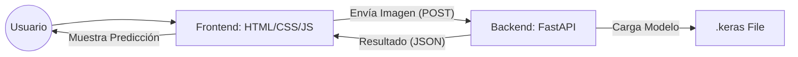

Una vez que hemos entrenado nuestro modelo de clasificación de **perros vs gatos** y estamos satisfechos con su precisión, el siguiente paso lógico es sacarlo del entorno de desarrollo (Google Colab) y ponerlo a disposición de los usuarios.

Para ello, crearemos una **API (Application Programming Interface)** que actúe como puente entre el modelo de Inteligencia Artificial y una página web o aplicación móvil.

---

## 1. Exportar el Modelo desde Colab

El entrenamiento es un proceso costoso que solo hacemos una vez. Una vez terminado, queremos guardar el "cerebro" (los pesos y la arquitectura) de nuestra red en un archivo.

### Guardar en formato Nativo `.keras`
La forma recomendada en las versiones actuales de TensorFlow/Keras es guardar el modelo completo en un solo archivo:

```python
# Al final de tu cuaderno de Colab
modelo.save('modelo_perros_gatos.keras')
```

### Descargar el archivo
Para llevarlo a tu ordenador local, puedes usar el panel de archivos de Colab (botón derecho -> Descargar) o mediante código:

```python
from google.colab import files
files.download('modelo_perros_gatos.keras')
```

:::info
**¿Por qué exportar?**  
Si no exportamos el modelo, tendríamos que reentrenarlo cada vez que quisiéramos usarlo, lo cual es ineficiente y lento. El archivo `.keras` contiene todo lo necesario para cargar el modelo y hacer predicciones de forma instantánea.
:::

---

## 2. Arquitectura de la Aplicación

En un entorno de producción, dividimos la responsabilidad en dos grandes bloques: el **Backend** (donde vive la IA) y el **Frontend** (lo que ve el usuario).



### Responsabilidades

| Componente | Tecnología | Responsabilidad Principal |
| :--- | :--- | :--- |
| **Backend (API)** | FastAPI + TensorFlow | Cargar el modelo, preprocesar la imagen recibida, realizar la inferencia y devolver la probabilidad/etiqueta. |
| **Frontend (Web)** | HTML + CSS + JS | Interfaz de usuario, captura de la imagen (archivo o cámara), envío de la petición a la API y visualización del resultado. |

---

## 3. Preparando el Entorno Local

Para ejecutar nuestra API en local, necesitamos preparar un entorno de trabajo limpio.

### Crear un Entorno Virtual (venv)
Es una buena práctica crear un "aislamiento" para que las librerías de este proyecto no entren en conflicto con otros.

```bash
# Crear el entorno (ejecutar en la carpeta de tu proyecto)
python -m venv venv

# Activar el entorno (Linux/Mac)
source venv/bin/activate

# Activar el entorno (Windows)
venv\Scripts\activate
```

### Instalar Dependencias
Instalaremos solo lo estrictamente necesario para que la API funcione:

```bash
pip install fastapi uvicorn tensorflow-cpu pillow python-multipart
```

*   **fastapi**: El framework para crear la API.
*   **uvicorn**: El servidor que ejecutará FastAPI.
*   **tensorflow-cpu**: Versión ligera de TF (no necesitamos entrenar, solo predecir).
*   **pillow**: Para manipular y redimensionar las imágenes que suba el usuario.
*   **python-multipart**: Necesario para que FastAPI pueda recibir archivos de imagen.

---

## 4. ¿Qué es FastAPI?

**FastAPI** es un framework moderno y de alto rendimiento para construir APIs con Python. Sus principales ventajas son:

1.  **Velocidad**: Es uno de los frameworks de Python más rápidos.
2.  **Documentación Automática**: Nada más crear la API, genera una web interactiva (Swagger UI) para probarla.
3.  **Tipado de datos**: Usa estándares de Python para validar que los datos que llegan son correctos.

### Ejemplo "Hola Mundo" en FastAPI
Crea un archivo llamado `main.py`:

```python
from fastapi import FastAPI

app = FastAPI()

@app.get("/")
def home():
    return {"mensaje": "API de Clasificación de Mascotas Activa"}
```

Para ejecutarlo: `uvicorn main:app --reload`.

---

## 5. Implementación del Backend (main.py)

Aquí es donde ocurre la magia. La API recibirá una imagen, la convertirá al formato que el modelo espera (180x180 y normalizada) y devolverá si es un perro o un gato.

```python
import io
import numpy as np
import tensorflow as tf
from PIL import Image
from fastapi import FastAPI, UploadFile, File
from fastapi.middleware.cors import CORSMiddleware

app = FastAPI()

# Permitir que el Frontend (en otro puerto o dominio) pueda consultar la API
app.add_middleware(
    CORSMiddleware,
    allow_origins=["*"],
    allow_methods=["*"],
    allow_headers=["*"],
)

# 1. Cargar el modelo al arrancar la API
model = tf.keras.models.load_model('modelo_perros_gatos.keras')

def preprocess_image(image_bytes):
    # Abrir la imagen con PIL
    img = Image.open(io.BytesIO(image_bytes))
    # Redimensionar al tamaño que usamos en Colab (ej: 180x180)
    img = img.resize((180, 180))
    # Convertir a array de numpy
    img_array = np.array(img)
    # Normalizar (0 a 1)
    img_array = img_array / 255.0
    # Añadir dimensión de batch (1, 180, 180, 3)
    img_array = np.expand_dims(img_array, axis=0)
    return img_array

@app.post("/predict")
async def predict(file: UploadFile = File(...)):
    # Leer el archivo que sube el usuario
    contents = await file.read()
    # Preprocesar
    processed_image = preprocess_image(contents)
    # Realizar la predicción
    prediction = model.predict(processed_image)
    
    # Supongamos que 0 = Gato, 1 = Perro (según tu entrenamiento)
    clase = "Perro" if prediction[0][0] > 0.5 else "Gato"
    score = float(prediction[0][0]) if clase == "Perro" else 1 - float(prediction[0][0])

    return {
        "etiqueta": clase,
        "confianza": f"{score*100:.2f}%"
    }
```

---

## 6. Implementación del Frontend (HTML/JS)

Un frontend sencillo para que el usuario pueda interactuar con el modelo.

```html
<!DOCTYPE html>
<html lang="es">
<head>
    <meta charset="UTF-8">
    <title>Clasificador Perros vs Gatos</title>
    <style>
        body { font-family: sans-serif; text-align: center; padding: 50px; }
        .result { margin-top: 20px; font-size: 1.5em; font-weight: bold; }
    </style>
</head>
<body>
    <h1>¿Es un perro o un gato? 🐶🐱</h1>
    <input type="file" id="imageInput" accept="image/*">
    <button onclick="predecir()">Analizar Imagen</button>
    
    <div id="loading" style="display:none;">Analizando...</div>
    <div class="result" id="resultado"></div>

    <script>
        async function predecir() {
            const input = document.getElementById('imageInput');
            if (input.files.length === 0) return alert("Selecciona una imagen");

            const formData = new FormData();
            formData.append('file', input.files[0]);

            document.getElementById('loading').style.display = 'block';
            document.getElementById('resultado').innerText = '';

            try {
                // Petición a nuestra API local
                const response = await fetch('http://localhost:8000/predict', {
                    method: 'POST',
                    body: formData
                });
                const data = await response.json();
                
                document.getElementById('resultado').innerText = 
                    `Es un ${data.etiqueta} (${data.confianza})`;
            } catch (error) {
                console.error(error);
                alert("Error al conectar con la API");
            } finally {
                document.getElementById('loading').style.display = 'none';
            }
        }
    </script>
</body>
</html>
```

---

## 7. Opciones de Despliegue

Una vez que todo funciona en tu ordenador (`localhost`), el siguiente paso es subirlo a internet para que cualquiera pueda usarlo.

### Opción A: Hugging Face Spaces (Recomendado para ML)
**Hugging Face** ofrece una plataforma llamada "Spaces" que es gratuita y está pensada específicamente para demostraciones de modelos de IA.

*   **Hugging Face + Docker**: Puedes subir tu código de FastAPI en un contenedor Docker. Hugging Face te dará una URL pública para tu backend.
*   **Hugging Face + Gradio/Streamlit**: Si no quieres programar un frontend con HTML/JS, puedes usar estas librerías de Python para crear una interfaz rápida en minutos.

### Opción B: Separar Backend y Frontend (Arquitectura Profesional)
Es la opción más común si quieres tener una web personalizada:

*   **Backend (API)**: Despliégalo en plataformas como **Render**, **Railway** o **Fly.io**. Soportan Python y puedes conectar tu repo de GitHub para que se actualicen solos.
*   **Frontend (Web)**: Al ser solo archivos estáticos (HTML, CSS, JS), puedes subirlo gratis a **Netlify**, **Vercel** o **GitHub Pages**. 
    *   *Importante*: Recuerda cambiar la URL del `fetch` en tu JS: de `http://localhost:8000/predict` a la URL real que te dé el servidor de backend.

---

## Resumen del Workflow

1.  **Entrena** y **valida** tu modelo en Google Colab.
2.  **Exporta** a `.keras` y descárgalo.
3.  Crea un **entorno virtual** local e instala las dependencias.
4.  Crea la **API con FastAPI** que cargue el modelo.
5.  Crea un **Frontend** que consuma esa API mediante `fetch`.
6.  **¡Despliega!** (Opcionalmente a servicios como Render, Railway o AWS).

---

## Demo y Recursos

👉 **[Abrir Cuaderno: Entrenamiento Perros vs Gatos](../0-colab/perros_vs_gatos_cnn.ipynb)**  
👉 **[Código Completo de la API (ZIP)](../0-colab/perros_gatos_api.zip)**