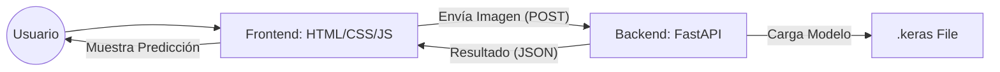
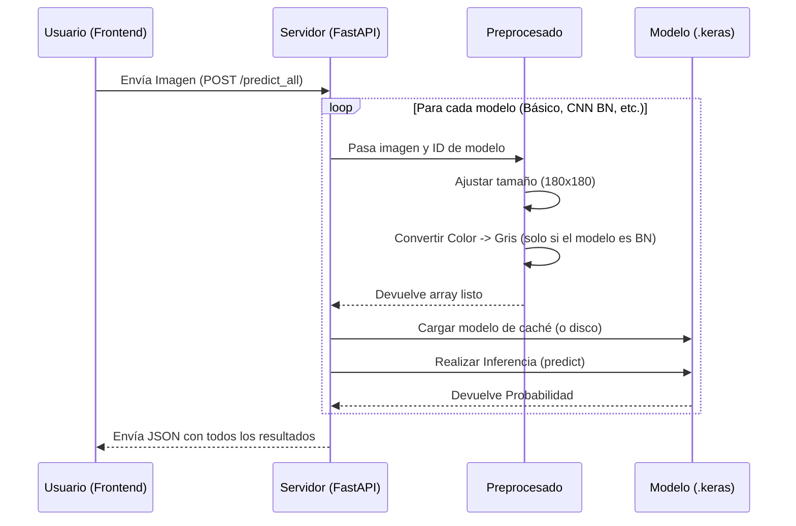
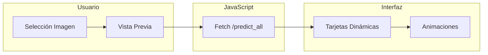

En el siguiente colab se explica cómo entrenar modelos a color y blanco y negro. Una vez que hemos entrenado nuestro modelo de clasificación de **perros vs gatos** y estamos satisfechos con su precisión, el siguiente paso lógico es sacarlo del entorno de desarrollo (Google Colab) y ponerlo a disposición de los usuarios.

👉 **[Abrir Cuaderno: Clasificador perros y gatos](../0-colab/perros_vs_gatos_cnn.ipynb)**

Hasta ahora, habíamos utilizado **TensorFlow.js** para ejecutar modelos directamente en el navegador. Sin embargo, para modelos más complejos como los de visión artificial, crear una **API (Application Programming Interface)** en el servidor es una mejor idea por varias razones:
1. **Protección de la Propiedad Intelectual**: El modelo no se descarga en el cliente; nadie puede "robarte" tu entrenamiento.
2. **Eficiencia**: No obligamos al usuario a descargar archivos de varios megabytes antes de poder usar la aplicación.
3. **Potencia de Cómputo**: La inferencia se hace en el servidor, permitiendo que la aplicación funcione fluida incluso en dispositivos móviles poco potentes.

En esta sección, crearemos una API que actúe como puente entre el modelo de Inteligencia Artificial y una página web o aplicación móvil.

---

## 1. Exportar el Modelo desde Colab

El entrenamiento es un proceso costoso que solo hacemos una vez. Una vez terminado, queremos guardar el "cerebro" (los pesos y la arquitectura) de nuestra red en un archivo.

### Guardar en formato Nativo `.keras`
La forma recomendada en las versiones actuales de TensorFlow/Keras es guardar el modelo completo en un solo archivo:

```python
# Al final de tu cuaderno de Colab
modelo.save('modelo_perros_gatos.keras')
```

### Descargar el archivo
Para llevarlo a tu ordenador local, puedes usar el panel de archivos de Colab (botón derecho -> Descargar) o mediante código:

```python
from google.colab import files
files.download('modelo_perros_gatos.keras')
```

:::info
**¿Por qué exportar?**  
Si no exportamos el modelo, tendríamos que reentrenarlo cada vez que quisiéramos usarlo, lo cual es ineficiente y lento. El archivo `.keras` contiene todo lo necesario para cargar el modelo y hacer predicciones de forma instantánea.
:::

---

## 2. Arquitectura de la Aplicación

En un entorno de producción, dividimos la responsabilidad en dos grandes bloques: el **Backend** (donde vive la IA) y el **Frontend** (lo que ve el usuario).



### Responsabilidades

| Componente | Tecnología | Responsabilidad Principal |
| :--- | :--- | :--- |
| **Backend (API)** | FastAPI + TensorFlow | Cargar el modelo, preprocesar la imagen recibida, realizar la inferencia y devolver la probabilidad/etiqueta. |
| **Frontend (Web)** | HTML + CSS + JS | Interfaz de usuario, captura de la imagen (archivo o cámara), envío de la petición a la API y visualización del resultado. |

---

## 3. Preparando el Entorno Local

Para ejecutar nuestra API en local, necesitamos preparar un entorno de trabajo limpio.

### Crear un Entorno Virtual (venv)

Un **entorno virtual** es como una "burbuja" o compartimento estanco dentro de tu sistema. En el desarrollo con Python, es fundamental utilizarlos por varias razones:

1.  **Evitar conflictos**: Diferentes proyectos pueden necesitar versiones distintas de la misma librería (por ejemplo, TensorFlow 2.12 vs 2.15). El entorno virtual permite que cada proyecto tenga exactamente lo que necesita sin interferir con los demás.
2.  **Limpieza**: No "ensucias" tu instalación global de Python con cientos de paquetes que solo vas a usar en un proyecto concreto.
3.  **Portabilidad**: Facilita que otras personas puedan replicar tu entorno de trabajo exacto.

Es una buena práctica crear este "aislamiento" antes de empezar a instalar dependencias.

```bash
# Crear el entorno (ejecutar en la carpeta de tu proyecto)
python -m venv venv

# Activar el entorno (Linux/Mac)
source .venv/bin/activate

# Activar el entorno (Windows)
venv\Scripts\activate
```

### Instalar Dependencias

En lugar de instalar las librerías una a una, en proyectos profesionales solemos utilizar un archivo llamado `requirements.txt`. Este archivo es una simple lista que indica a Python qué paquetes (y qué versiones) necesita tu proyecto para funcionar.

**Ventajas de usar un archivo de requisitos:**
*   **Consistencia**: Asegura que cualquier persona (o tú mismo en el futuro) instale exactamente las mismas librerías.
*   **Automatización**: Con un solo comando instalas todo de golpe.

**Forma de uso:**
1.  Crea un archivo de texto llamado `requirements.txt` en la carpeta de tu proyecto.
2.  Pega el siguiente contenido (o los paquetes que tu proyecto necesite para funcionar):

```text
fastapi
uvicorn[standard]
tensorflow
python-multipart
pillow
numpy
```

3.  Ejecuta el siguiente comando para instalar todo lo que hay en el archivo:

```bash
pip install -r requirements.txt
```

**¿Qué estamos instalando?**

*   **fastapi**: El framework para crear la API.
*   **uvicorn[standard]**: El servidor que ejecutará FastAPI. La opción `[standard]` incluye librerías de red más rápidas.
*   **tensorflow**: La librería principal para cargar nuestro modelo y hacer predicciones.
*   **python-multipart**: Necesario para que FastAPI pueda recibir archivos (como las imágenes que subirá el usuario).
*   **pillow**: Para manipular, abrir y redimensionar las imágenes.
*   **numpy**: Para realizar operaciones matemáticas fluidas con los arrays de las imágenes.

---

## 4. ¿Qué es FastAPI?

**FastAPI** es un framework moderno y de alto rendimiento para construir APIs con Python. Sus principales ventajas son:

1.  **Velocidad**: Es uno de los frameworks de Python más rápidos.
2.  **Documentación Automática**: Nada más crear la API, genera una web interactiva (Swagger UI) para probarla.
3.  **Tipado de datos**: Usa estándares de Python para validar que los datos que llegan son correctos.

### Ejemplo: Servidor de Archivos Estáticos

FastAPI nos permite crear una API de datos y, al mismo tiempo, servir nuestra página web (archivos estáticos como HTML, CSS y JS). 

Crea un archivo llamado `main.py`:

```python title="main.py"
import uvicorn
from fastapi import FastAPI
from fastapi.staticfiles import StaticFiles
from fastapi.responses import FileResponse

app = FastAPI()

# 1. Rutas de la API (devuelven JSON)
@app.get("/api/estado")
def estado():
    return {"status": "ok", "mensaje": "Servidor activo"}

# 2. Servir la carpeta de estáticos (donde guardes tu index.html, styles.css...)
# Montamos la carpeta "static" para que sea accesible desde la web
app.mount("/static", StaticFiles(directory="static"), name="static")

# 3. Ruta para mostrar el HTML principal al entrar en la raíz "/"
@app.get("/")
def read_index():
    return FileResponse('static/index.html')

# 4. Bloque para ejecutar con: python main.py
if __name__ == "__main__":
    uvicorn.run(app, host="0.0.0.0", port=8000)
```

### ¿Cómo funciona este código? (Componentes Básicos)

Para entender las piezas fundamentales de FastAPI que hemos usado arriba:

1.  **Instancia de la API (`app`)**: Es el objeto principal que representa nuestra aplicación. Se crea con `app = FastAPI()`.
2.  **Decoradores de Operación (`@app.get`, `@app.post`)**: Indican a FastAPI que la función que hay debajo se encarga de manejar una petición web. 
    *   **Método HTTP**: `.get()` para pedir datos (como el HTML), `.post()` para enviarlos (como cuando mandamos una imagen para predecir).
    *   **Ruta (Path)**: El texto dentro de los paréntesis (ej: `"/"` o `"/api/estado"`) es la dirección URL donde se "escucha".
3.  **Función de Operación**: La función que se ejecuta cuando alguien entra en esa ruta. Puede devolver diccionarios, listas o archivos (`FileResponse`), y FastAPI se encarga de enviarlos correctamente al navegador.
4.  **StaticFiles**: Es el módulo que permite que FastAPI busque y entregue archivos (CSS, Imágenes, JS) automáticamente desde una carpeta de nuestro ordenador.

:::info
**Estructura de Carpetas Recomendada**  
Para que el código anterior funcione, tu proyecto debería verse así:
```text
📦 mi-proyecto
 ┣ 📂 static
 ┃ ┣ 📜 styles.css
 ┃ ┗ 📜 script.js
 ┣ 📜 index.html
 ┣ 📜 main.py
 ┗ 📜 requirements.txt
```
:::

---

## 5. Implementación del Backend (main.py)

En este apartado resumimos la lógica fundamental de nuestro servidor `main.py`. El flujo de trabajo principal se basa en recibir una imagen y procesarla según el modelo elegido.

### El flujo de una petición (`/predict_all`)

Cuando el usuario solicita comparar todos los modelos, el servidor realiza los siguientes pasos de forma secuencial para cada uno:



### Puntos clave de la lógica

1.  **Preprocesado adaptativo**: El servidor detecta automáticamente si el modelo seleccionado espera una imagen a **color (3 canales)** o en **escala de grises (1 canal)**. Si es necesario, realiza la conversión antes de la predicción.
2.  **Carga eficiente**: Los modelos se guardan en un diccionario (**caché**) tras la primera carga. Así, las siguientes predicciones son casi instantáneas porque el modelo ya está en la memoria RAM.
3.  **Normalización**: No dividimos manualmente por 255 porque nuestros modelos ya incluyen una capa interna de `Rescaling` que lo gestiona.
4.  **Respuesta unificada**: El servidor devuelve siempre un objeto **JSON** con la etiqueta final ("Perro" o "Gato") y el porcentaje de confianza, facilitando su visualización en el frontend.


## 6. Implementación del Frontend

En este apartado explicamos cómo funciona la lógica de nuestra página web para interactuar con la Inteligencia Artificial.

### Flujo de Trabajo del Frontend

El frontend no contiene el modelo, sino que actúa como una interfaz "viva" que se comunica con el servidor. Estos son los pasos que sigue:



### Puntos clave del código

1.  **Captura y Vista Previa**: Utilizamos el objeto `FileReader` de JavaScript para leer la imagen del disco y mostrarla en pantalla antes de enviarla. Así el usuario sabe qué está analizando.
2.  **Envío de Datos (`FormData`)**: Al ser una imagen (un archivo binario), no podemos enviarla como texto normal. Usamos un objeto `FormData` que empaqueta todo el archivo de forma que la API de FastAPI pueda entenderlo.
3.  **Interacción con la API (`fetch`)**: La magia ocurre al llamar a la ruta `/predict_all`. El frontend se queda "esperando" (con un cargador visual) hasta que el servidor responde con la comparativa de todos los modelos.
4.  **Renderizado Dinámico**: En lugar de tener el HTML escrito de antemano, el archivo `script.js` recorre la lista de resultados y **crea por código** una tarjeta para cada modelo, inyectando el nombre, la predicción y animando la barra de confianza según el valor recibido.


---

## 7. Despliegue en Hugging Face Spaces

Una vez que todo funciona en tu ordenador, el siguiente paso es subirlo a internet. Para ello utilizaremos **Hugging Face**. Podríamos decir que es el **"GitHub" del Machine Learning**: una plataforma central y colaborativa donde se comparten miles de modelos, conjuntos de datos (datasets) y aplicaciones de IA de código abierto.

### ¿Qué es Hugging Face Spaces?
Es un servicio gratuito dentro de la plataforma que permite alojar y ejecutar aplicaciones de Inteligencia Artificial directamente en la nube. Esto nos permite compartir nuestro trabajo mediante una URL pública para que cualquier persona pueda probar nuestro modelo. En nuestro caso, utilizaremos un **Espacio con Docker**.

### ¿Qué es Docker?
Imagina que quieres enviar un pastel a un amigo. En lugar de enviarle los ingredientes y confiar en que su horno funcione igual que el tuyo, le envías una **caja cerrada** que contiene el pastel ya horneado y listo para comer. **Docker** hace esto con el software: empaqueta tu código, las librerías (TensorFlow, FastAPI) y el modelo en un "contenedor" que funcionará exactamente igual en cualquier servidor del mundo.

### Prepración del despliegue

#### 1. Preparación del Código (main.py)
Hugging Face Spaces espera que tu aplicación escuche en un puerto específico. Debes asegurarte de que al final de tu archivo `main.py` figure lo siguiente:

```python title="main.py"
if __name__ == "__main__":
    import uvicorn
    # Importante: Puerto 7860 para Hugging Face
    uvicorn.run(app, host="0.0.0.0", port=7860)
```

#### 2. Creación del Dockerfile
Para que Hugging Face sepa cómo montar nuestra "caja", necesitamos un archivo llamado `Dockerfile` (sin extensión) en la raíz de nuestro proyecto con el siguiente contenido:

```docker title="Dockerfile"
# Usar una imagen base de Python oficial y moderna
FROM python:3.11-slim

# Evitar que Python genere archivos .pyc y habilitar el log en tiempo real
ENV PYTHONDONTWRITEBYTECODE=1
ENV PYTHONUNBUFFERED=1

# Establecer el directorio de trabajo
WORKDIR /app

# Instalar dependencias del sistema necesarias
RUN apt-get update && apt-get install -y \
    build-essential \
    libgl1 \
    libglib2.0-0 \
    && rm -rf /var/lib/apt/lists/*

# Copiar el archivo de requerimientos
COPY requirements.txt .

# Instalar las librerías de Python. 
# En Hugging Face podemos usar la versión más reciente de TensorFlow.
RUN pip install --no-cache-dir -r requirements.txt

# Copiar el resto del código y los modelos
COPY . .

# Exponer el puerto que usa Hugging Face Spaces (7860)
EXPOSE 7860

# Comando para ejecutar la aplicación
CMD ["python", "main.py"]
```

#### 3. Subida al Space
1. Crea una cuenta en [Hugging Face](https://huggingface.co/).
2. Haz clic en **New Space**.
3. Elige un nombre y selecciona **Docker** como el SDK.
4. Una vez creado, sube tus archivos (`main.py`, `index.html`, `static/`, `requirements.txt`, `Dockerfile` y tu modelo `.keras`) a través de la interfaz web o usando Git.
5. Hugging Face detectará el Dockerfile, "construirá" el contenedor y, tras unos minutos, tu API estará online con una URL pública.

:::tip
**Consejo para la subida:** Asegúrate de mantener exactamente la misma estructura de carpetas que tienes en local. **No subas la carpeta `.venv`**, ya que Hugging Face se encargará de crear su propio entorno e instalar las dependencias automáticamente usando tu `Dockerfile` y el archivo `requirements.txt`.
:::

## 8. Código fuente

Puedes descargar el proyecto completo listo para funcionar desde el siguiente enlace:

👉 **[Descargar Proyecto: PerrosGatos.zip](../0-colab/perros_gatos_api.zip)**

:::info 
**Nota sobre los modelos:** Debido a que GitHub no permite subir archivos que superen los 100MB, la carpeta `modelos` del zip no contiene todos los archivos `.keras` necesarios. 
:::

**Pasos para ejecutar en local**

Una vez descargado y descomprimido el archivo, sigue estos pasos en tu terminal dentro de la carpeta del proyecto:

1.  **Crear el entorno virtual**:
    ```bash
    python -m venv venv
    ```
2.  **Activarlo**:
    *   En Windows: `venv\Scripts\activate`
    *   En Mac/Linux: `source venv/bin/activate`
3.  **Instalar las dependencias**:
    ```bash
    pip install -r requirements.txt
    ```
4.  **Ejecutar la API**:
    ```bash
    python main.py
    ```

---

## Resumen del Workflow

1.  **Entrena** y **valida** tu modelo en Google Colab.
2.  **Exporta** a `.keras` y descárgalo.
3.  Crea un **entorno virtual** local e instala las dependencias.
4.  Crea la **API con FastAPI** que cargue el modelo.
5.  Crea un **Frontend** que consuma esa API mediante `fetch`.
6.  **Despliega** en Hugging Face Spaces o similar.