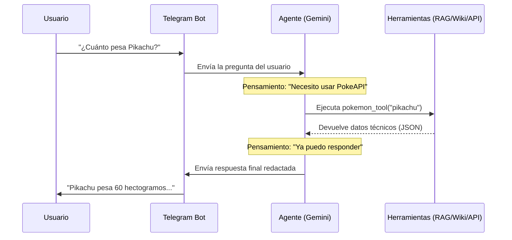

# Actividad: Potenciando al Agente (Python)

En esta actividad de ampliación, dejarás de tener un bot que solo sabe leer tus apuntes para convertirlo en un asistente multidisciplinar capaz de consultar la **Wikipedia** y la **PokeAPI**.

:::important[Requisito previo]
Debes tener funcionando el bot del tutorial anterior (`bot.py`) y ejecutar el script de ingesta (`ingesta_rag.py`). 
:::

---

## Actividad 0: Migración a Agente de LangChain

Hasta ahora, nuestro bot seguía un camino **lineal e imperativo**: 
1. Recibía una pregunta de Telegram. 
2. Nosotros "le dábamos de comer" los datos de la base vectorial. 
3. Le obligábamos a responder basándose *solo* en eso.

Este enfoque (llamado "Cadena RAG") es rígido. Si queremos que el bot use la Wikipedia o una API, no podemos escribir cientos de `if/else`. Para solucionar esto, vamos a migrar a una arquitectura de **Agente**. 

Un Agente es un sistema donde el LLM (Gemini) tiene acceso a una "caja de herramientas" (`tools`) y él mismo decide qué herramienta usar según la duda del usuario.



:::tip[¿Quién hace qué?]
Es útil pensar que **Gemini es el Cerebro** (el que razona y decide qué herramienta usar) y **LangChain es el Cuerpo** (el que ejecuta las funciones Python y habla con el mundo exterior). Sin Gemini, el bot no sabría qué hacer; sin LangChain, Gemini no tendría "manos" para consultar APIs.
:::

### ¿Qué cambia en nuestro código?

*   **Antes (`bot.py` básico)**: Usábamos el SDK directo de Google (`google-genai`) y una función manual `generar_respuesta_rag` para inyectar el contexto.
*   **Ahora (`bot_pro.py`)**: Usaremos el conector de LangChain para Gemini (`ChatGoogleGenerativeAI`) y un `AgentExecutor` que gestionará automáticamente las herramientas.

1.  Añade estas librerías a tu `requirements.txt` e instálalas:
    *   `langchain-google-genai` (Conector de Gemini)
    *   `langsmith` (Para gestionar los prompts del Agente)
2.  Sustituye el cliente de `google-genai` por el de LangChain y configura el `AgentExecutor`.

### Pista de código
Sustituye la configuración del modelo y la función de respuesta por algo como esto (cuidado donde pones cada cosa):

```python
from langchain_google_genai import ChatGoogleGenerativeAI
from langchain_classic.agents import create_react_agent, AgentExecutor
from langchain.tools import tool
from langchain_classic import hub
from langsmith import Client

# Cargamos las variables de entorno

# 1. Configuramos el modelo de Gemini para LangChain
llm = ChatGoogleGenerativeAI(model="models/gemini-3.1-flash-lite-preview", google_api_key=GEMINI_API_KEY)

# Inicialización de la base de datos vectorial (ChromaDB)

# 2. Definimos la herramienta de RAG (tu búsqueda actual)
# Debes envolver tu lógica de búsqueda en una función con el decorador @tool
@tool
def tool_rag(query: str) -> str:
    """Consulta la base de conocimientos oficial del curso para dudas sobre temario y horarios."""
    docs = vectorstore.similarity_search(query, k=3)
    return "\n\n".join([doc.page_content for doc in docs])

# 3. Preparamos el Agente (usando LangSmith para el prompt)
client = Client()
prompt = client.pull_prompt("hwchase17/react", dangerously_pull_public_prompt=True)
tools = [tool_rag]
agent = create_react_agent(llm, tools, prompt)
agent_executor = AgentExecutor(agent=agent, tools=tools, verbose=True)

# 4. En tu función 'responder', ahora el Agente toma el control:
respuesta = agent_executor.invoke({"input": pregunta})["output"]
```

:::info[¿Qué es LangChain Hub y hwchase17/react?]
*   **LangChain Hub**: Es un repositorio oficial (integrado en LangSmith) donde la comunidad comparte prompts optimizados. En lugar de escribir nosotros el prompt del agente a mano, descargamos uno que ya ha sido probado.
*   **hwchase17/react**: Es el prompt más famoso del Hub, creado por Harrison Chase (fundador de LangChain). Implementa la lógica **ReAct** (*Reasoning + Acting*), que enseña a la IA a pensar paso a paso: *"Necesito saber el peso de un Pokemon -> Voy a usar la herramienta PokeAPI -> El resultado es X -> Ya puedo responder"*.
:::

---

## Actividad 1: Integración con Wikipedia

¿Qué pasa si el usuario pregunta algo que no está en tu archivo de conocimiento? Actualmente el bot diría "No tengo esa información". Vamos a permitirle que busque en la Wikipedia.

### Instrucciones
1.  Añade la librería `wikipedia` a tu archivo `requirements.txt` e instala las dependencias actualizadas (`pip install -r requirements.txt`).
2.  Importa y configura la herramienta de LangChain. Consulta la [documentación oficial de la Wikipedia Tool](https://docs.langchain.com/oss/python/integrations/providers/wikipedia).

### Pista de código
En tu archivo Python, deberás añadir lo siguiente:

:::warning[Cuidado con el bloqueo de Wikipedia]
La API de Wikipedia bloquea las peticiones anónimas y devuelve un error (`Expecting value: line 1 column 1 (char 0)`). Para evitarlo, **debes importar la librería `wikipedia` y configurar un User-Agent** (el "nombre" de tu bot) antes de configurar la herramienta.
:::

```python
import wikipedia
from langchain_community.tools import WikipediaQueryRun
from langchain_community.utilities import WikipediaAPIWrapper

# Le damos un nombre a nuestro bot para que la API de Wikipedia no nos bloquee
wikipedia.set_user_agent("AsistenteIAPIA/1.0")

# Configura el wrapper para que responda en español y limite los resultados
api_wrapper = WikipediaAPIWrapper(top_k_results=1, doc_content_chars_max=500, lang="es")
wiki_tool = WikipediaQueryRun(api_wrapper=api_wrapper)

# RECUERDA: Debes añadir 'wiki_tool' a la lista de tools que le pasas al agente
tools = [tool_rag, wiki_tool]
```

---

## Actividad 2: Crear una Tool personalizada (PokeAPI)

Ahora vamos a lo más interesante: enseñar al Agente a usar una API externa que no existe en LangChain. Queremos que si el usuario pregunta por un Pokémon, el bot consulte la [PokeAPI](https://pokeapi.co/).

### Instrucciones
1.  Debes crear una función en Python que reciba el nombre de un Pokémon y devuelva su información básica (peso, altura, tipos, habilidades).
2.  Usa el decorador `@tool` de LangChain para convertir esa función en una herramienta que el Agente pueda entender. Consulta cómo [definir Custom Tools aquí](https://docs.langchain.com/oss/python/langchain/tools).

### Esqueleto de código a completar
Completa la lógica dentro de la función:

```python
import requests
import json
from langchain.tools import tool

@tool
def pokemon_tool(pokemon_name: str) -> str:
    """Consulta información técnica sobre un Pokémon (peso, altura, habilidades, tipos). 
    El parámetro de entrada debe ser el nombre del Pokémon en minúsculas."""
    
    # Limpiamos el nombre por si acaso
    name = pokemon_name.lower().strip()
    url = f"https://pokeapi.co/api/v2/pokemon/{name}"
    
    try:
        response = requests.get(url)
        if response.status_code == 200:
            data = response.json()
            
            # PRO-TIP: En lugar de devolver todo el JSON (que es enorme), 
            # filtramos solo los campos que nos interesan para ahorrar tokens.
            datos_reducidos = {
                "name": data["name"],
                "weight": data["weight"],
                "height": data["height"],
                "abilities": [a["ability"]["name"] for a in data["abilities"]],
                "types": [t["type"]["name"] for t in data["types"]]
            }
            
            return json.dumps(datos_reducidos)
        else:
            return f"No he podido encontrar al Pokémon '{name}'."
    except Exception as e:
        return f"Error al consultar la API: {e}"

# No olvides añadir 'pokemon_tool' a tu lista de herramientas
```

:::info[¿Por qué filtramos el JSON?]
El JSON original de un Pokémon es inmenso (miles de líneas). Si se lo pasamos entero al Agente:
1.  **Gastamos muchos tokens** innecesariamente.
2.  Podemos superar el **límite de contexto** del modelo.
Al quitar los movimientos y las imágenes, el Agente sigue teniendo acceso a su peso, altura, tipos y estadísticas, pero de forma mucho más eficiente.
:::

---

## Actividad 3: Consultando el Clima (wttr.in)

Para terminar de profesionalizar nuestro agente, vamos a darle la capacidad de saber qué tiempo hace en cualquier parte del mundo en tiempo real. Utilizaremos la API de [wttr.in](https://wttr.in/), que es gratuita y no requiere registro ni API Key.

### Instrucciones
1.  Crea una herramienta llamada `weather_tool`.
2.  La función debe recibir el nombre de una ciudad.
3.  Debe hacer una petición GET a `https://wttr.in/{ciudad}?format=j1`. El parámetro `format=j1` es clave para que nos devuelva un JSON procesable.
4. Analiza la respuesta y filtra qué campos nos interesan para ahorrar tokens.

---

## Validación

Para dar por válida la actividad, tu Agente debe ser capaz de responder a estas cuatro preguntas en una sola ejecución:
1.  *"¿Quién es el profesor de PIA?"* (Debe usar **RAG**).
2.  *"¿Quién fue Alan Turing?"* (Debe usar **Wikipedia**).
3.  *"¿Cuánto pesa un Snorlax?"* (Debe usar **PokeAPI**).
4.  *"¿Qué tiempo hace hoy en Santander?"* (Debe usar **Clima**).

:::tip[Reflexión]
Observa los logs en tu terminal. ¿Cómo decide el Agente qué herramienta usar en cada caso? Fíjate en cómo influye la descripción que has puesto en el `docstring` de la función `pokemon_tool`.
:::

---

## Entrega

Para la evaluación de esta actividad, se deberá entregar la carpeta completa del proyecto. **Es necesario excluir** el directorio del entorno virtual (`.venv`) y el archivo de variables de entorno (`.env`) antes de realizar la entrega. 

Fecha límite de entrega: **miércoles 13 de mayo a las 23:59h**.
