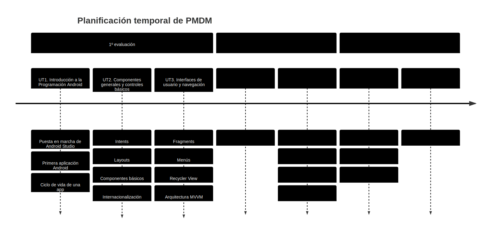

# Presentación

El módulo **Programación Multimedia y Dispositivos Móviles** (PMDM) se encuentra dentro del segundo curso del Ciclo Formativo de Grado Superior en **Desarrollo de Aplicaciones Multiplataforma**. Esta página web servirá de repositorio para agrupar los materiales y actividades de dicho módulo, impartido en el IES Ágora de Cáceres.

## Resultados de aprendizaje

Los **resultados de aprendizaje (RA)** trabajados en este módulo son los indicados en el **Real Decreto 450/2010, Real Decreto 405/2023 y Decreto 259/2011**:

| Código | Descripción |
|--------|-------------|
| RA1    | Aplica tecnologías de desarrollo para dispositivos móviles evaluando sus características y capacidades. |
| RA2    | Desarrolla aplicaciones para dispositivos móviles analizando y empleando las tecnologías y librerías específicas. |
| RA3    | Desarrolla programas que integran contenidos multimedia analizando y empleando las tecnologías y librerías específicas. |
| RA4    | Selecciona y prueba motores de juegos analizando la arquitectura de juegos 2D y 3D. |
| RA5    | Desarrolla juegos 2D y 3D sencillos utilizando motores de juegos. |

## Unidades de trabajo

Los resultados de aprendizaje (RAs) mencionados se han organizado en 7 **unidades de trabajo (UT)**, que se desarrollarán a lo largo de las tres evaluaciones del curso.  

El módulo de PMDM tiene una duración total de **130 horas**, con una **carga semanal de 4 horas**.

| UNIDAD                                   | RAs       | HORAS |
|------------------------------------------|-----------|-------|
| UT1. Introducción a la Programación Android | RA1       | 5 h   |
| UT2. Componentes generales y controles básicos | RA2       | 15 h  |
| UT3. Interfaces de usuario y navegación  | RA2       | 20 h  |
| UT4. Componentes Avanzados               | RA2       | 20 h  |
| UT5. Persistencia de Datos               | RA2       | 20 h  |
| UT6. Librerías multimedia integradas     | RA3       | 15 h  |
| UT7. Motores y desarrollo de juegos      | RA4 – RA5 | 15 h  |
| Repaso y refuerzo                        | Todos     | 20 h  |

## Temporalización

Las unidades de trabajo (UTs) y sus contenidos se han organizado a lo largo del curso de la siguiente manera:

## Materiales y recursos de software

Para el desarrollo y seguimiento de las clases, contaremos con los siguientes recursos:

**Materiales didácticos**  
- Apuntes disponibles en esta página web.  
- Enunciados de actividades y proyectos publicados en la plataforma *Evex*.  

**Software necesario**  
- Java (versión 17 o superior).  
- Android Studio.  
- Android SDK 30.  

:::info CABLE USB
Para probar las aplicaciones podrás utilizar un **emulador** de Android Studio o tu **propio dispositivo Android**.  
En este último caso, recuerda traer a clase un **cable USB** compatible con tu teléfono.
:::

