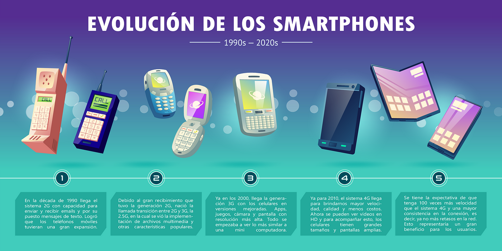
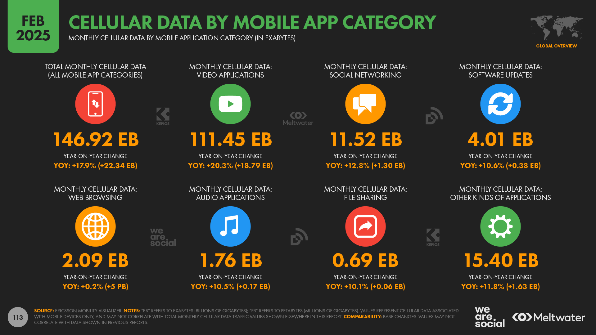
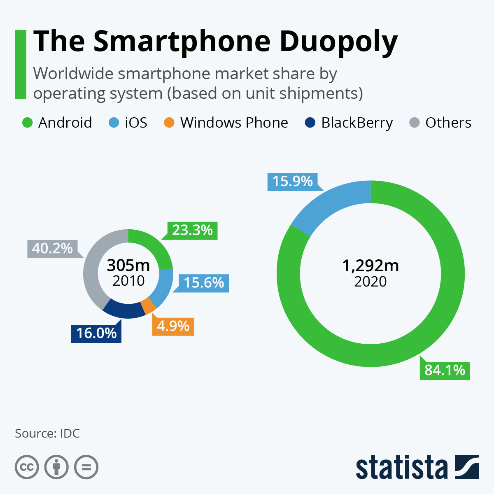
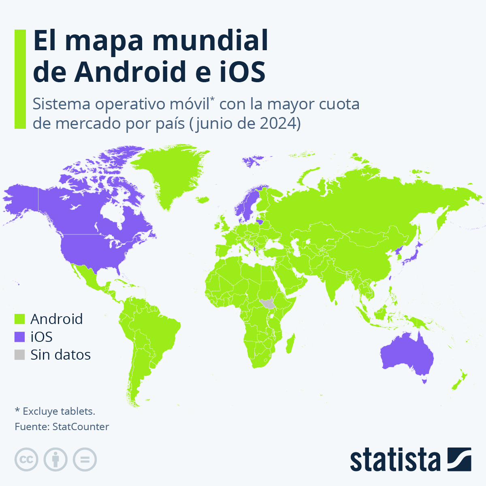
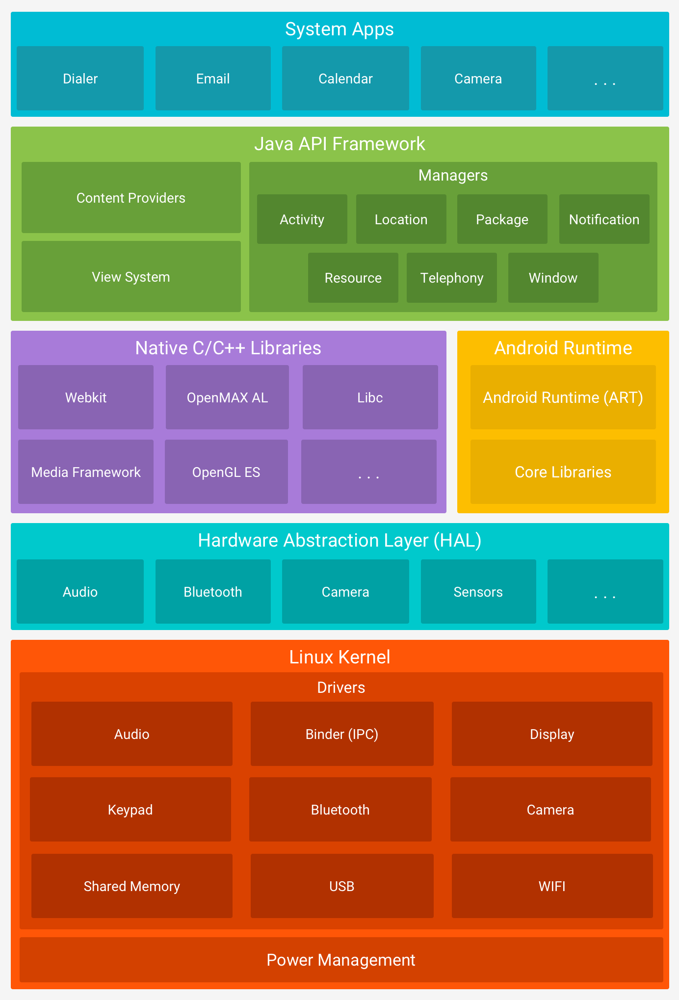
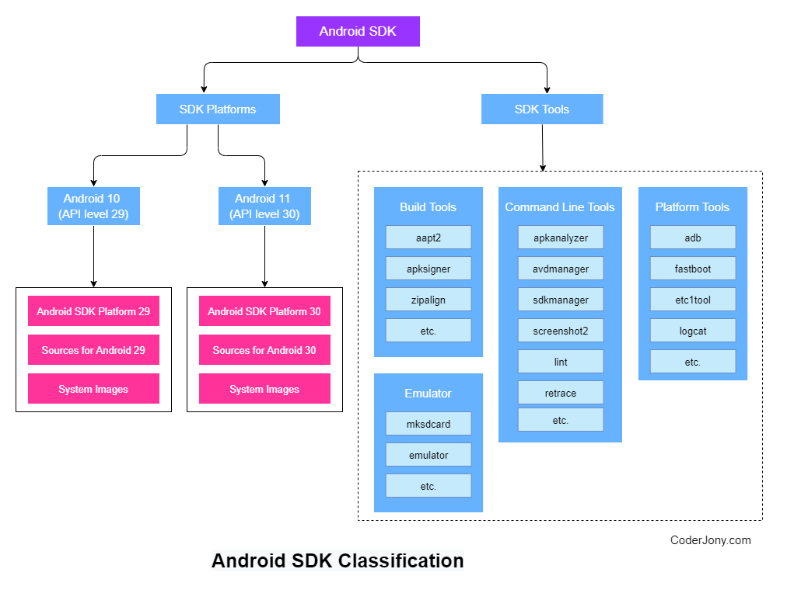

# Introducción

La evolución de los dispositivos móviles ha sido significativa en las últimas décadas.  

Al principio, los teléfonos móviles tenían funciones muy limitadas, centradas casi exclusivamente en llamadas y mensajes de texto. Con el paso del tiempo, la miniaturización de los componentes, el aumento de la capacidad de procesamiento y la llegada de nuevas generaciones de conectividad (2G, 3G, 4G y 5G) permitieron que estos dispositivos se transformaran en una especie de **ordenadores de bolsillo**.

Hoy en día, los teléfonos no son los únicos dispositivos con capacidad de ejecutar aplicaciones: también tenemos **tablets**, **wearables** (como relojes inteligentes), **televisiones inteligentes** e incluso **automóviles conectados**, que integran sistemas completos de información y entretenimiento.

Este avance ha cambiado profundamente nuestra vida cotidiana: los dispositivos móviles son ahora una herramienta esencial para **comunicarnos, trabajar, aprender, gestionar nuestra salud o entretenernos**. Además, no funcionan de forma aislada, sino que forman parte de un **ecosistema digital** mucho más amplio conectado a servicios en la nube, accesorios inteligentes e incluso al Internet de las Cosas (IoT).

Para los desarrolladores, este contexto plantea nuevos retos: diseñar aplicaciones que sean **eficientes, seguras, multiplataforma y adaptables** a diferentes pantallas y entornos. En este módulo, estudiaremos las bases necesarias para dar los primeros pasos en este extenso mundo.

---

## Limitaciones de los dispositivos móviles

Los dispositivos móviles presentan limitaciones importantes que deben ser consideradas durante el desarrollo para garantizar un producto de calidad:

- **Desconexión:** Al ser portátiles, los dispositivos pueden sufrir desconexiones totales o parciales.  
  👉 *Ejemplo:* una app de mensajería debe permitir redactar y guardar mensajes aunque no haya cobertura, y enviarlos más tarde cuando la conexión vuelva.

- **Conectividad variable:** No basta con pensar en conexión/desconexión, también varía la calidad de la red (2G, 3G, 4G, 5G, WiFi).  
  👉 *Ejemplo:* una app de streaming debe ajustar la calidad del vídeo según el ancho de banda disponible.

- **Seguridad:** Debido a su facilidad de transporte y la conexión frecuente a redes inseguras, son más vulnerables a robos y ataques. Es esencial limitar los permisos solicitados y cifrar la información sensible.  
  👉 *Ejemplo:* una app bancaria debe cifrar todas las comunicaciones y bloquear la sesión si detecta inactividad.

- **Consumo de batería:** La batería es un recurso limitado. Las aplicaciones deben ser eficientes en el uso de CPU, red y sensores, liberando recursos cuando no se utilizan.  
  👉 *Ejemplo:* una app de fitness no debería mantener activo el GPS si el usuario no está registrando un entrenamiento.

- **Memoria y almacenamiento:** Aunque cada vez disponen de más recursos, siguen siendo limitados. Es necesario optimizar el uso de memoria y almacenamiento para evitar afectar el rendimiento y permitir que convivan varias apps sin problemas.  
  👉 *Ejemplo:* una app de cámara debería comprimir las fotos en lugar de generar archivos enormes que llenen rápidamente la memoria del dispositivo.

- **Tamaño de pantalla y usabilidad:** El espacio visual es reducido, lo que obliga a simplificar la interfaz y priorizar la información más importante.  
  👉 *Ejemplo:* una app de banca debe mostrar el saldo y movimientos de forma clara sin saturar al usuario con menús complejos.

- **Dependencia del hardware integrado:** Muchas funciones requieren sensores (GPS, cámara, giroscopio, NFC). No todos los móviles los incluyen o tienen la misma calidad.  
  👉 *Ejemplo:* una app de realidad aumentada puede no funcionar en un dispositivo sin giroscopio.

- **Actualizaciones del sistema operativo:** No todos los usuarios actualizan sus dispositivos al mismo ritmo, y algunos nunca reciben nuevas versiones.  
  👉 *Ejemplo:* una API introducida en Android 13 puede estar disponible solo en una parte de los móviles activos, obligando a mantener compatibilidad con versiones anteriores.

- **Costes de datos móviles:** No todos los usuarios disponen de tarifas ilimitadas. Las apps deben ser responsables con el consumo de datos.  
  👉 *Ejemplo:* una app de mensajería debería comprimir imágenes y vídeos antes de enviarlos.

*Fuente: [DataReportal](https://datareportal.com/reports/digital-2025-sub-section-device-trends)*

---

## Sistemas Operativos Móviles

Desde el inicio de la tecnología móvil han existido múltiples sistemas operativos: **Symbian, BlackBerry OS, Windows Phone, Palm OS**, entre otros. Sin embargo, todos ellos han ido desapareciendo hasta dejar el mercado prácticamente **monopolizado por Android e iOS**.

  
*Fuente: [Statista](https://www.statista.com/chart/3268/smartphone-os-market-share/)*

La cuota de mercado presenta además **una fuerte división geográfica**, lo que condiciona qué plataforma conviene priorizar según el público objetivo.

  
*Fuente: [Statista](https://es.statista.com/grafico/29620/sistema-operativo-movil-con-la-mayor-cuota-de-mercado-por-pais/)*

Más allá de los smartphones, tanto Android como iOS se han extendido a **tablets, relojes inteligentes, televisores y automóviles conectados**, consolidándose como **ecosistemas completos**.

Para el desarrollador, esta situación simplifica las decisiones:  
- **Android** es clave si se busca el **alcance global**.  
- **iOS** es prioritario en mercados con alto poder adquisitivo (EE. UU., Europa Occidental, Japón).  

Además, la publicación de aplicaciones difiere entre ambos: Android permite más flexibilidad a través de la **Google Play Store** (e incluso otras tiendas), mientras que iOS centraliza todo en la **App Store**, con políticas de revisión más estrictas.

---

## Desarrollo de aplicaciones móviles

A la hora de desarrollar aplicaciones móviles, existen dos grandes enfoques: **híbrido** y **nativo**. Cada uno tiene sus ventajas y desventajas, y la elección depende del proyecto, presupuesto y público objetivo.

### Aplicaciones híbridas

Las aplicaciones híbridas utilizan **un único código base** que se puede compilar para múltiples plataformas (Android, iOS e incluso web). Su principal ventaja es el **ahorro en tiempo y costes de desarrollo**, ya que no es necesario crear una aplicación distinta para cada sistema operativo.

Ejemplos de frameworks y lenguajes:

- **Xamarin:** C#  
- **Unity:** C# (más orientado a videojuegos y experiencias interactivas en 2D/3D).  
- **Flutter:** Dart (gran rendimiento gracias a su propio motor gráfico).  
- **Ionic:** JavaScript + HTML + CSS (apoyado en tecnologías web).  
- **React Native:** JavaScript (permite usar componentes nativos con un solo código base).  
- **PWA (Progressive Web Apps):** JavaScript (aplicaciones web que se comportan como apps móviles).  

**Ventajas:**
- Desarrollo más rápido y económico.  
- Un solo equipo de desarrollo puede cubrir varias plataformas.  
- Mantenimiento más sencillo (un único código fuente).  

**Desventajas:**
- Rendimiento generalmente inferior al de una app nativa.  
- Dependencia de librerías externas para acceder a funciones específicas del hardware.  
- Limitaciones a la hora de explotar al máximo la interfaz o las animaciones.  

👉 *Ejemplo real:* **Instagram** y **Airbnb** en sus primeras versiones hicieron uso de enfoques híbridos para acelerar su llegada al mercado, aunque luego migraron partes críticas a nativo para mejorar el rendimiento.

### Aplicaciones nativas

Las aplicaciones nativas están desarrolladas en el **lenguaje oficial de cada plataforma**, lo que permite un mayor control y optimización:

- Android → **Java o Kotlin** en **Android Studio**.  
- iOS → **Objective-C o Swift** en **Xcode**.  

Al estar escritas específicamente para un sistema, aprovechan al máximo el hardware y las API nativas.

**Ventajas:**
- **Máximo rendimiento y fluidez**, especialmente en animaciones o videojuegos.  
- Acceso completo al hardware del dispositivo (cámara, GPS, sensores, Bluetooth, etc.).  
- Mejor experiencia de usuario, con interfaz y diseño adaptados a cada sistema operativo.  
- Mayor facilidad para integrar nuevas funciones de la plataforma tan pronto como salen (ejemplo: APIs exclusivas de Android 13 o iOS 16).  

**Desventajas:**
- Requiere equipos de desarrollo especializados (Android y iOS por separado).  
- Coste y tiempo de desarrollo mayores.  
- Doble mantenimiento (dos bases de código distintas).  

👉 *Ejemplo real:* **WhatsApp** y **Pokémon GO** son aplicaciones nativas, ya que necesitan un rendimiento óptimo y un acceso profundo al hardware.

### ¿Qué enfoque elegir?

- Si buscas **rapidez de desarrollo** y un **presupuesto limitado** → aplicaciones **híbridas**.  
- Si necesitas **máximo rendimiento, uso intensivo del hardware o una experiencia de usuario de alta calidad** → aplicaciones **nativas**.  
- En muchos proyectos se adopta un **enfoque mixto**, desarrollando gran parte en híbrido y componentes críticos en nativo.
 

---

## Android

Cuando hablamos de **Android** solemos referirnos tanto al **sistema operativo** como al **ecosistema de desarrollo** que lo acompaña. Conviene distinguir claramente entre:

- **Android (SO):** El sistema operativo basado en Linux que viene preinstalado en la mayoría de smartphones, tablets y otros dispositivos inteligentes.  
- **Android SDK:** El conjunto de herramientas y librerías que permiten a los desarrolladores crear aplicaciones que se ejecuten sobre ese sistema.

> 📌 Android fue creado inicialmente por la empresa Android Inc. en 2003 y adquirido por Google en 2005. La primera versión comercial (Android 1.0) se lanzó en 2008. Desde entonces, ha evolucionado de forma constante hasta convertirse en el sistema operativo móvil más utilizado del mundo.

### Sistema Operativo Android

Android es, en esencia, un sistema operativo basado en el núcleo de **Linux**, al que se le ha añadido una capa de software con diferentes componentes:

- Una **máquina virtual** (originalmente la **Dalvik VM**, hoy reemplazada por **ART: Android Runtime**) para ejecutar código Java/Kotlin de forma optimizada.  
- Aplicaciones básicas incluidas de serie: Contactos, Teléfono, Mensajes, Navegador, etc.  
- Un motor de base de datos integrado (**SQLite**).  
- Motores gráficos y de renderizado (**OpenGL ES**, **Vulkan**) para juegos y aplicaciones con alto componente visual.  
- Librerías para conectividad (WiFi, Bluetooth, NFC), multimedia, seguridad y gestión de notificaciones.

*Fuente: [Android Developers](https://developer.android.com/guide/platform?hl=es-419)*

> ⚙️ La arquitectura de Android suele representarse en cinco capas: **núcleo Linux**, **capa de abstracción del hardware**, **librerías nativas**, **framework de Android** y **aplicaciones**.

### Android SDK

El **Android SDK (Software Development Kit)** es el conjunto de herramientas oficiales para desarrollar aplicaciones Android. Incluye:

- **APIs y librerías**: para acceder a sensores, cámara, GPS, notificaciones, almacenamiento, etc.  
- **Herramientas de compilación**: convierten el código fuente (Java/Kotlin) en bytecode optimizado para Android (**.apk** o **.aab**).  
- **Emuladores**: permiten probar las aplicaciones en dispositivos virtuales con distintas versiones de Android y configuraciones de hardware.  
- **Depuración y profiling**: herramientas como **ADB (Android Debug Bridge)** y **Android Profiler** para analizar el rendimiento, el uso de memoria y la eficiencia energética de las apps.  
- **Documentación y ejemplos**: guías oficiales y proyectos de muestra que facilitan el aprendizaje.

Se denomina SDK porque es un **kit de desarrollo de software**: un paquete que agrupa todo lo necesario para programar, compilar, probar y depurar aplicaciones Android.

*Fuente: [CoderJony](https://coderjony.com/blogs/understanding-android-sdk-ecosystem)*

