# Puesta en marcha

<div class="justify-text">

En este apartado veremos los pasos básicos para poner en marcha un proyecto Android en **Android Studio**, desde los aspectos iniciales hasta la prueba en dispositivos.  

Trabajaremos con **Java** como lenguaje de programación principal, junto con XML para la definición de interfaces y recursos. También aprenderemos a usar el SDK de Android y a ejecutar nuestras aplicaciones en emuladores o dispositivos físicos.


:::info
Si quieres profundizar, la documentación oficial está disponible en [Android Developers](https://developer.android.com/guide). 
:::

---

## Aspectos básicos

Desde **2017, Kotlin es el lenguaje oficial de desarrollo en Android**, aunque previamente el protagonismo lo tuvo **Java**. Actualmente ambos lenguajes conviven en el ecosistema y cuentan con soporte oficial por parte de Google. En este curso trabajaremos con **Java**, ya que fue el lenguaje utilizado en la asignatura de Programación el año pasado.

Además del código fuente, una aplicación está formada por múltiples **recursos**: interfaces gráficas, textos traducibles, estilos visuales, imágenes o iconos. Estos se definen en ficheros **XML**, lo que permite mantener una clara separación entre la lógica de programación y el diseño.

Cuando desarrollamos una app, todo este conjunto de código y recursos se compila mediante el **SDK de Android**. El resultado es un archivo **APK (Android Package)** que contiene la aplicación empaquetada y lista para instalarse en dispositivos reales o distribuirse a través de una tienda como Google Play.

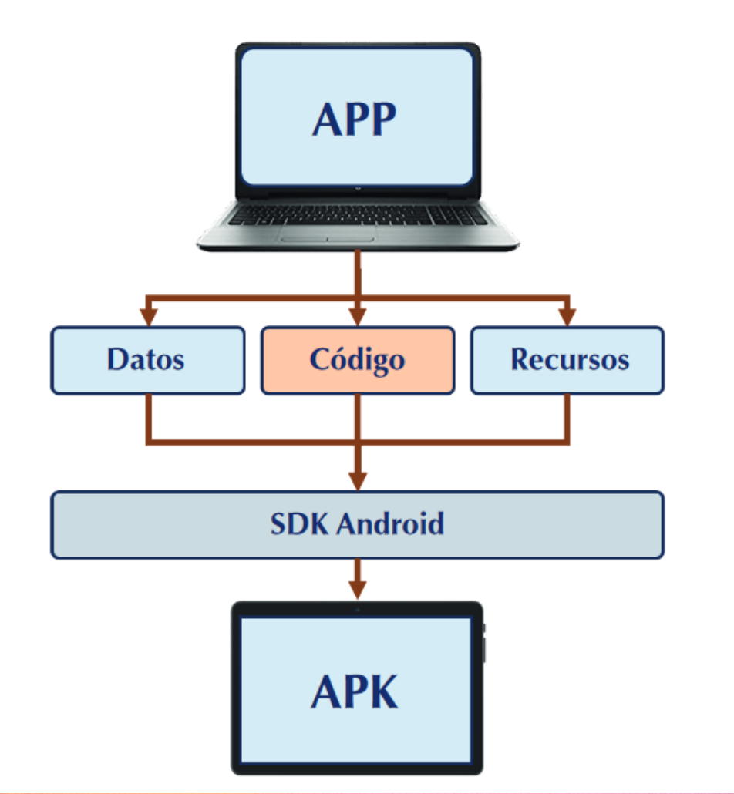


### Java vs Kotlin

Históricamente, **Java** ha sido el lenguaje principal del desarrollo Android y todavía hoy sigue teniendo un papel muy importante. Gran parte de la documentación oficial, librerías de terceros y proyectos en producción están escritos en Java, lo que lo convierte en una base sólida para empezar a programar en Android. Además, su sintaxis es ampliamente conocida y facilita la transición desde otros lenguajes orientados a objetos.

Por su parte, **Kotlin** fue adoptado como lenguaje oficial por Google en 2017. Entre sus principales ventajas se encuentran una sintaxis más concisa, un sistema de tipos más seguro que ayuda a evitar errores comunes como el *NullPointerException*, y un mejor soporte para la programación asíncrona y funcional. Kotlin también se integra perfectamente con Java, lo que permite combinar ambos en un mismo proyecto.

:::tip
En la práctica, muchos proyectos modernos se inician directamente en Kotlin, pero **conocer Java sigue siendo fundamental** para comprender el ecosistema Android y trabajar con librerías o ejemplos existentes.
:::

- Documentación: [Introducción a Kotlin](https://developer.android.com/kotlin)

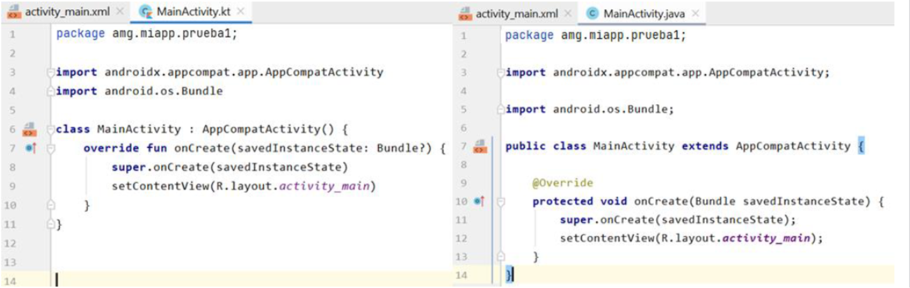


### Jetpack Compose

Tradicionalmente, las interfaces en Android se definían en **XML**, separando el diseño de la lógica de la aplicación.  Google introdujo **Jetpack Compose** como alternativa moderna que permite construir la interfaz directamente con código Kotlin mediante funciones anotadas con `@Composable`.  

A continuación se muestra un ejemplo básico de cada enfoque:

```xml title="activity_main.xml (XML tradicional)" 
<?xml version="1.0" encoding="utf-8"?>
<androidx.constraintlayout.widget.ConstraintLayout xmlns:android="http://schemas.android.com/apk/res/android"
    xmlns:app="http://schemas.android.com/apk/res-auto"
    xmlns:tools="http://schemas.android.com/tools"
    android:id="@+id/main"
    android:layout_width="match_parent"
    android:layout_height="match_parent"
    tools:context=".MainActivity">

    <TextView
        android:layout_width="wrap_content"
        android:layout_height="wrap_content"
        android:text="Hello World!"
        app:layout_constraintBottom_toBottomOf="parent"
        app:layout_constraintEnd_toEndOf="parent"
        app:layout_constraintStart_toStartOf="parent"
        app:layout_constraintTop_toTopOf="parent" />

</androidx.constraintlayout.widget.ConstraintLayout>
````

```kotlin title="GreetingText.kt (Jetpack Compose)" 
@Composable
fun GreetingText(message: String, from: String, modifier: Modifier = Modifier) {
    Column(
        verticalArrangement = Arrangement.Center,
        modifier = modifier
    ) {
        Text(
            text = message,
            fontSize = 100.sp,
            lineHeight = 116.sp,
            color = Color.Blue,
            textAlign = TextAlign.Center
        )
        Text(
            text = from,
            fontSize = 36.sp,
            modifier = Modifier
                .padding(16.dp)
                .align(Alignment.CenterHorizontally)
        )
    }
}
```

Podríamos decir que:

* **XML**: método clásico, ampliamente usado y compatible con la mayoría de proyectos existentes. Separa vista y lógica, pero puede ser más rígido y verboso.
* **Jetpack Compose**: enfoque moderno, declarativo y más conciso. Facilita la creación de interfaces dinámicas y reactivas, aunque aún no está presente en todos los proyectos.

:::info 
En este curso nos centraremos en el **diseño con XML**, ya que proporciona una base sólida para comprender cómo se estructuran las interfaces en Android. Sin embargo, es importante conocer que **Jetpack Compose** representa el futuro del desarrollo de interfaces en la plataforma. 
:::


### Componentes principales de una aplicación

Una aplicación Android está compuesta por diferentes **componentes fundamentales**, cada uno con una función específica.  
Estos componentes permiten estructurar la aplicación, gestionar la interacción con el usuario y comunicarse con el sistema operativo o con otras aplicaciones.

* **Activity**  
   Es el componente principal de una aplicación Android y representa una **pantalla con la que el usuario puede interactuar**.  
   Cada Activity gestiona una interfaz de usuario (definida en XML o en Compose) y la lógica asociada.

   - Una aplicación puede tener **una o varias Activities**.
   - Cada Activity debe declararse en el archivo `AndroidManifest.xml`.


* **Service**  
   Un Service es un componente **sin interfaz gráfica** que se ejecuta en segundo plano. Se utiliza para tareas que deben continuar funcionando aunque el usuario no esté interactuando con la aplicación.

   **Ejemplo de uso:** imagina que estás desarrollando una aplicación de música, y deseas que los usuarios puedan seguir escuchando canciones incluso cuando minimizan la aplicación o usan otras aplicaciones. El uso de un service en segundo plano permite pausar o detener la música desde una notificación o interfaz externa.


* **Broadcast Receiver**  
   Permite que la aplicación **escuche y reaccione a eventos del sistema** (o de otras apps), como el nivel bajo de batería, la llegada de un SMS o una llamada entrante.

   - Ideal para responder a sucesos externos.
   - No tiene interfaz de usuario.

   **Ejemplo de uso:** supongamos que estás desarrollando una aplicación de música que reproduce canciones en segundo plano. Para mejorar la experiencia del usuario, quieres que la aplicación detenga la música automáticamente cuando el usuario reciba una llamada entrante.  
    Cuando una llamada telefónica entra en el dispositivo, el sistema Android emite un broadcast que notifica sobre el cambio en el estado de la llamada. Para lograr que tu aplicación reaccione a este evento puedes usar un Broadcast Receiver.


* **Content Provider**  
   Es el mecanismo que utiliza Android para **compartir datos entre aplicaciones** de forma segura. Los datos se gestionan normalmente mediante una base de datos interna y se exponen a otras apps a través de un Content Provider.

   **Ejemplo de uso**: imagina que estás desarrollando una aplicación de mensajería que necesita acceder a los contactos del teléfono para que el usuario pueda seleccionar a quién enviar un mensaje.  
   Android ofrece un Content Provider predefinido que maneja los contactos almacenados en el dispositivo en una base de datos. Bastaría con realizar una petición de datos a dicho proveedor.


* **Widget**  
   Son elementos interactivos que se colocan en la **pantalla principal** del dispositivo.  
   Permiten al usuario consultar información o ejecutar acciones rápidas sin abrir la aplicación.

   **Ejemplos**: reloj, calendario, reproductor de música, previsión meteorológica.

* **Intent**  
   Es el mecanismo de comunicación básico entre los distintos componentes. Un Intent es un **mensaje o petición** que se envía a otro componente (de la misma aplicación o de otra distinta).


:::info
Todos estos componentes se declaran en el archivo `AndroidManifest.xml`, que actúa como la “carta de presentación” de la aplicación frente al sistema operativo.
:::

---

## Instalación de Android Studio

Para poder desarrollar aplicaciones Android, necesitamos instalar **Android Studio**, el entorno de desarrollo integrado (IDE) oficial de Google. Este programa incluye todo lo necesario: editor de código, emuladores, depurador y el **Android SDK**.

1. Accede a la página oficial: [developer.android.com/studio](https://developer.android.com/studio).
2. Descarga la versión estable más reciente para tu sistema operativo (Windows, macOS o Linux).
3. Ejecuta el instalador y sigue los pasos indicados:
   - Selecciona la instalación **Standard** para mayor comodidad.
   - Acepta los términos de licencia.
   - Espera hasta que termine la descarga del SDK, puede llevar unos minutos.

:::tip
Se recomienda instalar Android Studio en un disco con **al menos 10 GB libres** y contar con **8 GB de RAM o más** para un funcionamiento fluido, especialmente al usar emuladores.
:::

---

## Primera aplicación

Vamos a ver los pasos a seguir para crear una aplicación "Hola mundo" en Android.

### Crear un proyecto en Android Studio
Al abrir Android Studio podemos crear un proyecto nuevo, seleccionando **New Project** en el menú principal.

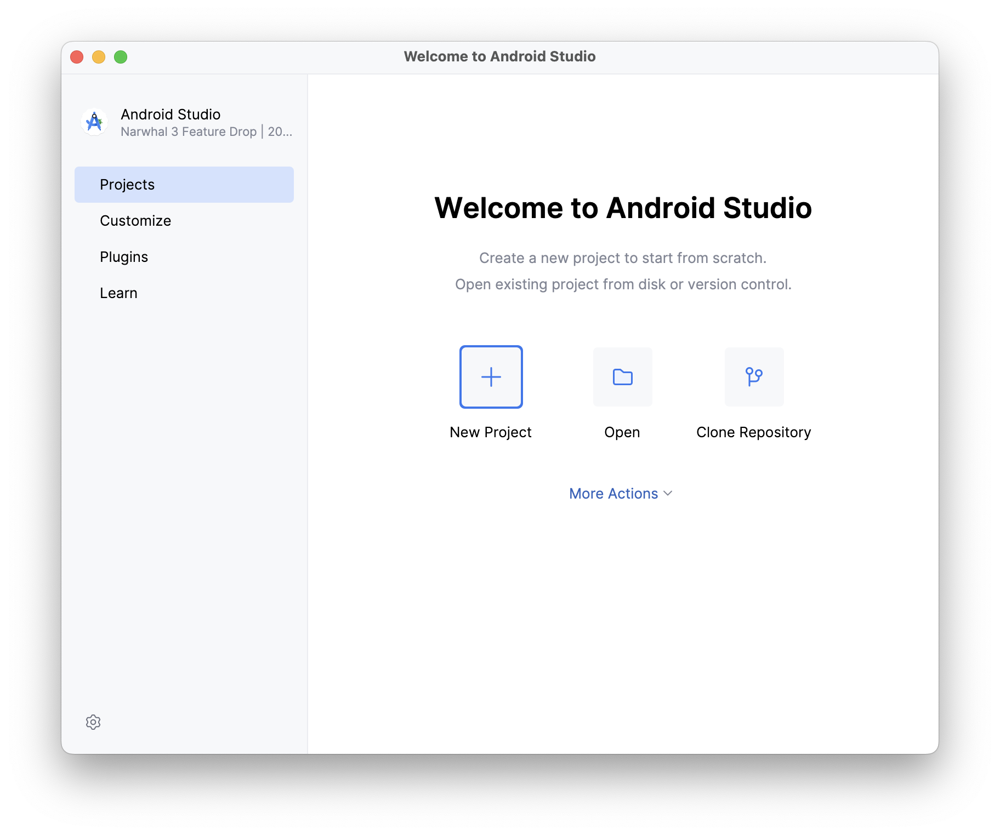

En la siguiente pantalla, selecciona una plantilla básica como **Empty Views Activity**. Cuidado con seleccionar Empty Activity porque se usará Kotlin y no Java.

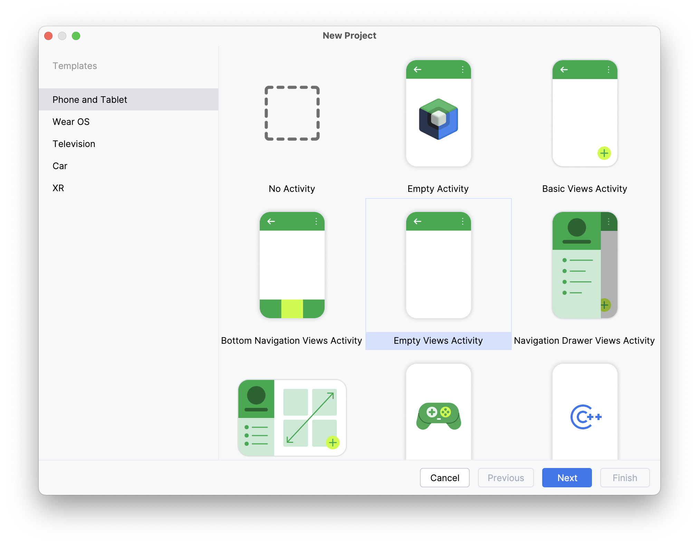

Finalmente, debemos introducir la configuración básica de nuestro proyecto:

- **Name**: Nombre de la aplicación. Será el identificador visible en Android Studio y también el título que, por defecto, verá el usuario en el dispositivo.

- **Package name**: Identificador único de la aplicación en formato **dominio inverso** (ejemplo: `es.iesagora.holamundo`).  
  Este valor es fundamental, ya que distingue tu app de cualquier otra en Google Play.

  :::tip
  Es recomendable usar el dominio de tu organización o centro educativo seguido del nombre del proyecto.
  :::

- **Save location**: Carpeta local donde se guardará el proyecto en tu ordenador. Puedes elegir cualquier ruta, aunque lo ideal es mantener una estructura organizada.

- **Language**: Lenguaje de programación con el que se generará el código inicial de la aplicación. En este curso trabajaremos con **Java**, aunque también es posible elegir Kotlin.

- **Minimum SDK**: Indica la **versión mínima de Android** necesaria para ejecutar la aplicación. Cuanto más bajo sea este valor, en más dispositivos podrá instalarse la app, pero se limitarán algunas funcionalidades modernas.

  :::info
  En el ejemplo se selecciona **API 24 (Nougat, Android 7.0)**, lo que asegura compatibilidad con aproximadamente el **98% de los dispositivos** actuales.
  :::

- **Build configuration language**  
  Define el lenguaje usado para los archivos de configuración de **Gradle**:  
  `Groovy` → formato clásico (`build.gradle`)  
  `Kotlin DSL` → formato más reciente y recomendado (`build.gradle.kts`)  

  :::info
  Este ajuste solo afecta a la configuración del proyecto, no al lenguaje de programación de la aplicación.
  :::

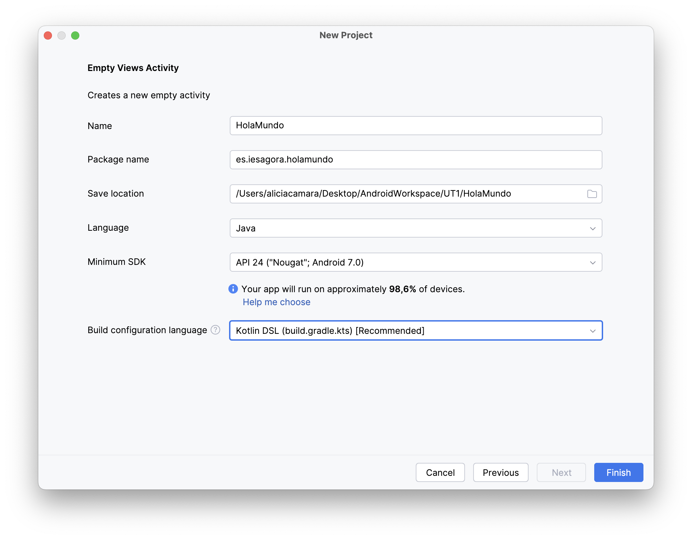

### Vistas en Android Studio

En el explorador de la parte izquierda de Android Studio podemos ver los archivos del proyecto de distintas formas.  
Las dos más utilizadas son:

- **Vista Android**  
  - Muestra los archivos organizados de forma lógica y simplificada, tal como se usan en el desarrollo de aplicaciones Android.  
  - Agrupa recursos, layouts, código fuente y el archivo `AndroidManifest.xml` en secciones más intuitivas.  
  - Es la vista recomendada para trabajar en el día a día, ya que oculta carpetas y archivos internos que no suelen ser necesarios.  

- **Vista Project**  
  - Refleja la **estructura real del proyecto en el sistema de archivos**.  
  - Se muestran todas las carpetas y archivos tal como están en el disco (incluyendo configuraciones de Gradle, archivos ocultos, etc.).  
  - Es útil cuando necesitas localizar un archivo específico o trabajar con configuraciones más avanzadas.  

:::tip
Para aprender y trabajar de forma más cómoda, se recomienda usar la **vista Android**. Cuando necesites editar configuraciones del proyecto o acceder a archivos que no aparecen ahí, puedes cambiar a la **vista Project**.
:::

| Vista Android | Vista Project |
|---------------|---------------|
| 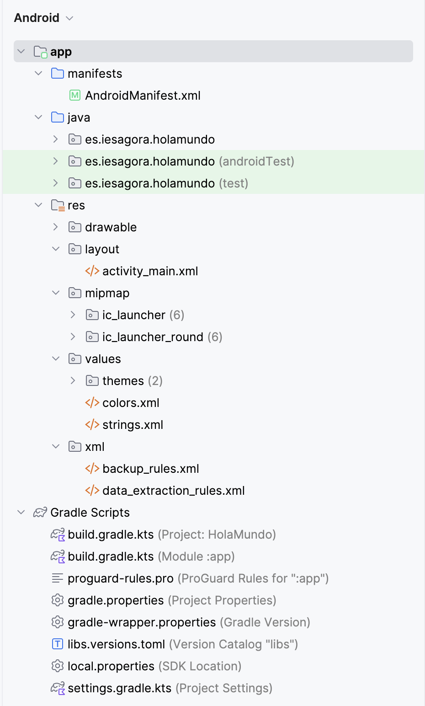 | 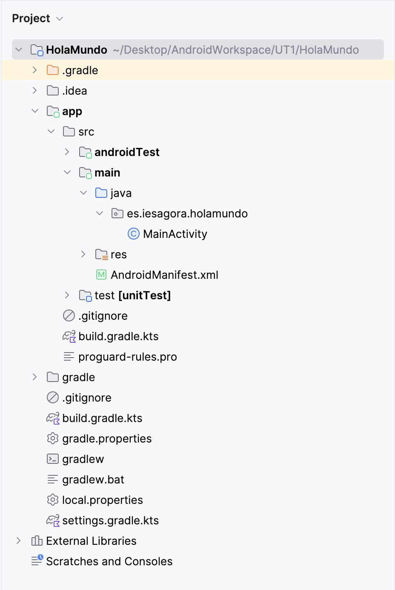 |


---

### Estructura de carpetas principales

Al crear un proyecto en Android Studio, se genera automáticamente una **estructura de carpetas** que organiza el código, los recursos y la configuración. Conocer esta estructura es fundamental para entender cómo se construye una aplicación Android.


- **Java**: código de la aplicación en Java o Kotlin. Aquí se incluyen las **Activities**, **clases auxiliares**, controladores, lógica de negocio, etc. 

- **Res**: incluye todos los **recursos gráficos y de interfaz** de la aplicación. Se organiza en subcarpetas según el tipo de recurso.
  - `drawable/`: imágenes y gráficos (PNG, JPG, SVG o XML vectoriales).
  - `layout/`: archivos XML que definen la interfaz de usuario.
  - `values/`: ficheros de valores como cadenas de texto, estilos, temas o colores..
  - `mipmap/`: iconos de la aplicación en distintas resoluciones (mdpi, hdpi, xhdpi...).


- **Manifests**: contiene el archivo más importante del proyecto: **`AndroidManifest.xml`**. Este archivo actúa como la “carta de presentación” de la aplicación ante el sistema operativo. Define:
   - El nombre de la aplicación.  
   - Las **Activities** disponibles.  
   - Los **permisos** que necesita (ej. acceso a Internet, cámara, ubicación).  
   - Los **servicios** y **broadcast receivers**.
  
- **Gradle Scripts**: agrupa los ficheros necesarios para la compilación de la aplicación.

---

### Análisis de la Activity

En Android, una **Activity** se corresponde con una pantalla de la aplicación y actúa como un **punto de entrada** que el sistema puede cargar en cualquier momento.  
Cada Activity controla tanto la interfaz de usuario como la lógica que hay detrás.

Una Activity está compuesta por:
- **Una clase** que extiende de `AppCompatActivity`, donde definimos el comportamiento de la aplicación.  
- **Un layout**, que describe la apariencia de la interfaz (definido en XML).  
- **Su declaración en el `AndroidManifest.xml`**, que permite al sistema reconocerla y ejecutarla.


#### Activity – Clase Java
En una aplicación básica, la lógica principal reside en una clase Java que hereda de `AppCompatActivity`:

```java title="MainActivity.java"
public class MainActivity extends AppCompatActivity {

    @Override
    protected void onCreate(Bundle savedInstanceState) {
        super.onCreate(savedInstanceState);
        setContentView(R.layout.activity_main);
    }
}
```


#### Activity – Layout

La interfaz de la Activity se define en un archivo XML ubicado en la carpeta de recursos `res/layout`.


#### Recursos

Al compilarse, cada recurso recibe un **ID único** que podemos utilizar en el código para acceder a él.
Estos recursos se almacenan en la carpeta `res` y se acceden mediante la clase `R`, usando la notación `R.tipo.nombre`.

| Ruta del recurso | Acceso desde código |
| --------------------------------- | -------------------------------------- |
| 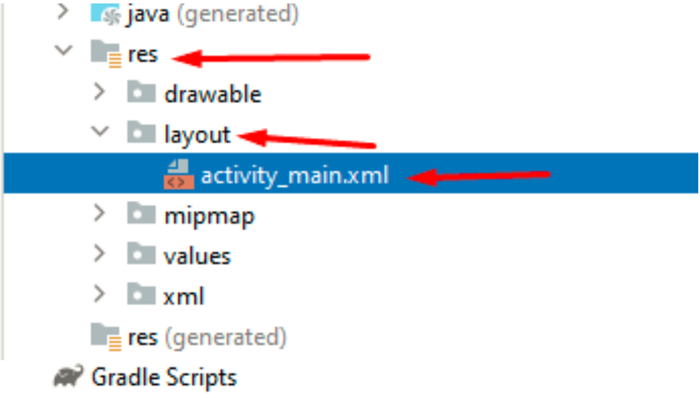 | 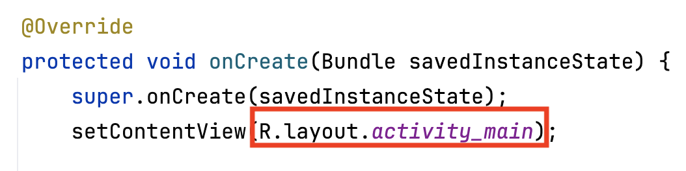 |

---


## Compilación

En Android Studio, el proceso de **compilación** se gestiona a través de **Gradle**, la herramienta que se encarga de construir la aplicación, resolver dependencias externas y generar el archivo APK final.  
Gradle trabaja en dos niveles: el **proyecto completo** y el **módulo de la aplicación**.

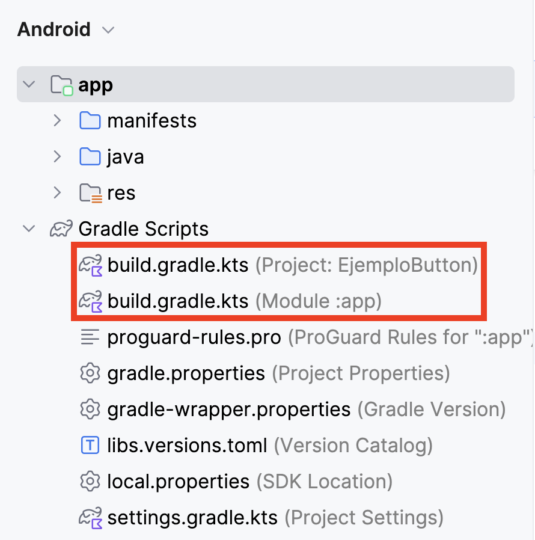

La configuración puede ajustarse editando directamente los ficheros `build.gradle` o mediante una interfaz más visual en:  
**File > Project Structure**.

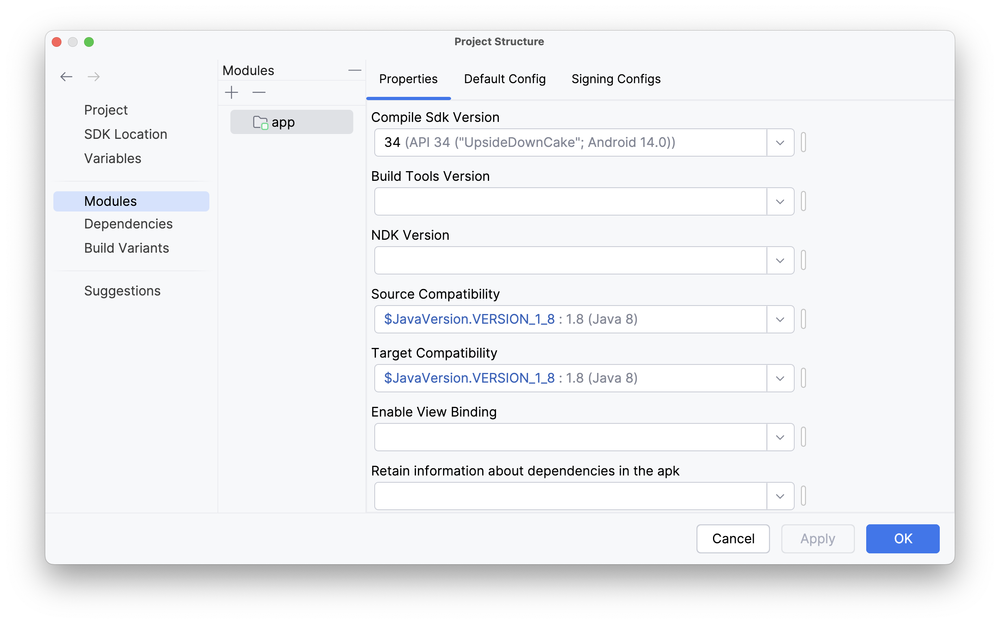

:::tip
Desde *Project Structure* es posible cambiar aspectos como la versión de SDK, dependencias o configuraciones de compilación sin tener que modificar manualmente los ficheros Gradle.
:::

---

## Probar la aplicación

Podemos ejecutar la app en:
- **Emuladores**: dispositivos virtuales que simulan diferentes modelos, sensores y versiones de Android.
- **Dispositivos físicos**: conectados por USB.

### Crear un emulador

Dependendiendo de la versión de Android Studio que hayas instalado, es posible que ya tengas un emulador instalado. En caso contrario, el proceso de creación sería:

1. En el menú superior, selecciona `Tools > Device Manager > Create Virtual Device` 

  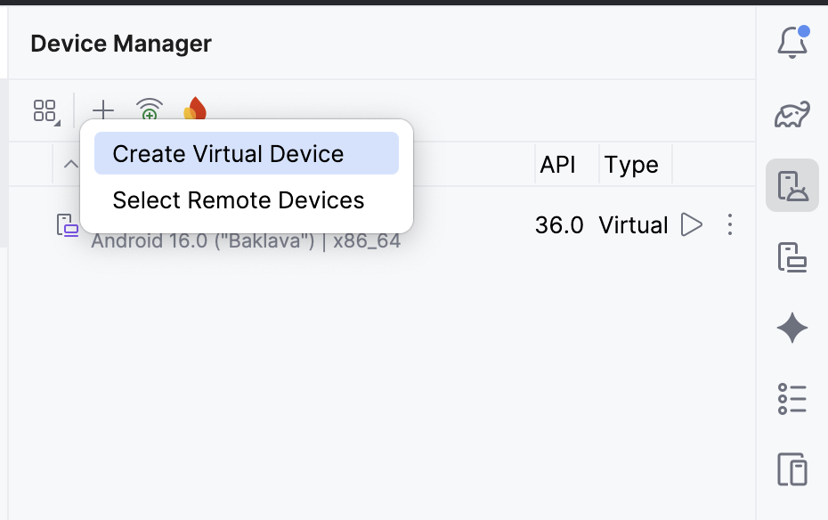

2. Seleccionar modelo, por ejemplo Pixel 9a, versión de Android y configuraciones de hardware.

  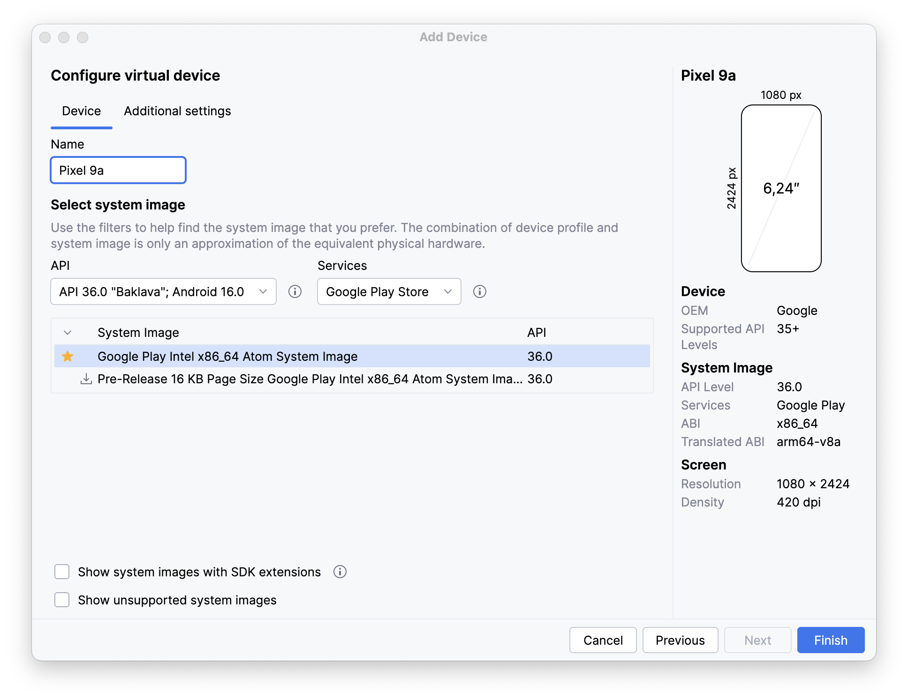

### Ejecutar la aplicación

Seleccionando la opción Run en el menú superior, se compila la aplicación y se prueba en el dispositivo real conectado o virtual (en nuestro caso). En la parte izquierda también puedes seleccionar el dispositivo en el que correrá la aplicación.


---

## Depuración

La depuración es una parte esencial del desarrollo, ya que nos permite **detectar y corregir errores** de forma más rápida. Android Studio nos ofrece dos herramientas principales: **Logcat** y el **Debugger**.

### Logcat

`Logcat` es la consola en la que Android Studio muestra los mensajes del sistema y de la aplicación.
Podemos imprimir nuestros propios mensajes utilizando la clase `android.util.Log` con la siguiente estructura:

```java
Log.d(String tag, String message)
```

* **tag**: sirve para identificar el origen del mensaje, normalmente el nombre de la clase.
* **message**: el texto que queremos mostrar en el log.

Ejemplo básico:

```java title="MainActivity.java"
public class MainActivity extends AppCompatActivity {

    @Override
    protected void onCreate(Bundle savedInstanceState) {
        super.onCreate(savedInstanceState);
        setContentView(R.layout.activity_main);

        Log.d("MainActivity", "Se ha cargado el layout");
    }
}
```

En el panel inferior de Android Studio podemos abrir la pestaña **Logcat** y ver la salida en tiempo real.
Dado que aparecen muchos mensajes del sistema, es recomendable **aplicar filtros** para mostrar únicamente los logs de nuestra aplicación o buscar por el `tag` que hayamos definido.

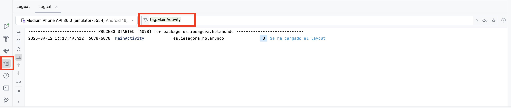


### Debugger

El depurador nos permite **detener la ejecución del programa en un punto concreto** y analizar el estado de las variables en ese momento.

1. Colocamos un **breakpoint** haciendo clic en el margen izquierdo de la línea de código.

   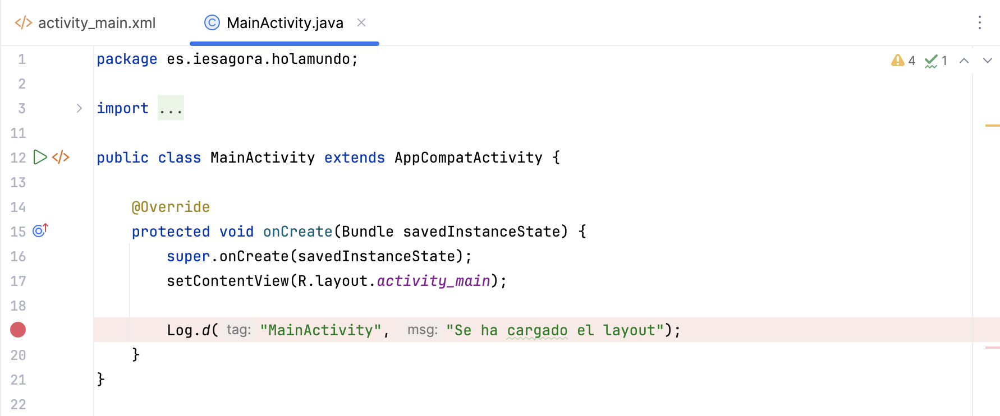

2. Ejecutamos la aplicación en modo **Debug** (símbolo del insecto en la barra superior).

   

3. Cuando la ejecución se detenga en el breakpoint, podremos ver el valor de las variables y recorrer el código paso a paso.

   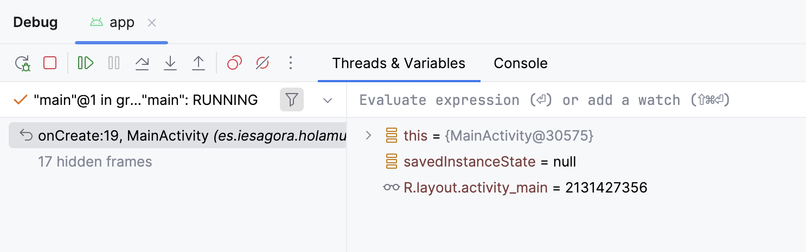


</div>