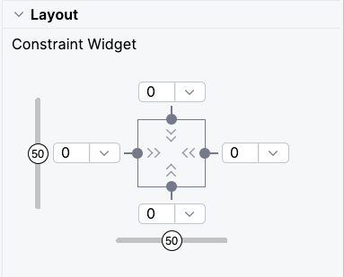
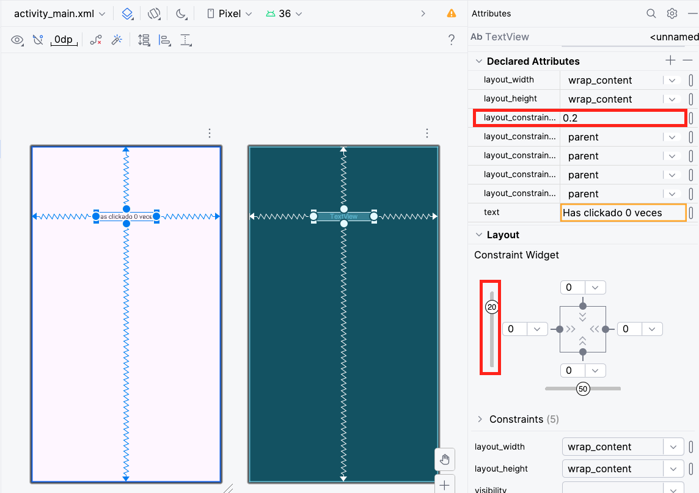
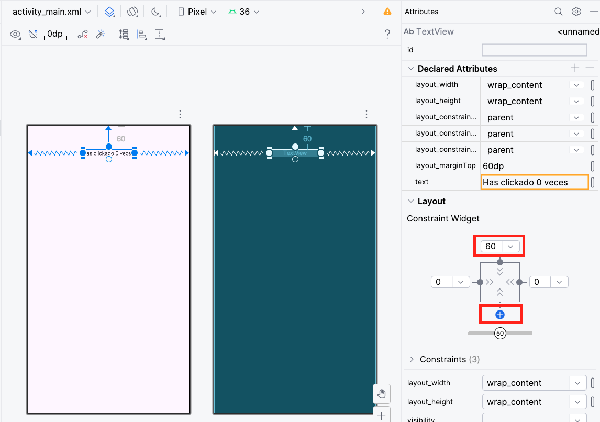
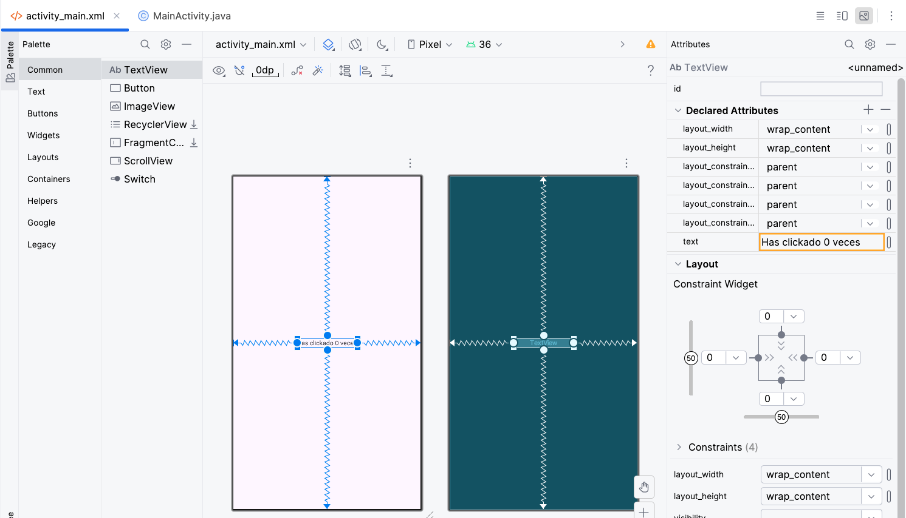
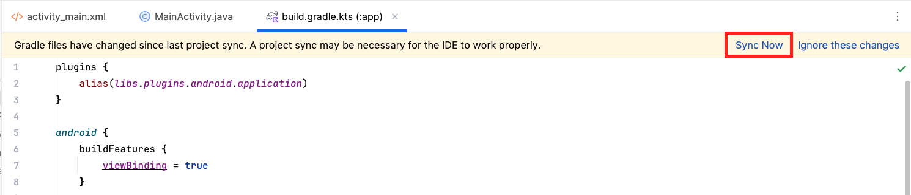

# Aplicación básica

<div class="justify-text">

En esta segunda parte vamos a crear una **aplicación sencilla en Android**: un contador de clics implementado con una sola Activity.  


La interfaz estará construida con un **ConstraintLayout** que incluirá un campo de texto para mostrar el número de clics y un botón que permitirá incrementarlo.  

Este ejemplo nos servirá como primer acercamiento práctico a la relación entre **diseño de interfaz (XML)** y **lógica de programación (Java)** dentro de una aplicación Android.

:::info
En Android, una aplicación suele estar formada por varias **Activities** entre las que el usuario puede navegar. En este ejercicio trabajaremos únicamente con una, lo que nos permitirá centrarnos en comprender su funcionamiento básico.
:::


---

## Editar el Layout

El primer paso será preparar la interfaz de usuario.
En Android, los **layouts** se definen en archivos **XML** que se encuentran dentro de la carpeta `res/layout`. Estos archivos describen cómo se organizan y presentan los distintos elementos visuales en la pantalla.

### Modos de edición

Android Studio ofrece dos formas principales de trabajar con los layouts:

* **Modo gráfico (Design):** permite construir la interfaz de forma visual, arrastrando componentes desde la paleta y ajustando sus propiedades con el ratón. Es útil para obtener una vista rápida del resultado y mover elementos con facilidad.
* **Modo código (XML):** consiste en escribir directamente el XML que define la interfaz. Aporta un mayor control, precisión y comprensión de lo que ocurre “por debajo” del editor gráfico.

En la práctica, **ambos modos se complementan**. Por ejemplo:

* Con **ConstraintLayout** suele resultar más ágil comenzar en el editor gráfico, ya que las restricciones se entienden mejor visualmente.
* Con **LinearLayout** u otros layouts más simples, escribir el XML directamente suele ser más rápido y claro.


### Análisis de la interfaz de "Hello World"

Cuando creamos una aplicación Android nueva, esta contiene por defecto un texto **"Hello World"**. Vamos a analizar esta interfaz para comprender ciertos aspectos antes de continuar.

El código que contiene es:

```xml title="MainActivity.xml"
<?xml version="1.0" encoding="utf-8"?>
<androidx.constraintlayout.widget.ConstraintLayout xmlns:android="http://schemas.android.com/apk/res/android"
    xmlns:app="http://schemas.android.com/apk/res-auto"
    xmlns:tools="http://schemas.android.com/tools"
    android:id="@+id/main"
    android:layout_width="match_parent"
    android:layout_height="match_parent"
    tools:context=".MainActivity">

    <TextView
        android:layout_width="wrap_content"
        android:layout_height="wrap_content"
        android:text="Hello World"
        app:layout_constraintBottom_toBottomOf="parent"
        app:layout_constraintEnd_toEndOf="parent"
        app:layout_constraintStart_toStartOf="parent"
        app:layout_constraintTop_toTopOf="parent" />

</androidx.constraintlayout.widget.ConstraintLayout>
```

Podemos ver que el texto se define dentro de un campo llamado **`TextView`**, que a su vez está contenido dentro de un **`ConstraintLayout`**.
Toda interfaz Android debe estar contenida dentro de alguno de los layouts existentes (**`LinearLayout`**, **`ConstraintLayout`**, **`FrameLayout`**, etc.).


#### **ConstraintLayout**

**`ConstraintLayout`** es un tipo de layout muy flexible en Android que permite posicionar y dimensionar vistas usando **restricciones (constraints)**. Con él podemos diseñar interfaces complejas en una sola jerarquía, evitando tener que anidar muchos layouts diferentes.

Cada elemento de la vista (por ejemplo, el **`TextView`**) debe estar “atado” al menos en **dos direcciones (horizontal y vertical)**, por ejemplo: arriba y abajo, izquierda y derecha, o centrado en el padre. Podemos imaginar las constraints como **“muelles”** que tiran del elemento en cuatro direcciones (arriba, abajo, izquierda y derecha). El widget queda equilibrado entre las fuerzas definidas.

En el caso del **TextView** vemos que ya hay definidas **cuatro constraints**:

```xml
app:layout_constraintBottom_toBottomOf="parent"
app:layout_constraintEnd_toEndOf="parent"
app:layout_constraintStart_toStartOf="parent"
app:layout_constraintTop_toTopOf="parent"
```

Donde:

* **`constraintTop_toTopOf="parent"`** → tira hacia la parte superior del padre.
* **`constraintBottom_toBottomOf="parent"`** → hacia la parte inferior.
* **`constraintStart_toStartOf="parent"`** → hacia la izquierda.
* **`constraintEnd_toEndOf="parent"`** → hacia la derecha.

Ten en cuenta que el **padre del `TextView` es el `ConstraintLayout`**.

Si analizamos la posición del `TextView` desde la vista de diseño, podemos ver que todas las fuerzas están en **equilibrio (valor 0)**.



Si queremos que el elemento esté más desplazado hacia arriba, tenemos dos formas de hacerlo:

* **Modificar el atributo `Vertical bias`** (u `Horizontal bias` si el desplazamiento fuera hacia izquierda o derecha) a **0.2**. En este caso el elemento se coloca más cerca del borde superior (20% desde arriba y 80% hacia abajo). Al trabajar en porcentajes, la posición es **proporcional y adaptable** a cualquier tamaño de pantalla.

  

* **Romper el equilibrio entre las fuerzas**, asignando un **margen fijo** en la parte superior en lugar de 0. Si te fijas, hemos quitado el muelle hacia el **bottom** para evitar que tire desde ahí. Este mecanismo es **más rígido** que el anterior, pudiendo provocar que en pantallas pequeñas quede demasiado separado, y en pantallas grandes demasiado arriba.

  


#### **TextView**

En el campo de texto, además de los atributos ya mencionados relacionados con el `ConstraintLayout`, podemos ver las siguientes propiedades:

* Los atributos **`layout_width`** y **`layout_height`** especifican el ancho y alto del elemento:

  * El valor **`wrap_content`** indica que el ancho/alto se adapta al contenido del elemento (en el caso del Button y el TextView, al texto que contienen).
  * El valor **`match_parent`** indica que el ancho/alto debe ser el mismo que el del elemento padre.
  * También se puede establecer un ancho/alto de **tamaño fijo en píxeles (dp/px)**.

* El atributo **`text`** especifica el texto que se muestra en la interfaz.

* El atributo **`id`** es el **identificador único** de ese recurso. El nombre debe ser algo que permita identificar rápidamente el tipo de campo y su función.
  Si lo modificas desde la vista de código, en el valor hay que poner **@+id/** antes del identificador que quieras asignar.

Por ejemplo:

```xml
<TextView
    android:id="@+id/textoInicial"
    android:layout_width="wrap_content"
    android:layout_height="wrap_content"
    android:layout_marginTop="60dp"
    android:text="Hola mundo"
    app:layout_constraintEnd_toEndOf="parent"
    app:layout_constraintStart_toStartOf="parent"
    app:layout_constraintTop_toTopOf="parent" />
```

:::info IMPORTANCIA DEL ID
Todos los campos que vayan a ser modificados o consultados desde la lógica (desde Java) deben tener definido un **id**. En caso contrario, no podrás acceder a ellos.
:::


### Interfaz de la app contadora

Nuestra aplicación básica contará con dos elementos principales:

* Un **TextView** que mostrará el número de veces que se ha pulsado el botón.
* Un **Button** que incrementará ese número cada vez que el usuario lo presione.

Para el texto, reutilizaremos el `TextView` que inicialmente contiene el mensaje *“Hello World”*, personalizando su contenido mediante el atributo `android:text` y añadiéndole un identificador único.

Esto puede hacerse directamente desde el código:

```xml title="MainActivity.xml"
<?xml version="1.0" encoding="utf-8"?>
<androidx.constraintlayout.widget.ConstraintLayout xmlns:android="http://schemas.android.com/apk/res/android"
    xmlns:app="http://schemas.android.com/apk/res-auto"
    xmlns:tools="http://schemas.android.com/tools"
    android:id="@+id/main"
    android:layout_width="match_parent"
    android:layout_height="match_parent"
    tools:context=".MainActivity">

    <TextView
        android:id="@+id/textoContador"
        android:layout_width="wrap_content"
        android:layout_height="wrap_content"
        android:text="Has clickado 0 veces"
        app:layout_constraintBottom_toBottomOf="parent"
        app:layout_constraintEnd_toEndOf="parent"
        app:layout_constraintStart_toStartOf="parent"
        app:layout_constraintTop_toTopOf="parent" />

</androidx.constraintlayout.widget.ConstraintLayout>
```

O bien desde el editor gráfico, modificando los atributos:



A continuación añadiremos un botón debajo del texto. Para lograrlo, anclaremos la parte superior del botón a la parte inferior del `TextView` y le aplicaremos un `Vertical bias` de 0.3 para situarlo más próximo a la parte superior.

El layout completo queda así:

```xml title="MainActivity.xml"
<?xml version="1.0" encoding="utf-8"?>
<androidx.constraintlayout.widget.ConstraintLayout xmlns:android="http://schemas.android.com/apk/res/android"
    xmlns:app="http://schemas.android.com/apk/res-auto"
    xmlns:tools="http://schemas.android.com/tools"
    android:id="@+id/main"
    android:layout_width="match_parent"
    android:layout_height="match_parent"
    tools:context=".MainActivity">

    <TextView
        android:id="@+id/textoContador"
        android:layout_width="wrap_content"
        android:layout_height="wrap_content"
        android:text="Has clickado 0 veces"
        app:layout_constraintBottom_toBottomOf="parent"
        app:layout_constraintEnd_toEndOf="parent"
        app:layout_constraintStart_toStartOf="parent"
        app:layout_constraintTop_toTopOf="parent" />

    <Button
        android:id="@+id/btnContador"
        android:layout_width="wrap_content"
        android:layout_height="wrap_content"
        android:text="Contar"
        app:layout_constraintBottom_toBottomOf="parent"
        app:layout_constraintEnd_toEndOf="parent"
        app:layout_constraintStart_toStartOf="parent"
        app:layout_constraintTop_toBottomOf="@+id/textoContador"
        app:layout_constraintVertical_bias="0.3" />

</androidx.constraintlayout.widget.ConstraintLayout>
```

---

## Programar el Comportamiento

Una vez definida la interfaz, necesitamos programar qué ocurre al interactuar con ella.  
En este caso, queremos que al pulsar el botón se incremente el contador y se actualice el texto del `TextView`.

### Enlazando elementos (forma tradicional)
Para acceder a un `TextView` o `Button` desde la Activity, debemos crear una variable y vincularla usando el método `findViewById()`.  

```java title="MainActivity.java"
public class MainActivity extends AppCompatActivity {

    private TextView textoContador;
    private  Button btnContador;

    @Override
    protected void onCreate(Bundle savedInstanceState) {
        super.onCreate(savedInstanceState);
        // Establecemos el layout que debe cargar esta Activity
        setContentView(R.layout.activity_main);

        // Una vez cargado el layout, ya podemos acceder a sus elementos
        textoContador = findViewById(R.id.textoContador);
        btnContador = findViewById(R.id.btnContador);
    }
}
```

Utilizando las referencias a `textoContador` y `btnContador` podremos modificar sus propiedades desde el código Java.


### Enlazando elementos (ViewBinding)
El método anterior funciona, pero en proyectos con muchas vistas puede volverse tedioso.  
Para simplificarlo, Android ofrece **ViewBinding**, que permite acceder directamente a los elementos del layout sin llamadas repetitivas a `findViewById()`.  

Para activarlo, en `build.gradle (Module: app)` añade:

```gradle
android {
    buildFeatures {
        viewBinding = true
    }

    ...
}
```

:::warning Sincronización
Cualquiero modificación que se realice sobre el build.gradle requiere sincronizar para descargar las nuevas dependencias.


:::

Este método de enlace, requiere una nueva forma de inicializar la activity:

```java title="MainActivity.java"
public class MainActivity extends AppCompatActivity {

    // Variable que sirve como enlace
    private ActivityMainBinding binding;

    @Override
    protected void onCreate(Bundle savedInstanceState) {
        super.onCreate(savedInstanceState);
        // Establecemos el layout que debe cargar esta Activity
        setContentView((binding = ActivityMainBinding.inflate(getLayoutInflater())).getRoot());
    }
}
```

Ahora puedes acceder directamente a los elementos de esta forma:

```java
binding.textViewContador.setText("0");
```

### Programando el botón (tradicional)
Para que un botón reaccione al clic, debemos usar el método `setOnClickListener()` y definir qué hacer en su `onClick()`.  

Ejemplo sencillo:

```java
public class MainActivity extends AppCompatActivity {

    // Variable que sirve como enlace
    private ActivityMainBinding binding;
    
    // Variable que cuenta el nº de clicks
    private int contador = 0;

    @Override
    protected void onCreate(Bundle savedInstanceState) {
        super.onCreate(savedInstanceState);
        // Establecemos el layout que debe cargar esta Activity
        setContentView((binding = ActivityMainBinding.inflate(getLayoutInflater())).getRoot());

        binding.btnContador.setOnClickListener(new View.OnClickListener() {
            @Override
            public void onClick(View v) {
                // Actualizamos el valor del contador
                contador++; 
                // Actualizamos el texto que muestra la cuenta
                binding.textoContador.setText("Has clickado " + contador + " veces");
            }
        });
    }
}
```

### Programando el botón (lambdas)
Cuando la lógica que debe ejecutarse en el evento es más extensa, conviene separar el código en un **método independiente** y llamarlo desde el `onClick()`.  

Con Java 8 podemos simplificar usando una **expresión lambda**:

```java title="MainActivity.java"
public class MainActivity extends AppCompatActivity {

    // Variable que sirve como enlace
    private ActivityMainBinding binding;

    // Variable que cuenta el nº de clicks
    private int contador = 0;

    @Override
    protected void onCreate(Bundle savedInstanceState) {
        super.onCreate(savedInstanceState);
        // Establecemos el layout que debe cargar esta Activity
        setContentView((binding = ActivityMainBinding.inflate(getLayoutInflater())).getRoot());

        binding.btnContador.setOnClickListener(v -> incrementarContador(v));
    }

    // Método externo que reacciona al evento
    private void incrementarContador(View v) {
        // Actualizamos el valor del contador
        contador++;
        // Actualizamos el texto que muestra la cuenta
        binding.textoContador.setText("Has clickado " + contador + " veces");
    }
}
```

Aquí, `v` representa la vista que ha sido pulsada (el botón en este caso).


:::info EJERCICIO
Modifica la aplicación del contador añadiendo un botón adicional para **resetear el contador**.
:::


</div>