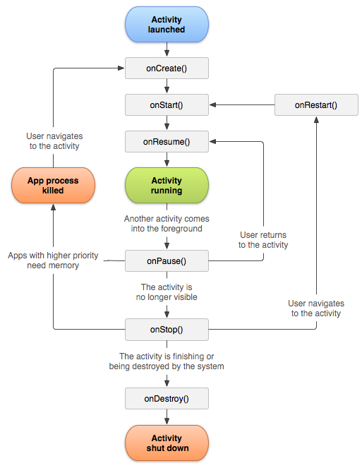
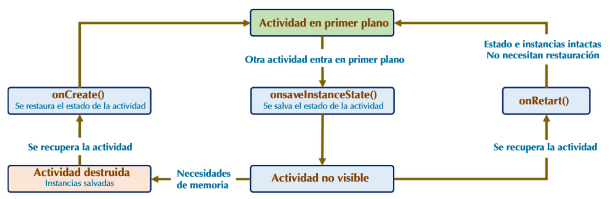

<div class="justify-text">

# Ciclo de vida de una aplicación

En esta unidad vamos a estudiar el **ciclo de vida de una Activity** en Android. Comprenderlo es fundamental, ya que determina cómo se comporta una aplicación cuando el usuario entra, sale o la vuelve a abrir. También veremos cómo **mantener el estado** de una actividad para no perder información importante.


## Ciclo de vida

Cuando un usuario navega por tu aplicación, la cierra y después vuelve a entrar, la instancia de la `Activity` pasa por diferentes **estados del ciclo de vida**.  
La clase `Activity` proporciona una serie de **métodos de callback** que notifican cuando ocurre un cambio de estado: creación, pausa, reanudación o destrucción de la actividad.

Estos métodos permiten definir **cómo debe comportarse la Activity** en cada situación. Por ejemplo, en un reproductor de vídeo podemos pausar el vídeo y cerrar la conexión cuando el usuario cambia de aplicación; Si el usuario vuelve, restablecemos la conexión y reanudamos la reproducción.




### Métodos principales

- **`onCreate()`** → se llama al crear la actividad. Aquí inicializamos los elementos básicos, como la interfaz (`setContentView`) o variables de estado.  
- **`onStart()`** → la actividad empieza a prepararse para ser visible y entrar en primer plano. En este punto, la actividad **ya es visible para el usuario, pero aún no tiene el foco para interactuar**. 
- **`onResume()`** → la actividad ya está en pantalla y tiene el foco del usuario. Permanece en este estado hasta que otra app o actividad la interrumpe.  
- **`onPause()`** → se ejecuta cuando el usuario abandona la actividad. En este punto la actividad pierde el foco, pero aún es parcialmente visible (otra ventana encima, un diálogo, etc.) Es el lugar indicado para **guardar datos temporales** o detener animaciones. Debe ser rápido, ya que hasta que no termine no se inicia la siguiente actividad.  
- **`onStop()`** → la actividad deja de ser visible. Aquí se pueden realizar **tareas de cierre más pesadas**, como guardar en base de datos.  
- **`onDestroy()`** → se llama justo antes de que la actividad sea destruida, ya sea porque el usuario cerró la app o porque el sistema necesita liberar memoria.  

:::tip
La clave está en saber **qué guardar en cada fase**. Operaciones rápidas en `onPause()`, y las más costosas (como acceso a base de datos) en `onStop()`.
:::

:::info EJERCICIO

1. Crea una aplicación nueva y observa los estados que atraviesa la Activity cuando:  
   - Cierras la aplicación.  
   - Bloqueas el móvil.  
   - Giras el dispositivo.  
   
   Puedes usar Logcat para analizar los estados por los que pasa.

   ```java title="MainActivity.java"
    @Override
    protected void onCreate(Bundle savedInstanceState) {
        super.onCreate(savedInstanceState);
        setContentView((binding = ActivityMainBinding.inflate(getLayoutInflater())).getRoot());

        Log.d("MainActivity", "Paso por onCreate");
    }

    @Override
    protected void onResume() {
        super.onResume();
        Log.d("MainActivity", "Paso por onResume");
    }
   ```

2. Repite la prueba con la aplicación **Contador** de la unidad anterior. Reflexiona: **¿qué ocurre con el valor del contador?**
:::

---

## Mantener el estado

Como hemos visto, cuando una actividad se pausa o se detiene, su estado suele conservarse porque la instancia sigue en memoria. Sin embargo, el sistema puede **destruir una Activity** en segundo plano para liberar recursos. En ese caso, al volver a abrirla, el sistema debe **crear una nueva instancia**, volviendo a inicializarse todas las variables.  

Para que el usuario no pierda su información, debemos implementar mecanismos para **guardar y restaurar el estado**.  



### Guardar el estado
Se realiza con el método **`onSaveInstanceState(Bundle outState)`**.  
Podemos añadir al `Bundle` pares **clave-valor** con la información que queramos conservar (texto, números, booleanos, etc.).  

Ejemplo:

```java
@Override
protected void onSaveInstanceState(Bundle outState) {
    outState.putInt("contador", contador);
    super.onSaveInstanceState(outState);
}
```

### Recuperar el estado
El estado guardado se recupera en dos posibles callbacks:  
- **`onCreate(Bundle savedInstanceState)`**  
- **`onRestoreInstanceState(Bundle savedInstanceState)`**  

Ambos reciben el `Bundle` con la información guardada. Por comodidad, lo recuperaremos en `onCreate`. No obstante, en ambos casos es importante comprobar si `savedInstanceState` es **nulo**, ya que:  
- Si **es nulo**, significa que la Activity se está creando desde cero.  
- Si **no es nulo**, se está recreando con datos previamente guardados.  

Ejemplo:

```java
@Override
protected void onCreate(Bundle savedInstanceState) {
    super.onCreate(savedInstanceState);
    setContentView(R.layout.activity_main);

    if (savedInstanceState != null) {
        contador = savedInstanceState.getInt("contador");
    } else {
        // Aquí puedes inicializarlo al valor por defecto
        contador = 0;
    }
}
```

De esta manera, al rotar la pantalla o reabrir la app tras ser destruida, el valor del contador (o cualquier otra información relevante) se conserva.

## Aplicación contador

Para que nuestra aplicación contadora, desarrollada en el apartado anterior, conserve el valor del contador al producirse cambios en el ciclo de vida (por ejemplo, al girar la pantalla), podemos modificarla de la siguiente manera:

```java title="MainActivity.java"
public class MainActivity extends AppCompatActivity {

    // Variable que sirve como enlace
    private ActivityMainBinding binding;

    // Constante para evitar errores al escribir
    private final static String ESTADO_CONTADOR = "contador";

    private int contador = 0;

    @Override
    protected void onCreate(Bundle savedInstanceState) {
        super.onCreate(savedInstanceState);
        setContentView((binding = ActivityMainBinding.inflate(getLayoutInflater())).getRoot());

        if (savedInstanceState != null) {
            // Recuperamos el valor de contador
            contador = savedInstanceState.getInt(ESTADO_CONTADOR);
        }

        binding.btnContador.setOnClickListener(v -> incrementarContador(v));
    }

    private void incrementarContador(View v) {
        // Actualizamos el valor del contador
        contador++;
        // Actualizamos el texto que muestra la cuenta
        binding.textoContador.setText("Has clickado " + contador + " veces");
    }

    @Override
    protected void onSaveInstanceState(@NonNull Bundle outState) {
        super.onSaveInstanceState(outState);
        // Guardamos el valor de contador
        outState.putInt(ESTADO_CONTADOR, contador);
    }
}
```

:::warning CUIDADO
Copia este código y comprueba su funcionamiento. Si giras el dispositivo, ¿qué sucede con el texto del contador? Reflexiona: ¿qué falta para que funcione de manera correcta?
:::

:::info ACTIVIDAD DE SEGUIMIENTO
Realiza la **Actividad de Seguimiento 1: Dungeons and Dados**.
:::


</div>