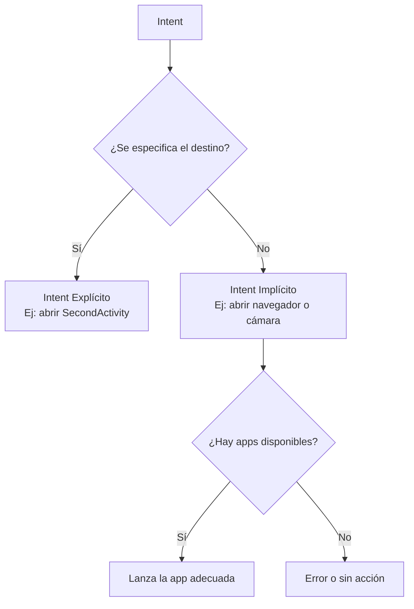
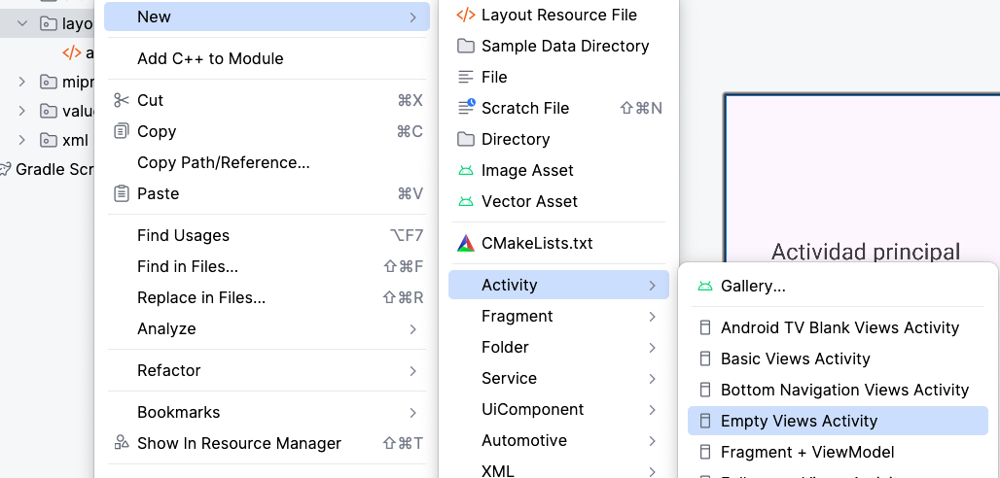
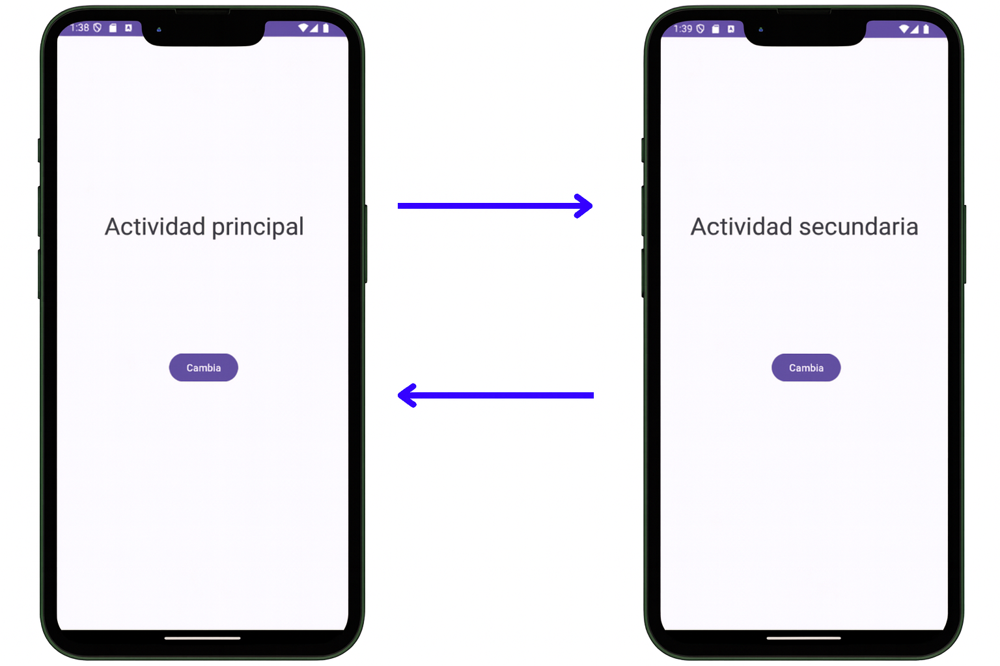
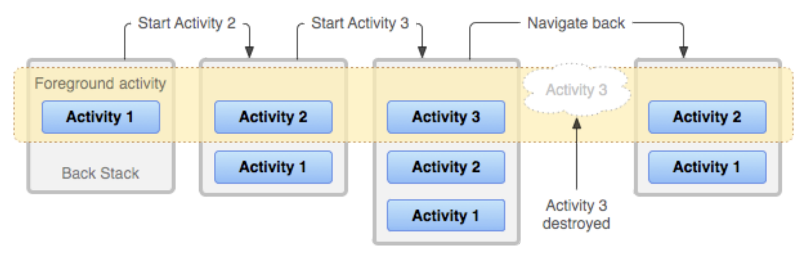

<div class="justify-text">

En Android, los **Intents** son mensajes que permiten solicitar una acción a otro componente.
Gracias a ellos podemos **iniciar Activities**, **lanzar servicios**, **enviar broadcasts** o incluso interactuar con aplicaciones externas.

Existen dos tipos de Intents:

* **Explícitos** → apuntan a un componente concreto dentro de nuestra aplicación.
* **Implícitos** → describen una acción a realizar, dejando que Android decida qué aplicación o componente puede llevarla a cabo. Estos Intents se usan para realizar acciones como abrir un enlace en el navegador o hacer una foto con la cámara.

<div style={{ display: "flex", justifyContent: "center" }}>



</div>
---

## Intents Explícitos

Un **Intent explícito** indica directamente **qué Activity o componente** se debe iniciar. Se utilizan habitualmente para navegar entre pantallas dentro de una misma aplicación.

Pero... **¿Cómo se crea una nueva Activity en Android Studio?** Puedes añadir una Activity haciendo clic derecho en la carpeta de layouts: **New > Activity > Empty Views Activity**.



Para ir desde una actividad a otra, crearemos un Intent y se lo pasaremos al método **startActivity()**.

```java
// Crear un Intent explícito
Intent intent = new Intent(MainActivity.this, SecondActivity.class);
startActivity(intent);
```

El constructor de un Intent requiere dos parámetros, en este ejemplo:

* El **primer parámetro** (`MainActivity.this`) es el **contexto**, es decir, desde dónde se lanza.
* El **segundo parámetro** (`SecondActivity.class`) es la **Activity destino**.




### Compartir información entre Activities

En muchas ocasiones no basta con abrir una nueva **Activity**, sino que necesitamos **pasar datos** entre ellas.
Por ejemplo, podemos enviar desde una pantalla de login el **usuario introducido** para que la pantalla principal lo muestre en un mensaje de bienvenida.

En Android, este intercambio de información se realiza mediante **extras** dentro de un `Intent`.

#### Enviar datos

Usamos el método `putExtra()` para añadir valores al `Intent`. Cada dato se identifica con una **clave (name)** y un **valor (value)**.

```java
Intent intent = new Intent(MainActivity.this, SecondActivity.class);
intent.putExtra("mensaje", "Hola mundo");
intent.putExtra("numero", 42);
intent.putExtra("esValido", true);
startActivity(intent);
```

#### Recibir datos

En la nueva Activity, por ejemplo, en el método `onStart()`, recuperamos el Intent con `getIntent()` y accedemos a los valores usando los métodos correspondientes (`getStringExtra`, `getIntExtra`, `getBooleanExtra`, etc.).
Es recomendable indicar un **valor por defecto**, que se usará si el dato no llega correctamente.

```java
Intent intent = getIntent();
String mensaje = intent.getStringExtra("mensaje");
int numero = intent.getIntExtra("numero", 0);
boolean esValido = intent.getBooleanExtra("esValido", false);
```

Utiliza nombres de clave claros y consistentes (ejemplo: `"usuario"`, `"puntuacion"`, `"esAdmin"`) para evitar errores y facilitar la lectura del código.

### Back Stack

La **back stack (pila de retroceso)** en Android es una estructura de datos que gestiona las actividades que se
han iniciado dentro de una aplicación. Cuando abrimos nuevas Activities con Intents explícitos, Android las va apilando en ella, de tal forma que:

* Cada nueva pantalla se coloca sobre la anterior.
* Al pulsar el botón de retroceso, se elimina la última y se vuelve a la anterior.

Esto asegura un comportamiento de navegación coherente para el usuario.



---

## Intents Implícitos

Un **Intent implícito** no indica un destino específico. En su lugar, describe una **acción a realizar** (por ejemplo, abrir un enlace o tomar una foto). Android se encarga de buscar qué aplicación instalada puede responder a esa acción.

Ejemplos comunes:

```java
// Abrir un navegador con una URL
Intent intent = new Intent(Intent.ACTION_VIEW, Uri.parse("https://developer.android.com"));
startActivity(intent);

// Realizar una llamada
Intent intent = new Intent(Intent.ACTION_DIAL, Uri.parse("tel:123456789"));
startActivity(intent);

// Enviar un WhatsApp (si está instalada la app)
Intent intent = new Intent(Intent.ACTION_SEND);
intent.setType("text/plain");
intent.putExtra(Intent.EXTRA_TEXT, "Hola, ¿qué tal?");
intent.setPackage("com.whatsapp");
startActivity(intent);
```

:::info Intents más comunes
Si quieres profundizar en los **intents implícitos** (abrir una web, enviar un correo, tomar una foto, etc.), consulta la documentación oficial de Android en este enlace: [developer.android.com/guide/components/intents-common](https://developer.android.com/guide/components/intents-common?hl=es-419)
:::

### Buenas prácticas

Antes de lanzar un Intent implícito, conviene **verificar** que existe alguna aplicación capaz de gestionarlo:

```java
if (intent.resolveActivity(getPackageManager()) != null) {
    startActivity(intent);
} else {
    Toast.makeText(MainActivity.this, "No existe la aplicación", Toast.LENGTH_SHORT).show();
}
```

De esta forma evitamos errores si, por ejemplo, no existe ninguna aplicación de correo instalada.


</div>