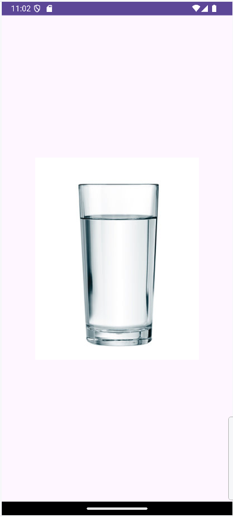

<div class="justify-text">

En Android, los **layouts** son los encargados de organizar cómo se muestran los diferentes elementos de la interfaz de usuario (botones, textos, imágenes, etc.). Aunque no son visibles por sí mismos, controlan la **distribución, posición y tamaño** de todos los componentes de una pantalla.

Existen dos conceptos clave:

* **View**: la unidad básica de la interfaz, como un botón, una etiqueta de texto o una imagen.
* **ViewGroup**: actúa como un contenedor que puede agrupar varias `View` o incluso otros `ViewGroup`. Los layouts son un tipo especial de `ViewGroup`.


Gracias a esta jerarquía, podemos anidar layouts para crear diseños cada vez más complejos.

---

## Principales atributos de medida

A continuación se describen los principales atributos que se pueden utilizar tanto en Views como ViewGroups:

| **Categoría**                    | **Atributo**            | **Descripción**               |
|----------------------------------|--------------------------|-------------------------------|
| **Atributos de posicionamiento** | `layout_width`           | ancho                         |
|                                  | `layout_height`          | alto                          |
| **Atributos para los márgenes**  | `layout_margin`          | cuatro márgenes               |
|                                  | `layout_marginBottom`    | margen inferior               |
|                                  | `layout_marginLeft`      | margen izquierdo              |
|                                  | `layout_marginRight`     | margen derecho                |
|                                  | `layout_marginTop`       | margen superior               |
| **Atributos para el espaciado**  | `android:padding`        | espaciado a los cuatro lados  |
|                                  | `android:paddingTop`     | espaciado superior            |
|                                  | `android:paddingBottom`  | espaciado inferior            |
|                                  | `android:paddingLeft`    | espaciado izquierdo           |
|                                  | `android:paddingRight`   | espaciado derecho             |

:::tip Diferencia entre **margen** y **padding**
- **Margen (margin):** es el espacio **externo** entre el borde del elemento y otros elementos que lo rodean.  
- **Padding:** es el espacio **interno** entre el contenido del elemento (texto, imagen, etc.) y su propio borde.  

En resumen: **margen separa elementos entre sí** y **padding separa el contenido del borde del mismo elemento**.
:::

En la siguiente imagen puedes ver cómo afectan los valores `wrap_content` y `match_parent` a las propiedades `layout_width`y `layout_height`:


Al definir un layout o cualquier vista, debemos establecer sus dimensiones. Android utiliza varias unidades, pero las más comunes son:

* **px (píxeles)**: representan un punto físico en la pantalla. No se recomienda usar esta unidad, ya que el tamaño varía según la densidad de cada dispositivo.
* **dp (density-independent pixels)**: unidad recomendada. Se ajusta automáticamente a la densidad de la pantalla, garantizando que el tamaño visual se mantenga uniforme en diferentes dispositivos.
* **sp (scale-independent pixels)**: similar a `dp`, pero se adapta además al tamaño de texto configurado por el usuario en su dispositivo. Se utiliza siempre para textos.

---

## Tipos principales de Layouts

En función de la forma y el posicionamiento de los elementos en su interior podemos distinguir una gran variedad de tipos de Layouts.


### FrameLayout

Es el más simple. Coloca todos los elementos en la **esquina superior izquierda** y los va apilando uno encima de otro.
Suele usarse para superponer vistas, por ejemplo, una imagen de fondo con un botón encima.

Podemos utilizar el atributo layout_gravity para colocar los elementos en la posición deseada, aunque no tendremos una precisión milimétrica.

```xml title="activity_main.xml"
<?xml version="1.0" encoding="utf-8"?>
<FrameLayout xmlns:android="http://schemas.android.com/apk/res/android"
    xmlns:app="http://schemas.android.com/apk/res-auto"
    xmlns:tools="http://schemas.android.com/tools"
    android:id="@+id/main"
    android:layout_width="match_parent"
    android:layout_height="match_parent"
    tools:context=".MainActivity">

    <Button
        android:id="@+id/button"
        android:layout_width="wrap_content"
        android:layout_height="wrap_content"
        android:layout_gravity="left|center"
        android:text="Button" />

</FrameLayout>
```

Estos son los valores que le podemos dar a los elementos:


---

### LinearLayout

Permite organizar sus elementos de forma **vertical** u **horizontal**, según la propiedad `android:orientation`.
Además, incorpora la propiedad `android:layout_weight`, que asigna un tamaño proporcional entre los elementos.

:::warning Información importante sobre `layout_weight`
Para que el atributo `layout_weigth` actue de forma correcta, debes cambiar las propiedades:
* Si la orientación es vertical → se pone `layout_height="0dp"`.
* Si la orientación es horizontal → se pone `layout_width="0dp"`.
:::

Ejemplo de LinearLayout con diferentes pesos:

```xml title="activity_main.xml"
<LinearLayout xmlns:android="http://schemas.android.com/apk/res/android"
    android:layout_width="match_parent"
    android:layout_height="match_parent"
    android:orientation="horizontal"
    tools:context=".MainActivity">

    <Button
        android:id="@+id/button2"
        android:layout_width="0dp"
        android:layout_height="wrap_content"
        android:layout_weight="1"
        android:text="Button" />

    <Button
        android:id="@+id/button3"
        android:layout_width="0dp"
        android:layout_height="wrap_content"
        android:layout_weight="2"
        android:text="Button" />

</LinearLayout>
```

La salida que obtenemos es:


Una de las características más potentes de estos layouts es que se pueden **anidar** para conseguir vistas más complejas:

```xml title="activity_main.xml"
<LinearLayout xmlns:android="http://schemas.android.com/apk/res/android"
    android:layout_width="match_parent"
    android:layout_height="match_parent"
    android:orientation="vertical"
    tools:context=".MainActivity">

    <Button
        android:id="@+id/button2"
        android:layout_width="match_parent"
        android:layout_height="0dp"
        android:layout_weight="1"
        android:text="Button" />

    <Button
        android:id="@+id/button3"
        android:layout_width="match_parent"
        android:layout_height="0dp"
        android:layout_weight="2"
        android:text="Button" />

    <LinearLayout
        android:layout_width="match_parent"
        android:layout_height="0dp"
        android:layout_weight="1"
        android:orientation="horizontal">

        <Button
            android:layout_width="0dp"
            android:layout_weight="1"
            android:layout_height="match_parent"
            android:text="Button"/>

        <Button
            android:layout_width="0dp"
            android:layout_height="match_parent"
            android:layout_weight="3"
            android:text="Button"/>
    </LinearLayout>
</LinearLayout>
```

El código anterior da como resultado:


:::info EJERCICIO
**Dibuja la siguiente vista.**  
Antes de comenzar con el código, analiza los layouts que la componen y la orientación de los mismos.


:::

---

### TableLayout

Distribuye los elementos en **filas y columnas**, como una tabla en HTML.
Las filas se definen con `TableRow`, y dentro de ellas se añaden las celdas (los controles).

Atributos útiles del layout:

* `android:stretchColumns`: permite que ciertas columnas se expandan.
* `android:shrinkColumns`: permite que se contraigan.
* `android:collapseColumns`: oculta columnas completas.

Atributos útiles para las celdas:

* `android:layout_span`: permite que una celda determinada pueda ocupar el espacio de varias columnas de la tabla (análogo al atributo `colspan` de HTML). Esto se indicará mediante la propiedad  del componente concreto que deberá tomar dicho espacio.

```xml title="activity_main.xml"
<TableLayout xmlns:android="http://schemas.android.com/apk/res/android"
    xmlns:tools="http://schemas.android.com/tools"
    android:layout_width="match_parent"
    android:layout_height="match_parent"
    android:stretchColumns="2,3"
    android:shrinkColumns="0,1"
    tools:context=".MainActivity">

    <TableRow>
        <Button android:text="Celda 1.1" />
        <Button android:text="Celda 1.2" />
        <Button android:text="Celda 1.3" />
    </TableRow>

    <TableRow>
        <Button android:text="Celda 2.1" />
        <Button android:text="Celda 2.2" />
        <Button android:text="Celda 2.3" />
    </TableRow>

    <TableRow>
        <Button
            android:text="Celda doble 3.1"
            android:layout_span="2"/>
        <Button android:text="Celda 3.2" />
    </TableRow>
</TableLayout>
```

El resultado del código anterior es el siguiente:


---

### GridLayout

Funciona también con filas y columnas, pero es **más flexible** que TableLayout. En el propio layout se definen el número de filas y columnas con `android:rowCount` y `android:columnCount`, respectivamente. Los diferentes elementos hijos se irán colocando ordenadamente por filas o columnas (dependiendo de la propiedad `android:orientation`) hasta completar el número de filas o columnas indicadas en los atributos anteriores.

Para las celdas del grid ofrece atributos como:

* `layout_rowSpan` y `layout_columnSpan`: para que un elemento ocupe varias filas o columnas.
* `layout_columnWeight`: para distribuir el espacio horizontal.
* `layout_row` y `layout_column`: para indicar la celda exacta en la que debe colocarse un elemento.

Ejemplo de uso:

```xml title="activity_main.xml"
<GridLayout xmlns:android="http://schemas.android.com/apk/res/android"
    xmlns:tools="http://schemas.android.com/tools"
    android:layout_width="match_parent"
    android:layout_height="match_parent"
    android:orientation="horizontal"
    android:columnCount="3"
    android:rowCount="3"
    tools:context=".MainActivity">

    <!-- Fila 1 -->
    <Button android:text="Celda 1.1" android:layout_columnWeight="1" />
    <Button android:text="Celda 1.2" android:layout_columnWeight="1" />
    <Button android:text="Celda 1.3 doble" android:layout_columnWeight="1"
        android:layout_rowWeight="2"
        android:layout_rowSpan="2" />

    <!-- Fila 2 -->
    <Button android:text="Celda 2.1" android:layout_columnWeight="1"/>
    <Button android:text="Celda 2.2" android:layout_columnWeight="1"/>

    <!-- Fila 3 -->
    <Button android:text="Celda 3.1 doble" android:layout_columnSpan="2"
        android:layout_columnWeight="1"/>
    <Button android:text="Celda 3.2" android:layout_columnWeight="1" />
</GridLayout>
```

El layout resultante es el siguiente:


---

### RelativeLayout

Permite colocar los elementos **en relación al contenedor** o entre ellos mismos.
Ejemplo: colocar un botón debajo de un campo de texto, o alinear un elemento al borde derecho del layout padre.

Aquí tienes la tabla en **Markdown** con las posiciones relativas:

Posiciones relativas al layout padre:

- `android:layout_alignParentLeft`  
- `android:layout_alignParentRight`  
- `android:layout_alignParentTop`  
- `android:layout_alignParentBottom`  
- `android:layout_centerHorizontal`  
- `android:layout_centerVertical`  
- `android:layout_centerInParent`  

Posiciones relativas a otro control:

- `android:layout_above`  
- `android:layout_below`  
- `android:layout_toLeftOf`  
- `android:layout_toRightOf`  
- `android:layout_alignLeft`  
- `android:layout_alignRight`  
- `android:layout_alignTop`  
- `android:layout_alignBottom`  
- `android:layout_alignBaseline`  

:::warning USO de RelativeLayout
Este tipo de layout fue muy utilizado en versiones anteriores de Android, pero hoy en día ha sido sustituido en gran medida por ConstraintLayout.
:::

Ejemplo de uso:

```xml title="activity_main.xml"
<RelativeLayout
    xmlns:android="http://schemas.android.com/apk/res/android"
    android:layout_width="match_parent"
    android:layout_height="match_parent">

    <EditText
        android:id="@+id/txtNombre"
        android:hint="Introduce tu nombre"
        android:layout_width="match_parent"
        android:layout_height="wrap_content"
        android:inputType="text"/>

    <Button
        android:id="@+id/btnAceptar"
        android:layout_width="wrap_content"
        android:layout_height="wrap_content"
        android:text="Aceptar"
        android:layout_below="@id/txtNombre"
        android:layout_alignParentRight="true"/>
</RelativeLayout>
```

La salida que genera es:


---

### ConstraintLayout

Es el **layout recomendado** actualmente por Google. Permite crear interfaces complejas de manera eficiente sin necesidad de anidar múltiples layouts.
Su funcionamiento se basa en establecer **constraints** (restricciones) que actúan como “muelles” en las cuatro direcciones (arriba, abajo, izquierda y derecha).


Es más potente y flexible que RelativeLayout, y está especialmente diseñado para usarse con el **editor visual** de Android Studio.

Más información:

* [Guía oficial de ConstraintLayout](https://developer.android.com/develop/ui/views/layout/constraint-layout)
* [Codelab práctico](https://developer.android.com/codelabs/constraint-layout#0)

---

:::info TIP PARA LA MAYORÍA DE LAYOUTS
El atributo `android:layout_gravity` se utiliza para especificar **cómo se debe posicionar una vista dentro de su contenedor
padre**. Ten en cuenta que el comportamiento de `layout_gravity` depende del layout en el que esté contenido. Funciona con
layouts como FrameLayout, LinearLayout y GridLayout, pero puede no tener efecto en otros layouts que no respetan
`layout_gravity`, como el RelativeLayout.

También debes tener en cuenta que **el layout en el que se utilie no debe ocupar toda la pantalla (`layout_width` y `layout_height` a `match_parent`)** ya que en ese caso no podrá centrar sus hijos.

```xml title="activity_main.xml"
<?xml version="1.0" encoding="utf-8"?>
<GridLayout xmlns:android="http://schemas.android.com/apk/res/android"
    xmlns:tools="http://schemas.android.com/tools"
    android:layout_width="wrap_content"
    android:layout_height="wrap_content"
    android:layout_gravity="center"
    android:orientation="horizontal"
    android:columnCount="3"
    android:rowCount="3"
    tools:context=".MainActivity">

    <!-- Fila 1 -->
    <Button android:text="Celda 1.1" android:layout_columnWeight="1" />
    <Button android:text="Celda 1.2" android:layout_columnWeight="1" />
    <Button android:text="Celda 1.3 doble" android:layout_columnWeight="1"
        android:layout_gravity="fill"
        android:layout_rowSpan="2" />

    <!-- Fila 2 -->
    <Button android:text="Celda 2.1" android:layout_columnWeight="1"/>
    <Button android:text="Celda 2.2" android:layout_columnWeight="1"/>

    <!-- Fila 3 -->
    <Button android:text="Celda 3.1 doble" android:layout_columnSpan="2"
        android:layout_columnWeight="1"/>
    <Button android:text="Celda 3.2" android:layout_columnWeight="1" />
</GridLayout>
```

El resultado será similar a:


:::

## Layouts para diferentes orientaciones

Android selecciona automáticamente el layout más adecuado según la **orientación del dispositivo** (portrait o landscape).
Podemos definir distintos archivos XML en `res/layout` y `res/layout-land` para personalizar la interfaz según la orientación.

Puedes crear un layout en la orientación landscape haciendo click derecho en la carpeta `res/layout` > New > Layout Resource File.


En el wizard que aparece selecciona **Landscape** como **Screen orientation**.


Como resultado, podrás observar que se ha creado un layout con el mismo nombre pero con la coletilla de `land`.


:::tip Detectar la orientación desde Java
Si necesitas **detectar la orientación actual del dispositivo en tiempo de ejecución**, puedes hacerlo en Java con:

```java
int orientacion = getResources().getConfiguration().orientation;

if (orientacion == Configuration.ORIENTATION_PORTRAIT) {
    // El dispositivo está en modo vertical (portrait)
} else if (orientacion == Configuration.ORIENTATION_LANDSCAPE) {
    // El dispositivo está en modo horizontal (landscape)
}
```

:::


:::info EJERCICIO
Crea una App que muestre dos Layouts diferentes dependiendo de la orientación del dispositivo.

| **Portrait** | **Landscape** |
|--------------|---------------|
|  |  |


:::


</div>