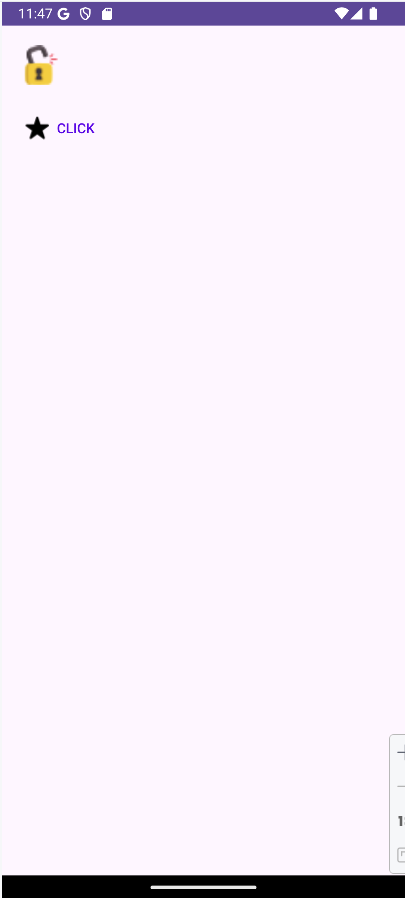

<div class="justify-text">

En este apartado veremos los **controles básicos de Android**, aquellos que más utilizaremos en nuestras interfaces gráficas: imágenes, textos, botones y controles de selección. Aunque sencillos, conocer bien sus propiedades es clave para crear aplicaciones usables y accesibles.

---

## Imágenes y textos

### ImageView
El control **ImageView** permite mostrar imágenes. Se suele usar para iconos, logotipos o cualquier recurso gráfico.

Atributos más usados:

- `android:src` o `android:srcCompact`: define la imagen a mostrar.  
- `android:maxWidth` y `android:maxHeight`: límites de tamaño.  
- `android:contentDescription`: **descripción accesible** (imprescindible para lectores de pantalla). 
- `android:scaleType`: define cómo se **ajusta y escala la imagen** dentro del espacio asignado por el `ImageView`.
Por defecto, un ImageView puede no mostrar la imagen como esperas si el tamaño del contenedor (`layout_width` y `layout_height`) no coincide con las dimensiones de la imagen.
Con scaleType puedes controlar **si la imagen se estira, se recorta o se mantiene proporcional**. Algunos posibles valores son: `center`, `centerCrop`, `fitCenter`, etc.   

```xml title="activity_main.xml"
<ImageView
    android:id="@+id/imgVaso"
    android:layout_width="200dp"
    android:layout_height="200dp"
    app:layout_constraintBottom_toBottomOf="parent"
    app:layout_constraintEnd_toEndOf="parent"
    app:layout_constraintStart_toStartOf="parent"
    app:layout_constraintTop_toTopOf="parent"
    android:scaleType="fitCenter"
    android:contentDescription="Vaso con agua"
    app:srcCompat="@drawable/glass" />
```

El resultado es:


En Java podemos cambiar la imagen con el método `setImageResource()`, pasándole el ID del recurso a utilizar como contenido de la imagen:

```java
ImageView img = findViewById(R.id.imgVaso);
img.setImageResource(R.drawable.spill_glass);
```

---

### TextView
El control **TextView** se usa para mostrar texto.

Atributos más usados:

- `android:text`: texto a mostrar.  
- `android:textColor`: color de fuente.  
- `android:textSize`: tamaño de texto (generalmente lo especificaremos en `sp`).  
- `android:textStyle`: estilo (`bold`, `italic`).  
- `android:background`: color de fondo.  
- `android:textAlignment`: indica cómo se alinea el contenido del texto respecto al área de la vista. Posibles valores: `center`, `textStart`, `textEnd`.

```xml
<TextView
    android:id="@+id/textView"
    android:layout_width="wrap_content"
    android:layout_height="wrap_content"
    android:layout_marginTop="79dp"
    android:background="#00BCD4"
    android:text="Esto es un texto de prueba"
    android:textColor="@color/white"
    android:textSize="30dp"
    android:typeface="monospace"
    android:textStyle="italic"
    android:textAlignment="center"
    app:layout_constraintEnd_toEndOf="parent"
    app:layout_constraintStart_toStartOf="parent"
    app:layout_constraintTop_toTopOf="parent" />
```

La salida del código anterior será la siguiente:


De igual forma, también podemos manipular estas propiedades desde nuestro código Java:

```java
textoPrueba = findViewById(R.id.textoPrueba);
textoPrueba.setText("Este es otro texto de prueba desde Java");
textoPrueba.setBackgroundColor(Color.WHITE);
textoPrueba.setTextColor(Color.BLACK);
textoPrueba.setTextAlignment(TextView.TEXT_ALIGNMENT_TEXT_END);
```

:::tip Buenas prácticas con recursos en Android

En Android, **no es recomendable definir colores o textos directamente en el layout** (hardcodeados). En su lugar, debemos utilizar los ficheros de recursos:

- **`res/values/colors.xml`** → para almacenar todos los colores de la aplicación. Esto facilita cambiar un color en toda la app modificando solo un lugar.  
  Ejemplo:
  ```xml
  <color name="primaryColor">#6200EE</color>
  ```

    Luego, en el layout:

    ```xml
    android:background="@color/primaryColor"
    ```

    O bien desde el código Java:

    ```java
    Button btnAceptar = findViewById(R.id.btnAceptar);
    btnAceptar.setBackgroundColor(ContextCompat.getColor(this, R.color.primaryColor));
    ```

* **`res/values/strings.xml`** → para centralizar todos los textos de la aplicación. Esto es esencial para la **traducción a varios idiomas** y mantener un código limpio.
  Ejemplo:

  ```xml
  <string name="btn_aceptar">Aceptar</string>
  ```

  Luego, en el layout:

  ```xml
  android:text="@string/btn_aceptar"
  ```

  O bien desde el código Java:

  ```java
  Button btnAceptar = findViewById(R.id.btnAceptar);
  btnAceptar.setText(getString(R.string.btn_aceptar));
  ```

De esta forma, conseguimos una aplicación **más organizada, escalable y fácil de mantener**.

:::


---

### EditText
El control **EditText** permite introducir texto. Es uno de los campos más usados para login, formularios o búsquedas.

Atributos útiles:

- `android:inputType`: tipo de dato (`textEmailAddress`, `number`, `phone`, `textUri`, `text`, etc.).
- `android:hint`: texto de ayuda o descripción que desaparece al escribir. 
- `android:textColorHint`: color del hint.  
- `android:maxLength`: longitud máxima.  
- `android:digits`: restringe los caracteres válidos.  
- `android:lines`: limita el número de líneas.
- `android:drawableLeft` o `android:drawableRight`: imagen a la izquierda o derecha.

```xml
<EditText
    android:id="@+id/username"
    android:layout_width="wrap_content"
    android:layout_height="48dp"
    android:layout_marginTop="62dp"
    android:ems="10"
    android:inputType="text"
    android:hint="Nombre de usuario"
    android:drawableLeft="@drawable/user"
    android:drawablePadding="8dp"
    app:layout_constraintEnd_toEndOf="parent"
    app:layout_constraintStart_toStartOf="parent"
    app:layout_constraintTop_toTopOf="parent" />
```

La salida del código anterior es la siguiente:


Desde Java podemos leer el contenido del campo con el método `getText()`:

```java
username = findViewById(R.id.username);
String textoLeido = username.getText().toString();
```


:::tip
El valor de `inputType` también determina el **teclado** que Android mostrará al usuario (numérico, email, texto, contraseña, etc.).
:::

---

### DatePickerDialog

En muchas aplicaciones necesitamos que el usuario seleccione una **fecha** (por ejemplo, fecha de nacimiento, día de una reserva o recordatorio). Para ello Android ofrece el componente **DatePickerDialog**, que muestra un cuadro de diálogo con un calendario sencillo.

El flujo habitual es el siguiente:

1. **Definir un campo de texto (EditText o TextView)** en el layout donde se mostrará la fecha seleccionada.

    ```xml title="activity_main.xml"
    <?xml version="1.0" encoding="utf-8"?>
    <androidx.constraintlayout.widget.ConstraintLayout xmlns:android="http://schemas.android.com/apk/res/android"
        xmlns:app="http://schemas.android.com/apk/res-auto"
        xmlns:tools="http://schemas.android.com/tools"
        android:id="@+id/main"
        android:layout_width="match_parent"
        android:layout_height="match_parent"
        tools:context=".MainActivity">

        <EditText
            android:id="@+id/fechaReserva"
            android:layout_width="match_parent"
            android:layout_height="48dp"
            android:layout_marginStart="50dp"
            android:layout_marginTop="62dp"
            android:layout_marginEnd="50dp"
            android:hint="Fecha de reserva"
            android:inputType="text"
            app:layout_constraintEnd_toEndOf="parent"
            app:layout_constraintStart_toStartOf="parent"
            app:layout_constraintTop_toTopOf="parent" />

    </androidx.constraintlayout.widget.ConstraintLayout>
    ```
2. **Escuchar el evento `setOnClickListener`** sobre ese campo. Cuando el usuario pulse, se abrirá el **DatePickerDialog**.
3. **Configurar el diálogo** indicando:

   * el contexto (`this`),
   * un **`onDateSetListener`** para manejar la fecha seleccionada,
   * y una fecha inicial (año, mes y día).
4. **Actualizar el campo de texto** con la fecha elegida.

    ```java title="MainActivity.java"
    public class MainActivity extends AppCompatActivity {

        ...

        @Override
        protected void onCreate(Bundle savedInstanceState) {
            super.onCreate(savedInstanceState);
            setContentView(R.layout.activity_main);

            // Listener para el selector de fecha: cambia el contenido del campo de texto
            DatePickerDialog.OnDateSetListener dateSetListener = new DatePickerDialog.OnDateSetListener() {
                @Override
                public void onDateSet(DatePicker datePicker, int anio, int mes, int dia) {
                    // Paso 4. Actualizamos el campo de texto con la fecha elegida
                    fechaReserva.setText(dia + "/" + mes + "/" + anio);
                }
            };

            // Paso 2. Escuchamos el click en el campo de texto
            fechaReserva.setOnClickListener(new View.OnClickListener() {
                @Override
                public void onClick(View v) {
                    // Paso 3. Instanciamos un DatePickerDialog para mostrar el calendario con la fecha de hoy
                    DatePickerDialog calendario = new DatePickerDialog(
                        MainActivity.this,
                        dateSetListener,
                        anioActual,
                        mesActual,
                        diaActual
                    );

                    // Mostramos el calendario
                    calendario.show();
                }
            });

        }
    }
    ```

:::info
Ten en cuenta que en el código Java anterior se han omitido fragmentos de código para una mayor claridad.
:::

Resultado del código anterior:


:::info ACTIVIDAD DE SEGUIMIENTO 2
**Realiza la Actividad de Seguimiento 2: Vueltas al sol.**
:::

---

## Botones

### Button
El botón básico contiene texto y lanza una acción al pulsarlo.

Principales atributos:

* `android:text`: texto que muestra el botón.
* `android:background`: color o recurso de fondo.
* `android:typeface`: tipo de fuente (`sans`, `serif`, `monospace`).
* `android:textColor`: color del texto.
* `android:textSize`: tamaño de la fuente (usar `sp`).
* `android:textStyle`: estilo del texto (`bold`, `italic`, `bold|italic`).
* `android:gravity`: alineación del contenido (`center`, `left`, `right`).


```xml
<Button
    android:id="@+id/btnSimple"
    android:layout_width="wrap_content"
    android:layout_height="wrap_content"
    android:layout_marginTop="40dp"
    android:backgroundTint="@color/black"
    android:text="Button"
    app:layout_constraintEnd_toEndOf="parent"
    app:layout_constraintStart_toStartOf="parent"
    app:layout_constraintTop_toTopOf="parent" />
```

La interfaz correspondiente al código anterior será algo del estilo:


En Java escuchamos los eventos de click:

```java
btn.setOnClickListener(new View.OnClickListener() {
    @Override
    public void onClick(View view) {
        // Código del evento
    }
});
```

O utilizando funciones lambda:

```java
btn.setOnClickListener(v -> funcionEvento(v));

private void funcionEvento(View v) {
    // Código del evento
}
```

---

### ToggleButton

El **ToggleButton** es un botón de dos estados: **activado** o **desactivado**. Se utiliza cuando queremos que el usuario seleccione una opción binaria (encendido/apagado, sí/no, etc.).

Principales atributos:

* `android:textOn`: texto mostrado cuando está activado.
* `android:textOff`: texto mostrado cuando está desactivado.
* `android:checked`: estado inicial (`true` o `false`).
* `android:background`: color o recurso de fondo.
* `android:textColor`: color del texto.
* `android:textSize`: tamaño del texto (usar `sp`).

```xml
<ToggleButton
    android:id="@+id/toggleButton"
    android:layout_width="wrap_content"
    android:layout_height="wrap_content"
    android:text="ToggleButton"
    android:textOn="ON"
    android:textOff="OFF"
    android:layout_marginStart="40dp"
    android:layout_marginTop="40dp" />
```

La interfaz correspondiente al código anterior será algo del estilo:


En Java escuchamos los cambios de estado con `setOnCheckedChangeListener`:

```java
toggle.setOnCheckedChangeListener(new CompoundButton.OnCheckedChangeListener() {
    @Override
    public void onCheckedChanged(CompoundButton buttonView, boolean isChecked) {
        if (isChecked) {
            // Estado activado
        } else {
            // Estado desactivado
        }
    }
});
```

O utilizando funciones lambda:

```java
toggle.setOnCheckedChangeListener((buttonView, isChecked) -> manejarToggle(isChecked));

private void manejarToggle(boolean isChecked) {
    if (isChecked) {
        // Estado activado
    } else {
        // Estado desactivado
    }
}
```

---

### Switch
Similar al ToggleButton pero con estilo de interruptor. **Su uso y listener es análogo al elemento anterior**.

Principales atributos:

* `android:text`: añade un texto a la izquierda del control, que sirve habitualmente para describir su función.
* `android:textOff`: define el espacio entre el texto del control y su representación visual

```xml
<Switch
    android:layout_margin="20dp"
    android:layout_width="wrap_content"
    android:layout_height="wrap_content"
    android:id="@+id/btnSwitch"
    android:switchPadding="10dp"
    android:text="Selección" />

<com.google.android.material.materialswitch.MaterialSwitch
    android:layout_margin="20dp"
    android:layout_width="wrap_content"
    android:layout_height="wrap_content"
    android:id="@+id/btnSwitchMaterial"
    android:layout_below="@+id/btnSwitch"
    android:text="Selección" />
```

La interfaz queda de la siguiente forma:


---

### ImageButton

Botón que muestra una imagen en lugar de texto. 

Principales atributos:

* `android:src`: recurso de imagen (almacenado en la carpeta `/res/drawable`).
* `android:contentDescription`: descripción accesible de la imagen.
* `android:padding`: espacio entre el borde y el contenido.
* `android:background`: color o recurso de fondo (opcional).

```xml
<ImageButton
    android:id="@+id/imgBtn"
    android:layout_width="wrap_content"
    android:layout_height="wrap_content"
    android:src="@drawable/ic_estrella"
    android:padding="20dp" />
```

Aunque existe este tipo específico de botón para imágenes, también es posible **añadir una imagen a un botón normal de tipo Button** como elemento suplementario al texto (compound drawable).
Por ejemplo, para mostrar un icono a la izquierda del texto, se puede usar la propiedad `android:drawableLeft`, indicando el ID del recurso gráfico.

```xml
<Button
    android:id="@+id/iconButton"
    android:layout_width="wrap_content"
    android:layout_height="wrap_content"
    android:layout_marginTop="40dp"
    android:contentDescription="Ejemplo button"
    android:drawableLeft="@drawable/ic_estrella"
    android:layout_below="@id/imgBtn"
    android:text="CLICK" />
```

La interfaz correspondiente será algo similar a:


---

### Botones personalizados

#### Selectores
Podemos usar **selectores** para cambiar el aspecto según su estado (normal, pulsado, deshabilitado).  
El selector se define en un archivo XML en `res/drawable/`.

```xml title="res/drawable/selector_lock.xml"
<selector xmlns:android="http://schemas.android.com/apk/res/android">
    <item android:state_checked="false" android:drawable="@drawable/unlocked"/>
    <item android:state_checked="true" android:drawable="@drawable/lock"/>
</selector>
```

Y lo aplicamos:

```xml
<ToggleButton
    android:layout_margin="20dp"
    android:layout_width="40dp"
    android:layout_height="40dp"
    android:background="@drawable/selector_lock"
    android:textOff=""
    android:textOn="" />
```

#### Estilos predefinidos

Otra forma de personalizar los controles en Android es utilizando estilos (los veremos más adelante). Los estilos nos permiten, por ejemplo, prescindir del borde de los botones. Para ello, podemos utilizar el estilo borderlessButtonStyle como estilo del botón (propiedad style).

```xml
<Button
    android:layout_width="wrap_content"
    android:layout_height="wrap_content"
    android:layout_below="@id/toggleBtn"
    android:text="CLICK"
    android:drawableLeft="@drawable/ic_estrella"
    android:textColor="@color/design_default_color_primary"
    style="?android:borderlessButtonStyle"/>
```

Los dos botones anteriores se verán de la siguiente forma:




---


### CheckBox

El **CheckBox** es un control que permite al usuario seleccionar o deseleccionar una opción. 

Principales atributos:

* `android:text`: texto mostrado junto al CheckBox.
* `android:checked`: estado inicial (`true` o `false`).
* `android:buttonTint`: color del icono de selección.

```xml
<CheckBox
    android:id="@+id/cb_terminos"
    android:layout_width="wrap_content"
    android:layout_height="wrap_content"
    android:text="Acepta los términos"
    android:checked="true" />

<CheckBox
    android:layout_width="wrap_content"
    android:layout_height="wrap_content"
    android:layout_toRightOf="@id/cb_terminos"
    android:layout_marginLeft="30dp"
    android:text="Uso comercial"
    android:checked="false" />
```

La interfaz correspondiente al código anterior será algo del estilo:


En Java escuchamos los cambios de estado con **`setOnCheckedChangeListener`**, igual que como explicamos para **ToggleButton**. También puedes comprobar si está seleccionado con el método **`isChecked()`**: 

```java
CheckBox check = findViewById(R.id.checkRecordar);
if (check.isChecked()) {
    // hacer algo
}
```

---

### RadioButton

El **RadioButton** es un control de selección exclusiva: de un grupo de opciones, el usuario solo puede marcar **una**. Para organizar varios `RadioButton` debemos colocarlos dentro de un `RadioGroup`, que se encarga de gestionar la exclusión automática (solo una opción activa a la vez).

Principales atributos:

* `android:text`: texto que muestra la opción.
* `android:checked`: estado inicial (`true` o `false`).
* `android:buttonTint`: color del icono de selección.

```xml
<RadioGroup
    android:id="@+id/radioGroup"
    android:layout_width="match_parent"
    android:layout_height="wrap_content"
    android:orientation="horizontal">

    <RadioButton
        android:id="@+id/radioButton1"
        android:layout_width="wrap_content"
        android:layout_height="wrap_content"
        android:text="radio1" />

    <RadioButton
        android:id="@+id/radioButton2"
        android:layout_width="wrap_content"
        android:layout_height="wrap_content"
        android:text="radio2"
        android:layout_marginLeft="30dp" />

    <RadioButton
        android:id="@+id/radioButton3"
        android:layout_width="wrap_content"
        android:layout_height="wrap_content"
        android:text="radio3"
        android:checked="true"
        android:layout_marginLeft="30dp" />
</RadioGroup>
```

La interfaz correspondiente al código anterior será algo del estilo:


En Java escuchamos la selección de opciones con `setOnCheckedChangeListener` del `RadioGroup`:

```java
RadioGroup radioGroup = findViewById(R.id.radioGroup);
radioGroup.setOnCheckedChangeListener(new RadioGroup.OnCheckedChangeListener() {
    @Override
    public void onCheckedChanged(RadioGroup group, int checkedId) {
        if (checkedId == R.id.radioButton1) {
            // Se seleccionó radio1
        } else if (checkedId == R.id.radioButton2) {
            // Se seleccionó radio2
        } else if (checkedId == R.id.radioButton3) {
            // Se seleccionó radio3
        }
    }
});
```

O utilizando funciones lambda:

```java
radioGroup.setOnCheckedChangeListener((group, checkedId) -> manejarSeleccion(checkedId));

private void manejarSeleccion(int checkedId) {
    if (checkedId == R.id.radioButton1) {
        // radio1
    } else if (checkedId == R.id.radioButton2) {
        // radio2
    } else if (checkedId == R.id.radioButton3) {
        // radio3
    }
}
```

Además, el **RadioGroup** también ofrece los siguientes métodos principales:

* `check(id)`: marca de forma programática el `RadioButton` con el ID indicado.
* `clearCheck()`: desmarca todas las opciones del grupo.
* `getCheckedRadioButtonId()`: devuelve el ID de la opción seleccionada (o `-1` si no hay ninguna marcada).


---

## Spinner

El **Spinner** es un desplegable que muestra una lista de opciones. Todos los **controles de selección** (como spinner) accederán a los datos que contienen a través de un **adaptador**. Android proporciona de serie varios tipos de adaptadores sencillos, aunque podemos extender su funcionalidad fácilmente para adaptarlos a nuestras necesidades.


**Paso 1: definir el Spinner**

Los **spinner** funcionan de forma similar a cualquier control de este tipo: el usuario selecciona la lista, se muestra una especie de lista emergente al usuario con todas las opciones disponibles y al seleccionarse una de ellas ésta queda fijada en el control.

```xml
<Spinner
    android:id="@+id/spinnerColores"
    android:layout_width="match_parent"
    android:layout_height="wrap_content"
    android:layout_margin="20dp"/>
```

**Paso 2: enlazar datos con un adaptador**

El adaptador más sencillo es el **ArrayAdapter**, que provee de datos a un control de selección a partir de un array de objetos de cualquier tipo. Se crea de la siguiente forma:

```java
// Recuperamos el elemento de la interfaz
Spinner spinner = findViewById(R.id.spinnerColores);

// Definimos los valores y el adaptador
String[] colores = {"Rojo", "Verde", "Azul"};
ArrayAdapter<String> adapter = new ArrayAdapter<>(
        this,
        android.R.layout.simple_spinner_item,
        colores
);

// Le asignamos el adaptador al spinner recuperado
spinner.setAdapter(adapter);
```

El **constructor de ArrayAdapter** requiere los siguientes parámetros:

- El **contexto**, que normalmente será simplemente una referencia a la actividad donde se crea el adaptador.
- El **ID del layout** sobre el que se mostrarán los datos del control. En este caso le pasamos el ID de un **layout predefinido en Android** (`android.R.layout.simple_spinner_item`), formado únicamente por un control TextView, pero podríamos pasarle el ID de cualquier layout personalizado de nuestro proyecto con cualquier estructura.
- El array que contiene los datos a mostrar.

**Paso 3: manejar la selección**

En cuanto a los eventos lanzados por el control Spinner, el más comúnmente utilizado será el generado al seleccionarse una opción de la lista desplegable, **`onItemSelected`**.

```java
spinner.setOnItemSelectedListener(new AdapterView.OnItemSelectedListener() {
    @Override
    public void onItemSelected(AdapterView<?> parent, View view, int position, long id) {
        String color = parent.getItemAtPosition(position).toString();
        Toast.makeText(getApplicationContext(), "Seleccionaste: " + color, Toast.LENGTH_SHORT).show();
    }

    @Override
    public void onNothingSelected(AdapterView<?> parent) {}
});
```

</div>
