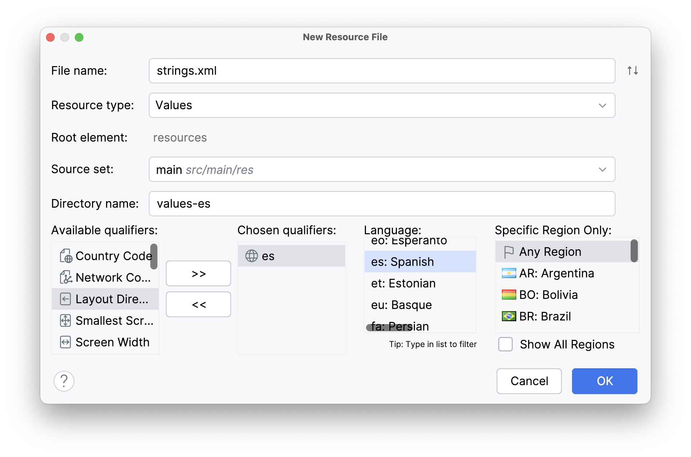

La **internacionalización** en Android permite que tu aplicación soporte múltiples idiomas, adaptando los textos, formatos de fecha y otros aspectos culturales de acuerdo con la **configuración regional del dispositivo**.

## Directorios de recursos

Los **textos de la interfaz de usuario** (botones, etiquetas, títulos, mensajes, etc.) se guardan en archivos `strings.xml` dentro de la carpeta `res/values`.

Cuando queremos traducir la aplicación a varios idiomas, **no es necesario crear manualmente nuevas carpetas**.
Android Studio se encarga de colocar el archivo en el directorio correcto según el idioma que elijamos al crearlo.

Para añadir un nuevo idioma:

1. Haz clic derecho sobre la carpeta **`res` → New → Android Resource File**.
2. En el campo **File name**, escribe `strings.xml`.
3. En **Resource type**, selecciona `Values`.
4. En el apartado **Available qualifiers**, elige **Locale** y selecciona el idioma y país deseado (por ejemplo, `es` para español).
5. Android Studio creará automáticamente el archivo dentro del directorio adecuado.



Ejemplo del resultado:

```
res/values/strings.xml        → Textos por defecto (idioma base)
res/values-es/strings.xml     → Traducción al español
res/values-fr/strings.xml     → Traducción al francés
res/values-de/strings.xml     → Traducción al alemán
```

Android selecciona **automáticamente** el archivo adecuado según el idioma configurado en el dispositivo del usuario.


## Ejemplo de `strings.xml`

Dentro de cada uno de los directorios values, tendrás un archivo strings.xml que define los textos en el idioma correspondiente y a cada texto le daremos la referencia a ese recurso concreto.


```xml title="res/values/strings.xml"
<resources>
    <string name="btn_accept">Accept</string>
</resources>
```

```xml title="res/values-es/strings.xml"
<resources>
    <string name="btn_accept">Aceptar</string>
</resources>
```

En el layout XML haremos referencia al recurso:

```xml
<Button
    android:id="@+id/btnAceptar"
    android:layout_width="wrap_content"
    android:layout_height="wrap_content"
    android:text="@string/btn_accept"/>
```

## Uso desde Java

También es posible acceder a los textos desde el código Java:

```java
Button btn = findViewById(R.id.btnAceptar);
btn.setText(getString(R.string.btn_accept));
```

De esta forma, Android mostrará automáticamente el texto en el idioma configurado en el dispositivo.

:::info ACTIVIDAD DE SEGUIMIENTO 3
**Realiza la Actividad de Seguimiento 3: Domoticon.**
:::