<div class="justify-text">

En Android, un **Fragment** es un componente modular que representa una parte reutilizable de la interfaz de usuario.
Podemos imaginarlo como una “mini-actividad” que tiene su propio layout, su propio ciclo de vida y su propia lógica, pero que vive **dentro de una Activity** o de otro Fragment.

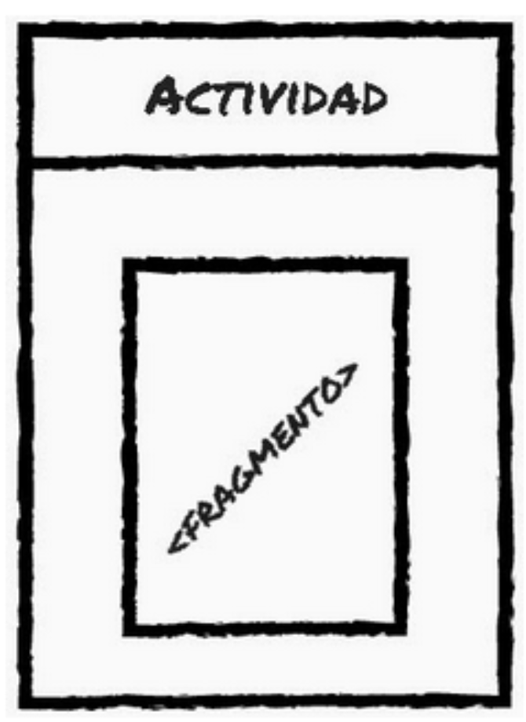

Gracias a los fragments, podemos:

* Dividir la interfaz de una app en **secciones independientes**.
* Crear **diseños adaptables** para distintos dispositivos (por ejemplo, mostrar lista y detalle a la vez en una tablet).
* Reutilizar fragmentos de interfaz en distintas pantallas.

Ejemplo de reutilización de código mediante fragments:

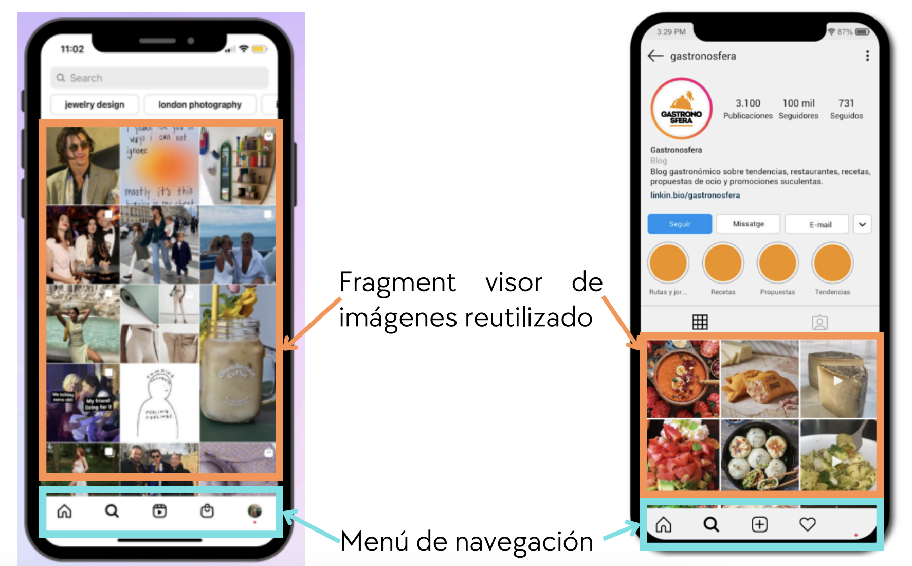

Ejemplo de adaptación al diseño según el tamaño del dispositivo:

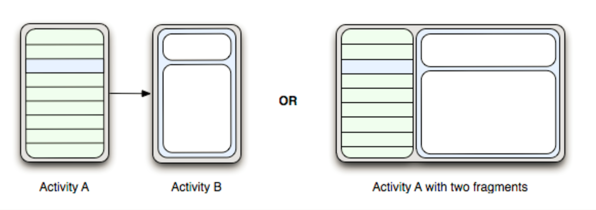


---

## Ciclo de vida de un Fragment

Al igual que las **Activities**, los **Fragments** tienen su propio **ciclo de vida**, controlado por el sistema Android.
Este ciclo determina qué métodos se ejecutan en cada momento desde que el fragment se crea hasta que se destruye.
Comprenderlo es fundamental para saber **dónde inicializar datos, inflar la interfaz o liberar recursos**.

A diferencia de una Activity, el fragment **depende siempre de otra Activity** para existir.
Esto significa que su ciclo de vida está **vinculado** al de la actividad que lo contiene, pero no son idénticos: un fragment puede **sobrevivir parcialmente** a los cambios de la actividad (por ejemplo, al rotar la pantalla).

---

### Fases principales del ciclo de vida

El ciclo de vida completo de un fragmento pasa por varias etapas.
Las más importantes y utilizadas en el desarrollo son las siguientes:

#### 🧩 1. `onAttach(Context context)`

Se llama **cuando el fragment se asocia por primera vez a su Activity contenedora**.
En este punto, el fragment *ya sabe en qué Activity vive*, por lo que podrías obtener una referencia al contexto si la necesitas.

```java
@Override
public void onAttach(@NonNull Context context) {
    super.onAttach(context);
    Log.d("CICLO", "Fragment adjunto a la Activity");
}
```

📘 **Uso típico:** inicializar recursos que dependen del contexto (por ejemplo, un adaptador o listener).

---

#### ⚙️ 2. `onCreate(Bundle savedInstanceState)`

Se ejecuta **una sola vez** cuando el fragment se crea por primera vez.
Aquí no existe todavía la interfaz visual, por lo que no se debe acceder a los elementos del layout.

```java
@Override
public void onCreate(Bundle savedInstanceState) {
    super.onCreate(savedInstanceState);
    // Inicializar variables, recuperar argumentos del Bundle, etc.
}
```

📘 **Uso típico:** inicializar variables globales, ViewModels o recuperar argumentos pasados con `setArguments()`.

---

#### 🖼️ 3. `onCreateView(LayoutInflater inflater, ViewGroup container, Bundle savedInstanceState)`

Es el método encargado de **crear y devolver la vista (layout)** del fragmento.
Aquí se infla el archivo XML que define la interfaz.

```java
@Override
public View onCreateView(LayoutInflater inflater, ViewGroup container,
                         Bundle savedInstanceState) {
    return inflater.inflate(R.layout.fragment_home, container, false);
}
```

📘 **Uso típico:** inflar la vista, pero **no inicializar todavía los componentes** (se hace justo después, en `onViewCreated()`).

---

#### 🧱 4. `onViewCreated(View view, Bundle savedInstanceState)`

Se llama inmediatamente después de `onCreateView()`.
En este momento, la vista **ya ha sido creada**, por lo que podemos acceder a sus elementos.

```java
@Override
public void onViewCreated(@NonNull View view, @Nullable Bundle savedInstanceState) {
    super.onViewCreated(view, savedInstanceState);

    Button btnSaludar = view.findViewById(R.id.btnSaludar);
    btnSaludar.setOnClickListener(v ->
        Toast.makeText(getContext(), "Hola desde el Fragment", Toast.LENGTH_SHORT).show()
    );
}
```

📘 **Uso típico:** acceder a componentes visuales, configurar listeners, adaptar datos a vistas.

---

#### ▶️ 5. `onStart()`

Se ejecuta **justo antes de que el fragment sea visible para el usuario** (aunque todavía no está interactuando con él).
Equivale al `onStart()` de las Activities.

📘 **Uso típico:** preparar elementos que se deben mostrar en pantalla, iniciar animaciones o procesos visuales.

---

#### 🟢 6. `onResume()`

Indica que el fragment ya está **visible y activo**.
En este punto el usuario puede interactuar con él.

📘 **Uso típico:** reanudar operaciones que estaban pausadas (por ejemplo, la reproducción de un vídeo o la escucha de sensores).

---

#### ⏸️ 7. `onPause()`

Se ejecuta cuando el fragment **deja de estar en primer plano** (por ejemplo, cuando aparece otro fragment encima).

📘 **Uso típico:** pausar animaciones, detener escuchas o guardar cambios temporales.

---

#### 🔻 8. `onStop()`

El fragment ya **no es visible**, aunque todavía está en memoria.
Es un buen momento para liberar recursos pesados que no se necesitan mientras no se muestra la interfaz.

---

#### 🗑️ 9. `onDestroyView()`

Se ejecuta cuando la **vista del fragment se destruye**, pero el objeto `Fragment` aún sigue existiendo.
Esto ocurre, por ejemplo, cuando se reemplaza el fragment por otro.
Si usas **Data Binding**, aquí es donde debes poner `binding = null` para evitar fugas de memoria.

---

#### 💀 10. `onDestroy()`

El fragment está a punto de destruirse completamente.
Aquí deberías liberar todos los recursos restantes o hilos que hayas iniciado.

---

#### 🚪 11. `onDetach()`

El fragment **se ha separado definitivamente de su Activity contenedora**.
Después de este punto, ya no se puede acceder al contexto de la Activity.

---

### Resumen gráfico

El ciclo de vida puede representarse así:

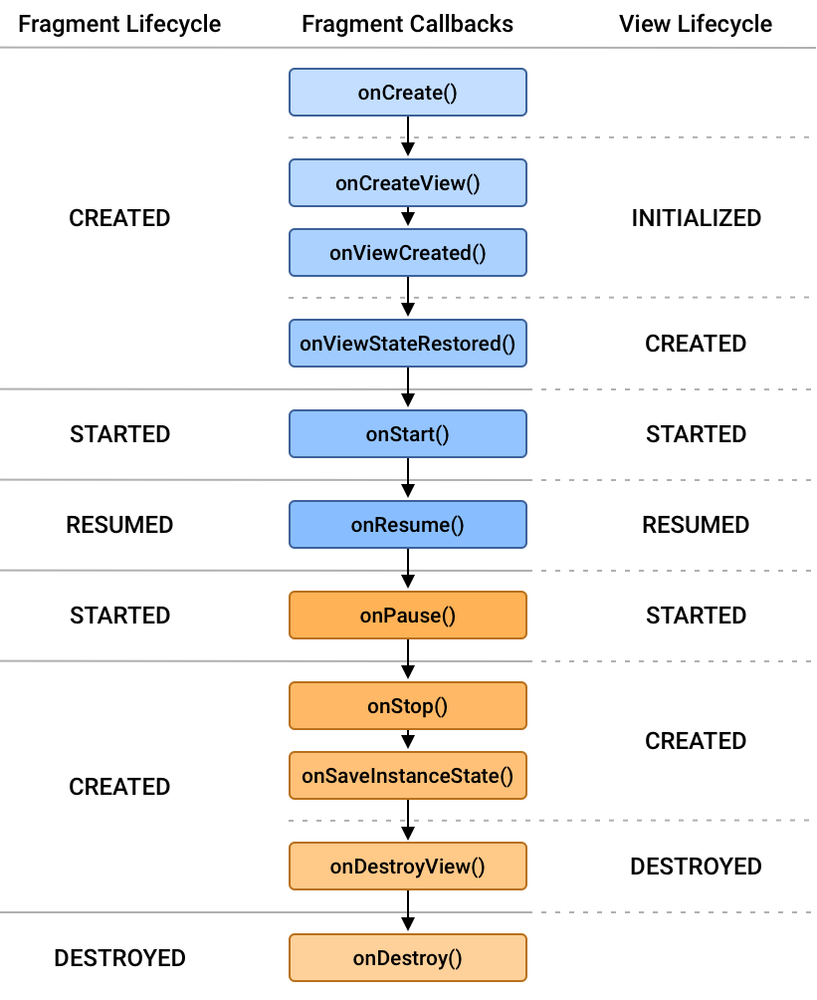

---

### Relación con la Activity

Cuando una Activity se crea, **también se crean sus fragments asociados**.
Sin embargo, si la Activity se destruye temporalmente (por ejemplo, por un cambio de orientación), el sistema puede **recrear el fragment automáticamente**, restaurando su estado a partir del `Bundle` guardado.

Por eso es importante:

* No guardar referencias directas a la Activity (pueden quedar obsoletas).
* Usar `getContext()` o `requireActivity()` solo cuando sea necesario.
* Manejar correctamente los datos persistentes con `ViewModel` o `onSaveInstanceState()`.

---

### En resumen

| Fase              | Descripción                         | Cuándo usarla                   |
| ----------------- | ----------------------------------- | ------------------------------- |
| `onAttach()`      | El fragment se asocia a la Activity | Obtener contexto o listeners    |
| `onCreate()`      | Inicialización lógica, sin vista    | Cargar datos o ViewModels       |
| `onCreateView()`  | Inflar el layout XML                | Crear la vista                  |
| `onViewCreated()` | Vista ya disponible                 | Configurar componentes visuales |
| `onStart()`       | Fragment visible                    | Preparar UI                     |
| `onResume()`      | Fragment activo                     | Interacción del usuario         |
| `onPause()`       | Fragment parcialmente oculto        | Guardar estado, pausar tareas   |
| `onStop()`        | Fragment no visible                 | Liberar recursos                |
| `onDestroyView()` | Destruye la vista                   | Evitar fugas de memoria         |
| `onDestroy()`     | Destruye el fragment                | Cierre total                    |
| `onDetach()`      | Se separa de la Activity            | Limpieza final                  |

---

## Gestión de fragments: tradicional vs Android Jetpack

Hoy en día, no gestionamos los *Fragments* directamente (añadiéndolos o reemplazándolos “a mano”), sino que utilizamos el **Navigation Component** de Android Jetpack, que **automatiza y simplifica todo ese proceso**.

Antes, cuando queríamos mostrar un nuevo fragmento en pantalla, había que hacerlo **manualmente** mediante el uso de `FragmentManager` y `FragmentTransaction`.
Esto implicaba escribir bastante código repetitivo y, sobre todo, estar muy pendiente de la **pila de retroceso (back stack)** y del **ciclo de vida** de cada fragment.

Por ejemplo, si teníamos una Activity con un contenedor para fragments (`FragmentContainerView`), y queríamos reemplazar un fragment por otro, el código típico era algo como esto:

```java
Fragment nuevoFragment = new DetalleFragment();

FragmentManager fm = getSupportFragmentManager();
FragmentTransaction ft = fm.beginTransaction();

// Reemplazamos el fragment actual por el nuevo
ft.replace(R.id.contenedorFragmentos, nuevoFragment);

// Añadimos la transacción al back stack para poder volver atrás
ft.addToBackStack(null);

// Confirmamos el cambio
ft.commit();
```

Y si además queríamos **pasar datos** al nuevo fragment, teníamos que usar un `Bundle` manualmente:

```java
Bundle args = new Bundle();
args.putString("nombreUsuario", "Alicia");
nuevoFragment.setArguments(args);
```

En el fragmento de destino había que **recuperar los datos** en el método `onCreate()`:

```java
@Override
public void onCreate(Bundle savedInstanceState) {
    super.onCreate(savedInstanceState);
    if (getArguments() != null) {
        String nombre = getArguments().getString("nombreUsuario");
    }
}
```

Todo esto funcionaba, pero presentaba varios **problemas prácticos**:

* Había que **gestionar manualmente** las transacciones, lo que era propenso a errores.
* El control de la **pila de retroceso** podía volverse complejo (por ejemplo, al pulsar “Atrás”).
* El paso de datos no era **seguro en tiempo de compilación** (si te equivocabas de clave en el `Bundle`, el fallo aparecía en ejecución).
* Al girar el dispositivo o reanudar la app, algunos fragments podían **recrearse incorrectamente** si no se manejaba bien su estado.

Para evitar estos inconvenientes, Google introdujo el **Navigation Component** dentro de la suite **Android Jetpack**.
Con él, toda la navegación se define desde un único archivo XML (el *Navigation Graph*), que describe los destinos (fragments, actividades, diálogos...) y las acciones que los conectan.

---

## Navigation Component

El **Navigation Component** es parte de la librería **Android Jetpack** y su objetivo es **simplificar la navegación entre pantallas** (Fragments y Activities) dentro de una aplicación.

Gestiona por nosotros la pila de retroceso (“back stack”), el paso de argumentos, las transiciones animadas y la integración con la barra de navegación, todo desde un único punto centralizado: el **Navigation Graph**.

---

### Conceptos clave

1. **Navigation Graph (`nav_graph.xml`)**
   Es un recurso XML que define los destinos de la app (Fragments, Activities, etc.) y las acciones que conectan esos destinos.
   Actúa como un mapa visual de toda la navegación.

   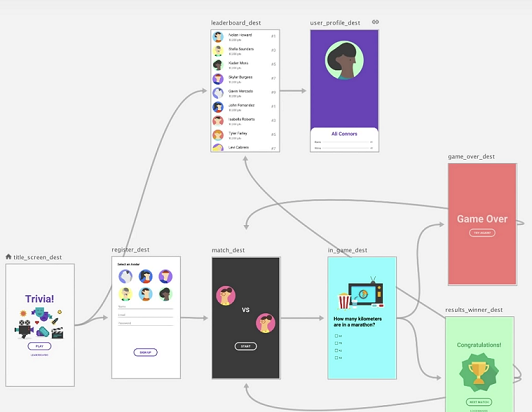

2. **NavHostFragment**
   Es el contenedor que carga en la Activity los fragments definidos en el grafo.
   Cuando el usuario navega, el `NavHostFragment` cambia automáticamente el fragment visible.

   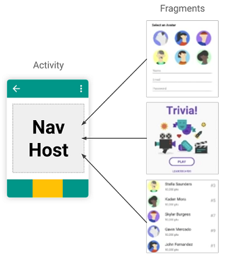

3. **NavController**
   Es el objeto que controla la navegación entre destinos.
   Cuando se pulsa un botón o una opción del menú, el `NavController` decide qué fragment debe mostrarse en el `NavHostFragment`.


---

### Tutorial de uso

1. **Añadir dependencias en `build.gradle` (nivel módulo):**

   ```gradle
    val navVersion = "2.9.5"
    implementation("androidx.navigation:navigation-fragment:$navVersion")
    implementation("androidx.navigation:navigation-ui:$navVersion")
   ```

   Puedes consultar la última versión en la [documentación oficial de Navigation](https://developer.android.com/guide/navigation).

   :::warning Sincroniza el proyecto
    Después de modificar el archivo build.gradle, haz clic en “Sync Now” en la barra superior de Android Studio.
    Si no sincronizas, las nuevas dependencias no se descargarán y el código marcará errores.
   :::

2. **Crear el grafo de navegación:**

   * Click derecho sobre la carpeta raíz del proyecto → **New > Android Resource File**

    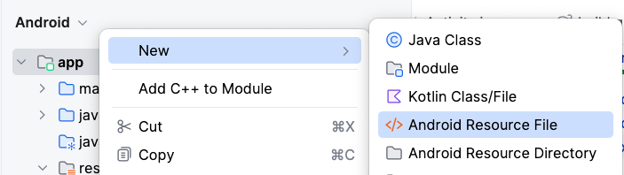

   * Asigna el tipo “Navigation” y un nombre como `nav_graph.xml`.

    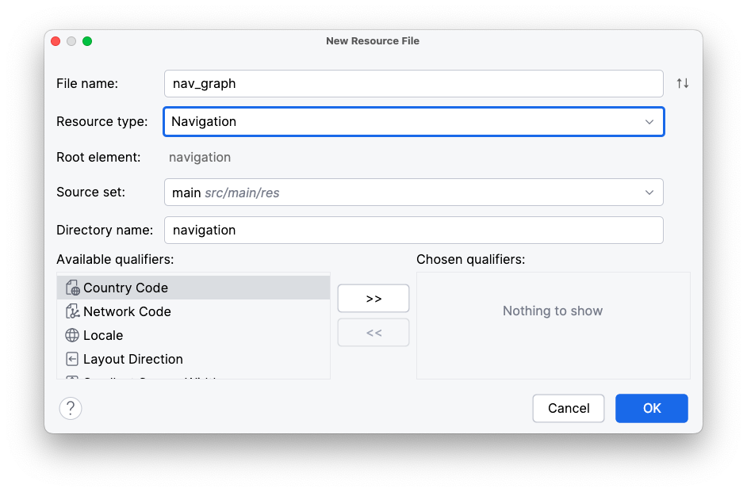


3. **Definición del grafo de navegación**

    Una vez creado el grafo, puedes abrirlo en **modo Design** desde Android Studio.
    Allí verás un lienzo donde puedes:

    * **Añadir destinos** (cada destino suele ser un fragment).
    * **Crear conexiones (acciones)** entre destinos arrastrando una flecha.
    * **Definir el destino inicial (Start Destination)** marcando el icono de la casa.

    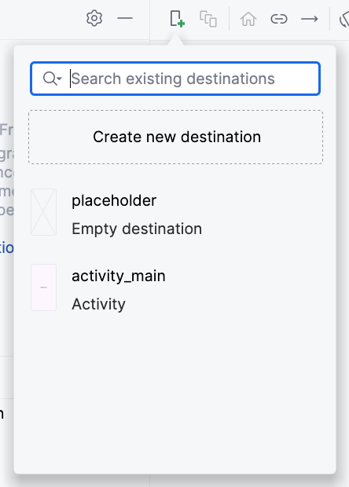

4. **Creación de los fragments**

    A partir del menú anterior, vamos a crear los fragments pulsando sobre `Create new destination`. El tipo de fragment a elegir es **Fragment (Blank)**.

    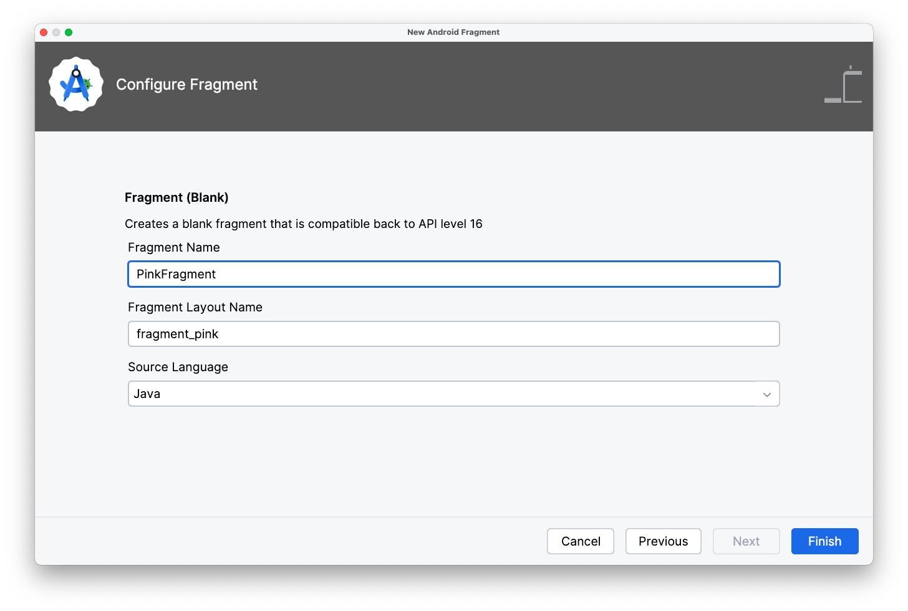

    :::tip 💡 NOMENCLATURA DE FRAGMENTS Y LAYOUTS
    Sigue la misma convención que utilizamos para las Activities:

    El nombre de la clase del fragmento se escribe en CamelCase y termina con la palabra Fragment.  
    👉 Ejemplo: DetalleFragment, LoginFragment, ListaUsuariosFragment.

    El nombre del layout asociado va todo en minúsculas y separado por guiones bajos, empezando por la palabra fragment_.  
    👉 Ejemplo: fragment_detalle.xml, fragment_login.xml, fragment_lista_usuarios.xml.

    Mantener esta nomenclatura ayuda a identificar rápidamente qué layout pertenece a qué fragment y a mantener el proyecto ordenado.
    :::

    Puedes observar que se han creado ambos ficheros en las carpetas correspondientes:

    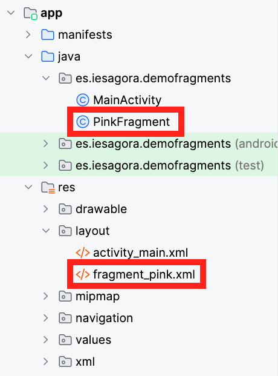

    Modificamos el layout a nuestro gusto y dejamos limpio el código del Fragment. De momento, solo necesitaremos estos métodos:

    ```java title="PinkFragment.java"
    public class PinkFragment extends Fragment {

        // Binding del fragment
        FragmentPinkBinding binding;

        @Override
        public View onCreateView(LayoutInflater inflater, ViewGroup container,
                             Bundle savedInstanceState) {
            // Inicializamos el binding inflando el layout
            binding = FragmentPinkBinding.inflate(inflater, container, false);

            // Devolvemos la vista raíz del binding
            return binding.getRoot();
        }

        @Override
        public void onViewCreated(@NonNull View view, @Nullable Bundle savedInstanceState) {
            super.onViewCreated(view, savedInstanceState);
        
            // Aquí podemos acceder a las vistas (botones, textos, etc.)
        }
    }
    ```

5. **Añadir las relaciones entre los fragments**
    
    Las relaciones indican a qué fragments se puede navegar desde cada fragmento. Se establecen uniendo los fragmentos mediantes flechas. 

    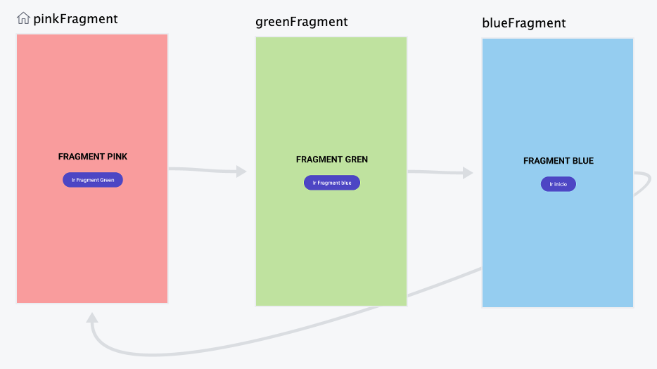

    Además, el icono de la casa sobre el PinkFragment indica que este es el destino que se mostrará en primer lugar: el Start
    Destination. Puedes cambiar en cualquier momento el Start Destination seleccionando un destino y clicando en el icono de la casa de la barra.

6. **Añadir el NavHostFragment al layout principal**

    En el layout de la `MainActivity` (por ejemplo `activity_main.xml`), se incluye el contenedor donde se mostrarán los fragments:

    ```xml title="activity_main.xml"
    <?xml version="1.0" encoding="utf-8"?>
    <androidx.constraintlayout.widget.ConstraintLayout
        xmlns:android="http://schemas.android.com/apk/res/android"
        xmlns:app="http://schemas.android.com/apk/res-auto"
        xmlns:tools="http://schemas.android.com/tools"
        android:layout_width="match_parent"
        android:layout_height="match_parent"
        tools:context=".MainActivity">

        <!-- Contenedor de fragments -->
        <androidx.fragment.app.FragmentContainerView
            android:id="@+id/nav_host_fragment"
            android:name="androidx.navigation.fragment.NavHostFragment"
            android:layout_width="match_parent"
            android:layout_height="match_parent"
            app:defaultNavHost="true"
            app:navGraph="@navigation/nav_graph"
            app:layout_constraintTop_toBottomOf="parent"
            app:layout_constraintBottom_toTopOf="parent"
            app:layout_constraintStart_toStartOf="parent"
            app:layout_constraintEnd_toEndOf="parent" />

    </androidx.constraintlayout.widget.ConstraintLayout>
    ```

    Esto le indica a Android que ese contenedor debe mostrar los fragments definidos en el grafo.


7. **Navegación entre fragments**

   El `NavController` es el encargado de cambiar de un fragment a otro según las acciones definidas en el grafo.

   En el PinkFragment, al pulsar el botón, vamos a navegar al siguiente destino con el siguiente código:

   ```java title="PinkFragment.java"
   @Override
    public void onViewCreated(@NonNull View view, @Nullable Bundle savedInstanceState) {
        super.onViewCreated(view, savedInstanceState);

        binding.btnIrFragment2.setOnClickListener(new View.OnClickListener() {
            @Override
            public void onClick(View v) {
                NavController navController = Navigation.findNavController(view);
                navController.navigate(R.id.action_pinkFragment_to_greenFragment);
            }
        });
    }
   ```

   Este código utiliza la acción definida en el grafo (`action_pinkFragment_to_greenFragment`) para cambiar automáticamente de pantalla.

   El sistema se encarga de todo:

   * Cargar el nuevo fragment en el `NavHostFragment`.
   * Añadirlo a la pila de retroceso.
   * Manejar correctamente el botón “Atrás”.

   El nombre de la acción a utilizar podemos verlo en el grafo de navegación, campo action:

   ```xml title="nav_graph"
   <?xml version="1.0" encoding="utf-8"?>
   <navigation
       xmlns:android="http://schemas.android.com/apk/res/android"
       xmlns:app="http://schemas.android.com/apk/res-auto"
       xmlns:tools="http://schemas.android.com/tools"
       android:id="@+id/nav_graph"
       app:startDestination="@id/pinkFragment">

       <fragment
           android:id="@+id/pinkFragment"
           android:name="es.iesagora.demofragments.PinkFragment"
           android:label="fragment_pink"
           tools:layout="@layout/fragment_pink">

           <action
               android:id="@+id/action_pinkFragment_to_greenFragment"
               app:destination="@id/greenFragment" />
       </fragment>

       <fragment
           android:id="@+id/greenFragment"
           android:name="es.iesagora.demofragments.GreenFragment"
           android:label="fragment_green"
           tools:layout="@layout/fragment_green">

           <action
               android:id="@+id/action_greenFragment_to_blueFragment"
               app:destination="@id/blueFragment" />
       </fragment>

       <fragment
           android:id="@+id/blueFragment"
           android:name="es.iesagora.demofragments.BlueFragment"
           android:label="fragment_blue"
           tools:layout="@layout/fragment_blue">

           <action
               android:id="@+id/action_blueFragment_to_pinkFragment"
               app:destination="@id/pinkFragment" />
       </fragment>

   </navigation>
   ```

---

### Enviar datos entre fragments

A veces necesitamos **enviar información de un fragment a otro**, por ejemplo, pasar el nombre de un usuario o un identificador.
Existen varias formas de hacerlo, pero la más simple es mediante un **objeto `Bundle`**, que permite enviar pares clave–valor entre fragments.

> ⚠️ Esta forma es la tradicional (sin Safe Args).
> Más adelante aprenderás a hacerlo con **ViewModel**, que es la opción más moderna y recomendada.

1. **Declara los argumentos en el grafo:**

    Puedes hacerlo de la vista de diseño, pulsando sobre `+` en el apartado `Arguments`:

    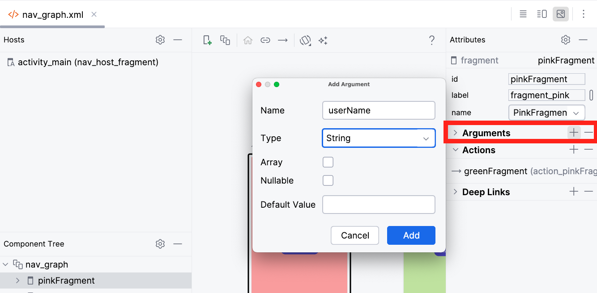

    También puedes hacerlo directamente desde el XML:

   ```xml
    <fragment
        android:id="@+id/pinkFragment"
        android:name="es.iesagora.demofragments.PinkFragment"
        android:label="fragment_pink"
        tools:layout="@layout/fragment_pink" >
        <action
            android:id="@+id/action_pinkFragment_to_greenFragment"
            app:destination="@id/greenFragment" />
        <argument
            android:name="userName"
            app:argType="string" />
    </fragment>
   ```

2. **Envía los datos desde el fragment de origen:**

   ```java title="PinkFragment.java"
    @Override
    public void onViewCreated(@NonNull View view, @Nullable Bundle savedInstanceState) {
        super.onViewCreated(view, savedInstanceState);
        navController = Navigation.findNavController(view);

        binding.btnIrFragment2.setOnClickListener(new View.OnClickListener() {
            @Override
            public void onClick(View v) {
                Bundle args = new Bundle();
                args.putString("userName", "Alicia");
                navController.navigate(R.id.action_pinkFragment_to_greenFragment, args);
            }
        });
    }
   ```


3. **Recupera los datos en el destino:**

   Estos datos puedes recuperarlos, por ejemplo, en el método `onCreate()` del fragmento de destino:

   ```java title="GreenFragment.java"
   public class GreenFragment extends Fragment {

       private FragmentGreenBinding binding;
       private String nombre;

       @Override
       public void onCreate(Bundle savedInstanceState) {
           super.onCreate(savedInstanceState);

           // Siempre comprobamos si no es null para evitar errores de acceso
           if (getArguments() != null) {
               nombre = getArguments().getString("userName");
           }
       }

       @Override
       public View onCreateView(LayoutInflater inflater, ViewGroup container,
                                Bundle savedInstanceState) {
           binding = FragmentGreenBinding.inflate(inflater, container, false);
           return binding.getRoot();
       }
   }
   ```

:::info USO DE VIEWMODEL PARA COMPARTIR DATOS
El método con `Bundle` es útil para ejemplos sencillos, pero no es la forma más robusta ni moderna.
Cuando varios fragments necesitan **compartir datos** (por ejemplo, comunicarse entre ellos o mantener el estado al rotar la pantalla), lo ideal es utilizar un **ViewModel compartido**.

Ventajas de usar `ViewModel`:

* Evita depender de `Bundles` y claves de texto.
* Mantiene los datos incluso si el fragment se destruye y recrea.
* Se integra fácilmente con la arquitectura **MVVM** y con **LiveData**.

Aprenderemos esta técnica en próximos apartados.
:::

:::info ACTIVIDAD DE SEGUIMIENTO 4
**Realiza la Actividad de Seguimiento 4: Proceso Onboarding.**
:::


</div>