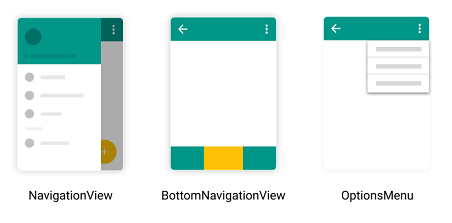
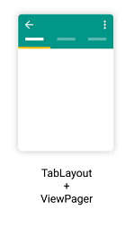

Los **menús** son elementos fundamentales de la interfaz de usuario que permiten **navegar por la aplicación** y acceder a sus diferentes secciones o funciones.  
Son esenciales para ofrecer una **experiencia de usuario clara, accesible y coherente**, ya que organizan la estructura de la app de forma visual y práctica.

En Android disponemos de varios componentes de navegación visual, que podemos combinar con el **Navigation Component** y su clase `NavigationUI` para gestionar automáticamente la navegación, el título de la barra superior y el estado de los iconos.

A lo largo de este tema estudiaremos los siguientes elementos:

- **Top App Bar (Toolbar)** → barra superior con título e iconos de acción.  
- **Navigation Drawer** → panel lateral de navegación (menú hamburguesa).  
- **Bottom Navigation** → barra inferior con iconos de secciones principales.  
- **Options Menu** → menú de acciones dentro de la Toolbar.  
- **Tabs (TabLayout + ViewPager2)** → navegación por pestañas o deslizamiento lateral.

Cada uno de estos elementos los implementaremos en un ejemplo práctico, utilizando el patrón moderno de navegación basado en **Fragments** y el **Navigation Component**.

:::tip 💡 IMPORTANTE
El componente `NavigationUI` (de Android Jetpack) permite **sincronizar automáticamente** la interfaz con el grafo de navegación.  
Esto significa que la **Toolbar, el Drawer y el BottomNavigationView** se actualizan de forma automática al navegar, sin tener que gestionar manualmente los cambios de fragment ni los iconos de la AppBar.
:::

