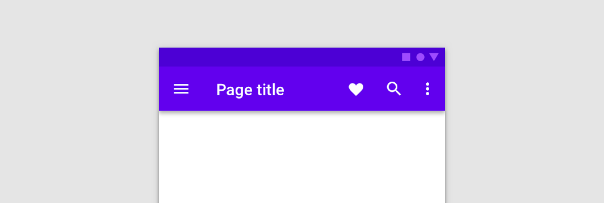
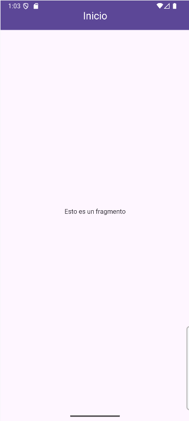

<div class="justify-text">

La **Top App Bar** (también conocida como **Toolbar**) es la barra situada en la parte superior de la pantalla. En ella se muestran el **título de la aplicación**, los **iconos de acción** (como búsqueda o ajustes) y, en muchos casos, el **botón de navegación** (hamburguesa o flecha de retroceso).



En versiones modernas de Android, la clase recomendada es:

```java
com.google.android.material.appbar.MaterialToolbar
```

`MaterialToolbar` es una evolución de la antigua `Toolbar` de AppCompat.
Hereda todas sus funciones, pero con soporte completo para **Material Design 3 (Material You)**: color dinámico, elevación y animaciones suaves.

---

## Pasos para implementar una Toolbar en tu app

### 1️⃣ Modificar el layout de la Activity

En nuestro caso, vamos a partir de un **proyecto vacío**, al que añadiremos manualmente la barra superior.

La estructura mínima del layout de `ActivityMain` incluirá los siguientes elementos:

* **`CoordinatorLayout`** → actúa como contenedor principal. Es el tipo de layout recomendado para combinar componentes de la interfaz que pueden interactuar entre sí (por ejemplo, la Toolbar y el contenido que hace scroll).
* **`AppBarLayout`** → se sitúa en la parte superior y sirve como contenedor de la barra de herramientas. Permite aplicar comportamientos dinámicos, como ocultar la barra al hacer scroll.
* **`MaterialToolbar`** → es la barra superior propiamente dicha. En ella se mostrará el título, los iconos de acción y, opcionalmente, el botón de navegación.
* **`FragmentContainerView`** → ocupará el resto de la pantalla y será el espacio donde se carguen los fragments o el contenido principal de la aplicación.


```xml title="activity_main.xml"
<?xml version="1.0" encoding="utf-8"?>
<androidx.coordinatorlayout.widget.CoordinatorLayout
    xmlns:android="http://schemas.android.com/apk/res/android"
    xmlns:app="http://schemas.android.com/apk/res-auto"
    xmlns:tools="http://schemas.android.com/tools"
    android:layout_width="match_parent"
    android:layout_height="match_parent"
    tools:context=".MainActivity">

    <!-- AppBar superior -->
    <com.google.android.material.appbar.AppBarLayout
        android:layout_width="match_parent"
        android:layout_height="wrap_content"
        android:theme="@style/ThemeOverlay.Material3.Dark.ActionBar">

        <com.google.android.material.appbar.MaterialToolbar
            android:id="@+id/toolbar"
            android:layout_width="match_parent"
            android:layout_height="?attr/actionBarSize"
            android:background="?attr/colorPrimary"
            app:titleCentered="true"
            app:titleTextColor="@android:color/white" />
    </com.google.android.material.appbar.AppBarLayout>

    <!-- Contenido principal -->
    <androidx.fragment.app.FragmentContainerView
        android:id="@+id/nav_host_fragment"
        android:name="androidx.navigation.fragment.NavHostFragment"
        android:layout_width="match_parent"
        android:layout_height="match_parent"
        app:defaultNavHost="true"
        app:navGraph="@navigation/nav_graph" />

</androidx.coordinatorlayout.widget.CoordinatorLayout>
```

:::warning GRAFO DE NAVEGACIÓN
Ten en cuenta que tenemos un `FragmentContainerView` para cargar los fragmentos. Debes incluir las dependencias necesarias, el grafo de navegación y los fragments para que el código funcione, tal y como estudiamos en el primer apartado de este tema.
:::

---

### 2️⃣ Configurar la Toolbar desde Java

En la Activity asociada, indicamos que esta `MaterialToolbar` será la **ActionBar** de la aplicación.
Esto se hace con el método `setSupportActionBar()`.

```java title="MainActivity.java"
public class MainActivity extends AppCompatActivity {

    ActivityMainBinding binding;
    private NavController navController;
    private AppBarConfiguration appBarConfiguration;

    @Override
    protected void onCreate(Bundle savedInstanceState) {
        super.onCreate(savedInstanceState);
        setContentView((binding = ActivityMainBinding.inflate(getLayoutInflater())).getRoot());

        // 1. Obtenemos la referencia de la Toolbar del layout
        setSupportActionBar(binding.toolbar);

        // 2. Obtenemos el NavController desde el contenedor del grafo
        navController = ((NavHostFragment) getSupportFragmentManager().findFragmentById(R.id.nav_host_fragment)).getNavController();

        // 3. Configuramos la AppBar para que el título y el botón de navegación
        // se actualicen automáticamente al navegar entre fragments
        appBarConfiguration = new AppBarConfiguration.Builder(navController.getGraph()).build();
        NavigationUI.setupActionBarWithNavController(this, navController, appBarConfiguration);
    }

}
```

:::info
Con las últimas líneas de código estamos **vinculando la App Bar con el `NavController`**.
Esto permite que el **botón de retroceso funcione automáticamente** al navegar entre fragments y que la** Toolbar muestre como título** el valor definido en el atributo `android:label` de cada destino del grafo de navegación.

```xml title="nav_graph.xml"
<?xml version="1.0" encoding="utf-8"?>
<navigation xmlns:android="http://schemas.android.com/apk/res/android"
    xmlns:app="http://schemas.android.com/apk/res-auto"
    xmlns:tools="http://schemas.android.com/tools"
    android:id="@+id/nav_graph"
    app:startDestination="@id/pinkFragment">

    <fragment
        android:id="@+id/pinkFragment"
        android:name="es.iesagora.demomenu.PinkFragment"
        android:label="Inicio" <!-- Este campo marca el título de la app bar -->
        tools:layout="@layout/fragment_pink" />
</navigation>
````


:::

</div>

