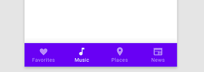
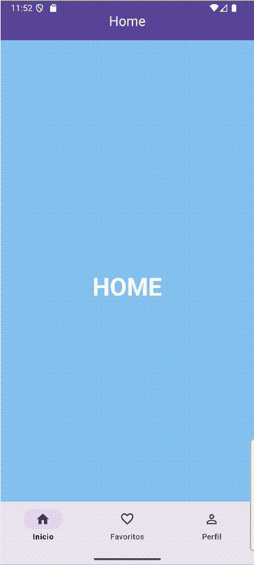
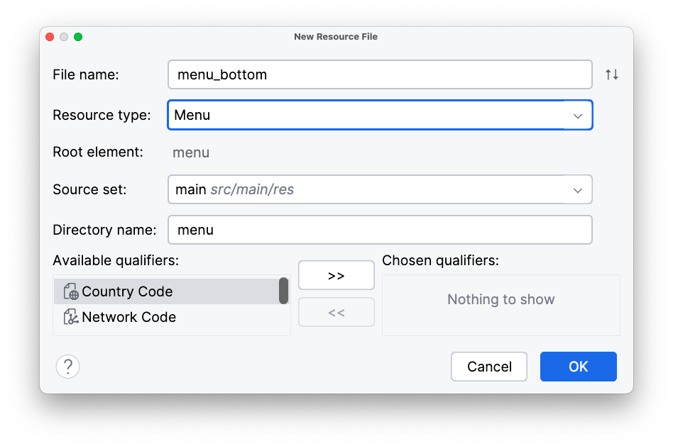
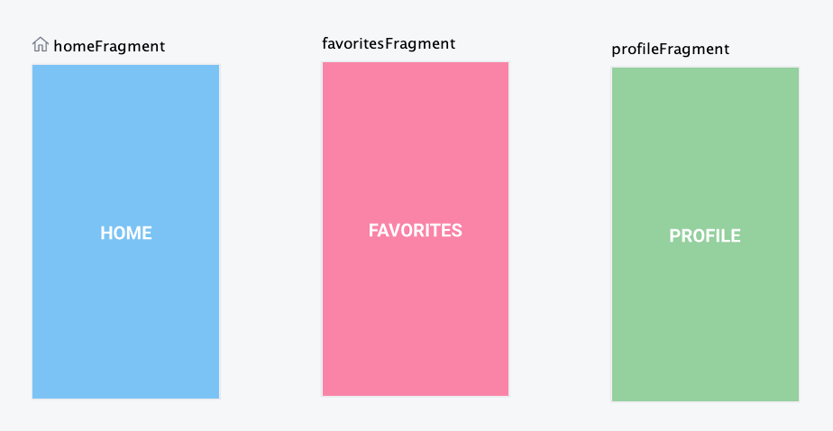
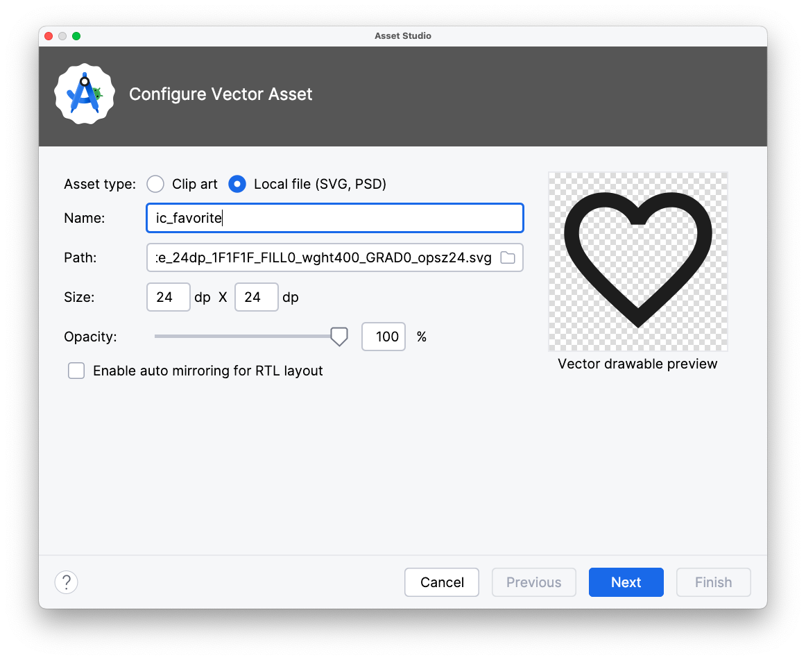

<div class="justify-text">

La **Bottom Navigation** es una barra ubicada en la parte inferior de la pantalla que permite navegar entre las secciones principales de una aplicación. Cada elemento de la barra representa un destino (generalmente un fragment) y muestra un **icono** y, opcionalmente, un **texto**.

Este patrón de navegación es muy común en apps modernas (Instagram, YouTube, Gmail…) y está recomendado por las **guías de Material Design** para mostrar entre 3 y 5 destinos principales.



En Android se implementa mediante el componente:

```java
com.google.android.material.bottomnavigation.BottomNavigationView
```

En este tutorial vamos a implementar la siguiente aplicación:



---

## Pasos para implementar un Bottom Navigation en tu app

### 1️⃣ Modificar el layout de la Activity

Partiremos de un **proyecto con Navigation Component configurado** y añadiremos una barra superior (`MaterialToolbar`) y una barra inferior (`BottomNavigationView`).
Ambas estarán sincronizadas con el grafo de navegación para mostrar correctamente el título y la navegación “back”.

El layout de la `MainActivity` quedará así:

```xml title="activity_main.xml"
<?xml version="1.0" encoding="utf-8"?>
<androidx.coordinatorlayout.widget.CoordinatorLayout
    xmlns:android="http://schemas.android.com/apk/res/android"
    xmlns:app="http://schemas.android.com/apk/res-auto"
    xmlns:tools="http://schemas.android.com/tools"
    android:layout_width="match_parent"
    android:layout_height="match_parent"
    tools:context=".MainActivity">

    <!-- AppBar superior -->
    <com.google.android.material.appbar.AppBarLayout
        android:id="@+id/appbar"
        android:layout_width="match_parent"
        android:layout_height="wrap_content"
        android:theme="@style/ThemeOverlay.Material3.Dark.ActionBar">

        <com.google.android.material.appbar.MaterialToolbar
            android:id="@+id/toolbar"
            android:layout_width="match_parent"
            android:layout_height="?attr/actionBarSize"
            android:background="?attr/colorPrimary"
            app:titleCentered="true"
            app:titleTextColor="@android:color/white" />
    </com.google.android.material.appbar.AppBarLayout>

    <!-- Contenedor principal de fragments -->
    <androidx.fragment.app.FragmentContainerView
        android:id="@+id/nav_host_fragment"
        android:name="androidx.navigation.fragment.NavHostFragment"
        android:layout_width="match_parent"
        android:layout_height="match_parent"
        android:layout_marginTop="?attr/actionBarSize"
        android:layout_marginBottom="56dp"
        app:defaultNavHost="true"
        app:navGraph="@navigation/nav_graph" />

    <!-- Menú inferior -->
    <com.google.android.material.bottomnavigation.BottomNavigationView
        android:id="@+id/bottomNavigationView"
        android:layout_width="match_parent"
        android:layout_height="wrap_content"
        android:layout_gravity="bottom"
        app:menu="@menu/menu_bottom"
        android:background="?android:attr/windowBackground" />

</androidx.coordinatorlayout.widget.CoordinatorLayout>
```

:::warning MENÚ INFERIOR
El atributo `app:menu="@menu/menu_bottom"` hace referencia al archivo de menú que definiremos en la carpeta `res/menu`.
Cada `item` representará un destino de navegación.
:::

---

### 2️⃣ Crear el menú inferior

Creamos el archivo `menu_bottom.xml` dentro de `res/menu/` con los elementos de la barra. Para ello hacemos click derecho sobre la carpeta `res` > `New` > `Android resource file`.

Como nombre del fichero vamos a indicar **menu_bottom** (el mismo que pusimos en la opción `app:menu`) y en `Resource type` seleccionamos Menu.



El contenido de nuestro menú será de este estilo:

```xml title="menu_bottom.xml"
<?xml version="1.0" encoding="utf-8"?>
<menu xmlns:android="http://schemas.android.com/apk/res/android">
    <item
        android:id="@+id/homeFragment"
        android:icon="@drawable/ic_home"
        android:title="Inicio" />

    <item
        android:id="@+id/favoritesFragment"
        android:icon="@drawable/ic_favorite"
        android:title="Favoritos" />

    <item
        android:id="@+id/profileFragment"
        android:icon="@drawable/ic_person"
        android:title="Perfil" />
</menu>
```

Cada `<item>` representa **una sección principal** de tu aplicación e incluye lo siguientes atributos:

---

| Atributo            | Descripción                                                                                                                                                                                                       |
| ------------------- | ----------------------------------------------------------------------------------------------------------------------------------------------------------------------------------------------------------------- |
| **`android:id`**    | Identificador único del elemento del menú. Debe **coincidir con el `id` del fragment** correspondiente en el grafo de navegación (`nav_graph.xml`) para que `NavigationUI` pueda enlazar el botón con el destino. |
| **`android:icon`**  | Recurso gráfico (drawable) que se mostrará como icono del botón en la barra inferior.                                                                                                                             |
| **`android:title`** | Texto que aparecerá debajo del icono (si el menú lo muestra) y que sirve también como **etiqueta accesible** para lectores de pantalla.                                                                           |


:::tip IMPORTANTE
El `id` de cada elemento **debe coincidir** con el `id` del fragment correspondiente en el grafo de navegación (`nav_graph.xml`).
:::

---

### 3️⃣ Crear el grafo de navegación

Definimos los fragments que se mostrarán al seleccionar cada opción del menú.

```xml title="nav_graph.xml"
<?xml version="1.0" encoding="utf-8"?>
<navigation xmlns:android="http://schemas.android.com/apk/res/android"
    xmlns:app="http://schemas.android.com/apk/res-auto"
    xmlns:tools="http://schemas.android.com/tools"
    android:id="@+id/nav_graph"
    app:startDestination="@id/homeFragment">

    <fragment
        android:id="@+id/homeFragment"
        android:name="es.iesagora.demomenu.HomeFragment"
        android:label="Home"
        tools:layout="@layout/fragment_home" />
    <fragment
        android:id="@+id/favoritesFragment"
        android:name="es.iesagora.demomenu.FavoritesFragment"
        android:label="Favorites"
        tools:layout="@layout/fragment_favorites" />
    <fragment
        android:id="@+id/profileFragment"
        android:name="es.iesagora.demomenu.ProfileFragment"
        android:label="Profile"
        tools:layout="@layout/fragment_profile" />
</navigation>
```

:::warning IMPORTANTE
Fíjate en dos detalles clave dentro del grafo de navegación:

* El atributo **`android:id`** de cada fragment **debe coincidir exactamente** con el `id` de los elementos definidos en el menú inferior.
  Si no coinciden, **`NavigationUI` no podrá enlazar el menú con los fragments** y la navegación no funcionará.

* Los fragments **no están conectados entre sí** mediante acciones, ya que la navegación se realiza **a través del menú inferior**.
  Solo necesitarías definir conexiones directas si existieran botones u otros elementos dentro de los fragments que llevaran a otro destino, como vimos en apartados anteriores.
  :::


En la vista de diseño, nuestro grafo tiene el siguiente aspecto:



---

### 4️⃣ Configurar la Activity

En `MainActivity.java` configuramos tanto la `MaterialToolbar` como el `BottomNavigationView` para que trabajen de forma sincronizada con el `NavController`.

```java title="MainActivity.java"
public class MainActivity extends AppCompatActivity {

    ActivityMainBinding binding;
    private NavController navController;
    private AppBarConfiguration appBarConfiguration;

    @Override
    protected void onCreate(Bundle savedInstanceState) {
        super.onCreate(savedInstanceState);
        setContentView((binding = ActivityMainBinding.inflate(getLayoutInflater())).getRoot());

        // 1. Configuramos la toolbar
        setSupportActionBar(binding.toolbar);

        // 2. Obtenemos el NavController
        navController = ((NavHostFragment) getSupportFragmentManager().findFragmentById(R.id.nav_host_fragment)).getNavController();

        // 3. Configuramos la AppBar con los destinos principales (bottom menu)
        // Los fragments que pongamos aquí se consideran top-level destinations
        // Esto quiere decir en ellas no hay botón de back porque no se llegó desde otra,
        // sino que se accede directamente desde el menú
        appBarConfiguration = new AppBarConfiguration.Builder(
                R.id.homeFragment,
                R.id.favoritesFragment,
                R.id.profileFragment
        ).build();

        // 4. Vinculamos la Toolbar con el NavController indicando la configuración correcta
        NavigationUI.setupActionBarWithNavController(this, navController, appBarConfiguration);

        // 5. Sincronizamos BottomNavigationView con el NavController
        NavigationUI.setupWithNavController(binding.bottomNavigationView, navController);
    }

}
```

---


## Cómo añadir iconos desde Material Symbols (Google Fonts)

**Material Design** es el **sistema oficial de diseño de Google** para crear interfaces coherentes, modernas y accesibles en Android, web y otras plataformas.

Su objetivo es que las apps:

* Tengan un aspecto **consistente** entre dispositivos y versiones.
* Sean **intuitivas** y **agradables de usar**.
* Sigan buenas prácticas de **accesibilidad y usabilidad**.

Los pasos para añadir iconos de Material son:


### 1️⃣ Descarga el icono desde Material Symbols

1. Abre la página oficial de iconos: 👉 [https://fonts.google.com/icons](https://fonts.google.com/icons)
2. Usa la barra de búsqueda para localizar el icono que necesites (por ejemplo: `home`, `favorite`, `person`, `settings`...).
3. Haz clic sobre el icono que quieras.
4. En el panel lateral derecho:

   * Elige el estilo **Filled** (relleno).
   * Pulsa el botón **Download SVG**.
     Se descargará un archivo `.svg` (por ejemplo, `favorite.svg`).


### 2️⃣ Importa el icono como Vector Asset en Android Studio

1. Haz clic derecho sobre la carpeta:
   👉 `res/drawable` → **New > Vector Asset**
2. En la parte superior, cambia el tipo de recurso a:
   **“Local file (SVG, PSD)”**
3. Pulsa el botón **Browse…** y selecciona el archivo `.svg` que acabas de descargar.
4. Ajusta el nombre (por ejemplo, `ic_favorite`) y haz clic en **Next → Finish**.



Android Studio creará un archivo como:

```
res/drawable/ic_favorite.xml
```

que ya puedes utilizar como drawable vectorial en tu aplicación.


### 3️⃣ Usa el icono en tu menú

```xml
<item
    android:id="@+id/favoritesFragment"
    android:icon="@drawable/ic_favorite"
    android:title="Favoritos" />
```

---

### Ejemplos de iconos descargables

| Función   | Nombre a buscar | Archivo generado  | Descripción           |
| --------- | --------------- | ----------------- | --------------------- |
| Inicio    | `home`          | `ic_home.xml`     | Icono clásico de casa |
| Favoritos | `favorite`      | `ic_favorite.xml` | Corazón relleno       |
| Perfil    | `person`        | `ic_person.xml`   | Silueta de usuario    |
| Ajustes   | `settings`      | `ic_settings.xml` | Rueda dentada         |
| Buscar    | `search`        | `ic_search.xml`   | Lupa                  |


📘 **Consejo:**
Los iconos descargados en formato **SVG** se convierten en *vector drawables* (`.xml`) al importarlos.
Estos se escalan automáticamente y no necesitan versiones específicas para diferentes densidades (`hdpi`, `xhdpi`, etc.), por lo que son perfectos para menús y barras de navegación.


</div>