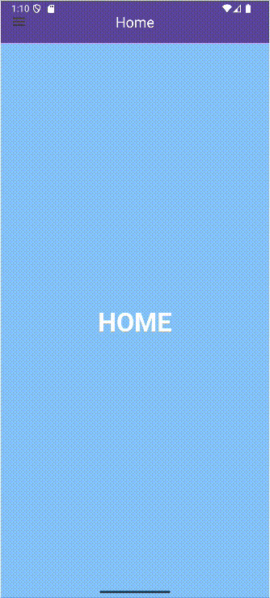
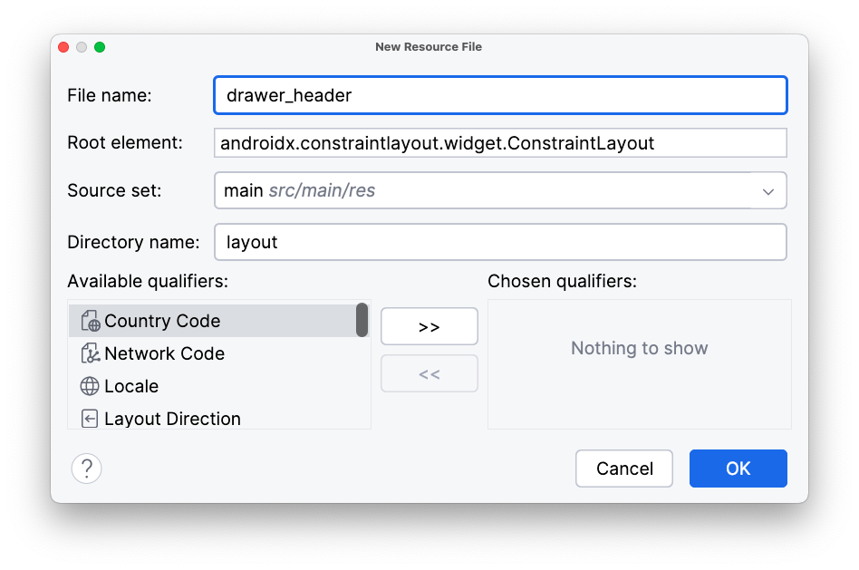

<div class="justify-text">

La **Navigation Drawer** (también conocida como *drawer menu* o menú lateral) es un panel deslizable que aparece desde el borde izquierdo de la pantalla.
Permite acceder rápidamente a las secciones principales de la app, generalmente acompañada del botón **hamburguesa** en la parte superior izquierda de la **Toolbar**.

Este patrón es ideal cuando existen **más de 3-5 destinos principales**, o cuando queremos mostrar **secciones secundarias** sin saturar la interfaz principal.



---

## Pasos para implementar un Navigation Drawer

### 1️⃣ Crear el layout principal de la Activity

Partiremos de un proyecto con **Navigation Component configurado**.
El `DrawerLayout` será el contenedor raíz y dentro colocaremos:

* Un layout con la **Toolbar** 

* Un NavHostFragment para cargar los diferentes fragmentos

* El **NavigationView**, que representará el panel lateral (drawer)


```xml title="activity_main.xml"
<?xml version="1.0" encoding="utf-8"?>
<androidx.drawerlayout.widget.DrawerLayout
    xmlns:android="http://schemas.android.com/apk/res/android"
    xmlns:app="http://schemas.android.com/apk/res-auto"
    xmlns:tools="http://schemas.android.com/tools"
    android:id="@+id/drawer_layout"
    android:layout_width="match_parent"
    android:layout_height="match_parent"
    tools:context=".MainActivity">

    <!-- Contenido principal con Toolbar y NavHostFragment -->
    <androidx.coordinatorlayout.widget.CoordinatorLayout
        android:layout_width="match_parent"
        android:layout_height="match_parent">

        <com.google.android.material.appbar.MaterialToolbar
            android:id="@+id/toolbar"
            android:layout_width="match_parent"
            android:layout_height="?attr/actionBarSize"
            android:background="?attr/colorPrimary"
            app:titleCentered="true"
            app:titleTextColor="@android:color/white"
            app:navigationIconTint="@android:color/white"/>

        <androidx.fragment.app.FragmentContainerView
            android:id="@+id/nav_host_fragment"
            android:name="androidx.navigation.fragment.NavHostFragment"
            android:layout_width="match_parent"
            android:layout_height="match_parent"
            android:layout_marginTop="?attr/actionBarSize"
            app:defaultNavHost="true"
            app:navGraph="@navigation/nav_graph" />
    </androidx.coordinatorlayout.widget.CoordinatorLayout>

    <!-- Panel lateral -->
    <com.google.android.material.navigation.NavigationView
        android:id="@+id/navigation_view"
        android:layout_width="wrap_content"
        android:layout_height="match_parent"
        android:layout_gravity="start"
        app:headerLayout="@layout/drawer_header"
        app:menu="@menu/menu_drawer" />

</androidx.drawerlayout.widget.DrawerLayout>
```

:::info PANEL LATERAL  
Dentro de `NavigationView`:
* El atributo **`app:headerLayout`** indica el layout que se mostrará como **cabecera del menú lateral** (por ejemplo, con el nombre o avatar del usuario).  
* El atributo **`app:menu`** hace referencia al archivo de menú definido en `res/menu/`, donde se declaran los **ítems de navegación** del drawer.  
:::

### 2️⃣ Crear la cabecera del Drawer

Creamos un layout en `res/layout/drawer_header.xml` que se mostrará en la parte superior del menú lateral.

Para crear un nuevo layout en Android Studio:

1. En el panel **Project**, abre la carpeta `res/layout`.
2. Haz clic derecho sobre ella → **New > Layout Resource File**.
3. Escribe el nombre del archivo, por ejemplo: `drawer_header`.
4. Asegúrate de que el tipo de recurso sea **Layout** y pulsa **OK**.



Android Studio creará el archivo vacío `drawer_header.xml`, listo para editar en modo **Code** o **Design**. El siguiente es un ejemplo de cabecera que podemos añadir a nuestro DrawerMenu:


```xml title="drawer_header.xml"
<?xml version="1.0" encoding="utf-8"?>
<LinearLayout xmlns:android="http://schemas.android.com/apk/res/android"
    xmlns:app="http://schemas.android.com/apk/res-auto"
    android:orientation="vertical"
    android:layout_width="match_parent"
    android:layout_height="160dp"
    android:gravity="bottom|center_horizontal"
    android:background="?attr/colorPrimary"
    android:padding="16dp">

    <ImageView
        android:id="@+id/ivAvatar"
        android:layout_width="64dp"
        android:layout_height="64dp"
        app:srcCompat="@drawable/ic_user" />

    <TextView
        android:id="@+id/tvUserName"
        android:layout_width="wrap_content"
        android:layout_height="wrap_content"
        android:layout_marginTop="8dp"
        android:text="Hola Usuario"
        android:textColor="@android:color/white"
        android:textAppearance="?attr/textAppearanceTitleMedium"
        android:textStyle="bold" />

</LinearLayout>
```

---

### 3️⃣ Crear el menú lateral

Definimos los elementos del drawer en `res/menu/menu_drawer.xml` (ya vimos en el apartado anterior cómo crear un menú):

```xml title="menu_drawer.xml"
<?xml version="1.0" encoding="utf-8"?>
<menu xmlns:android="http://schemas.android.com/apk/res/android">
    <item
        android:id="@+id/homeFragment"
        android:icon="@drawable/ic_home"
        android:title="Inicio" />

    <item
        android:id="@+id/favoritesFragment"
        android:icon="@drawable/ic_favorite"
        android:title="Favoritos" />

    <item
        android:id="@+id/profileFragment"
        android:icon="@drawable/ic_person"
        android:title="Perfil" />
</menu>
```

:::warning IMPORTANTE
El `id` de cada `<item>` debe coincidir con el `id` de los `fragment` definidos en el **grafo de navegación** (`nav_graph.xml`), para que `NavigationUI` los sincronice correctamente.
:::

---

### 4️⃣ Definir el grafo de navegación

Creamos el archivo `nav_graph.xml` en `res/navigation/` con los destinos del menú.

```xml title="nav_graph.xml"
<?xml version="1.0" encoding="utf-8"?>
<navigation xmlns:android="http://schemas.android.com/apk/res/android"
    xmlns:app="http://schemas.android.com/apk/res-auto"
    xmlns:tools="http://schemas.android.com/tools"
    android:id="@+id/nav_graph"
    app:startDestination="@id/homeFragment">

    <fragment
        android:id="@+id/homeFragment"
        android:name="es.iesagora.demomenu.HomeFragment"
        android:label="Home"
        tools:layout="@layout/fragment_home" />
    <fragment
        android:id="@+id/favoritesFragment"
        android:name="es.iesagora.demomenu.FavoritesFragment"
        android:label="Favorites"
        tools:layout="@layout/fragment_favorites" />
    <fragment
        android:id="@+id/profileFragment"
        android:name="es.iesagora.demomenu.ProfileFragment"
        android:label="Profile"
        tools:layout="@layout/fragment_profile" />
</navigation>
```

En la vista de diseño, nuestro grafo tiene el siguiente aspecto:


---

### 5️⃣ Configurar la Activity

En `MainActivity.java` configuramos la Toolbar, el DrawerLayout y el NavigationView con el `NavController`:

```java title="MainActivity.java"
public class MainActivity extends AppCompatActivity {

    ActivityMainBinding binding;
    private NavController navController;
    private AppBarConfiguration appBarConfiguration;

    @Override
    protected void onCreate(Bundle savedInstanceState) {
        super.onCreate(savedInstanceState);
        setContentView((binding = ActivityMainBinding.inflate(getLayoutInflater())).getRoot());

        // 1. Configuramos la toolbar
        setSupportActionBar(binding.toolbar);

        // 2. Obtenemos el NavController
        navController = ((NavHostFragment) getSupportFragmentManager().findFragmentById(R.id.nav_host_fragment)).getNavController();

        // 3. Configuramos la AppBar con los destinos principales (bottom menu)
        // Los fragments que pongamos aquí se consideran top-level destinations
        // Esto quiere decir en ellas no hay botón de back porque no se llegó desde otra,
        // sino que se accede directamente desde el menú
        appBarConfiguration = new AppBarConfiguration.Builder(
                R.id.homeFragment,
                R.id.favoritesFragment,
                R.id.profileFragment
        ).setOpenableLayout(binding.drawerLayout) // Importante para gestionar el icono hamburguesa
         .build();

        // 4. Vinculamos la Toolbar con el NavController indicando la configuración correcta
        NavigationUI.setupActionBarWithNavController(this, navController, appBarConfiguration);

        // 5. Sincronizamos BottomNavigationView con el NavController
        NavigationUI.setupWithNavController(binding.navigationView, navController);
    }

    // Método que se ejecuta cuando el usuario pulsa el botón de “navegación superior” de la barra de la app, es decir:
    // el icono de flecha atrás, o el icono de menú hamburguesa (si tienes un DrawerLayout).
    @Override
    public boolean onSupportNavigateUp() {
        return NavigationUI.navigateUp(navController, appBarConfiguration)
                || super.onSupportNavigateUp();
    }
    
}
```

</div>
