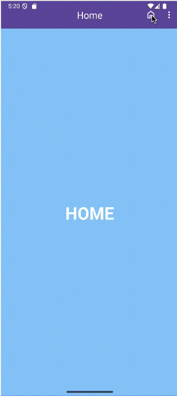

<div class="justify-text">

El **Options Menu** es el menú principal de acciones que aparece en la **parte superior derecha de la Toolbar** (a veces representado con el icono de tres puntos verticales).  
Se utiliza para ofrecer **acciones adicionales o configuraciones secundarias**, como *Buscar*, *Ajustes*, *Ayuda*, etc.

<!--  -->

---

## Pasos para implementar un Options Menu en Android

### 1️⃣ Crear el layout de la Activity

Partiremos de un proyecto con **Navigation Component configurado** y una **Toolbar** que actuará como barra de aplicación.

```xml title="activity_main.xml"
<?xml version="1.0" encoding="utf-8"?>
<androidx.coordinatorlayout.widget.CoordinatorLayout
    xmlns:android="http://schemas.android.com/apk/res/android"
    xmlns:app="http://schemas.android.com/apk/res-auto"
    xmlns:tools="http://schemas.android.com/tools"
    android:layout_width="match_parent"
    android:layout_height="match_parent"
    tools:context=".MainActivity">

    <!-- AppBar superior -->
    <com.google.android.material.appbar.MaterialToolbar
        android:id="@+id/toolbar"
        android:layout_width="match_parent"
        android:layout_height="?attr/actionBarSize"
        android:background="?attr/colorPrimary"
        app:titleCentered="true"
        app:titleTextColor="@android:color/white" />

    <!-- Contenedor principal de fragments -->
    <androidx.fragment.app.FragmentContainerView
        android:id="@+id/nav_host_fragment"
        android:name="androidx.navigation.fragment.NavHostFragment"
        android:layout_width="match_parent"
        android:layout_height="match_parent"
        android:layout_marginTop="?attr/actionBarSize"
        app:defaultNavHost="true"
        app:navGraph="@navigation/nav_graph" />

</androidx.coordinatorlayout.widget.CoordinatorLayout>
````

---

### 2️⃣ Crear el menú de opciones

Creamos un archivo en `res/menu/menu_options.xml` que contendrá las acciones visibles en la Toolbar.
Cada `<item>` representará una acción o destino del menú.

```xml title="menu_options.xml"
<?xml version="1.0" encoding="utf-8"?>
<menu xmlns:android="http://schemas.android.com/apk/res/android"
      xmlns:app="http://schemas.android.com/apk/res-auto">

    <!-- Acción visible directamente en la Toolbar -->
    <item
        android:id="@+id/homeFragment"
        android:icon="@drawable/ic_home"
        android:title="Inicio"
        app:showAsAction="always" />

    <!-- Acción visible solo en el menú desplegable -->
    <item
        android:id="@+id/settingsFragment"
        android:icon="@drawable/ic_settings"
        android:title="Ajustes"
        app:showAsAction="never" />

    <!-- Otra acción del menú -->
    <item
        android:id="@+id/helpFragment"
        android:icon="@drawable/ic_help"
        android:title="Ayuda"
        app:showAsAction="never" />
</menu>
```

:::tip OPCIONES DE VISIBILIDAD
El atributo **`app:showAsAction`** controla dónde se muestra cada opción:

* `always` → visible siempre en la Toolbar (como icono).
* `ifRoom` → visible si hay espacio.
* `never` → aparece en el desplegable (tres puntos).
  :::

---

### 3️⃣ Crear el grafo de navegación

En `res/navigation/nav_graph.xml` definimos los fragments a los que accederemos desde el menú.

```xml title="nav_graph.xml"
<?xml version="1.0" encoding="utf-8"?>
<navigation xmlns:android="http://schemas.android.com/apk/res/android"
    xmlns:app="http://schemas.android.com/apk/res-auto"
    xmlns:tools="http://schemas.android.com/tools"
    android:id="@+id/nav_graph"
    app:startDestination="@id/homeFragment">

    <fragment
        android:id="@+id/homeFragment"
        android:name="es.iesagora.demomenu.HomeFragment"
        android:label="Inicio"
        tools:layout="@layout/fragment_home" />

    <fragment
        android:id="@+id/settingsFragment"
        android:name="es.iesagora.demomenu.SettingsFragment"
        android:label="Ajustes"
        tools:layout="@layout/fragment_settings" />

    <fragment
        android:id="@+id/helpFragment"
        android:name="es.iesagora.demomenu.HelpFragment"
        android:label="Ayuda"
        tools:layout="@layout/fragment_help" />
</navigation>
```

:::warning IMPORTANTE
El `id` de cada elemento del menú (`menu_options.xml`) debe **coincidir** con el `id` del fragment correspondiente en el grafo de navegación (`nav_graph.xml`).
:::

---

### 4️⃣ Configurar la Activity

En la `MainActivity` configuramos la `Toolbar` y el `NavigationUI` para que sincronicen los títulos y las acciones de navegación.

```java title="MainActivity.java"
public class MainActivity extends AppCompatActivity {

    ActivityMainBinding binding;
    private NavController navController;
    private AppBarConfiguration appBarConfiguration;

    @Override
    protected void onCreate(Bundle savedInstanceState) {
        super.onCreate(savedInstanceState);
        setContentView((binding = ActivityMainBinding.inflate(getLayoutInflater())).getRoot());

        // 1️⃣ Configurar la Toolbar como ActionBar
        setSupportActionBar(binding.toolbar);

        // 2️⃣ Obtener el NavController
        navController = ((NavHostFragment) getSupportFragmentManager()
                .findFragmentById(R.id.nav_host_fragment)).getNavController();

        // 3️⃣ Definir los destinos principales
        appBarConfiguration = new AppBarConfiguration.Builder(
                R.id.homeFragment
        ).build();

        // 4️⃣ Vincular Toolbar con NavController
        NavigationUI.setupActionBarWithNavController(this, navController, appBarConfiguration);
    }

    // 5️⃣ Cargar el menú de opciones en la Toolbar
    @Override
    public boolean onCreateOptionsMenu(Menu menu) {
        getMenuInflater().inflate(R.menu.menu_options, menu);
        return true;
    }

    // 6️⃣ Gestionar los clics en las opciones del menú
    @Override
    public boolean onOptionsItemSelected(@NonNull MenuItem item) {
        return NavigationUI.onNavDestinationSelected(item, navController)
                || super.onOptionsItemSelected(item);
    }

    // 7️⃣ Gestionar el botón de navegación (flecha atrás)
    @Override
    public boolean onSupportNavigateUp() {
        return NavigationUI.navigateUp(navController, appBarConfiguration)
                || super.onSupportNavigateUp();
    }
}
```

---

## ✅ Ventajas del Options Menu

* Permite acceder a **acciones globales** o de configuración.
* Integra automáticamente el título del fragment en la Toolbar.
* Compatible con **NavigationUI**, lo que evita manejar los clics manualmente.
* Se adapta automáticamente al **modo claro/oscuro** de Material 3.

</div>